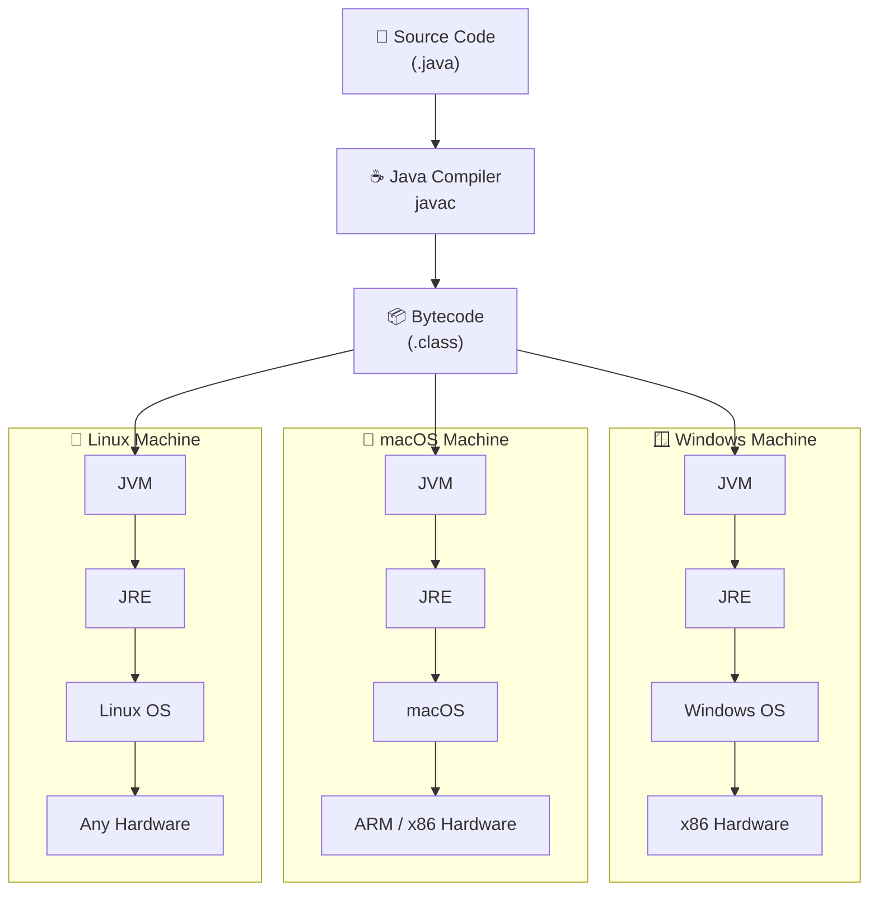
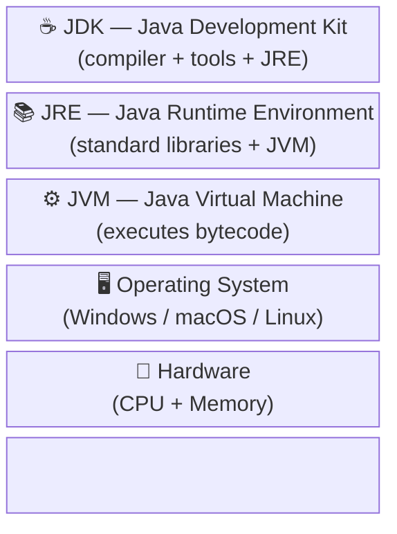
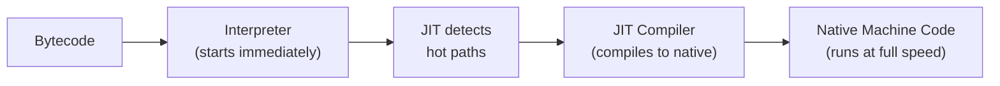

# How Java Runs Everywhere

[← Back to README](../README.md)

---

Java's promise is **Write Once, Run Anywhere (WORA)**. You write and compile Java code once, and it runs on any machine — Windows, macOS, Linux, mobile — without recompilation.

## How it works

When you compile a `.java` file, the Java compiler (`javac`) does not produce native machine code. Instead it produces **bytecode** — a platform-neutral instruction set stored in `.class` files. Bytecode is not tied to any CPU or operating system.

At runtime, the **Java Virtual Machine (JVM)** reads that bytecode and translates it into native instructions for whatever machine it is running on. Each platform has its own JVM implementation, but all JVMs understand the same bytecode — that's what makes portability possible.

## The Java Platform Stack

Each machine that runs Java has these layers:

| Layer | Full name | Role |
|-------|-----------|------|
| **JDK** | Java Development Kit | Everything needed to write and compile Java. Includes `javac`, debugger, profiler, and the JRE. Install this to develop. |
| **JRE** | Java Runtime Environment | Everything needed to *run* Java programs. Includes the standard library (`java.lang`, `java.util`, etc.) and the JVM. End users need this. |
| **JVM** | Java Virtual Machine | Loads `.class` files, verifies bytecode, and executes it by translating to native machine instructions (via JIT compilation). |
| **OS** | Operating System | Manages hardware resources. The JVM talks to the OS, not directly to hardware. |
| **Hardware** | CPU + Memory | The physical machine. Java code never targets this directly. |

## JIT Compilation

The JVM doesn't just interpret bytecode line by line — it uses a **Just-In-Time (JIT) compiler** to detect frequently executed code ("hot paths") and compile them to optimised native machine code at runtime. This is why long-running Java programs often get *faster* over time.

---

[← Back to README](../README.md)
