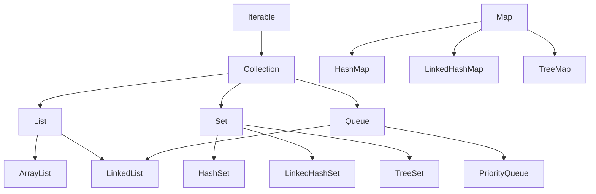

# Collections and Generics

[← Back to README](../README.md)

---

## Generics

Generics let you write classes and methods that work with any type while keeping type safety at compile time. Without generics you'd use `Object` everywhere and need casts that could fail at runtime.

```java
// without generics — unsafe
java.util.ArrayList list = new java.util.ArrayList();
list.add("hello");
String s = (String) list.get(0);  // cast required, could throw ClassCastException

// with generics — safe
java.util.ArrayList<String> list = new java.util.ArrayList<>();
list.add("hello");
String s = list.get(0);  // no cast needed, type checked at compile time
```

### Generic Classes

```java
public class Box<T> {
    private T value;

    public Box(T value) {
        this.value = value;
    }

    public T get() {
        return value;
    }
}

Box<Integer> intBox    = new Box<>(42);
Box<String>  strBox    = new Box<>("hello");

System.out.println(intBox.get());  // 42
System.out.println(strBox.get());  // hello
```

`T` is a **type parameter** — a placeholder replaced with a real type when the class is used. Common conventions:

| Letter | Stands for |
|--------|------------|
| `T`    | Type       |
| `E`    | Element    |
| `K`    | Key        |
| `V`    | Value      |
| `N`    | Number     |

### Generic Methods

```java
public static <T> void swap(T[] arr, int i, int j) {
    T temp = arr[i];
    arr[i] = arr[j];
    arr[j] = temp;
}

Integer[] nums = {1, 2, 3};
swap(nums, 0, 2);  // [3, 2, 1]
```

### Bounded Type Parameters

Use `extends` to restrict which types are allowed:

```java
// T must be a Number or subclass (Integer, Double, etc.)
public static <T extends Number> double sum(java.util.List<T> list) {
    double total = 0;
    for (T item : list) {
        total += item.doubleValue();
    }
    return total;
}

sum(java.util.List.of(1, 2, 3));        // 6.0
sum(java.util.List.of(1.5, 2.5, 3.0)); // 7.0
```

### Wildcards

When you don't need to know the exact type, use `?`:

```java
// accepts a list of any type
public static void printAll(java.util.List<?> list) {
    for (Object item : list) {
        System.out.println(item);
    }
}

// upper bounded — List of Number or any subtype
public static double total(java.util.List<? extends Number> list) {
    return list.stream().mapToDouble(Number::doubleValue).sum();
}

// lower bounded — List of Integer or any supertype
public static void addNumbers(java.util.List<? super Integer> list) {
    list.add(1);
    list.add(2);
}
```

---

## The Collections Framework

The Java Collections Framework provides ready-made data structures in `java.util`. All collections implement the `Collection` interface (except `Map`).



---

## List

An ordered, index-based collection that allows duplicates.

### ArrayList

Backed by a resizable array. Fast random access (`O(1)`), slow insertions/deletions in the middle (`O(n)`).

```java
import java.util.ArrayList;

var names = new ArrayList<String>();

names.add("Alice");
names.add("Bob");
names.add("Charlie");
names.add("Bob");          // duplicates allowed

System.out.println(names.get(1));      // Bob
System.out.println(names.size());      // 4
System.out.println(names.contains("Alice")); // true

names.remove("Bob");                   // removes first occurrence
names.set(0, "Anna");                  // replace at index

for (var name : names) {
    System.out.println(name);
}
```

### LinkedList

Backed by a doubly-linked list. Fast insertions/deletions at either end (`O(1)`), slow random access (`O(n)`). Also implements `Deque`.

```java
import java.util.LinkedList;

var queue = new LinkedList<String>();

queue.addFirst("first");
queue.addLast("last");
queue.add("middle");

System.out.println(queue.peekFirst());  // first
System.out.println(queue.pollFirst()); // removes and returns "first"
```

### List.of() — Immutable Lists

```java
var fruits = java.util.List.of("apple", "banana", "cherry");
// fruits.add("date");  // throws UnsupportedOperationException — immutable
```

---

## Set

An unordered collection that does **not** allow duplicates. Useful for membership checks and deduplication.

### HashSet

No guaranteed order. `O(1)` average for add, remove, and contains.

```java
import java.util.HashSet;

var set = new HashSet<String>();

set.add("apple");
set.add("banana");
set.add("apple");  // duplicate — ignored

System.out.println(set.size());          // 2
System.out.println(set.contains("apple")); // true
set.remove("banana");
```

### LinkedHashSet

Maintains **insertion order**.

```java
var set = new java.util.LinkedHashSet<String>();
set.add("banana");
set.add("apple");
set.add("cherry");
System.out.println(set);  // [banana, apple, cherry]
```

### TreeSet

Keeps elements in **sorted order**. `O(log n)` for add, remove, contains.

```java
var set = new java.util.TreeSet<Integer>();
set.add(5);
set.add(1);
set.add(3);
System.out.println(set);          // [1, 3, 5]
System.out.println(set.first());  // 1
System.out.println(set.last());   // 5
```

---

## Queue and Deque

A `Queue` is a first-in, first-out (FIFO) structure. A `Deque` (double-ended queue) supports insertion and removal at both ends.

```java
import java.util.ArrayDeque;

var queue = new ArrayDeque<String>();

queue.offer("first");   // add to tail
queue.offer("second");
queue.offer("third");

System.out.println(queue.peek());   // "first" — look without removing
System.out.println(queue.poll());   // "first" — remove from head
System.out.println(queue.size());   // 2

// as a stack (LIFO)
var stack = new ArrayDeque<Integer>();
stack.push(1);
stack.push(2);
stack.push(3);
System.out.println(stack.pop());    // 3
```

---

## Map

A `Map` stores **key-value pairs**. Keys are unique; values can repeat. `Map` does not extend `Collection`.

### HashMap

No guaranteed order. `O(1)` average for get, put, and remove.

```java
import java.util.HashMap;

var scores = new HashMap<String, Integer>();

scores.put("Alice", 95);
scores.put("Bob", 87);
scores.put("Charlie", 92);
scores.put("Alice", 98);   // updates existing key

System.out.println(scores.get("Alice"));           // 98
System.out.println(scores.getOrDefault("Dan", 0)); // 0
System.out.println(scores.containsKey("Bob"));     // true
System.out.println(scores.size());                 // 3

scores.remove("Bob");

// iterate entries
for (var entry : scores.entrySet()) {
    System.out.println(entry.getKey() + " → " + entry.getValue());
}

// iterate keys only
for (var key : scores.keySet()) {
    System.out.println(key);
}
```

### LinkedHashMap

Maintains **insertion order**.

```java
var map = new java.util.LinkedHashMap<String, Integer>();
map.put("banana", 2);
map.put("apple", 5);
map.put("cherry", 1);
System.out.println(map);  // {banana=2, apple=5, cherry=1}
```

### TreeMap

Keeps keys in **sorted order**.

```java
var map = new java.util.TreeMap<String, Integer>();
map.put("banana", 2);
map.put("apple", 5);
map.put("cherry", 1);
System.out.println(map);           // {apple=5, banana=2, cherry=1}
System.out.println(map.firstKey()); // apple
```

### Map.of() — Immutable Maps

```java
var config = java.util.Map.of(
    "host", "localhost",
    "port", "8080"
);
```

---

## Choosing the Right Collection

| Need | Use |
|------|-----|
| Ordered list, fast access by index | `ArrayList` |
| Frequent insertions/deletions at ends | `LinkedList` / `ArrayDeque` |
| Unique elements, fast lookup | `HashSet` |
| Unique elements, insertion order | `LinkedHashSet` |
| Unique elements, sorted | `TreeSet` |
| FIFO queue or stack | `ArrayDeque` |
| Key-value pairs, fast lookup | `HashMap` |
| Key-value pairs, insertion order | `LinkedHashMap` |
| Key-value pairs, sorted keys | `TreeMap` |

---

## Useful Utility Methods

### Collections class

```java
import java.util.Collections;

var list = new java.util.ArrayList<>(java.util.List.of(3, 1, 4, 1, 5));

Collections.sort(list);                    // [1, 1, 3, 4, 5]
Collections.reverse(list);                // [5, 4, 3, 1, 1]
Collections.shuffle(list);                // random order
System.out.println(Collections.min(list)); // smallest element
System.out.println(Collections.max(list)); // largest element
Collections.frequency(list, 1);           // count occurrences of 1
```

### Sorting with Comparator

```java
var names = new java.util.ArrayList<>(java.util.List.of("Charlie", "Alice", "Bob"));

// sort alphabetically
names.sort(java.util.Comparator.naturalOrder());   // [Alice, Bob, Charlie]

// sort by length
names.sort(java.util.Comparator.comparingInt(String::length));

// sort descending
names.sort(java.util.Comparator.reverseOrder());
```

---

[← Back to README](../README.md)
