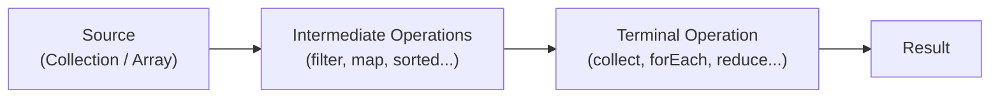

# Functional Programming and Streams

[← Back to README](../README.md)

---

Java 8 introduced first-class support for functional programming through **lambda expressions**, **functional interfaces**, and the **Stream API**. These features let you write concise, declarative code focused on *what* to do rather than *how* to do it.

---

## Lambda Expressions

A lambda is an anonymous function — a block of code you can pass around as a value.

```java
// syntax
(parameters) -> expression
(parameters) -> { statements; }
```

```java
// before lambdas — anonymous class
Runnable r = new Runnable() {
    @Override
    public void run() {
        System.out.println("Hello!");
    }
};

// with a lambda
Runnable r = () -> System.out.println("Hello!");
r.run();  // Hello!
```

```java
// single parameter — parentheses optional
java.util.function.Consumer<String> print = s -> System.out.println(s);

// multiple parameters
java.util.function.BiFunction<Integer, Integer, Integer> add = (a, b) -> a + b;
System.out.println(add.apply(3, 4));  // 7

// multi-line body
java.util.function.Function<Integer, String> classify = n -> {
    if (n < 0) return "negative";
    if (n == 0) return "zero";
    return "positive";
};
```

---

## Functional Interfaces

A **functional interface** has exactly one abstract method. Lambdas can be assigned to them. Java provides a rich set in `java.util.function`.

| Interface | Signature | Description |
|-----------|-----------|-------------|
| `Supplier<T>` | `T get()` | Produces a value, takes nothing |
| `Consumer<T>` | `void accept(T)` | Consumes a value, returns nothing |
| `Function<T, R>` | `R apply(T)` | Transforms T into R |
| `Predicate<T>` | `boolean test(T)` | Tests a condition |
| `BiFunction<T, U, R>` | `R apply(T, U)` | Takes two inputs, returns a value |
| `UnaryOperator<T>` | `T apply(T)` | Function where input and output are the same type |
| `BinaryOperator<T>` | `T apply(T, T)` | BiFunction where all types are the same |

```java
import java.util.function.*;

Supplier<String>        greeting  = () -> "Hello, World!";
Consumer<String>        printer   = s  -> System.out.println(s);
Function<String, Integer> length  = s  -> s.length();
Predicate<Integer>      isEven    = n  -> n % 2 == 0;

System.out.println(greeting.get());          // Hello, World!
printer.accept("Hi");                        // Hi
System.out.println(length.apply("Java"));    // 4
System.out.println(isEven.test(6));          // true
```

### Composing Functions

```java
Function<Integer, Integer> doubleIt  = x -> x * 2;
Function<Integer, Integer> addThree  = x -> x + 3;

// andThen — apply doubleIt first, then addThree
Function<Integer, Integer> doubleThenAdd = doubleIt.andThen(addThree);
System.out.println(doubleThenAdd.apply(5));  // 13

// compose — apply addThree first, then doubleIt
Function<Integer, Integer> addThenDouble = doubleIt.compose(addThree);
System.out.println(addThenDouble.apply(5));  // 16
```

### Composing Predicates

```java
Predicate<Integer> isEven     = n -> n % 2 == 0;
Predicate<Integer> isPositive = n -> n > 0;

Predicate<Integer> isEvenAndPositive = isEven.and(isPositive);
Predicate<Integer> isEvenOrPositive  = isEven.or(isPositive);
Predicate<Integer> isOdd             = isEven.negate();

System.out.println(isEvenAndPositive.test(4));   // true
System.out.println(isEvenAndPositive.test(-4));  // false
System.out.println(isOdd.test(3));               // true
```

---

## Method References

A method reference is a shorthand for a lambda that simply calls an existing method.

```java
// syntax: ClassName::methodName
```

| Type | Syntax | Equivalent lambda |
|------|--------|-------------------|
| Static method | `ClassName::staticMethod` | `x -> ClassName.staticMethod(x)` |
| Instance method (unbound) | `ClassName::instanceMethod` | `x -> x.instanceMethod()` |
| Instance method (bound) | `instance::instanceMethod` | `() -> instance.instanceMethod()` |
| Constructor | `ClassName::new` | `() -> new ClassName()` |

```java
import java.util.List;
import java.util.function.*;

// static method reference
Function<String, Integer> parse = Integer::parseInt;
System.out.println(parse.apply("42"));  // 42

// instance method reference (unbound)
Function<String, String> upper = String::toUpperCase;
System.out.println(upper.apply("hello"));  // HELLO

// instance method reference (bound)
String prefix = "Hello, ";
Function<String, String> greet = prefix::concat;
System.out.println(greet.apply("Alice"));  // Hello, Alice

// constructor reference
Supplier<java.util.ArrayList<String>> listFactory = java.util.ArrayList::new;
var list = listFactory.get();

// used with collections
List<String> names = List.of("Charlie", "Alice", "Bob");
names.stream()
     .map(String::toUpperCase)
     .forEach(System.out::println);
```

---

## The Stream API

A `Stream` is a sequence of elements that supports declarative processing operations. Streams don't store data — they process it from a source (collection, array, or generator).



- **Intermediate operations** are lazy — they don't execute until a terminal operation is called.
- **Terminal operations** trigger execution and produce a result.
- A stream can only be consumed once.

### Creating Streams

```java
import java.util.stream.Stream;
import java.util.List;

// from a collection
var names = List.of("Alice", "Bob", "Charlie");
Stream<String> stream = names.stream();

// from an array
Stream<Integer> fromArray = Stream.of(1, 2, 3, 4, 5);

// generate an infinite stream
Stream<Integer> zeros = Stream.generate(() -> 0);
Stream<Integer> counting = Stream.iterate(0, n -> n + 1);

// primitive streams (more efficient than boxed types)
java.util.stream.IntStream range = java.util.stream.IntStream.range(0, 10);     // 0–9
java.util.stream.IntStream rangeClosed = java.util.stream.IntStream.rangeClosed(1, 5); // 1–5
```

### Intermediate Operations

These return a new stream and are lazy.

```java
var numbers = List.of(1, 2, 3, 4, 5, 6, 7, 8, 9, 10);

// filter — keep elements matching a predicate
numbers.stream()
       .filter(n -> n % 2 == 0)
       .forEach(System.out::println);  // 2, 4, 6, 8, 10

// map — transform each element
numbers.stream()
       .map(n -> n * n)
       .forEach(System.out::println);  // 1, 4, 9, 16, ...

// sorted — natural or custom order
List.of("banana", "apple", "cherry").stream()
    .sorted()
    .forEach(System.out::println);  // apple, banana, cherry

// distinct — remove duplicates
Stream.of(1, 2, 2, 3, 3, 3)
      .distinct()
      .forEach(System.out::println);  // 1, 2, 3

// limit / skip
numbers.stream().limit(3).forEach(System.out::println);  // 1, 2, 3
numbers.stream().skip(7).forEach(System.out::println);   // 8, 9, 10

// flatMap — flatten nested structures
List<List<Integer>> nested = List.of(List.of(1, 2), List.of(3, 4));
nested.stream()
      .flatMap(java.util.Collection::stream)
      .forEach(System.out::println);  // 1, 2, 3, 4

// peek — inspect elements without consuming the stream (useful for debugging)
numbers.stream()
       .peek(n -> System.out.println("before: " + n))
       .filter(n -> n > 5)
       .peek(n -> System.out.println("after: " + n))
       .forEach(System.out::println);
```

### Terminal Operations

These trigger execution and produce a result.

```java
var numbers = List.of(1, 2, 3, 4, 5);

// forEach
numbers.stream().forEach(System.out::println);

// collect — gather results into a collection
import java.util.stream.Collectors;

List<Integer> evens = numbers.stream()
                             .filter(n -> n % 2 == 0)
                             .collect(Collectors.toList());

// count
long count = numbers.stream().filter(n -> n > 3).count();  // 2

// findFirst / findAny
Optional<Integer> first = numbers.stream().filter(n -> n > 3).findFirst();
first.ifPresent(System.out::println);  // 4

// anyMatch / allMatch / noneMatch
boolean anyEven  = numbers.stream().anyMatch(n -> n % 2 == 0);   // true
boolean allEven  = numbers.stream().allMatch(n -> n % 2 == 0);   // false
boolean noneNeg  = numbers.stream().noneMatch(n -> n < 0);       // true

// min / max
Optional<Integer> max = numbers.stream().max(Integer::compareTo);
System.out.println(max.get());  // 5

// reduce — fold elements into a single value
int sum = numbers.stream().reduce(0, Integer::sum);  // 15
int product = numbers.stream().reduce(1, (a, b) -> a * b);  // 120

// toArray
Integer[] arr = numbers.stream().toArray(Integer[]::new);
```

### Collectors

`Collectors` provides powerful ways to accumulate stream results.

```java
import java.util.stream.Collectors;

var people = List.of("Alice", "Bob", "Anna", "Charlie", "Brian");

// toList, toSet
List<String> list = people.stream().collect(Collectors.toList());
java.util.Set<String> set  = people.stream().collect(Collectors.toSet());

// joining — concatenate strings
String joined = people.stream().collect(Collectors.joining(", "));
System.out.println(joined);  // Alice, Bob, Anna, Charlie, Brian

// groupingBy — group into a Map
java.util.Map<Character, List<String>> byFirstLetter =
    people.stream().collect(Collectors.groupingBy(s -> s.charAt(0)));
System.out.println(byFirstLetter);
// {A=[Alice, Anna], B=[Bob, Brian], C=[Charlie]}

// counting per group
java.util.Map<Character, Long> countByLetter =
    people.stream().collect(Collectors.groupingBy(s -> s.charAt(0), Collectors.counting()));

// partitioningBy — split into true/false groups
java.util.Map<Boolean, List<String>> partition =
    people.stream().collect(Collectors.partitioningBy(s -> s.startsWith("A")));
System.out.println(partition.get(true));   // [Alice, Anna]
System.out.println(partition.get(false));  // [Bob, Charlie, Brian]

// summarizingInt — stats in one pass
java.util.IntSummaryStatistics stats =
    List.of(1, 2, 3, 4, 5).stream()
        .collect(Collectors.summarizingInt(Integer::intValue));
System.out.println(stats.getSum());     // 15
System.out.println(stats.getAverage()); // 3.0
System.out.println(stats.getMax());     // 5
```

---

## Optional

`Optional<T>` is a container that may or may not hold a value. It makes the possibility of absence explicit rather than using `null`.

```java
import java.util.Optional;

Optional<String> present = Optional.of("hello");
Optional<String> empty   = Optional.empty();

// check and get
System.out.println(present.isPresent());   // true
System.out.println(empty.isPresent());     // false
System.out.println(present.get());         // hello

// safe alternatives to get()
System.out.println(empty.orElse("default"));               // default
System.out.println(empty.orElseGet(() -> "computed"));     // computed
System.out.println(empty.orElseThrow(() ->
    new IllegalStateException("No value")));

// transform if present
present.map(String::toUpperCase)
       .ifPresent(System.out::println);  // HELLO

// filter
present.filter(s -> s.startsWith("h"))
       .ifPresent(System.out::println);  // hello
```

`Optional` is returned by many Stream terminal operations (`findFirst`, `min`, `max`). Always handle the empty case — never call `.get()` without first checking `isPresent()`.

---

## Putting It All Together

```java
import java.util.*;
import java.util.stream.*;

record Person(String name, int age, String city) {}

var people = List.of(
    new Person("Alice",   30, "Cape Town"),
    new Person("Bob",     25, "Johannesburg"),
    new Person("Charlie", 35, "Cape Town"),
    new Person("Diana",   28, "Durban"),
    new Person("Eve",     32, "Johannesburg")
);

// names of people over 28, sorted, from Cape Town
List<String> result = people.stream()
    .filter(p -> p.city().equals("Cape Town"))
    .filter(p -> p.age() > 28)
    .sorted(Comparator.comparing(Person::name))
    .map(Person::name)
    .collect(Collectors.toList());

System.out.println(result);  // [Alice, Charlie]

// average age per city
Map<String, Double> avgAgeByCity = people.stream()
    .collect(Collectors.groupingBy(
        Person::city,
        Collectors.averagingInt(Person::age)
    ));

System.out.println(avgAgeByCity);
// {Cape Town=32.5, Johannesburg=28.5, Durban=28.0}
```

---

## Functional Programming Summary

| Concept | Purpose |
|---------|---------|
| Lambda expression | Anonymous function passed as a value |
| Functional interface | Interface with one abstract method — target for lambdas |
| Method reference | Shorthand lambda for an existing method (`Class::method`) |
| `Stream` | Declarative pipeline for processing sequences of data |
| Intermediate operations | Lazy transformations — `filter`, `map`, `sorted`, `flatMap` |
| Terminal operations | Trigger execution — `collect`, `forEach`, `reduce`, `count` |
| `Optional<T>` | Explicit representation of a value that may be absent |

---

[← Back to README](../README.md)
