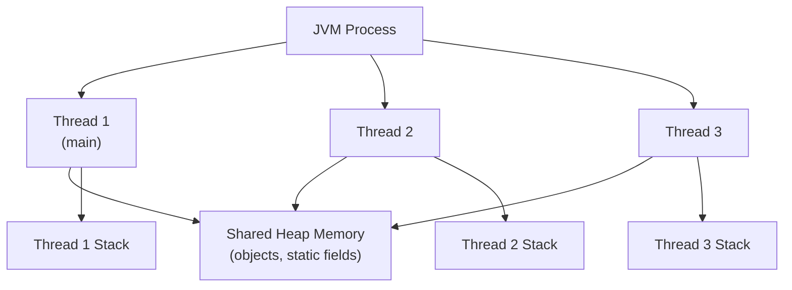
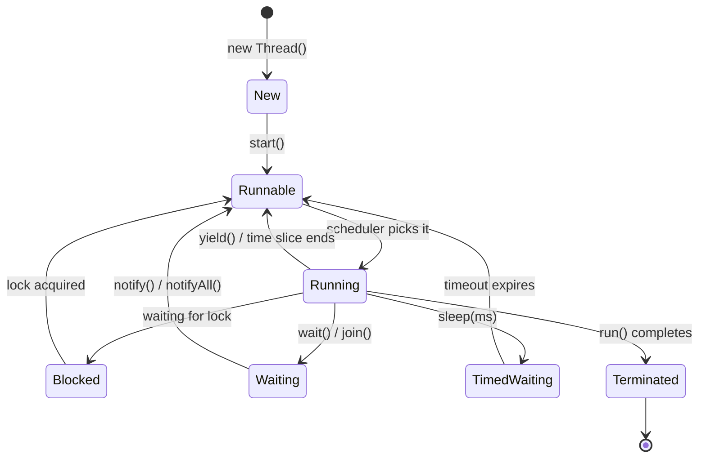

# Concurrency and Multithreading

[← Back to README](../README.md)

---

Concurrency allows a program to do multiple things at once. Java has built-in support for multithreading — running multiple threads of execution within a single process, sharing the same memory space.



Each thread has its own **stack** (local variables, method calls) but shares the **heap** (objects). This shared access is both the power and the danger of multithreading.

---

## Creating Threads

### Extending Thread

```java
public class MyThread extends Thread {
    @Override
    public void run() {
        System.out.println("Running in: " + Thread.currentThread().getName());
    }
}

MyThread t = new MyThread();
t.start();  // starts a new thread and calls run()
// t.run();  // wrong — calls run() on the current thread, no new thread
```

### Implementing Runnable

Preferred — keeps the class free to extend something else.

```java
public class MyTask implements Runnable {
    @Override
    public void run() {
        System.out.println("Task running in: " + Thread.currentThread().getName());
    }
}

Thread t = new Thread(new MyTask());
t.start();

// with a lambda (most common)
Thread t2 = new Thread(() -> System.out.println("Lambda thread"));
t2.start();
```

### Thread Lifecycle



### Useful Thread Methods

```java
Thread t = new Thread(() -> {
    try {
        Thread.sleep(1000);  // pause for 1 second
    } catch (InterruptedException e) {
        Thread.currentThread().interrupt();  // restore interrupt flag
    }
    System.out.println("Done");
});

t.setName("worker-1");
t.setDaemon(true);        // daemon threads don't prevent JVM shutdown
t.start();

t.join();                 // wait for t to finish before continuing
System.out.println("Thread finished: " + t.getState()); // TERMINATED

System.out.println(Thread.currentThread().getName());    // main
System.out.println(Runtime.getRuntime().availableProcessors()); // CPU cores
```

---

## Race Conditions and Shared State

When multiple threads read and write shared data without coordination, the result is unpredictable — a **race condition**.

```java
public class Counter {
    private int count = 0;

    public void increment() {
        count++;  // not atomic — read, add, write are three separate steps
    }

    public int getCount() { return count; }
}

Counter counter = new Counter();

// two threads both incrementing 1000 times
Thread t1 = new Thread(() -> { for (int i = 0; i < 1000; i++) counter.increment(); });
Thread t2 = new Thread(() -> { for (int i = 0; i < 1000; i++) counter.increment(); });

t1.start(); t2.start();
t1.join();  t2.join();

System.out.println(counter.getCount());  // likely NOT 2000 — race condition
```

---

## Synchronization

### synchronized Method

Only one thread can execute a `synchronized` method on the same object at a time.

```java
public class Counter {
    private int count = 0;

    public synchronized void increment() {
        count++;  // now thread-safe
    }

    public synchronized int getCount() {
        return count;
    }
}
```

### synchronized Block

Finer control — only the critical section is locked, not the whole method.

```java
public class Counter {
    private int count = 0;
    private final Object lock = new Object();

    public void increment() {
        // other non-critical work here...
        synchronized (lock) {
            count++;
        }
    }
}
```

### volatile

`volatile` ensures a variable's value is always read from and written to main memory, not a thread-local CPU cache. It does **not** make compound operations atomic.

```java
public class Flag {
    private volatile boolean running = true;

    public void stop() {
        running = false;
    }

    public void run() {
        while (running) {
            // loop will see the updated value of running
        }
    }
}
```

---

## Atomic Classes

`java.util.concurrent.atomic` provides lock-free, thread-safe operations on single variables.

```java
import java.util.concurrent.atomic.AtomicInteger;

AtomicInteger count = new AtomicInteger(0);

count.incrementAndGet();          // count++, returns new value
count.getAndIncrement();          // count++, returns old value
count.addAndGet(5);               // count += 5, returns new value
count.compareAndSet(5, 10);       // if count == 5, set to 10 (atomic CAS)
System.out.println(count.get());  // read current value
```

Other useful atomic classes: `AtomicLong`, `AtomicBoolean`, `AtomicReference<T>`.

---

## The Executor Framework

Creating threads manually is low-level and expensive. The `Executor` framework manages a pool of reusable threads.

```java
import java.util.concurrent.*;

// fixed thread pool — always keeps N threads alive
ExecutorService executor = Executors.newFixedThreadPool(4);

// submit tasks
executor.submit(() -> System.out.println("Task 1"));
executor.submit(() -> System.out.println("Task 2"));
executor.submit(() -> System.out.println("Task 3"));

// always shut down when done
executor.shutdown();                    // stops accepting new tasks
executor.awaitTermination(5, TimeUnit.SECONDS);  // wait for running tasks
```

### Common Executor Types

| Factory method | Behaviour |
|----------------|-----------|
| `newFixedThreadPool(n)` | Pool of exactly `n` threads |
| `newCachedThreadPool()` | Grows as needed, reuses idle threads |
| `newSingleThreadExecutor()` | One thread, tasks run sequentially |
| `newScheduledThreadPool(n)` | For delayed or recurring tasks |

---

## Callable and Future

`Runnable` cannot return a result or throw checked exceptions. `Callable<T>` can do both.

```java
import java.util.concurrent.*;

ExecutorService executor = Executors.newFixedThreadPool(2);

Callable<Integer> task = () -> {
    Thread.sleep(500);
    return 42;
};

Future<Integer> future = executor.submit(task);

// do other work here...

Integer result = future.get();           // blocks until done
System.out.println(result);              // 42

// non-blocking check
System.out.println(future.isDone());     // true
System.out.println(future.isCancelled()); // false

executor.shutdown();
```

`future.get()` throws `ExecutionException` if the task threw an exception, and `TimeoutException` if you add a timeout:

```java
Integer result = future.get(2, TimeUnit.SECONDS);  // timeout after 2s
```

---

## CompletableFuture

`CompletableFuture` (Java 8+) enables non-blocking, composable async pipelines.

```java
import java.util.concurrent.CompletableFuture;

// run async, no return value
CompletableFuture<Void> cf1 = CompletableFuture.runAsync(
    () -> System.out.println("Running async")
);

// supply async, returns a value
CompletableFuture<String> cf2 = CompletableFuture
    .supplyAsync(() -> "Hello")
    .thenApply(s -> s + ", World!")         // transform result
    .thenApply(String::toUpperCase);

System.out.println(cf2.get());  // HELLO, WORLD!

// chain async stages
CompletableFuture
    .supplyAsync(() -> fetchUser(1))
    .thenApply(user -> fetchOrders(user))
    .thenAccept(orders -> System.out.println("Orders: " + orders))
    .exceptionally(ex -> {
        System.out.println("Error: " + ex.getMessage());
        return null;
    });

// run two tasks in parallel, combine results
CompletableFuture<Integer> price    = CompletableFuture.supplyAsync(() -> 100);
CompletableFuture<Integer> discount = CompletableFuture.supplyAsync(() -> 20);

CompletableFuture<Integer> finalPrice = price.thenCombine(discount, (p, d) -> p - d);
System.out.println(finalPrice.get());  // 80

// wait for all to complete
CompletableFuture.allOf(cf1, cf2).join();
```

---

## Concurrent Collections

Standard collections like `ArrayList` and `HashMap` are **not** thread-safe. Use these instead:

| Thread-safe collection | Description |
|------------------------|-------------|
| `ConcurrentHashMap` | Thread-safe map, better than `synchronized HashMap` |
| `CopyOnWriteArrayList` | Thread-safe list, good for read-heavy workloads |
| `CopyOnWriteArraySet` | Thread-safe set backed by `CopyOnWriteArrayList` |
| `BlockingQueue` | Queue that blocks on put/take — ideal for producer-consumer |
| `LinkedBlockingQueue` | Bounded or unbounded blocking queue |
| `ArrayBlockingQueue` | Fixed-capacity blocking queue |

```java
import java.util.concurrent.*;

// ConcurrentHashMap
var map = new ConcurrentHashMap<String, Integer>();
map.put("a", 1);
map.putIfAbsent("b", 2);
map.computeIfAbsent("c", k -> k.length());

// BlockingQueue — producer/consumer
BlockingQueue<String> queue = new LinkedBlockingQueue<>(10);

Thread producer = new Thread(() -> {
    try {
        queue.put("item");   // blocks if full
    } catch (InterruptedException e) {
        Thread.currentThread().interrupt();
    }
});

Thread consumer = new Thread(() -> {
    try {
        String item = queue.take();  // blocks if empty
        System.out.println("Consumed: " + item);
    } catch (InterruptedException e) {
        Thread.currentThread().interrupt();
    }
});

producer.start();
consumer.start();
```

---

## Locks

`java.util.concurrent.locks` provides more flexible locking than `synchronized`.

```java
import java.util.concurrent.locks.*;

ReentrantLock lock = new ReentrantLock();

lock.lock();
try {
    // critical section
} finally {
    lock.unlock();  // always unlock in finally
}

// try to acquire without blocking
if (lock.tryLock()) {
    try {
        // got the lock
    } finally {
        lock.unlock();
    }
} else {
    // couldn't get lock — do something else
}

// ReadWriteLock — multiple readers OR one writer at a time
ReadWriteLock rwLock = new ReentrantReadWriteLock();

rwLock.readLock().lock();
try {
    // multiple threads can hold the read lock simultaneously
} finally {
    rwLock.readLock().unlock();
}

rwLock.writeLock().lock();
try {
    // exclusive access — no readers or other writers
} finally {
    rwLock.writeLock().unlock();
}
```

---

## Common Concurrency Problems

### Deadlock

Two threads each hold a lock the other needs — both wait forever.

```java
Object lockA = new Object();
Object lockB = new Object();

// Thread 1: acquires A, then tries B
// Thread 2: acquires B, then tries A
// → deadlock
```

**Prevention:** always acquire locks in the same order across all threads.

### Livelock

Threads keep responding to each other but neither makes progress (like two people stepping aside for each other in a hallway).

### Starvation

A thread is perpetually denied access to a resource because other threads always get priority.

---

## Concurrency Summary

| Tool | Use when |
|------|----------|
| `Thread` / `Runnable` | Simple one-off background tasks |
| `synchronized` | Protecting a critical section on a shared object |
| `volatile` | Single flag/state variable shared across threads |
| `AtomicInteger` etc. | Lock-free counter or reference updates |
| `ExecutorService` | Managing a pool of worker threads |
| `Callable` / `Future` | Tasks that return a result or throw exceptions |
| `CompletableFuture` | Non-blocking async pipelines and composition |
| `ConcurrentHashMap` | Thread-safe key-value store |
| `BlockingQueue` | Producer-consumer coordination |
| `ReentrantLock` | Fine-grained locking with try-lock or timeout |
| `ReadWriteLock` | Read-heavy workloads with occasional writes |

---

[← Back to README](../README.md)
