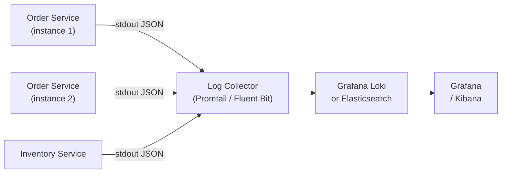

# Log Aggregation

[← Back to README](../README.md)

---

In a distributed system, logs are spread across dozens of service instances and containers. **Log aggregation** collects all logs into a central store where you can search, filter, and correlate them — essential for debugging production incidents.



---

## Structured Logging (Prerequisite)

Aggregation is only useful when logs are machine-readable JSON. See the Logging doc (23) for setup; here is the essential config:

```xml
<!-- logback-spring.xml -->
<configuration>
    <springProfile name="!local">
        <appender name="JSON" class="ch.qos.logback.core.ConsoleAppender">
            <encoder class="net.logstash.logback.encoder.LogstashEncoder">
                <includeMdcKeyName>traceId</includeMdcKeyName>
                <includeMdcKeyName>spanId</includeMdcKeyName>
                <includeMdcKeyName>userId</includeMdcKeyName>
                <includeMdcKeyName>tenantId</includeMdcKeyName>
            </encoder>
        </appender>
        <root level="INFO"><appender-ref ref="JSON"/></root>
    </springProfile>

    <springProfile name="local">
        <appender name="CONSOLE" class="ch.qos.logback.core.ConsoleAppender">
            <encoder><pattern>%d{HH:mm:ss} %-5level [%X{traceId}] %logger{36} - %msg%n</pattern></encoder>
        </appender>
        <root level="DEBUG"><appender-ref ref="CONSOLE"/></root>
    </springProfile>
</configuration>
```

```xml
<dependency>
    <groupId>net.logstash.logback</groupId>
    <artifactId>logstash-logback-encoder</artifactId>
    <version>7.4</version>
</dependency>
```

---

## Stack 1 — Grafana Loki (Lightweight)

Loki indexes only labels (not the full log content), making it far cheaper to run than Elasticsearch. Grafana queries logs and correlates them with metrics and traces.

### Docker Compose

```yaml
# compose.yml
services:
  loki:
    image: grafana/loki:3.0.0
    ports:
      - "3100:3100"
    command: -config.file=/etc/loki/local-config.yaml
    volumes:
      - loki-data:/loki

  promtail:
    image: grafana/promtail:3.0.0
    volumes:
      - /var/log:/var/log
      - /var/lib/docker/containers:/var/lib/docker/containers:ro
      - ./promtail-config.yaml:/etc/promtail/config.yaml
    command: -config.file=/etc/promtail/config.yaml

  grafana:
    image: grafana/grafana:latest
    ports:
      - "3000:3000"
    environment:
      GF_SECURITY_ADMIN_PASSWORD: admin
    volumes:
      - grafana-data:/var/lib/grafana

volumes:
  loki-data:
  grafana-data:
```

### Promtail Config

```yaml
# promtail-config.yaml
server:
  http_listen_port: 9080

clients:
  - url: http://loki:3100/loki/api/v1/push

scrape_configs:
  - job_name: docker
    docker_sd_configs:
      - host: unix:///var/run/docker.sock
        refresh_interval: 5s
    relabel_configs:
      - source_labels: [__meta_docker_container_name]
        target_label: container
      - source_labels: [__meta_docker_container_label_com_docker_compose_service]
        target_label: service
    pipeline_stages:
      - json:
          expressions:
            level:   level
            traceId: traceId
            message: message
      - labels:
          level:
          traceId:
```

### Spring Boot → Loki (Direct Push)

Skip Promtail by pushing directly from the app using `loki-logback-appender`:

```xml
<dependency>
    <groupId>com.github.loki4j</groupId>
    <artifactId>loki-logback-appender</artifactId>
    <version>1.5.2</version>
</dependency>
```

```xml
<!-- logback-spring.xml -->
<appender name="LOKI" class="com.github.loki4j.logback.Loki4jAppender">
    <http>
        <url>http://localhost:3100/loki/api/v1/push</url>
    </http>
    <format>
        <label>
            <pattern>app=${spring.application.name},level=%level,host=${HOSTNAME}</pattern>
        </label>
        <message class="com.github.loki4j.logback.JsonLayout"/>
    </format>
</appender>
```

---

## Stack 2 — ELK (Elasticsearch + Logstash + Kibana)

Heavier but supports full-text search across the entire log body.

```yaml
# compose.yml
services:
  elasticsearch:
    image: docker.elastic.co/elasticsearch/elasticsearch:8.14.0
    environment:
      - discovery.type=single-node
      - xpack.security.enabled=false
      - ES_JAVA_OPTS=-Xms512m -Xmx512m
    ports:
      - "9200:9200"

  logstash:
    image: docker.elastic.co/logstash/logstash:8.14.0
    ports:
      - "5044:5044"
      - "5000:5000/udp"
    volumes:
      - ./logstash.conf:/usr/share/logstash/pipeline/logstash.conf

  kibana:
    image: docker.elastic.co/kibana/kibana:8.14.0
    ports:
      - "5601:5601"
    environment:
      ELASTICSEARCH_HOSTS: http://elasticsearch:9200
```

```ruby
# logstash.conf
input {
  tcp {
    port => 5000
    codec => json_lines
  }
}

filter {
  if [level] == "ERROR" {
    mutate { add_tag => ["error"] }
  }
}

output {
  elasticsearch {
    hosts => ["http://elasticsearch:9200"]
    index => "logs-%{app}-%{+YYYY.MM.dd}"
  }
}
```

```xml
<!-- logback-spring.xml — send to Logstash -->
<appender name="LOGSTASH" class="net.logstash.logback.appender.LogstashTcpSocketAppender">
    <destination>localhost:5000</destination>
    <encoder class="net.logstash.logback.encoder.LogstashEncoder"/>
</appender>
```

---

## Querying Logs in Grafana (LogQL)

```logql
# All logs from order-service
{service="order-service"}

# ERROR logs only
{service="order-service"} |= "ERROR"

# Filter by JSON field
{service="order-service"} | json | level="ERROR"

# Search for a specific trace
{service=~"order-service|inventory-service"} | json | traceId="abc123"

# Count errors per minute
rate({service="order-service"} | json | level="ERROR" [1m])
```

---

## Correlating Logs with Traces

With Micrometer Tracing (doc 67), `traceId` appears in both logs and traces. In Grafana:

1. Find a slow trace in Tempo → copy `traceId`
2. Paste into Loki query: `{service="order-service"} | json | traceId="<id>"`
3. See every log line from every service for that request

Configure the Grafana data source link:

```yaml
# grafana/provisioning/datasources/loki.yaml
datasources:
  - name: Loki
    type: loki
    url: http://loki:3100
    jsonData:
      derivedFields:
        - datasourceUid: tempo
          matcherRegex: '"traceId":"(\w+)"'
          name: TraceID
          url: '$${__value.raw}'   # clickable link to Tempo trace
```

---

## Kubernetes Log Aggregation

In Kubernetes, logs go to stdout and are collected by a DaemonSet:

```yaml
# fluent-bit DaemonSet (one per node — collects all pod logs)
apiVersion: apps/v1
kind: DaemonSet
metadata:
  name: fluent-bit
  namespace: logging
spec:
  selector:
    matchLabels:
      app: fluent-bit
  template:
    spec:
      containers:
        - name: fluent-bit
          image: fluent/fluent-bit:3.0
          volumeMounts:
            - name: varlog
              mountPath: /var/log
            - name: config
              mountPath: /fluent-bit/etc/
      volumes:
        - name: varlog
          hostPath:
            path: /var/log
        - name: config
          configMap:
            name: fluent-bit-config
```

---

## Log Aggregation Summary

| Stack | Best for | Storage |
|-------|---------|---------|
| Loki + Grafana | Low-cost, label-based search | Object storage (S3/GCS) |
| ELK | Full-text search across log body | Elasticsearch shards |
| CloudWatch / Cloud Logging | AWS / GCP managed — no infra | Cloud-native |

| Concept | Detail |
|---------|--------|
| Structured logging | JSON logs with consistent fields enable label extraction |
| Labels (Loki) | Low-cardinality fields: `service`, `level`, `env` — not traceId |
| Log-trace correlation | Include `traceId` in MDC; link Loki → Tempo in Grafana |
| Promtail / Fluent Bit | Sidecar/DaemonSet that tails container stdout and ships to Loki/ES |
| Logstash | Transform + route logs to Elasticsearch |
| Retention | Set index lifecycle policies — don't keep debug logs for 90 days |

---

[← Back to README](../README.md)
