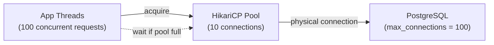

# HikariCP & Connection Pool Tuning

[← Back to README](../README.md)

---

**HikariCP** is Spring Boot's default JDBC connection pool — fast, lightweight, and production-hardened. A misconfigured pool is one of the most common causes of production database outages: too few connections cause request queuing; too many exhaust the database server.



---

## Configuration

```yaml
spring:
  datasource:
    url: jdbc:postgresql://localhost:5432/orders
    username: app
    password: ${DB_PASSWORD}
    hikari:
      # Pool size
      maximum-pool-size: 10          # max connections in pool
      minimum-idle: 5                # connections kept alive when idle

      # Timeouts
      connection-timeout: 3000       # ms to wait for a connection from pool (default 30s)
      idle-timeout: 600000           # ms an idle connection stays in pool (10 min)
      max-lifetime: 1800000          # ms a connection lives before being retired (30 min)
      keepalive-time: 60000          # ms between keepalive pings to DB (1 min)

      # Leak detection
      leak-detection-threshold: 10000  # warn if connection held > 10 s

      # Naming
      pool-name: orders-pool

      # Validation
      connection-test-query: SELECT 1  # only needed for drivers without JDBC4 isValid()
```

---

## Pool Sizing Formula

The classic formula from HikariCP's author:

> **pool size = (core count × 2) + effective spindle count**

For a typical 4-core server with SSD (0 spindles):
```
pool size = (4 × 2) + 1 = 9  ≈ 10
```

More connections does NOT mean more throughput. Each database connection is a thread on the DB server. Overshooting exhausts database resources.

```yaml
# Example: 3 app instances × 10 connections = 30 connections to the DB
# Ensure DB max_connections > (instances × pool_size) + headroom for admin tools
```

### PostgreSQL `max_connections`

```sql
-- Check current setting
SHOW max_connections;

-- Check active connections
SELECT count(*) FROM pg_stat_activity WHERE state = 'active';
SELECT count(*) FROM pg_stat_activity WHERE datname = 'orders';
```

```
# postgresql.conf
max_connections = 100   # reserve some for admin / migrations
```

---

## Monitoring the Pool

### Spring Boot Actuator + Micrometer

HikariCP auto-publishes metrics when Micrometer is on the classpath:

```yaml
management:
  endpoints:
    web:
      exposure:
        include: health, metrics, prometheus
  metrics:
    tags:
      application: ${spring.application.name}
```

Key metrics (available at `/actuator/metrics`):

| Metric | Meaning |
|--------|---------|
| `hikaricp.connections.active` | Connections currently in use |
| `hikaricp.connections.idle` | Connections waiting in the pool |
| `hikaricp.connections.pending` | Threads waiting to acquire a connection |
| `hikaricp.connections.timeout.total` | Total connection timeout errors |
| `hikaricp.connections.acquire` | Time spent acquiring connections (histogram) |
| `hikaricp.connections.usage` | Time connections are held by the application |

### Grafana Dashboard

```promql
# Pool utilisation — alert if > 80%
hikaricp_connections_active{pool="orders-pool"} /
hikaricp_connections_max{pool="orders-pool"}

# Connection wait time p95
histogram_quantile(0.95, rate(hikaricp_connections_acquire_seconds_bucket[5m]))

# Pending threads (requests waiting for a connection)
hikaricp_connections_pending{pool="orders-pool"}
```

---

## Connection Leak Detection

```yaml
hikari:
  leak-detection-threshold: 10000   # ms — log a warning if a connection is held longer
```

```
WARN  HikariPool-1 - Connection leak detection triggered for
      com.zaxxer.hikari.pool.ProxyConnection@1a2b3c4d
      on thread http-nio-8080-exec-3, stack trace follows:
      com.example.OrderRepository.findAll(OrderRepository.java:42)
      ...
```

Common causes of leaks:
- `ResultSet` / `Statement` not closed (use try-with-resources)
- Long-running transactions holding a connection
- Exception thrown before `connection.close()`

```java
// CORRECT — connection released when try block exits
try (Connection conn = dataSource.getConnection();
     PreparedStatement ps = conn.prepareStatement("SELECT ...")) {
    try (ResultSet rs = ps.executeQuery()) {
        while (rs.next()) { ... }
    }
}
```

---

## Timeout Tuning

```yaml
hikari:
  connection-timeout: 3000    # 3 s — fail fast rather than queue indefinitely

  # For slow DB startup (e.g., in Docker Compose)
  initialization-fail-timeout: 30000   # 30 s to wait for pool to initialise
```

```java
// Handle timeout in a @ControllerAdvice
@ExceptionHandler(SQLTimeoutException.class)
public ResponseEntity<ErrorResponse> handleTimeout(SQLTimeoutException ex) {
    return ResponseEntity.status(503)
        .body(new ErrorResponse("database_unavailable", "Try again shortly"));
}
```

---

## Multiple DataSources

```java
@Configuration
public class DataSourceConfig {

    @Primary
    @Bean
    @ConfigurationProperties("spring.datasource.primary.hikari")
    public HikariDataSource primaryDataSource() {
        return new HikariDataSource();
    }

    @Bean
    @ConfigurationProperties("spring.datasource.readonly.hikari")
    public HikariDataSource readOnlyDataSource() {
        return new HikariDataSource();
    }
}
```

```yaml
spring:
  datasource:
    primary:
      url: jdbc:postgresql://primary:5432/orders
      hikari:
        maximum-pool-size: 10
        pool-name: primary-pool

    readonly:
      url: jdbc:postgresql://replica:5432/orders
      hikari:
        maximum-pool-size: 20   # more connections for read-heavy workloads
        read-only: true
        pool-name: readonly-pool
```

---

## Testing with a Real Pool

```java
@SpringBootTest
@Testcontainers
class HikariPoolIntegrationTest {

    @Container
    static PostgreSQLContainer<?> postgres = new PostgreSQLContainer<>("postgres:16");

    @DynamicPropertySource
    static void props(DynamicPropertyRegistry r) {
        r.add("spring.datasource.url", postgres::getJdbcUrl);
        r.add("spring.datasource.username", postgres::getUsername);
        r.add("spring.datasource.password", postgres::getPassword);
    }

    @Autowired HikariDataSource dataSource;

    @Test
    void poolStatsAreReasonable() {
        HikariPoolMXBean pool = dataSource.getHikariPoolMXBean();
        assertThat(pool.getTotalConnections()).isGreaterThan(0);
        assertThat(pool.getActiveConnections()).isLessThanOrEqualTo(
            dataSource.getMaximumPoolSize());
    }
}
```

---

## HikariCP Summary

| Setting | Default | Recommended |
|---------|---------|-------------|
| `maximum-pool-size` | 10 | `(cores × 2) + 1` per instance |
| `minimum-idle` | same as max | 5 (allow shrinking when idle) |
| `connection-timeout` | 30 000 ms | 3 000 ms (fail fast) |
| `idle-timeout` | 600 000 ms | 600 000 ms (10 min) |
| `max-lifetime` | 1 800 000 ms | 1 800 000 ms (30 min, < DB timeout) |
| `keepalive-time` | 0 (disabled) | 60 000 ms (prevent firewall drops) |
| `leak-detection-threshold` | 0 (disabled) | 10 000 ms in dev/staging |

| Metric to Watch | Alert Threshold |
|----------------|----------------|
| `connections.pending` | > 0 sustained |
| Pool utilisation | > 80% |
| `connections.acquire` p95 | > 100 ms |
| `connections.timeout.total` | Any increase |

---

[← Back to README](../README.md)
