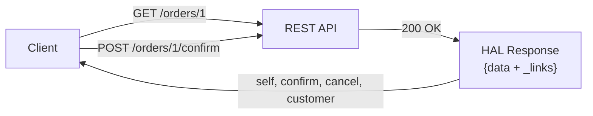

# Spring HATEOAS

[← Back to README](../README.md)

---

**HATEOAS** (Hypermedia as the Engine of Application State) makes REST APIs self-describing: every response includes links that tell the client what actions are available next. Spring HATEOAS provides `EntityModel`, `CollectionModel`, and `LinkBuilder` to add HAL-formatted links to any Spring MVC or WebFlux controller.



---

## Dependency

```xml
<dependency>
    <groupId>org.springframework.boot</groupId>
    <artifactId>spring-boot-starter-hateoas</artifactId>
</dependency>
```

Spring HATEOAS auto-configures HAL as the default media type (`application/hal+json`).

---

## EntityModel — Single Resource

`EntityModel<T>` wraps a domain object and attaches `Link` objects.

```java
import static org.springframework.hateoas.server.mvc.WebMvcLinkBuilder.*;

@RestController
@RequestMapping("/api/orders")
@RequiredArgsConstructor
public class OrderController {

    private final OrderService orderService;
    private final OrderModelAssembler assembler;

    @GetMapping("/{id}")
    public EntityModel<OrderResponse> getOrder(@PathVariable UUID id) {
        OrderResponse order = orderService.findById(id);
        return assembler.toModel(order);
    }

    @PostMapping("/{id}/confirm")
    public EntityModel<OrderResponse> confirm(@PathVariable UUID id) {
        OrderResponse order = orderService.confirm(id);
        return assembler.toModel(order);
    }

    @DeleteMapping("/{id}")
    public ResponseEntity<Void> cancel(@PathVariable UUID id) {
        orderService.cancel(id);
        return ResponseEntity.noContent().build();
    }
}
```

---

## RepresentationModelAssembler

Centralise link-building in an assembler to keep controllers lean.

```java
@Component
public class OrderModelAssembler
        implements RepresentationModelAssembler<OrderResponse, EntityModel<OrderResponse>> {

    @Override
    public EntityModel<OrderResponse> toModel(OrderResponse order) {
        EntityModel<OrderResponse> model = EntityModel.of(order);

        // Self link — always present
        model.add(linkTo(methodOn(OrderController.class)
                .getOrder(order.id())).withSelfRel());

        // Conditional links based on state
        if (order.status() == OrderStatus.PENDING) {
            model.add(linkTo(methodOn(OrderController.class)
                    .confirm(order.id())).withRel("confirm"));

            model.add(linkTo(methodOn(OrderController.class)
                    .cancel(order.id())).withRel("cancel"));
        }

        // Link to related resource
        model.add(linkTo(methodOn(CustomerController.class)
                .getCustomer(order.customerId())).withRel("customer"));

        return model;
    }
}
```

### HAL Response

```json
{
  "id": "a1b2c3d4-...",
  "status": "PENDING",
  "total": 99.99,
  "_links": {
    "self":     { "href": "http://localhost:8080/api/orders/a1b2c3d4-..." },
    "confirm":  { "href": "http://localhost:8080/api/orders/a1b2c3d4-.../confirm" },
    "cancel":   { "href": "http://localhost:8080/api/orders/a1b2c3d4-..." },
    "customer": { "href": "http://localhost:8080/api/customers/cust-1" }
  }
}
```

---

## CollectionModel — List of Resources

```java
@GetMapping
public CollectionModel<EntityModel<OrderResponse>> listOrders() {
    List<EntityModel<OrderResponse>> orders = orderService.findAll()
        .stream()
        .map(assembler::toModel)
        .toList();

    return CollectionModel.of(orders,
        linkTo(methodOn(OrderController.class).listOrders()).withSelfRel());
}
```

### HAL Collection Response

```json
{
  "_embedded": {
    "orderResponseList": [
      {
        "id": "a1b2...",
        "status": "PENDING",
        "_links": { "self": { "href": "..." }, "confirm": { "href": "..." } }
      }
    ]
  },
  "_links": {
    "self": { "href": "http://localhost:8080/api/orders" }
  }
}
```

---

## PagedModel — Paginated Collections

```java
@GetMapping
public PagedModel<EntityModel<OrderResponse>> listOrders(Pageable pageable) {
    Page<OrderResponse> page = orderService.findAll(pageable);
    return pagedResourcesAssembler.toModel(page, assembler);
}
```

```json
{
  "_embedded": { "orderResponseList": [...] },
  "_links": {
    "self":  { "href": "http://localhost:8080/api/orders?page=1&size=20" },
    "first": { "href": "http://localhost:8080/api/orders?page=0&size=20" },
    "prev":  { "href": "http://localhost:8080/api/orders?page=0&size=20" },
    "next":  { "href": "http://localhost:8080/api/orders?page=2&size=20" },
    "last":  { "href": "http://localhost:8080/api/orders?page=5&size=20" }
  },
  "page": { "size": 20, "totalElements": 110, "totalPages": 6, "number": 1 }
}
```

---

## Building Links Manually

```java
// methodOn() — type-safe link building via proxy
Link selfLink = linkTo(methodOn(OrderController.class)
    .getOrder(order.getId())).withSelfRel();

// Manual URL construction
Link reportLink = Link.of("/api/orders/" + order.getId() + "/report", "report");

// With template variables
Link searchLink = Link.of("/api/orders{?status,page,size}").withRel("search");

// Add to any RepresentationModel
order.add(selfLink, reportLink, searchLink);
```

---

## Affordances (Hypermedia Forms)

Affordances describe what request body a link expects — like HTML forms for APIs.

```java
import static org.springframework.hateoas.server.mvc.WebMvcLinkBuilder.*;

Link confirmLink = Affordances.of(
        linkTo(methodOn(OrderController.class).confirm(order.id())).withRel("confirm"))
    .afford(HttpMethod.POST)
        .withInput(ConfirmOrderRequest.class)
        .withOutput(OrderResponse.class)
        .withName("confirm-order")
    .toLink();

model.add(confirmLink);
```

```json
{
  "_links": {
    "confirm": {
      "href": "http://localhost:8080/api/orders/a1b2.../confirm"
    }
  },
  "_templates": {
    "confirm-order": {
      "method": "POST",
      "properties": [
        { "name": "notes", "type": "text" }
      ]
    }
  }
}
```

---

## Extending RepresentationModel

Domain DTOs can extend `RepresentationModel` directly:

```java
public class OrderResponse extends RepresentationModel<OrderResponse> {
    private final UUID id;
    private final OrderStatus status;
    private final BigDecimal total;

    // Lombok @Value or record won't work here — use @Getter + @AllArgsConstructor
}

// In controller
OrderResponse response = new OrderResponse(order.getId(), order.getStatus(), order.getTotal());
response.add(linkTo(methodOn(OrderController.class).getOrder(id)).withSelfRel());
return response;
```

---

## WebFlux (Reactive) HATEOAS

```java
@RestController
@RequestMapping("/api/orders")
public class ReactiveOrderController {

    @GetMapping("/{id}")
    public Mono<EntityModel<OrderResponse>> getOrder(@PathVariable UUID id) {
        return orderService.findById(id)
            .map(order -> EntityModel.of(order,
                linkTo(methodOn(ReactiveOrderController.class)
                    .getOrder(id)).withSelfRel()));
    }

    @GetMapping
    public Mono<CollectionModel<EntityModel<OrderResponse>>> listOrders() {
        return orderService.findAll()
            .map(order -> EntityModel.of(order,
                linkTo(methodOn(ReactiveOrderController.class)
                    .getOrder(order.id())).withSelfRel()))
            .collectList()
            .map(models -> CollectionModel.of(models,
                linkTo(methodOn(ReactiveOrderController.class)
                    .listOrders()).withSelfRel()));
    }
}
```

---

## Testing HATEOAS Responses

```java
@SpringBootTest(webEnvironment = SpringBootTest.WebEnvironment.RANDOM_PORT)
class OrderHateoasTest {

    @Autowired TestRestTemplate rest;

    @Test
    void getOrderIncludesSelfAndConfirmLinks() {
        ResponseEntity<String> response = rest.getForEntity("/api/orders/{id}", String.class, orderId);

        assertThat(response.getStatusCode()).isEqualTo(HttpStatus.OK);

        DocumentContext json = JsonPath.parse(response.getBody());
        assertThat(json.read("$._links.self.href", String.class))
            .endsWith("/api/orders/" + orderId);
        assertThat(json.read("$._links.confirm.href", String.class))
            .endsWith("/api/orders/" + orderId + "/confirm");
    }

    @Test
    void confirmedOrderHasNoConfirmLink() {
        // confirm the order first
        rest.postForEntity("/api/orders/{id}/confirm", null, Void.class, orderId);

        ResponseEntity<String> response = rest.getForEntity("/api/orders/{id}", String.class, orderId);
        DocumentContext json = JsonPath.parse(response.getBody());

        assertThat(json.read("$._links", Map.class)).doesNotContainKey("confirm");
    }
}
```

---

## Spring HATEOAS Summary

| Concept | Detail |
|---------|--------|
| `EntityModel<T>` | Wraps a single resource with `_links` |
| `CollectionModel<T>` | Wraps a list with `_embedded` + collection `_links` |
| `PagedModel<T>` | Adds pagination `_links` (first, prev, next, last) and `page` metadata |
| `RepresentationModelAssembler` | Centralises link-building, keeps controllers clean |
| `linkTo(methodOn(...))` | Type-safe link builder via controller proxy |
| `withSelfRel()` | Produces a `self` link (always include) |
| `withRel("name")` | Produces a named relation link |
| Conditional links | Only add links valid for the current resource state |
| Affordances | Describe expected request body for a link (HAL-FORMS) |
| Media type | `application/hal+json` (default) |

---

[← Back to README](../README.md)
