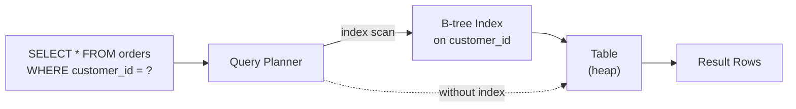
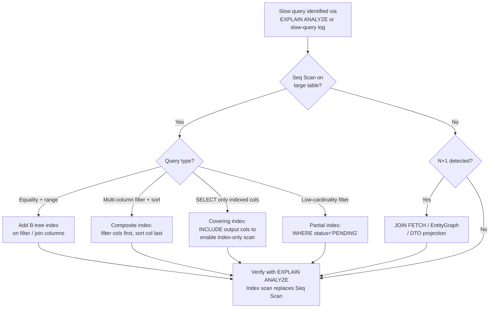

# Database Indexing & Query Optimisation

[← Back to README](../README.md)

---

Indexes are the single biggest lever for query performance. A missing index on a large table turns a millisecond lookup into a full scan that blocks the database for seconds. Understanding how indexes work, when to use them, and how to read a query plan is essential for any backend engineer.



---

## Index Types

### B-tree (Default)

Handles equality, range, `ORDER BY`, and `LIKE 'prefix%'`.

```sql
-- Single-column index
CREATE INDEX idx_orders_customer_id ON orders(customer_id);

-- Composite index — column order matters: left-prefix rule
CREATE INDEX idx_orders_customer_status ON orders(customer_id, status);
-- ✓ Used for: WHERE customer_id = ?
-- ✓ Used for: WHERE customer_id = ? AND status = ?
-- ✗ Not used for: WHERE status = ?  (no leading column)
```

### Hash Index

O(1) equality lookups only — no range queries.

```sql
CREATE INDEX idx_users_email_hash ON users USING hash(email);
-- ✓ WHERE email = 'x@y.com'
-- ✗ WHERE email LIKE 'x%'   — falls back to seq scan
```

### Partial Index

Index only a subset of rows — smaller, faster.

```sql
-- Only index pending orders (the ones queried most often)
CREATE INDEX idx_orders_pending ON orders(created_at)
    WHERE status = 'PENDING';

-- Only index non-deleted records
CREATE INDEX idx_products_active ON products(name)
    WHERE deleted_at IS NULL;
```

### Covering Index (Index-Only Scan)

Include all columns needed by the query so the planner never touches the heap.

```sql
-- Query: SELECT id, total FROM orders WHERE customer_id = ? ORDER BY created_at
CREATE INDEX idx_orders_covering
    ON orders(customer_id, created_at)
    INCLUDE (id, total);  -- PostgreSQL 11+; MySQL: add to composite key
```

### GIN / GiST (Full-text, JSON, Arrays)

```sql
-- Full-text search
CREATE INDEX idx_products_fts ON products USING gin(to_tsvector('english', description));

-- JSONB containment
CREATE INDEX idx_events_payload ON events USING gin(payload jsonb_ops);
-- Enables: WHERE payload @> '{"type": "ORDER_PLACED"}'

-- Array containment
CREATE INDEX idx_tags ON articles USING gin(tags);
-- Enables: WHERE tags @> ARRAY['java']
```

---

## EXPLAIN ANALYZE

Always analyse before adding an index. `EXPLAIN ANALYZE` runs the query and shows actual vs estimated costs.

```sql
EXPLAIN (ANALYZE, BUFFERS, FORMAT TEXT)
SELECT o.id, o.total, c.name
FROM orders o
JOIN customers c ON c.id = o.customer_id
WHERE o.status = 'PENDING'
ORDER BY o.created_at DESC
LIMIT 20;
```

```
Limit  (cost=45.23..45.28 rows=20) (actual time=12.345..12.378 rows=20)
  ->  Sort  (cost=45.23..46.23 rows=400) (actual time=12.344..12.352 rows=20)
        Sort Key: o.created_at DESC
        Sort Method: top-N heapsort  Memory: 26kB
        ->  Hash Join  (cost=8.15..30.00 rows=400) (actual time=0.412..11.892 rows=400)
              Hash Cond: (o.customer_id = c.id)
              ->  Seq Scan on orders o  (cost=0.00..20.00 rows=400)  ← BAD: full scan
                    Filter: (status = 'PENDING')
              ->  Hash  (cost=5.00..5.00 rows=250)
                    ->  Seq Scan on customers c
Planning Time: 0.8 ms
Execution Time: 12.9 ms
```

**Red flags:**
- `Seq Scan` on large tables → missing index
- High rows estimate vs actual → stale statistics (`ANALYZE orders;`)
- `Sort` after `Seq Scan` → consider composite index on `(status, created_at)`

---

## Spring Boot / JPA — Adding Indexes

```java
@Entity
@Table(name = "orders", indexes = {
    @Index(name = "idx_orders_customer_id",        columnList = "customer_id"),
    @Index(name = "idx_orders_customer_status",    columnList = "customer_id, status"),
    @Index(name = "idx_orders_created_at",         columnList = "created_at DESC")
})
public class Order {
    @Id UUID id;

    @Column(name = "customer_id", nullable = false)
    UUID customerId;

    @Enumerated(EnumType.STRING)
    @Column(nullable = false)
    OrderStatus status;

    Instant createdAt;
}
```

With Flyway / Liquibase, add indexes as explicit migration steps — don't rely on JPA DDL in production:

```sql
-- V5__add_order_indexes.sql
CREATE INDEX CONCURRENTLY idx_orders_customer_id ON orders(customer_id);
CREATE INDEX CONCURRENTLY idx_orders_customer_status ON orders(customer_id, status);
```

`CONCURRENTLY` builds the index without locking the table — essential on production tables with live traffic.

---

## Common Indexing Mistakes

### Functions Break Indexes

```sql
-- BAD — index on email is NOT used
SELECT * FROM users WHERE LOWER(email) = 'user@example.com';

-- FIX 1 — functional index
CREATE INDEX idx_users_email_lower ON users(LOWER(email));

-- FIX 2 — store as lowercase in the application
user.setEmail(email.toLowerCase());
```

### Implicit Casts Break Indexes

```sql
-- BAD — customer_id is UUID, parameter is VARCHAR → cast prevents index use
WHERE customer_id = '123e4567-...'::text   -- or via JDBC setString on a UUID column

-- FIX — use typed parameters
PreparedStatement ps = conn.prepareStatement(
    "SELECT * FROM orders WHERE customer_id = ?");
ps.setObject(1, uuid);  // correctly typed
```

### Too Many Indexes

Each index slows down `INSERT`, `UPDATE`, and `DELETE`. Rule of thumb:
- Add indexes for query patterns you can demonstrate with `EXPLAIN ANALYZE`
- Remove indexes that haven't been used in 30 days

```sql
-- Find unused indexes in PostgreSQL
SELECT schemaname, tablename, indexname, idx_scan
FROM pg_stat_user_indexes
WHERE idx_scan = 0
  AND indexname NOT LIKE '%pkey'
ORDER BY tablename;
```

---

## N+1 Queries — the ORM Tax

```java
// BAD — 1 query for orders + N queries for each customer
List<Order> orders = orderRepo.findAll();
for (Order o : orders) {
    System.out.println(o.getCustomer().getName());  // lazy load fires here
}

// FIX 1 — JOIN FETCH in JPQL
@Query("SELECT o FROM Order o JOIN FETCH o.customer WHERE o.status = :status")
List<Order> findByStatusWithCustomer(@Param("status") OrderStatus status);

// FIX 2 — EntityGraph
@EntityGraph(attributePaths = {"customer", "lines"})
List<Order> findByStatus(OrderStatus status);

// FIX 3 — DTO projection (avoids loading full entity graph)
@Query("""
    SELECT new com.example.OrderSummary(o.id, o.total, c.name)
    FROM Order o JOIN o.customer c
    WHERE o.status = :status
    """)
List<OrderSummary> findSummariesByStatus(@Param("status") OrderStatus status);
```

---

## Query Plan Analysis Cheatsheet

```sql
-- PostgreSQL: force index use for testing
SET enable_seqscan = OFF;
EXPLAIN ANALYZE SELECT ...;
SET enable_seqscan = ON;

-- Update statistics after bulk inserts
ANALYZE orders;
VACUUM ANALYZE orders;  -- also reclaims dead tuples

-- Index size
SELECT indexname, pg_size_pretty(pg_relation_size(indexrelid))
FROM pg_stat_user_indexes
WHERE tablename = 'orders';

-- Table size
SELECT pg_size_pretty(pg_total_relation_size('orders'));
```

```sql
-- MySQL equivalent
EXPLAIN FORMAT=JSON SELECT ...;
SHOW INDEX FROM orders;
ANALYZE TABLE orders;
```

---

## Index Maintenance

```sql
-- Rebuild bloated indexes (PostgreSQL) — locks table
REINDEX INDEX idx_orders_customer_id;

-- Rebuild without locking (PostgreSQL 12+)
REINDEX INDEX CONCURRENTLY idx_orders_customer_id;

-- Find bloated indexes
SELECT indexname,
       pg_size_pretty(pg_relation_size(indexrelid)) AS index_size,
       idx_scan, idx_tup_read, idx_tup_fetch
FROM pg_stat_user_indexes
WHERE tablename = 'orders'
ORDER BY pg_relation_size(indexrelid) DESC;
```

---

## Indexing Decision Flowchart



---

## Database Indexing Summary

| Index Type | Use Case | Limitation |
|------------|---------|-----------|
| B-tree | Equality, range, sort, `LIKE 'prefix%'` | Inefficient for high-update columns |
| Hash | Equality only (fast) | No range or sort support |
| Partial | Subset of rows (e.g. `WHERE active = true`) | Only usable when WHERE clause matches |
| Covering (`INCLUDE`) | Index-only scans — avoid heap access | Larger index size |
| GIN | JSON, arrays, full-text search | Slow to build; high insert cost |
| Composite | Multi-column filter queries | Left-prefix rule applies |

| Key Practice | Detail |
|-------------|--------|
| `EXPLAIN ANALYZE` | Always run before and after adding indexes |
| `CREATE INDEX CONCURRENTLY` | Build without table lock on live systems |
| N+1 prevention | `JOIN FETCH`, `@EntityGraph`, or DTO projections |
| Functional indexes | Required when predicates use functions (`LOWER`, `DATE`) |
| Remove unused indexes | They slow writes with zero read benefit |
| Update statistics | `ANALYZE` after bulk loads; keeps planner estimates accurate |

---

[← Back to README](../README.md)
