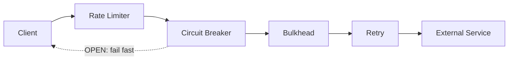
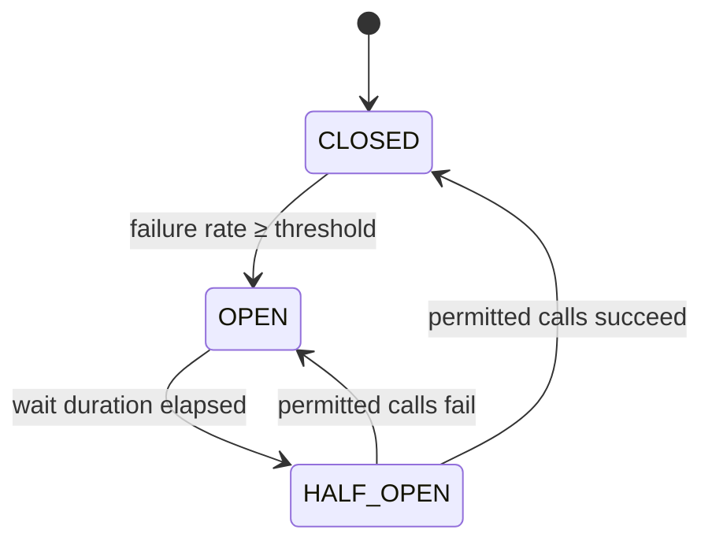

# Resilience4j

[← Back to README](../README.md)

---

**Resilience4j** is a lightweight fault-tolerance library designed for Java 8+ and functional programming. It provides Circuit Breaker, Retry, Rate Limiter, Bulkhead, TimeLimiter, and Cache decorators that compose around any `Supplier`, `Function`, or `Callable`. Spring Boot auto-configures all modules via `spring-boot-starter-aop` + `resilience4j-spring-boot3`.



---

## Dependency

```xml
<dependency>
    <groupId>io.github.resilience4j</groupId>
    <artifactId>resilience4j-spring-boot3</artifactId>
    <version>2.2.0</version>
</dependency>
<dependency>
    <groupId>org.springframework.boot</groupId>
    <artifactId>spring-boot-starter-aop</artifactId>
</dependency>
```

---

## Circuit Breaker

### How It Works



### Configuration

```yaml
resilience4j:
  circuitbreaker:
    instances:
      paymentService:
        sliding-window-type: COUNT_BASED        # or TIME_BASED
        sliding-window-size: 10                 # last 10 calls
        failure-rate-threshold: 50              # open if 50% fail
        minimum-number-of-calls: 5              # need 5 calls before evaluating
        wait-duration-in-open-state: 10s        # time before HALF_OPEN
        permitted-number-of-calls-in-half-open-state: 3
        slow-call-rate-threshold: 80            # treat slow calls as failures
        slow-call-duration-threshold: 2s
        record-exceptions:
          - java.io.IOException
          - java.util.concurrent.TimeoutException
        ignore-exceptions:
          - com.example.BusinessException         # don't count as failures
```

### Usage

```java
@Service
@RequiredArgsConstructor
public class PaymentService {

    private final PaymentGatewayClient client;

    @CircuitBreaker(name = "paymentService", fallbackMethod = "paymentFallback")
    public PaymentResult charge(ChargeRequest request) {
        return client.charge(request);
    }

    // Fallback — same return type, extra Throwable param
    private PaymentResult paymentFallback(ChargeRequest request, Throwable ex) {
        log.warn("Payment circuit open, using fallback: {}", ex.getMessage());
        return PaymentResult.deferred(request.orderId());
    }
}
```

### Programmatic API

```java
CircuitBreakerRegistry registry = CircuitBreakerRegistry.ofDefaults();
CircuitBreaker cb = registry.circuitBreaker("paymentService");

Supplier<PaymentResult> decorated = CircuitBreaker.decorateSupplier(cb,
    () -> client.charge(request));

Try<PaymentResult> result = Try.ofSupplier(decorated)
    .recover(CallNotPermittedException.class, ex -> PaymentResult.deferred(orderId));
```

---

## Retry

```yaml
resilience4j:
  retry:
    instances:
      inventoryService:
        max-attempts: 3
        wait-duration: 500ms
        enable-exponential-backoff: true
        exponential-backoff-multiplier: 2       # 500ms, 1000ms, 2000ms
        randomized-wait-factor: 0.2             # ±20% jitter
        retry-exceptions:
          - java.io.IOException
          - org.springframework.web.client.ResourceAccessException
        ignore-exceptions:
          - com.example.NotFoundException
```

```java
@Retry(name = "inventoryService", fallbackMethod = "inventoryFallback")
@CircuitBreaker(name = "inventoryService")
public InventoryResult checkStock(UUID productId) {
    return inventoryClient.check(productId);
}

private InventoryResult inventoryFallback(UUID productId, Exception ex) {
    return InventoryResult.unknown(productId);
}
```

---

## Rate Limiter

Limits the number of calls in a time window using a token-bucket / sliding-window algorithm.

```yaml
resilience4j:
  ratelimiter:
    instances:
      externalApi:
        limit-for-period: 10          # 10 calls per refresh period
        limit-refresh-period: 1s      # refresh every second
        timeout-duration: 200ms       # wait up to 200ms for a permit
```

```java
@RateLimiter(name = "externalApi", fallbackMethod = "rateLimitFallback")
public ApiResponse callExternalApi(String param) {
    return externalClient.call(param);
}

private ApiResponse rateLimitFallback(String param, RequestNotPermitted ex) {
    throw new TooManyRequestsException("Rate limit exceeded, try again shortly");
}
```

---

## Bulkhead

Limits concurrent calls to prevent thread exhaustion. Two implementations:

### Semaphore Bulkhead (default)

```yaml
resilience4j:
  bulkhead:
    instances:
      paymentService:
        max-concurrent-calls: 10      # max 10 simultaneous calls
        max-wait-duration: 100ms      # wait before rejecting
```

### Thread Pool Bulkhead (for async)

```yaml
resilience4j:
  thread-pool-bulkhead:
    instances:
      paymentService:
        max-thread-pool-size: 10
        core-thread-pool-size: 5
        queue-capacity: 20
        keep-alive-duration: 20ms
```

```java
@Bulkhead(name = "paymentService", type = Bulkhead.Type.SEMAPHORE)
public PaymentResult charge(ChargeRequest request) {
    return client.charge(request);
}

@Bulkhead(name = "paymentService", type = Bulkhead.Type.THREADPOOL)
public CompletableFuture<PaymentResult> chargeAsync(ChargeRequest request) {
    return CompletableFuture.supplyAsync(() -> client.charge(request));
}
```

---

## TimeLimiter

Wraps a `CompletableFuture` and cancels it if it exceeds the timeout.

```yaml
resilience4j:
  timelimiter:
    instances:
      paymentService:
        timeout-duration: 2s
        cancel-running-future: true
```

```java
@TimeLimiter(name = "paymentService")
@CircuitBreaker(name = "paymentService")
public CompletableFuture<PaymentResult> chargeAsync(ChargeRequest request) {
    return CompletableFuture.supplyAsync(() -> client.charge(request));
}
```

---

## Combining Decorators

The correct order from outermost to innermost: `Retry → CircuitBreaker → RateLimiter → TimeLimiter → Bulkhead → method`.

```java
// Annotation order (Spring AOP outermost = last annotation)
@Retry(name = "svc")
@CircuitBreaker(name = "svc")
@RateLimiter(name = "svc")
@Bulkhead(name = "svc")
public Result call() { ... }

// Programmatic decoration — same order explicitly
CircuitBreaker cb        = cbRegistry.circuitBreaker("svc");
RateLimiter   rl        = rlRegistry.rateLimiter("svc");
Retry         retry     = retryRegistry.retry("svc");
TimeLimiter   tl        = tlRegistry.timeLimiter("svc");

Supplier<Result> decorated = Decorators.ofSupplier(() -> client.call())
    .withCircuitBreaker(cb)
    .withRateLimiter(rl)
    .withRetry(retry)
    .decorate();
```

---

## Metrics and Monitoring

Resilience4j auto-publishes Micrometer metrics when `micrometer-core` is on the classpath:

```promql
# Circuit breaker state (0=CLOSED, 1=OPEN, 2=HALF_OPEN)
resilience4j_circuitbreaker_state{name="paymentService"}

# Failure rate
resilience4j_circuitbreaker_failure_rate{name="paymentService"}

# Retry attempts
resilience4j_retry_calls_total{name="inventoryService", kind="successful_with_retry"}

# Bulkhead available capacity
resilience4j_bulkhead_available_concurrent_calls{name="paymentService"}
```

```yaml
management:
  health:
    circuitbreakers:
      enabled: true
  endpoint:
    health:
      show-details: always
```

```json
// GET /actuator/health
{
  "components": {
    "circuitBreakers": {
      "details": {
        "paymentService": {
          "status": "UP",
          "details": { "state": "CLOSED", "failureRate": "10.0%" }
        }
      }
    }
  }
}
```

---

## Testing

```java
@SpringBootTest
class PaymentServiceTest {

    @Autowired PaymentService paymentService;
    @Autowired CircuitBreakerRegistry cbRegistry;

    @Test
    void circuitBreakerOpensAfterFailures() {
        CircuitBreaker cb = cbRegistry.circuitBreaker("paymentService");

        // Force failures to open the circuit
        cb.transitionToOpenState();

        assertThatThrownBy(() -> paymentService.charge(new ChargeRequest(...)))
            .isInstanceOf(CallNotPermittedException.class);
    }

    @Test
    void retryRecovery() {
        // Given first two calls fail, third succeeds
        when(client.charge(any()))
            .thenThrow(new IOException())
            .thenThrow(new IOException())
            .thenReturn(PaymentResult.success());

        PaymentResult result = paymentService.charge(new ChargeRequest(...));
        assertThat(result.isSuccess()).isTrue();
        verify(client, times(3)).charge(any());
    }
}
```

---

## Resilience4j Summary

| Module | Purpose | Key Config |
|--------|---------|-----------|
| Circuit Breaker | Stop calls to a failing service | `failure-rate-threshold`, `wait-duration-in-open-state` |
| Retry | Re-attempt failed calls | `max-attempts`, `wait-duration`, `exponential-backoff-multiplier` |
| Rate Limiter | Limit calls per time window | `limit-for-period`, `limit-refresh-period` |
| Bulkhead | Limit concurrent calls | `max-concurrent-calls` (semaphore) or `max-thread-pool-size` |
| TimeLimiter | Cancel slow async calls | `timeout-duration`, `cancel-running-future` |

| Annotation | Pairs With |
|-----------|-----------|
| `@CircuitBreaker(fallbackMethod=)` | Any synchronous method |
| `@Retry(fallbackMethod=)` | Any synchronous method |
| `@RateLimiter(fallbackMethod=)` | Any method |
| `@Bulkhead(type=THREADPOOL)` | `CompletableFuture`-returning methods |
| `@TimeLimiter` | `CompletableFuture`-returning methods |

---

[← Back to README](../README.md)
