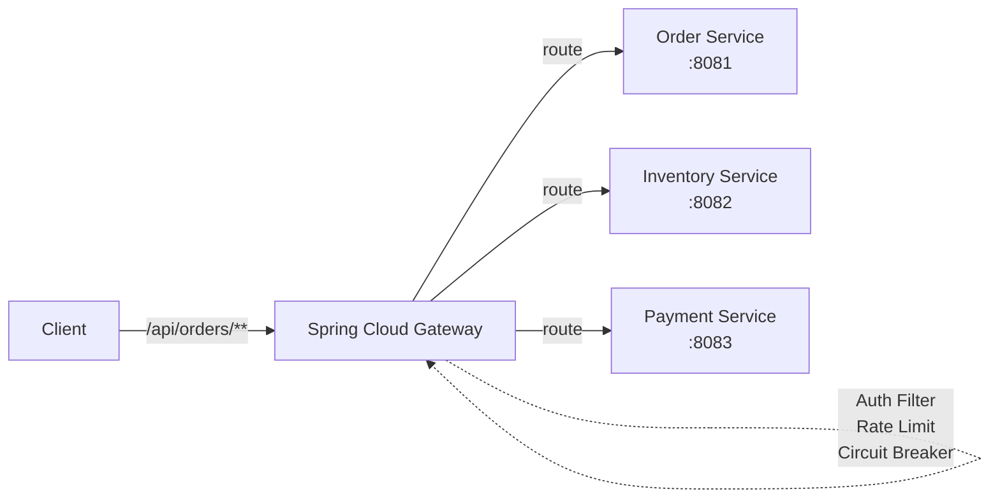

# Spring Cloud Gateway

[← Back to README](../README.md)

---

**Spring Cloud Gateway** is a reactive API gateway built on Spring WebFlux and Project Reactor. It routes incoming requests to downstream services, applies cross-cutting concerns (authentication, rate limiting, circuit breaking, request/response transformation), and provides a single entry point for a microservices system.



---

## Dependency

```xml
<dependency>
    <groupId>org.springframework.cloud</groupId>
    <artifactId>spring-cloud-starter-gateway</artifactId>
</dependency>
<!-- Spring Boot parent manages spring-cloud.version -->
<dependencyManagement>
    <dependencies>
        <dependency>
            <groupId>org.springframework.cloud</groupId>
            <artifactId>spring-cloud-dependencies</artifactId>
            <version>2023.0.3</version>
            <type>pom</type>
            <scope>import</scope>
        </dependency>
    </dependencies>
</dependencyManagement>
```

Gateway is WebFlux-based — do NOT add `spring-boot-starter-web` (they conflict).

---

## Route Configuration (YAML)

```yaml
spring:
  cloud:
    gateway:
      routes:
        # Route 1 — Order Service
        - id: order-service
          uri: http://order-service:8081          # downstream URL
          predicates:
            - Path=/api/orders/**                 # match this path
          filters:
            - StripPrefix=1                       # remove /api prefix before forwarding

        # Route 2 — Inventory Service with rewrite
        - id: inventory-service
          uri: lb://inventory-service             # service discovery (load balanced)
          predicates:
            - Path=/api/inventory/**
            - Method=GET,POST
            - Header=X-Request-Source, internal   # only if header present
          filters:
            - RewritePath=/api/inventory/(?<segment>.*), /inventory/${segment}
            - AddRequestHeader=X-Gateway-Source, api-gateway
            - AddResponseHeader=X-Response-Time, ${System.currentTimeMillis()}

        # Route 3 — with weight (A/B / canary)
        - id: payment-v1
          uri: http://payment-v1:8083
          predicates:
            - Path=/api/payments/**
            - Weight=payment-group, 90            # 90% of traffic

        - id: payment-v2
          uri: http://payment-v2:8084
          predicates:
            - Path=/api/payments/**
            - Weight=payment-group, 10            # 10% of traffic (canary)
```

---

## Predicates

| Predicate | Example |
|-----------|---------|
| `Path` | `Path=/api/orders/**` |
| `Method` | `Method=GET,POST` |
| `Header` | `Header=X-Version, v2` |
| `Query` | `Query=debug, true` |
| `Cookie` | `Cookie=session, abc` |
| `Host` | `Host=**.example.com` |
| `After` | `After=2024-01-01T00:00:00Z` (time-based routing) |
| `Weight` | `Weight=group, 80` (traffic splitting) |
| `RemoteAddr` | `RemoteAddr=192.168.1.0/24` (IP allowlist) |

---

## Built-in Filters

```yaml
filters:
  - StripPrefix=1                             # remove N path segments
  - PrefixPath=/v1                            # prepend prefix
  - RewritePath=/old/(?<seg>.*), /new/${seg}  # regex rewrite
  - AddRequestHeader=X-Source, gateway
  - AddResponseHeader=X-Cache, hit
  - RemoveRequestHeader=Cookie
  - SetStatus=404
  - RedirectTo=302, https://new.example.com
  - PreserveHostHeader                        # keep original Host header
  - SecureHeaders                             # add HSTS, CSP, X-Frame-Options
  - RequestRateLimiter:                       # (see rate limiting below)
      redis-rate-limiter.replenishRate: 10
      redis-rate-limiter.burstCapacity: 20
      key-resolver: "#{@userKeyResolver}"
```

---

## Global Filters

```java
@Component
@Order(-1)
public class RequestLoggingFilter implements GlobalFilter {

    @Override
    public Mono<Void> filter(ServerWebExchange exchange, GatewayFilterChain chain) {
        ServerHttpRequest request = exchange.getRequest();
        log.info("Gateway: {} {}", request.getMethod(), request.getURI());

        return chain.filter(exchange).then(Mono.fromRunnable(() -> {
            ServerHttpResponse response = exchange.getResponse();
            log.info("Gateway response: {}", response.getStatusCode());
        }));
    }
}
```

---

## Custom Gateway Filter

```java
@Component
public class JwtAuthGatewayFilterFactory
        extends AbstractGatewayFilterFactory<JwtAuthGatewayFilterFactory.Config> {

    private final JwtValidator jwtValidator;

    public JwtAuthGatewayFilterFactory(JwtValidator jwtValidator) {
        super(Config.class);
        this.jwtValidator = jwtValidator;
    }

    @Override
    public GatewayFilter apply(Config config) {
        return (exchange, chain) -> {
            String token = extractToken(exchange.getRequest());

            if (token == null) {
                exchange.getResponse().setStatusCode(HttpStatus.UNAUTHORIZED);
                return exchange.getResponse().setComplete();
            }

            return jwtValidator.validate(token)
                .flatMap(claims -> {
                    ServerHttpRequest mutated = exchange.getRequest().mutate()
                        .header("X-User-Id", claims.getSubject())
                        .header("X-User-Roles", String.join(",", claims.getRoles()))
                        .build();
                    return chain.filter(exchange.mutate().request(mutated).build());
                })
                .onErrorResume(e -> {
                    exchange.getResponse().setStatusCode(HttpStatus.UNAUTHORIZED);
                    return exchange.getResponse().setComplete();
                });
        };
    }

    private String extractToken(ServerHttpRequest request) {
        String auth = request.getHeaders().getFirst(HttpHeaders.AUTHORIZATION);
        return (auth != null && auth.startsWith("Bearer ")) ? auth.substring(7) : null;
    }

    public static class Config {}
}
```

```yaml
spring:
  cloud:
    gateway:
      routes:
        - id: order-service
          uri: http://order-service:8081
          predicates:
            - Path=/api/orders/**
          filters:
            - JwtAuth    # uses JwtAuthGatewayFilterFactory by name
```

---

## Rate Limiting (Redis)

```xml
<dependency>
    <groupId>org.springframework.boot</groupId>
    <artifactId>spring-boot-starter-data-redis-reactive</artifactId>
</dependency>
```

```java
@Bean
public KeyResolver userKeyResolver() {
    // Rate limit per authenticated user
    return exchange -> Mono.justOrEmpty(
        exchange.getRequest().getHeaders().getFirst("X-User-Id"))
        .defaultIfEmpty("anonymous");
}

@Bean
public KeyResolver ipKeyResolver() {
    return exchange -> Mono.just(
        Objects.requireNonNull(exchange.getRequest().getRemoteAddress())
            .getAddress().getHostAddress());
}
```

```yaml
spring:
  data:
    redis:
      host: localhost
      port: 6379
  cloud:
    gateway:
      routes:
        - id: order-service
          uri: http://order-service:8081
          predicates:
            - Path=/api/orders/**
          filters:
            - name: RequestRateLimiter
              args:
                redis-rate-limiter.replenishRate: 10    # tokens/sec
                redis-rate-limiter.burstCapacity: 20    # max burst
                redis-rate-limiter.requestedTokens: 1   # cost per request
                key-resolver: "#{@userKeyResolver}"
```

---

## Circuit Breaker Integration

```xml
<dependency>
    <groupId>org.springframework.cloud</groupId>
    <artifactId>spring-cloud-starter-circuitbreaker-reactor-resilience4j</artifactId>
</dependency>
```

```yaml
spring:
  cloud:
    gateway:
      routes:
        - id: payment-service
          uri: http://payment-service:8083
          filters:
            - name: CircuitBreaker
              args:
                name: paymentCB
                fallbackUri: forward:/fallback/payment
```

```java
@RestController
public class FallbackController {

    @GetMapping("/fallback/payment")
    public ResponseEntity<Map<String, String>> paymentFallback() {
        return ResponseEntity.status(HttpStatus.SERVICE_UNAVAILABLE)
            .body(Map.of("error", "Payment service unavailable", "retry", "true"));
    }
}
```

---

## Programmatic Route Definition

```java
@Configuration
public class GatewayConfig {

    @Bean
    public RouteLocator routes(RouteLocatorBuilder builder,
                               JwtAuthGatewayFilterFactory jwtAuth) {
        return builder.routes()
            .route("order-service", r -> r
                .path("/api/orders/**")
                .filters(f -> f
                    .stripPrefix(1)
                    .filter(jwtAuth.apply(new JwtAuthGatewayFilterFactory.Config()))
                    .addRequestHeader("X-Gateway", "true"))
                .uri("lb://order-service"))

            .route("actuator-health", r -> r
                .path("/health")
                .filters(f -> f.rewritePath("/health", "/actuator/health"))
                .uri("http://order-service:8081"))

            .build();
    }
}
```

---

## CORS at the Gateway

Configure CORS once at the gateway rather than in every downstream service:

```yaml
spring:
  cloud:
    gateway:
      globalcors:
        cors-configurations:
          '[/**]':
            allowed-origins:
              - "https://app.example.com"
            allowed-methods:
              - GET
              - POST
              - PUT
              - DELETE
            allowed-headers: "*"
            allow-credentials: true
            max-age: 3600
```

---

## Monitoring

```yaml
management:
  endpoints:
    web:
      exposure:
        include: gateway, health, metrics, prometheus
```

```bash
# List all routes
GET /actuator/gateway/routes

# Global filters
GET /actuator/gateway/globalfilters

# Route filters
GET /actuator/gateway/routefilters

# Refresh routes without restart (if using DiscoveryClient)
POST /actuator/gateway/refresh
```

---

## Spring Cloud Gateway Summary

| Concept | Detail |
|---------|--------|
| Predicate | Condition that must match for a route to apply (path, method, header, host) |
| Filter | Pre/post processing applied to matched requests (add headers, rate limit, circuit break) |
| Global Filter | Applies to every request (`GlobalFilter` bean) |
| `lb://service-name` | Load-balanced URI via Spring Cloud DiscoveryClient |
| `StripPrefix=N` | Remove N leading path segments before forwarding |
| `RewritePath` | Regex path rewrite before forwarding |
| `RequestRateLimiter` | Redis token-bucket per key resolver |
| `CircuitBreaker` | Resilience4j circuit breaker with `fallbackUri` |
| `Weight` | Weighted routing for canary / A/B deployments |
| `KeyResolver` | Function returning rate-limit key (user ID, IP address) |

---

[← Back to README](../README.md)
