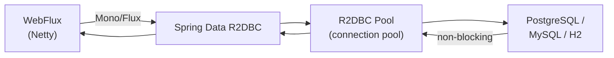

# R2DBC — Reactive Relational Database

[← Back to README](../README.md)

---

**R2DBC** (Reactive Relational Database Connectivity) is a non-blocking database driver API for relational databases. Unlike JDBC (which blocks a thread per query), R2DBC returns `Mono<T>` / `Flux<T>` so a small thread pool can handle thousands of concurrent database operations. Use it with Spring WebFlux for a fully reactive stack.



---

## Dependencies

```xml
<!-- PostgreSQL -->
<dependency>
    <groupId>org.springframework.boot</groupId>
    <artifactId>spring-boot-starter-data-r2dbc</artifactId>
</dependency>
<dependency>
    <groupId>org.postgresql</groupId>
    <artifactId>r2dbc-postgresql</artifactId>
    <scope>runtime</scope>
</dependency>

<!-- For tests — H2 with R2DBC support -->
<dependency>
    <groupId>io.r2dbc</groupId>
    <artifactId>r2dbc-h2</artifactId>
    <scope>test</scope>
</dependency>
```

---

## Configuration

```yaml
spring:
  r2dbc:
    url: r2dbc:postgresql://localhost:5432/orders
    username: app
    password: ${DB_PASSWORD}
    pool:
      initial-size: 5
      max-size: 20
      max-idle-time: 30m
      validation-query: SELECT 1

  # Schema creation — use Flyway for production
  sql:
    init:
      mode: always          # runs schema.sql + data.sql on startup
```

---

## Entity Mapping

R2DBC uses simple field mapping — no JPA annotations, no lazy loading, no entity graphs.

```java
import org.springframework.data.annotation.Id;
import org.springframework.data.relational.core.mapping.Column;
import org.springframework.data.relational.core.mapping.Table;

@Table("orders")
public record Order(
    @Id UUID id,
    @Column("customer_id") UUID customerId,
    @Column("status") String status,
    @Column("total") BigDecimal total,
    @Column("created_at") Instant createdAt
) {
    public static Order create(UUID customerId, BigDecimal total) {
        return new Order(null, customerId, "PENDING", total, Instant.now());
    }
}
```

---

## Repository

```java
public interface OrderRepository extends ReactiveCrudRepository<Order, UUID> {

    Flux<Order> findByCustomerId(UUID customerId);

    Flux<Order> findByStatus(String status);

    @Query("SELECT * FROM orders WHERE customer_id = :customerId AND status = :status")
    Flux<Order> findByCustomerIdAndStatus(UUID customerId, String status);

    @Query("SELECT COUNT(*) FROM orders WHERE customer_id = :customerId")
    Mono<Long> countByCustomerId(UUID customerId);

    // Pagination
    Flux<Order> findByCustomerId(UUID customerId, Pageable pageable);
}
```

---

## Service Layer

```java
@Service
@RequiredArgsConstructor
public class OrderService {

    private final OrderRepository orderRepo;
    private final DatabaseClient db;

    public Mono<Order> placeOrder(PlaceOrderCommand cmd) {
        Order order = Order.create(cmd.customerId(), cmd.total());
        return orderRepo.save(order);
    }

    public Flux<Order> getOrdersByCustomer(UUID customerId) {
        return orderRepo.findByCustomerId(customerId);
    }

    public Mono<Order> confirm(UUID orderId) {
        return orderRepo.findById(orderId)
            .switchIfEmpty(Mono.error(new OrderNotFoundException(orderId)))
            .flatMap(order -> {
                if (!order.status().equals("PENDING"))
                    return Mono.error(new IllegalStateException("Order not PENDING"));
                return orderRepo.save(new Order(
                    order.id(), order.customerId(),
                    "CONFIRMED", order.total(), order.createdAt()));
            });
    }

    public Mono<Void> delete(UUID orderId) {
        return orderRepo.deleteById(orderId);
    }
}
```

---

## DatabaseClient — Custom SQL

`DatabaseClient` is the low-level R2DBC API for queries that don't fit the repository abstraction.

```java
@Service
@RequiredArgsConstructor
public class OrderQueryService {

    private final DatabaseClient db;

    public Flux<OrderSummary> summaryByStatus() {
        return db.sql("""
                SELECT status,
                       COUNT(*)            AS order_count,
                       SUM(total)          AS revenue
                FROM orders
                GROUP BY status
                ORDER BY status
                """)
            .map((row, meta) -> new OrderSummary(
                row.get("status", String.class),
                row.get("order_count", Long.class),
                row.get("revenue", BigDecimal.class)))
            .all();
    }

    public Mono<Integer> bulkUpdateStatus(List<UUID> ids, String newStatus) {
        return db.sql("UPDATE orders SET status = :status WHERE id = ANY(:ids)")
            .bind("status", newStatus)
            .bind("ids", ids.toArray(UUID[]::new))
            .fetch()
            .rowsUpdated()
            .map(Long::intValue);
    }
}
```

---

## Transactions

```java
@Service
@RequiredArgsConstructor
public class OrderFulfillmentService {

    private final OrderRepository orderRepo;
    private final InventoryRepository inventoryRepo;
    private final TransactionalOperator txOp;

    // Declarative transaction (works with @Transactional in reactive context)
    @Transactional
    public Mono<Order> fulfil(UUID orderId) {
        return orderRepo.findById(orderId)
            .flatMap(order -> inventoryRepo.reserve(order.productId(), 1)
                .then(orderRepo.save(order.withStatus("CONFIRMED"))));
    }

    // Programmatic transaction (useful when you need fine control)
    public Mono<Order> fulfilProgrammatic(UUID orderId) {
        return txOp.transactional(
            orderRepo.findById(orderId)
                .flatMap(order -> inventoryRepo.reserve(order.productId(), 1)
                    .then(orderRepo.save(order.withStatus("CONFIRMED"))))
        );
    }
}
```

---

## Reactive Controller

```java
@RestController
@RequestMapping("/api/orders")
@RequiredArgsConstructor
public class OrderController {

    private final OrderService orderService;

    @PostMapping
    @ResponseStatus(HttpStatus.CREATED)
    public Mono<Order> placeOrder(@RequestBody @Valid PlaceOrderRequest req) {
        return orderService.placeOrder(new PlaceOrderCommand(req.customerId(), req.total()));
    }

    @GetMapping("/{id}")
    public Mono<ResponseEntity<Order>> getOrder(@PathVariable UUID id) {
        return orderService.findById(id)
            .map(ResponseEntity::ok)
            .defaultIfEmpty(ResponseEntity.notFound().build());
    }

    @GetMapping
    public Flux<Order> listByCustomer(@RequestParam UUID customerId) {
        return orderService.getOrdersByCustomer(customerId);
    }

    // Streaming — sends each row as it arrives
    @GetMapping(value = "/stream", produces = MediaType.TEXT_EVENT_STREAM_VALUE)
    public Flux<Order> streamOrders() {
        return orderService.streamAll();
    }
}
```

---

## Schema Setup with Flyway (R2DBC)

Flyway does not support R2DBC directly — it uses a JDBC connection for migrations. Add both drivers:

```xml
<dependency>
    <groupId>org.flywaydb</groupId>
    <artifactId>flyway-core</artifactId>
</dependency>
<dependency>
    <groupId>org.postgresql</groupId>
    <artifactId>postgresql</artifactId>   <!-- JDBC driver for Flyway only -->
    <scope>runtime</scope>
</dependency>
```

```yaml
spring:
  flyway:
    url: jdbc:postgresql://localhost:5432/orders   # separate JDBC URL for Flyway
    user: app
    password: ${DB_PASSWORD}
```

---

## Testing

```java
@SpringBootTest
@Testcontainers
class OrderRepositoryTest {

    @Container
    static PostgreSQLContainer<?> postgres =
        new PostgreSQLContainer<>("postgres:16")
            .withDatabaseName("orders");

    @DynamicPropertySource
    static void props(DynamicPropertyRegistry r) {
        r.add("spring.r2dbc.url",
            () -> "r2dbc:postgresql://localhost:" + postgres.getMappedPort(5432) + "/orders");
        r.add("spring.r2dbc.username", postgres::getUsername);
        r.add("spring.r2dbc.password", postgres::getPassword);
        r.add("spring.flyway.url",    postgres::getJdbcUrl);
        r.add("spring.flyway.user",   postgres::getUsername);
        r.add("spring.flyway.password", postgres::getPassword);
    }

    @Autowired OrderRepository repo;

    @Test
    void saveAndFind() {
        Order saved = repo.save(Order.create(UUID.randomUUID(), new BigDecimal("49.99")))
            .block();

        StepVerifier.create(repo.findById(saved.id()))
            .assertNext(o -> {
                assertThat(o.status()).isEqualTo("PENDING");
                assertThat(o.total()).isEqualByComparingTo("49.99");
            })
            .verifyComplete();
    }

    @Test
    void findByCustomerReturnsMultiple() {
        UUID customerId = UUID.randomUUID();
        Flux<Order> saves = Flux.range(1, 3)
            .flatMap(i -> repo.save(Order.create(customerId, BigDecimal.valueOf(i * 10))));

        StepVerifier.create(saves.thenMany(repo.findByCustomerId(customerId)))
            .expectNextCount(3)
            .verifyComplete();
    }
}
```

---

## JDBC vs R2DBC

| | JDBC (blocking) | R2DBC (reactive) |
|---|---|---|
| Return type | `T`, `List<T>` | `Mono<T>`, `Flux<T>` |
| Thread model | One thread per query | Event loop, non-blocking |
| Frameworks | Spring MVC, Spring Batch | Spring WebFlux |
| Lazy loading | JPA supports it | Not available — eager or explicit joins |
| Ecosystem | Mature, extensive | Growing — fewer libraries |
| Best for | CRUD apps, batch | High-concurrency, streaming, WebFlux stacks |

---

## R2DBC Summary

| Concept | Detail |
|---------|--------|
| `ReactiveCrudRepository` | Base interface — `save`, `findById`, `findAll`, `deleteById` return `Mono`/`Flux` |
| `@Table`, `@Id`, `@Column` | Entity mapping annotations (not JPA — from `spring-data-relational`) |
| `DatabaseClient` | Low-level reactive SQL client for custom queries |
| `@Transactional` | Works in reactive context with `ReactiveTransactionManager` |
| `TransactionalOperator` | Programmatic transaction boundary wrapping a reactive pipeline |
| No lazy loading | All associations must be fetched explicitly with joins or separate queries |
| Flyway + JDBC | Use JDBC URL for schema migrations alongside R2DBC URL for the app |
| `StepVerifier` | Reactor test utility for verifying `Mono`/`Flux` emissions |

---

[← Back to README](../README.md)
