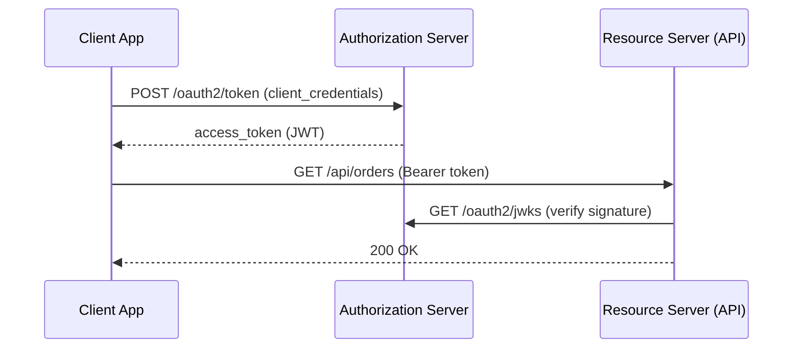

# Spring Authorization Server

[← Back to README](../README.md)

---

**Spring Authorization Server** (SAS) is a framework for building OAuth 2.1 and OpenID Connect 1.0 authorization servers. Instead of delegating to Keycloak or Auth0, you host your own token issuer — useful when you need fine-grained token customisation, embedded testing, or you can't use an external IdP.



---

## Dependency

```xml
<dependency>
    <groupId>org.springframework.security</groupId>
    <artifactId>spring-security-oauth2-authorization-server</artifactId>
</dependency>
<dependency>
    <groupId>org.springframework.boot</groupId>
    <artifactId>spring-boot-starter-security</artifactId>
</dependency>
<dependency>
    <groupId>org.springframework.boot</groupId>
    <artifactId>spring-boot-starter-web</artifactId>
</dependency>
```

---

## Minimal Setup

```java
@SpringBootApplication
public class AuthorizationServerApplication {
    public static void main(String[] args) {
        SpringApplication.run(AuthorizationServerApplication.class, args);
    }
}
```

```java
@Configuration
@EnableWebSecurity
public class SecurityConfig {

    // 1 — Authorization Server security filter chain
    @Bean
    @Order(1)
    public SecurityFilterChain authorizationServerSecurityFilterChain(HttpSecurity http)
            throws Exception {
        OAuth2AuthorizationServerConfiguration.applyDefaultSecurity(http);

        http.getConfigurer(OAuth2AuthorizationServerConfigurer.class)
            .oidc(Customizer.withDefaults());   // enable OpenID Connect 1.0

        http.exceptionHandling(ex -> ex
            .defaultAuthenticationEntryPointFor(
                new LoginUrlAuthenticationEntryPoint("/login"),
                new MediaTypeRequestMatcher(MediaType.TEXT_HTML)));

        return http.build();
    }

    // 2 — Default security chain (protects the login page)
    @Bean
    @Order(2)
    public SecurityFilterChain defaultSecurityFilterChain(HttpSecurity http)
            throws Exception {
        http
            .authorizeHttpRequests(auth -> auth.anyRequest().authenticated())
            .formLogin(Customizer.withDefaults());
        return http.build();
    }

    // 3 — User store
    @Bean
    public UserDetailsService users() {
        return new InMemoryUserDetailsManager(
            User.withUsername("alice")
                .password("{bcrypt}" + new BCryptPasswordEncoder().encode("password"))
                .roles("USER")
                .build());
    }

    @Bean
    public PasswordEncoder passwordEncoder() {
        return new BCryptPasswordEncoder();
    }
}
```

---

## Registered Clients

```java
@Configuration
public class AuthorizationServerConfig {

    @Bean
    public RegisteredClientRepository registeredClientRepository() {
        // Machine-to-machine client (client_credentials)
        RegisteredClient m2mClient = RegisteredClient.withId(UUID.randomUUID().toString())
            .clientId("order-service")
            .clientSecret("{bcrypt}" + new BCryptPasswordEncoder().encode("secret"))
            .clientAuthenticationMethod(ClientAuthenticationMethod.CLIENT_SECRET_BASIC)
            .authorizationGrantType(AuthorizationGrantType.CLIENT_CREDENTIALS)
            .scope("orders:read")
            .scope("orders:write")
            .tokenSettings(TokenSettings.builder()
                .accessTokenTimeToLive(Duration.ofMinutes(30))
                .build())
            .build();

        // Browser / SPA client (authorization_code + PKCE)
        RegisteredClient webClient = RegisteredClient.withId(UUID.randomUUID().toString())
            .clientId("web-app")
            .clientAuthenticationMethod(ClientAuthenticationMethod.NONE)   // public client
            .authorizationGrantType(AuthorizationGrantType.AUTHORIZATION_CODE)
            .authorizationGrantType(AuthorizationGrantType.REFRESH_TOKEN)
            .redirectUri("https://app.example.com/callback")
            .postLogoutRedirectUri("https://app.example.com/")
            .scope(OidcScopes.OPENID)
            .scope(OidcScopes.PROFILE)
            .scope("orders:read")
            .clientSettings(ClientSettings.builder()
                .requireProofKey(true)              // enforce PKCE
                .requireAuthorizationConsent(true)  // show consent screen
                .build())
            .tokenSettings(TokenSettings.builder()
                .accessTokenTimeToLive(Duration.ofMinutes(15))
                .refreshTokenTimeToLive(Duration.ofDays(30))
                .reuseRefreshTokens(false)          // rotate refresh tokens
                .build())
            .build();

        return new InMemoryRegisteredClientRepository(m2mClient, webClient);
    }

    // RSA key pair for signing JWTs
    @Bean
    public JWKSource<SecurityContext> jwkSource() throws Exception {
        KeyPairGenerator gen = KeyPairGenerator.getInstance("RSA");
        gen.initialize(2048);
        KeyPair keyPair = gen.generateKeyPair();

        RSAKey rsaKey = new RSAKey.Builder((RSAPublicKey) keyPair.getPublic())
            .privateKey(keyPair.getPrivate())
            .keyID(UUID.randomUUID().toString())
            .build();

        return new ImmutableJWKSet<>(new JWKSet(rsaKey));
    }

    @Bean
    public JwtDecoder jwtDecoder(JWKSource<SecurityContext> jwkSource) {
        return OAuth2AuthorizationServerConfiguration.jwtDecoder(jwkSource);
    }

    @Bean
    public AuthorizationServerSettings authorizationServerSettings() {
        return AuthorizationServerSettings.builder()
            .issuer("http://localhost:9000")
            .build();
    }
}
```

---

## Persistent Client and Token Storage

In production, use JPA or JDBC to store clients and issued tokens:

```java
@Bean
public RegisteredClientRepository registeredClientRepository(JdbcTemplate jdbc) {
    return new JdbcRegisteredClientRepository(jdbc);
}

@Bean
public OAuth2AuthorizationService authorizationService(
        JdbcTemplate jdbc, RegisteredClientRepository repo) {
    return new JdbcOAuth2AuthorizationService(jdbc, repo);
}

@Bean
public OAuth2AuthorizationConsentService consentService(
        JdbcTemplate jdbc, RegisteredClientRepository repo) {
    return new JdbcOAuth2AuthorizationConsentService(jdbc, repo);
}
```

```sql
-- Spring Authorization Server ships DDL scripts
-- org/springframework/security/oauth2/server/authorization/oauth2-authorization-schema.sql
-- org/springframework/security/oauth2/server/authorization/client/oauth2-registered-client-schema.sql
```

---

## Token Customisation

Add custom claims to JWT access tokens:

```java
@Bean
public OAuth2TokenCustomizer<JwtEncodingContext> tokenCustomizer() {
    return context -> {
        if (context.getTokenType() == OAuth2TokenType.ACCESS_TOKEN) {
            Authentication principal = context.getPrincipal();

            // Add roles
            Set<String> roles = principal.getAuthorities().stream()
                .map(GrantedAuthority::getAuthority)
                .collect(Collectors.toSet());
            context.getClaims().claim("roles", roles);

            // Add tenant ID from UserDetails
            if (principal.getPrincipal() instanceof CustomUserDetails user) {
                context.getClaims().claim("tenantId", user.getTenantId());
            }
        }
    };
}
```

---

## OIDC UserInfo Endpoint

```java
@Bean
public OAuth2TokenCustomizer<JwtEncodingContext> idTokenCustomizer() {
    return context -> {
        if (OidcParameterNames.ID_TOKEN.equals(context.getTokenType().getValue())) {
            // Add claims to ID token
            context.getClaims()
                .claim("email", getUserEmail(context.getPrincipal().getName()))
                .claim("given_name", "Alice")
                .claim("family_name", "Smith");
        }
    };
}
```

---

## Well-Known Endpoints

Once running on `http://localhost:9000`:

| Endpoint | Description |
|----------|-------------|
| `/.well-known/openid-configuration` | OIDC discovery document |
| `/oauth2/authorize` | Authorization endpoint |
| `/oauth2/token` | Token endpoint |
| `/oauth2/jwks` | Public keys for JWT verification |
| `/oauth2/revoke` | Token revocation |
| `/oauth2/introspect` | Token introspection |
| `/connect/logout` | OIDC logout |
| `/userinfo` | OIDC UserInfo |

---

## Resource Server (Consumer)

The API that validates tokens issued by your authorization server:

```yaml
spring:
  security:
    oauth2:
      resourceserver:
        jwt:
          issuer-uri: http://localhost:9000   # downloads JWKS automatically
```

```java
@Bean
public SecurityFilterChain resourceServerChain(HttpSecurity http) throws Exception {
    http
        .oauth2ResourceServer(oauth2 -> oauth2.jwt(jwt -> jwt
            .jwtAuthenticationConverter(jwtAuthenticationConverter())))
        .authorizeHttpRequests(auth -> auth
            .requestMatchers("/api/admin/**").hasAuthority("SCOPE_admin")
            .requestMatchers(HttpMethod.GET, "/api/orders/**").hasAuthority("SCOPE_orders:read")
            .requestMatchers(HttpMethod.POST, "/api/orders").hasAuthority("SCOPE_orders:write")
            .anyRequest().authenticated());
    return http.build();
}

@Bean
public JwtAuthenticationConverter jwtAuthenticationConverter() {
    JwtGrantedAuthoritiesConverter converter = new JwtGrantedAuthoritiesConverter();
    converter.setAuthoritiesClaimName("roles");      // read from custom "roles" claim
    converter.setAuthorityPrefix("ROLE_");

    JwtAuthenticationConverter jwtConverter = new JwtAuthenticationConverter();
    jwtConverter.setJwtGrantedAuthoritiesConverter(converter);
    return jwtConverter;
}
```

---

## Testing

```java
@SpringBootTest(webEnvironment = SpringBootTest.WebEnvironment.RANDOM_PORT)
class TokenEndpointTest {

    @LocalServerPort int port;
    RestClient client = RestClient.create();

    @Test
    void clientCredentialsReturnsToken() {
        Map<?, ?> response = client.post()
            .uri("http://localhost:" + port + "/oauth2/token")
            .headers(h -> h.setBasicAuth("order-service", "secret"))
            .body("grant_type=client_credentials&scope=orders:read",
                  MediaType.APPLICATION_FORM_URLENCODED)
            .retrieve()
            .body(Map.class);

        assertThat(response).containsKey("access_token");
        assertThat(response.get("token_type")).isEqualTo("Bearer");
    }
}
```

---

## Spring Authorization Server Summary

| Concept | Detail |
|---------|--------|
| `RegisteredClient` | OAuth2 client configuration (grant types, scopes, redirect URIs) |
| `CLIENT_SECRET_BASIC` | M2M clients authenticate with `Authorization: Basic` |
| `NONE` + PKCE | Public clients (SPA/mobile) — no secret, use code verifier |
| `JWKSource` | RSA key pair used to sign access tokens |
| `OAuth2TokenCustomizer` | Add custom claims (roles, tenant ID) to access/ID tokens |
| `JdbcRegisteredClientRepository` | Persist clients in a database |
| `JdbcOAuth2AuthorizationService` | Persist issued tokens (required for refresh token rotation) |
| `issuer-uri` | Resource servers use this to auto-fetch JWKS from `.well-known` |
| `SCOPE_orders:read` | Scopes appear as `SCOPE_` prefixed authorities on the resource server |

---

[← Back to README](../README.md)
