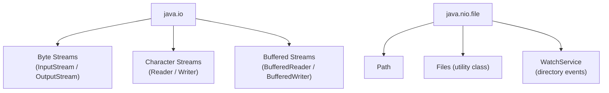

# I/O and File Handling

[← Back to README](../README.md)

---

Java provides two generations of I/O APIs:

- **`java.io`** — the original stream-based API (Java 1.0+)
- **`java.nio.file`** (NIO.2) — the modern path-based API (Java 7+), preferred for file operations



---

## Paths

`Path` represents a file or directory location. Always use `Path` over the legacy `File` class for new code.

```java
import java.nio.file.Path;

Path absolute = Path.of("/Users/alice/documents/notes.txt");
Path relative = Path.of("src", "main", "Hello.java");

System.out.println(absolute.getFileName());  // notes.txt
System.out.println(absolute.getParent());    // /Users/alice/documents
System.out.println(absolute.getRoot());      // /
System.out.println(relative.toString());     // src/main/Hello.java

// resolve — append a path
Path dir  = Path.of("/home/alice");
Path file = dir.resolve("docs/readme.txt");
System.out.println(file);  // /home/alice/docs/readme.txt

// normalize — remove redundant elements
Path messy = Path.of("/home/alice/../alice/./docs");
System.out.println(messy.normalize());  // /home/alice/docs

// convert to absolute
Path rel = Path.of("data.txt");
System.out.println(rel.toAbsolutePath());  // <cwd>/data.txt
```

---

## The Files Utility Class

`java.nio.file.Files` provides static methods for almost every file operation.

### Checking Files

```java
import java.nio.file.Files;

Path p = Path.of("data.txt");

Files.exists(p);          // true if the path exists
Files.isRegularFile(p);   // true if it's a file (not a directory)
Files.isDirectory(p);     // true if it's a directory
Files.isReadable(p);      // true if readable
Files.isWritable(p);      // true if writable
Files.size(p);            // size in bytes
Files.getLastModifiedTime(p);  // FileTime
```

### Reading Files

```java
import java.nio.file.Files;
import java.nio.file.Path;

Path path = Path.of("notes.txt");

// read entire file as a String (Java 11+)
String content = Files.readString(path);

// read all lines into a List
java.util.List<String> lines = Files.readAllLines(path);

// stream lines lazily — better for large files
try (var stream = Files.lines(path)) {
    stream.filter(line -> !line.isBlank())
          .forEach(System.out::println);
}

// read raw bytes
byte[] bytes = Files.readAllBytes(path);
```

### Writing Files

```java
import java.nio.file.Files;
import java.nio.file.StandardOpenOption;

Path path = Path.of("output.txt");

// write a String (creates or overwrites)
Files.writeString(path, "Hello, World!\n");

// append to existing file
Files.writeString(path, "More content\n", StandardOpenOption.APPEND);

// write lines
var lines = java.util.List.of("line 1", "line 2", "line 3");
Files.write(path, lines);

// write raw bytes
Files.write(path, "raw bytes".getBytes());
```

### Copying, Moving, Deleting

```java
import java.nio.file.StandardCopyOption;

Path src  = Path.of("source.txt");
Path dest = Path.of("destination.txt");

// copy
Files.copy(src, dest);
Files.copy(src, dest, StandardCopyOption.REPLACE_EXISTING);  // overwrite if exists

// move / rename
Files.move(src, dest);
Files.move(src, dest, StandardCopyOption.REPLACE_EXISTING);

// delete
Files.delete(path);                     // throws if not found
Files.deleteIfExists(path);             // silent if not found
```

### Creating Files and Directories

```java
Files.createFile(Path.of("new.txt"));             // creates empty file
Files.createDirectory(Path.of("mydir"));          // creates one directory
Files.createDirectories(Path.of("a/b/c"));        // creates full path
Files.createTempFile("prefix", ".tmp");           // temp file
Files.createTempDirectory("tmpdir");              // temp directory
```

---

## Walking Directory Trees

```java
// list contents of a directory (one level deep)
try (var entries = Files.list(Path.of("."))) {
    entries.forEach(System.out::println);
}

// walk entire tree recursively
try (var stream = Files.walk(Path.of("src"))) {
    stream.filter(Files::isRegularFile)
          .filter(p -> p.toString().endsWith(".java"))
          .forEach(System.out::println);
}

// find files matching a condition
try (var stream = Files.find(Path.of("."), 5,
        (path, attrs) -> attrs.isRegularFile() && path.toString().endsWith(".txt"))) {
    stream.forEach(System.out::println);
}
```

---

## Byte Streams

Byte streams read and write raw binary data — images, audio, serialised objects, etc. All byte stream classes extend `InputStream` or `OutputStream`.

```java
import java.io.*;

// write bytes to a file
try (var out = new FileOutputStream("data.bin")) {
    out.write(new byte[]{72, 101, 108, 108, 111});  // "Hello" in ASCII
}

// read bytes from a file
try (var in = new FileInputStream("data.bin")) {
    int b;
    while ((b = in.read()) != -1) {
        System.out.print((char) b);
    }
}
```

### Buffered Byte Streams

Wrapping a stream in a `Buffered*` class reduces system calls by reading/writing in chunks.

```java
try (var out = new BufferedOutputStream(new FileOutputStream("data.bin"))) {
    out.write("Hello".getBytes());
}

try (var in = new BufferedInputStream(new FileInputStream("data.bin"))) {
    byte[] buffer = new byte[1024];
    int bytesRead;
    while ((bytesRead = in.read(buffer)) != -1) {
        System.out.write(buffer, 0, bytesRead);
    }
}
```

---

## Character Streams

Character streams handle text and automatically manage character encoding. All character stream classes extend `Reader` or `Writer`.

```java
import java.io.*;

// write text
try (var writer = new FileWriter("hello.txt")) {
    writer.write("Hello, World!");
}

// read text character by character
try (var reader = new FileReader("hello.txt")) {
    int ch;
    while ((ch = reader.read()) != -1) {
        System.out.print((char) ch);
    }
}
```

### BufferedReader and BufferedWriter

The most common way to read and write text files line by line.

```java
import java.io.*;

// write lines
try (var writer = new BufferedWriter(new FileWriter("output.txt"))) {
    writer.write("First line");
    writer.newLine();
    writer.write("Second line");
}

// read lines
try (var reader = new BufferedReader(new FileReader("output.txt"))) {
    String line;
    while ((line = reader.readLine()) != null) {
        System.out.println(line);
    }
}

// or with streams (Java 8+)
try (var reader = new BufferedReader(new FileReader("output.txt"))) {
    reader.lines().forEach(System.out::println);
}
```

### Specifying Encoding

Always specify encoding explicitly to avoid platform-dependent behaviour.

```java
import java.io.*;
import java.nio.charset.StandardCharsets;

try (var writer = new BufferedWriter(
        new OutputStreamWriter(new FileOutputStream("utf8.txt"), StandardCharsets.UTF_8))) {
    writer.write("Héllo, Wörld!");
}

// NIO.2 approach (cleaner)
Files.writeString(Path.of("utf8.txt"), "Héllo, Wörld!", StandardCharsets.UTF_8);
String content = Files.readString(Path.of("utf8.txt"), StandardCharsets.UTF_8);
```

---

## PrintWriter and Scanner

### PrintWriter — convenient text output

```java
try (var pw = new PrintWriter(new FileWriter("report.txt"))) {
    pw.println("Name: Alice");
    pw.printf("Score: %.2f%n", 95.678);
}
```

### Scanner — convenient text input

```java
import java.util.Scanner;

// read from a file
try (var scanner = new Scanner(Path.of("data.txt"))) {
    while (scanner.hasNextLine()) {
        System.out.println(scanner.nextLine());
    }
}

// read typed values
try (var scanner = new Scanner(Path.of("numbers.txt"))) {
    while (scanner.hasNextInt()) {
        int n = scanner.nextInt();
        System.out.println(n * 2);
    }
}

// read from console
var console = new Scanner(System.in);
System.out.print("Enter your name: ");
String name = console.nextLine();
System.out.println("Hello, " + name);
```

---

## Object Serialization

Serialization converts an object to a byte stream so it can be saved or sent over a network. The class must implement `Serializable`.

```java
import java.io.*;

public class Person implements Serializable {
    private String name;
    private int    age;
    private transient String password;  // transient fields are NOT serialized

    public Person(String name, int age, String password) {
        this.name     = name;
        this.age      = age;
        this.password = password;
    }
}

// serialize
try (var out = new ObjectOutputStream(new FileOutputStream("person.ser"))) {
    out.writeObject(new Person("Alice", 30, "secret"));
}

// deserialize
try (var in = new ObjectInputStream(new FileInputStream("person.ser"))) {
    Person p = (Person) in.readObject();
}
```

> Prefer structured formats (JSON, XML, Protocol Buffers) over Java serialization for data that crosses system boundaries — Java serialization has known security vulnerabilities.

---

## Standard Streams

```java
// System.out — standard output (PrintStream)
System.out.println("Hello");
System.out.printf("Pi = %.4f%n", Math.PI);

// System.err — standard error
System.err.println("Something went wrong");

// System.in — standard input (InputStream)
int b = System.in.read();  // reads one byte

// redirect System.out to a file
try (var ps = new PrintStream("log.txt")) {
    System.setOut(ps);
    System.out.println("This goes to log.txt");
}
```

---

## I/O Best Practices

- **Always use try-with-resources** — ensures streams are closed even if an exception occurs.
- **Prefer NIO.2 (`Files`, `Path`)** over `java.io.File` for file operations — it's more expressive and throws better exceptions.
- **Always buffer** — wrap `FileInputStream`/`FileOutputStream` in `Buffered*` classes unless the file is tiny.
- **Always specify charset** — never rely on the platform default. Use `StandardCharsets.UTF_8`.
- **Use `Files.readString` / `Files.writeString`** for simple whole-file reads/writes (Java 11+).
- **Stream large files** with `Files.lines()` or buffered reading — avoid loading everything into memory.

---

## I/O Summary

| Task | Recommended API |
|------|-----------------|
| Read entire text file | `Files.readString(path)` |
| Read lines lazily | `Files.lines(path)` |
| Write text file | `Files.writeString(path, content)` |
| Copy / move / delete | `Files.copy()`, `Files.move()`, `Files.delete()` |
| Walk directory tree | `Files.walk()`, `Files.find()` |
| Read/write binary | `BufferedInputStream` / `BufferedOutputStream` |
| Read/write text line by line | `BufferedReader` / `BufferedWriter` |
| Formatted text output | `PrintWriter` |
| Tokenised input | `Scanner` |
| Object persistence | `ObjectInputStream` / `ObjectOutputStream` |

---

[← Back to README](../README.md)
