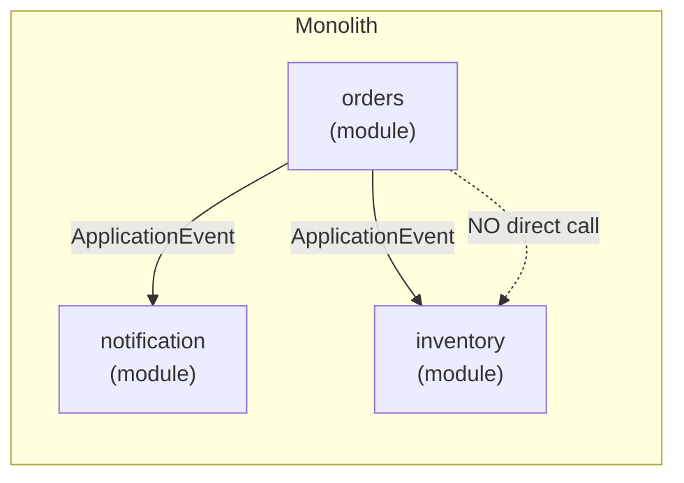

# Spring Modulith

[← Back to README](../README.md)

---

**Spring Modulith** brings modularity to the monolith. It lets you organise a Spring Boot application into logical modules with enforced boundaries, async inter-module events, and module-level integration tests — without the operational overhead of microservices. When you're ready to extract a service, each module already has a clean public API.



---

## Dependency

```xml
<dependencyManagement>
    <dependencies>
        <dependency>
            <groupId>org.springframework.modulith</groupId>
            <artifactId>spring-modulith-bom</artifactId>
            <version>1.2.3</version>
            <type>pom</type>
            <scope>import</scope>
        </dependency>
    </dependencies>
</dependencyManagement>

<dependencies>
    <dependency>
        <groupId>org.springframework.modulith</groupId>
        <artifactId>spring-modulith-starter-core</artifactId>
    </dependency>
    <!-- Event publication registry (persists events until consumed) -->
    <dependency>
        <groupId>org.springframework.modulith</groupId>
        <artifactId>spring-modulith-starter-jpa</artifactId>
    </dependency>
    <!-- Testing support -->
    <dependency>
        <groupId>org.springframework.modulith</groupId>
        <artifactId>spring-modulith-starter-test</artifactId>
        <scope>test</scope>
    </dependency>
</dependencies>
```

---

## Package Structure

Each top-level package under the main application package is a module. The `internal` sub-package is hidden from other modules.

```
com.example.shop
├── ShopApplication.java          ← @SpringBootApplication
│
├── orders/                       ← orders module
│   ├── Order.java                ← public API
│   ├── OrderService.java         ← public API
│   ├── OrderPlacedEvent.java     ← public event
│   └── internal/
│       ├── OrderRepository.java  ← hidden from other modules
│       └── OrderMapper.java      ← hidden from other modules
│
├── inventory/                    ← inventory module
│   ├── InventoryService.java     ← public API
│   └── internal/
│       └── StockRepository.java
│
└── notification/                 ← notification module
    └── internal/
        └── NotificationListener.java
```

---

## Application Module Declaration

No annotation needed — package structure is enough. Optionally document with `@ApplicationModule`:

```java
// orders/package-info.java
@org.springframework.modulith.ApplicationModule(
    displayName = "Orders",
    allowedDependencies = {"inventory"}   // explicit allowed dependencies
)
package com.example.shop.orders;
```

---

## Inter-Module Communication via Events

Modules must NOT call each other directly across module boundaries. Use Spring's `ApplicationEventPublisher`:

```java
// orders module — publishes an event
@Service
@RequiredArgsConstructor
public class OrderService {

    private final ApplicationEventPublisher events;
    private final OrderRepository orderRepo;

    @Transactional
    public Order placeOrder(PlaceOrderCommand cmd) {
        Order order = orderRepo.save(Order.create(cmd));
        events.publishEvent(new OrderPlacedEvent(order.getId(), order.getCustomerId()));
        return order;
    }
}

// Event record — lives in the orders package (public)
public record OrderPlacedEvent(UUID orderId, UUID customerId) {}
```

```java
// notification module — listens for the event
@Component
class NotificationListener {

    @ApplicationModuleListener   // async, transactional, once-only delivery
    void onOrderPlaced(OrderPlacedEvent event) {
        log.info("Sending confirmation for order {}", event.orderId());
        // send email...
    }
}
```

`@ApplicationModuleListener` is a composed annotation that sets up:
- `@Async` — runs in a separate thread after the publishing transaction commits
- `@Transactional(propagation = REQUIRES_NEW)` — own transaction
- `@TransactionalEventListener(phase = AFTER_COMMIT)` — only fires on success

---

## Event Publication Registry

Spring Modulith persists published events to a DB table and retries failed listeners — equivalent to the Transactional Outbox Pattern built-in.

```sql
-- Created automatically by spring-modulith-starter-jpa
CREATE TABLE event_publication (
    id              UUID PRIMARY KEY,
    listener_id     TEXT NOT NULL,
    event_type      TEXT NOT NULL,
    serialized_event TEXT NOT NULL,
    publication_date TIMESTAMP NOT NULL,
    completion_date  TIMESTAMP
);
```

```yaml
spring:
  modulith:
    events:
      republication-interval: PT10S    # retry incomplete events every 10s
      completion-mode: delete           # delete or archive completed events
```

---

## Verifying Module Structure

```java
// In any test class — validates module boundaries and cycles
@Test
void verifyModularStructure() {
    ApplicationModules.of(ShopApplication.class).verify();
}
```

This fails the build if:
- Module A accesses `internal` packages of module B
- A dependency cycle exists between modules
- An `allowedDependencies` constraint is violated

---

## Module Integration Tests

Test a module in isolation — only that module's Spring beans are loaded:

```java
@ApplicationModuleTest    // only loads the "orders" module
class OrderServiceTest {

    @Autowired OrderService orderService;

    @MockBean InventoryService inventoryService;   // mock cross-module dependency

    @Test
    void placeOrderPersistsAndPublishesEvent(
            @Autowired ApplicationEvents events) {     // capture published events

        orderService.placeOrder(new PlaceOrderCommand(UUID.randomUUID(), BigDecimal.TEN));

        assertThat(events.ofType(OrderPlacedEvent.class))
            .hasSize(1)
            .first()
            .satisfies(e -> assertThat(e.orderId()).isNotNull());
    }
}
```

Bootstrap modes for broader tests:

```java
@ApplicationModuleTest(mode = BootstrapMode.DIRECT_DEPENDENCIES)   // loads module + its dependencies
@ApplicationModuleTest(mode = BootstrapMode.ALL_DEPENDENCIES)       // loads full transitive closure
```

---

## Visualising the Module Graph

```java
@Test
void writeModuleDocs() {
    ApplicationModules modules = ApplicationModules.of(ShopApplication.class);
    new Documenter(modules)
        .writeModulesAsPlantUml()          // UML diagram
        .writeIndividualModulesAsPlantUml() // per-module diagrams
        .writeModuleCanvases();             // Markdown canvas per module
}
```

Output in `target/spring-modulith-docs/`:

```
components.puml          ← full module dependency diagram
orders.adoc              ← module canvas (public types, events, listeners)
inventory.adoc
notification.adoc
```

---

## Shared Kernel

For types used across all modules, create a top-level `shared` package that modules may depend on:

```
com.example.shop
├── shared/
│   ├── Money.java           ← value object shared across modules
│   └── CustomerId.java
├── orders/
└── inventory/
```

```java
// shared/package-info.java
@org.springframework.modulith.ApplicationModule(
    displayName = "Shared Kernel"
)
package com.example.shop.shared;
```

---

## Extracting a Module to a Microservice

When a module needs to become an independent service:

1. Its public API (types, events) are already isolated
2. Replace `ApplicationEventPublisher` with a Kafka/RabbitMQ producer
3. Replace `@ApplicationModuleListener` with a Kafka/RabbitMQ consumer in the new service
4. The domain logic is unchanged — only the transport changes

---

## Spring Modulith Summary

| Concept | Detail |
|---------|--------|
| Module | Top-level package under `@SpringBootApplication` package |
| `internal/` | Sub-package hidden from other modules — enforced at compile + test time |
| `@ApplicationModule` | Optional metadata: `displayName`, `allowedDependencies` |
| `ApplicationModules.verify()` | Fails tests if boundaries are violated |
| `ApplicationEventPublisher` | The only way modules may communicate (no direct bean injection across boundaries) |
| `@ApplicationModuleListener` | Async, transactional, post-commit listener with retry via event publication registry |
| `@ApplicationModuleTest` | Loads only the target module's beans for isolated tests |
| Event Publication Registry | Persists events to DB; retries failed listeners automatically |
| `Documenter` | Generates PlantUML and AsciiDoc module canvases |

---

[← Back to README](../README.md)
