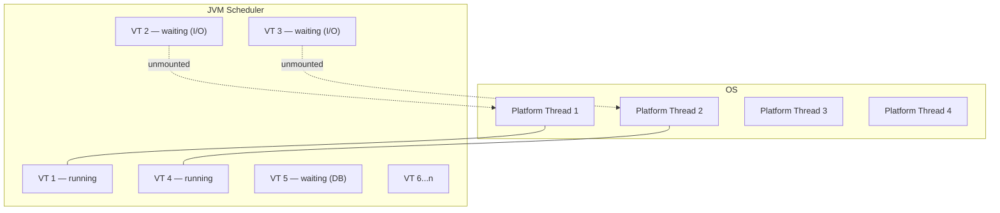

# Virtual Threads (Project Loom) Deep Dive

[← Back to README](../README.md)

---

**Virtual threads** (introduced as preview in Java 19, stable in Java 21) are lightweight threads managed by the JVM rather than the OS. Millions can exist simultaneously on a handful of OS threads, eliminating the throughput ceiling imposed by the platform thread-per-request model — without requiring reactive programming.



---

## Creating Virtual Threads

```java
// Single virtual thread
Thread vt = Thread.ofVirtual().name("vt-1").start(() -> {
    System.out.println("Running in: " + Thread.currentThread());
});
vt.join();

// Executor with virtual threads (Java 21)
try (var executor = Executors.newVirtualThreadPerTaskExecutor()) {
    Future<String> result = executor.submit(() -> fetchFromDb());
    System.out.println(result.get());
}

// Thread.Builder pattern
Thread.Builder builder = Thread.ofVirtual().name("worker-", 0);
Thread t1 = builder.start(() -> process(task1));
Thread t2 = builder.start(() -> process(task2));
```

---

## Spring Boot Integration

Spring Boot 3.2+ enables virtual threads with a single property:

```yaml
spring:
  threads:
    virtual:
      enabled: true   # Tomcat, Jetty, Undertow all use virtual threads per request
```

This replaces the platform thread pool with a virtual thread executor for:
- Incoming HTTP requests (Tomcat/Jetty)
- `@Async` task execution
- Scheduled task execution (`@Scheduled`)

```java
// Verify virtual threads are being used
@GetMapping("/thread-info")
public String threadInfo() {
    Thread t = Thread.currentThread();
    return "virtual=%s name=%s".formatted(t.isVirtual(), t.getName());
}
// → virtual=true name=tomcat-handler-0
```

---

## How Virtual Threads Work

### Mounting and Unmounting

A virtual thread is **mounted** onto a carrier (platform) thread when it needs CPU. When it blocks on I/O, it **unmounts** — the carrier thread is freed to run other virtual threads.

```java
// This blocking I/O call unmounts the virtual thread automatically
InputStream in = socket.getInputStream();
byte[] data = in.read();   // virtual thread parks here; carrier thread runs other VTs
```

### Thread Identity and ThreadLocal

Virtual threads support `ThreadLocal` but it is expensive (one `ThreadLocal` map per virtual thread, potentially millions). Prefer `ScopedValue` (Java 21 preview, stable in 23):

```java
// ThreadLocal — works but doesn't scale well with millions of VTs
private static final ThreadLocal<String> REQUEST_ID = new ThreadLocal<>();

// ScopedValue — immutable, structured, efficient for VTs
private static final ScopedValue<String> REQUEST_ID = ScopedValue.newInstance();

ScopedValue.where(REQUEST_ID, "req-123").run(() -> {
    System.out.println(REQUEST_ID.get());   // "req-123"
});
```

---

## Pinning — The Main Pitfall

A virtual thread is **pinned** when it cannot unmount from its carrier thread. Pinning blocks the carrier thread and defeats the purpose of virtual threads.

### Causes of Pinning

```java
// 1. synchronized block — pins the virtual thread
synchronized (this) {
    doBlockingIo();   // carrier thread is blocked; cannot run other VTs
}

// 2. synchronized method
public synchronized void process() {
    Thread.sleep(Duration.ofMillis(100));   // pins!
}

// 3. JNI calls — always pin
```

### Detecting Pinning

```bash
# JVM flag to log pinned threads
java -Djdk.tracePinnedThreads=full -jar app.jar

# JFR event
jfr print --events jdk.VirtualThreadPinned recording.jfr
```

```
Thread[#27,ForkJoinPool-1-worker-1,5,CarrierThreads]
    com.example.OrderService.process(OrderService.java:42) <== pinned here
        com.example.InventoryClient.fetch(InventoryClient.java:18)
```

### Fixing Pinning

```java
// Replace synchronized with ReentrantLock — allows unmounting
private final ReentrantLock lock = new ReentrantLock();

public void process() {
    lock.lock();
    try {
        doBlockingIo();   // virtual thread can unmount while blocked
    } finally {
        lock.unlock();
    }
}
```

---

## Virtual Threads vs Platform Threads — Benchmarks

| Scenario | Platform Threads | Virtual Threads |
|----------|-----------------|-----------------|
| 10 000 concurrent HTTP requests | Out of memory or queue depth exhausted | Handles easily |
| CPU-bound tasks (10 threads) | Optimal | Same (VTs don't add CPU) |
| DB query + HTTP call (blocking I/O) | Blocked thread per request | Unmounts during I/O |
| `synchronized` + I/O | Acceptable | Pinned — no benefit |

Virtual threads excel at **blocking I/O-bound workloads**. They provide no benefit for CPU-bound tasks.

---

## Structured Concurrency with Virtual Threads

`StructuredTaskScope` (Java 21+) manages a group of virtual threads with guaranteed cleanup:

```java
// Shutdown on first failure — all tasks cancelled if any fails
public OrderDetails fetchOrderDetails(UUID orderId) throws Exception {
    try (var scope = new StructuredTaskScope.ShutdownOnFailure()) {
        Subtask<Order>    order    = scope.fork(() -> orderRepo.findById(orderId));
        Subtask<Customer> customer = scope.fork(() -> customerClient.fetch(orderId));
        Subtask<List<Item>> items  = scope.fork(() -> itemRepo.findByOrder(orderId));

        scope.join().throwIfFailed();   // waits for all; throws if any failed

        return new OrderDetails(order.get(), customer.get(), items.get());
    }
}

// Shutdown on first success — returns first result, cancels the rest
public String fetchFromFastestReplica(String query) throws Exception {
    try (var scope = new StructuredTaskScope.ShutdownOnSuccess<String>()) {
        scope.fork(() -> replica1.query(query));
        scope.fork(() -> replica2.query(query));
        scope.fork(() -> replica3.query(query));

        scope.join();
        return scope.result();
    }
}
```

---

## Thread-Per-Request vs Reactive

| | Platform thread-per-request | Reactive (WebFlux) | Virtual thread-per-request |
|---|---|---|---|
| Code style | Imperative (easy to read) | Functional chains (complex) | Imperative (easy to read) |
| Scalability | Limited by thread count | High (event loop) | High (JVM manages millions) |
| Blocking I/O | Wastes thread | Never blocks | Parks thread — carrier freed |
| Debugging | Easy stack traces | Reactor stack traces | Easy stack traces |
| Learning curve | Low | High | Low |

---

## Common Mistakes

```java
// MISTAKE — ThreadLocal with millions of VTs wastes memory
private static final ThreadLocal<Connection> CONN = new ThreadLocal<>();

// BETTER — connection pool; never hold across unmount points

// MISTAKE — synchronized holding I/O (pinning)
public synchronized Response fetchAndCache(String key) {
    if (cache.containsKey(key)) return cache.get(key);
    Response r = http.get(url);   // PINNED during this I/O!
    cache.put(key, r);
    return r;
}

// BETTER — ReentrantLock + ConcurrentHashMap
private final ReentrantLock lock = new ReentrantLock();
private final Map<String, Response> cache = new ConcurrentHashMap<>();

public Response fetchAndCache(String key) {
    return cache.computeIfAbsent(key, k -> http.get(url));   // no lock held during I/O
}

// MISTAKE — using virtual threads for CPU-bound work expecting speedup
executor.submit(() -> computePi(10_000_000));   // still bounded by CPU cores
```

---

## Observability with Virtual Threads

Virtual threads use the thread name set at creation time. In Spring Boot, use MDC with care:

```java
Thread.ofVirtual().name("request-handler").start(() -> {
    MDC.put("requestId", UUID.randomUUID().toString());
    try {
        handleRequest();
    } finally {
        MDC.clear();   // always clear to avoid leaking to next task on same carrier
    }
});
```

---

## Virtual Threads Summary

| Concept | Detail |
|---------|--------|
| Virtual thread | JVM-managed thread; millions can exist concurrently |
| Carrier thread | Platform thread that runs virtual threads; small fixed pool |
| Mount/unmount | VT mounts on carrier to run; unmounts on blocking I/O |
| Pinning | VT cannot unmount — caused by `synchronized` + I/O, or JNI |
| Fix pinning | Replace `synchronized` with `ReentrantLock` |
| Spring Boot | `spring.threads.virtual.enabled=true` (Boot 3.2+) |
| `ThreadLocal` | Works but scales poorly — prefer `ScopedValue` |
| `StructuredTaskScope` | Manages VT lifecycle with scoped, cancellable task groups |
| Best for | I/O-bound workloads: DB queries, HTTP calls, file I/O |
| Not for | CPU-bound tasks — no benefit over platform threads |
| Detection | `-Djdk.tracePinnedThreads=full` or JFR `VirtualThreadPinned` event |

---

[← Back to README](../README.md)
