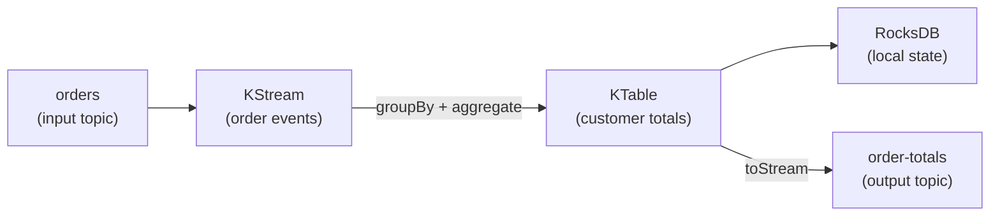

# Kafka Streams

[← Back to README](../README.md)

---

**Kafka Streams** is a client library for building stream-processing applications on top of Apache Kafka. Unlike batch jobs, it processes events continuously as they arrive. It runs inside your application (no separate cluster needed) and provides stateful operations — joins, aggregations, windowing — backed by RocksDB and Kafka changelog topics.



---

## Dependency

```xml
<dependency>
    <groupId>org.apache.kafka</groupId>
    <artifactId>kafka-streams</artifactId>
</dependency>
<dependency>
    <groupId>org.springframework.kafka</groupId>
    <artifactId>spring-kafka</artifactId>
</dependency>
```

---

## Configuration

```yaml
spring:
  kafka:
    bootstrap-servers: localhost:9092
    streams:
      application-id: order-processor       # unique per application; used as consumer group ID
      default-key-serde: org.apache.kafka.common.serialization.Serdes$StringSerde
      default-value-serde: org.springframework.kafka.support.serializer.JsonSerde
      properties:
        "[default.deserialization.exception.handler]": org.apache.kafka.streams.errors.LogAndContinueExceptionHandler
```

```java
@SpringBootApplication
@EnableKafkaStreams
public class StreamApplication {
    public static void main(String[] args) {
        SpringApplication.run(StreamApplication.class, args);
    }
}
```

---

## KStream — Stateless Transformations

```java
@Configuration
public class OrderStreamTopology {

    @Bean
    public KStream<String, OrderEvent> orderStream(StreamsBuilder builder) {
        // Deserialize JSON
        JsonSerde<OrderEvent> orderSerde = new JsonSerde<>(OrderEvent.class);

        KStream<String, OrderEvent> stream = builder
            .stream("orders", Consumed.with(Serdes.String(), orderSerde));

        // Filter — only PLACED events
        KStream<String, OrderEvent> placed = stream
            .filter((key, order) -> order.status().equals("PLACED"));

        // Map — transform value
        KStream<String, OrderSummary> summaries = placed
            .mapValues(order -> new OrderSummary(
                order.id(), order.customerId(), order.total()));

        // Branch — route to different topics based on value
        Map<String, KStream<String, OrderEvent>> branches = stream.split(Named.as("branch-"))
            .branch((k, v) -> v.total().compareTo(new BigDecimal("1000")) > 0,
                    Branched.as("high-value"))
            .branch((k, v) -> true,
                    Branched.as("standard"))
            .noDefaultBranch();

        branches.get("branch-high-value").to("high-value-orders");
        branches.get("branch-standard").to("standard-orders");

        summaries.to("order-summaries",
            Produced.with(Serdes.String(), new JsonSerde<>(OrderSummary.class)));

        return stream;
    }
}
```

---

## KTable — Changelog / Compacted View

A `KTable` represents the latest value per key — like a database table updated by a stream.

```java
@Bean
public KTable<String, CustomerStats> customerStatsTable(StreamsBuilder builder) {
    JsonSerde<OrderEvent> orderSerde = new JsonSerde<>(OrderEvent.class);
    JsonSerde<CustomerStats> statsSerde = new JsonSerde<>(CustomerStats.class);

    return builder
        .stream("orders", Consumed.with(Serdes.String(), orderSerde))
        .filter((key, order) -> order.status().equals("PLACED"))
        // Re-key by customerId for grouping
        .selectKey((orderId, order) -> order.customerId())
        .groupByKey()
        .aggregate(
            CustomerStats::empty,                    // initializer
            (customerId, order, stats) ->            // aggregator
                stats.add(order.total()),
            Materialized.<String, CustomerStats, KeyValueStore<Bytes, byte[]>>
                as("customer-stats-store")           // RocksDB store name
                .withKeySerde(Serdes.String())
                .withValueSerde(statsSerde));
}
```

---

## Windowed Aggregations

```java
@Bean
public KTable<Windowed<String>, Long> ordersPerMinute(StreamsBuilder builder) {
    JsonSerde<OrderEvent> orderSerde = new JsonSerde<>(OrderEvent.class);

    return builder
        .stream("orders", Consumed.with(Serdes.String(), orderSerde))
        .groupByKey()
        .windowedBy(TimeWindows.ofSizeWithNoGrace(Duration.ofMinutes(1)))
        .count(Materialized.as("orders-per-minute-store"));
}
```

Window types:

| Type | Description |
|------|-------------|
| `TimeWindows.ofSizeWithNoGrace(Duration)` | Tumbling window — fixed, non-overlapping |
| `SlidingWindows.ofTimeDifferenceWithNoGrace(Duration)` | Sliding window — overlapping |
| `SessionWindows.ofInactivityGapWithNoGrace(Duration)` | Session — merges events within gap |

---

## Stream-Table Join

```java
@Bean
public KStream<String, EnrichedOrder> enrichedOrders(
        StreamsBuilder builder,
        KTable<String, CustomerStats> customerTable) {

    JsonSerde<OrderEvent> orderSerde = new JsonSerde<>(OrderEvent.class);
    JsonSerde<CustomerStats> statsSerde = new JsonSerde<>(CustomerStats.class);

    return builder
        .stream("orders", Consumed.with(Serdes.String(), orderSerde))
        .selectKey((k, v) -> v.customerId())
        .join(customerTable,
            (order, stats) -> new EnrichedOrder(order, stats),   // value joiner
            Joined.with(Serdes.String(), orderSerde, statsSerde))
        .selectKey((customerId, enriched) -> enriched.orderId());
}
```

---

## Interactive Queries — Querying Local State

```java
@RestController
@RequiredArgsConstructor
public class CustomerStatsController {

    private final KafkaStreamsRegistry registry;

    @GetMapping("/stats/{customerId}")
    public CustomerStats getStats(@PathVariable String customerId) {
        KafkaStreams streams = registry.getKafkaStreams("order-processor");

        ReadOnlyKeyValueStore<String, CustomerStats> store =
            streams.store(StoreQueryParameters.fromNameAndType(
                "customer-stats-store",
                QueryableStoreTypes.keyValueStore()));

        CustomerStats stats = store.get(customerId);
        if (stats == null) throw new ResponseStatusException(HttpStatus.NOT_FOUND);
        return stats;
    }

    @GetMapping("/stats")
    public List<CustomerStats> getAllStats() {
        KafkaStreams streams = registry.getKafkaStreams("order-processor");

        ReadOnlyKeyValueStore<String, CustomerStats> store =
            streams.store(StoreQueryParameters.fromNameAndType(
                "customer-stats-store",
                QueryableStoreTypes.keyValueStore()));

        List<CustomerStats> result = new ArrayList<>();
        try (KeyValueIterator<String, CustomerStats> iter = store.all()) {
            iter.forEachRemaining(kv -> result.add(kv.value));
        }
        return result;
    }
}
```

---

## Error Handling

```java
@Bean
public KafkaStreamsCustomizer customizer() {
    return kafkaStreams -> kafkaStreams.setUncaughtExceptionHandler(
        (ex) -> {
            log.error("Uncaught stream exception", ex);
            // REPLACE_THREAD — restart the failing thread
            // SHUTDOWN_CLIENT — stop this instance
            // SHUTDOWN_APPLICATION — stop all instances
            return StreamsUncaughtExceptionHandler.StreamThreadExceptionResponse.REPLACE_THREAD;
        });
}
```

```yaml
spring:
  kafka:
    streams:
      properties:
        "[default.deserialization.exception.handler]": >
          org.apache.kafka.streams.errors.LogAndContinueExceptionHandler
        "[default.production.exception.handler]": >
          org.apache.kafka.streams.errors.DefaultProductionExceptionHandler
```

---

## Testing with TopologyTestDriver

Test the stream topology without a real Kafka broker:

```java
class OrderStreamTopologyTest {

    TopologyTestDriver testDriver;
    TestInputTopic<String, OrderEvent> inputTopic;
    TestOutputTopic<String, OrderSummary> outputTopic;

    @BeforeEach
    void setUp() {
        StreamsBuilder builder = new StreamsBuilder();
        new OrderStreamTopology().orderStream(builder);   // build the topology

        Properties props = new Properties();
        props.put(StreamsConfig.APPLICATION_ID_CONFIG, "test");
        props.put(StreamsConfig.BOOTSTRAP_SERVERS_CONFIG, "dummy:9092");
        props.put(StreamsConfig.DEFAULT_KEY_SERDE_CLASS_CONFIG, Serdes.String().getClass());

        testDriver = new TopologyTestDriver(builder.build(), props);

        inputTopic = testDriver.createInputTopic("orders",
            new StringSerializer(), new JsonSerializer<>());
        outputTopic = testDriver.createOutputTopic("order-summaries",
            new StringDeserializer(), new JsonDeserializer<>(OrderSummary.class));
    }

    @AfterEach
    void tearDown() { testDriver.close(); }

    @Test
    void placedOrderAppearsInSummaries() {
        inputTopic.pipeInput("order-1",
            new OrderEvent("order-1", "cust-1", "PLACED", new BigDecimal("49.99")));

        assertThat(outputTopic.readValuesToList())
            .hasSize(1)
            .first()
            .satisfies(s -> assertThat(s.total()).isEqualByComparingTo("49.99"));
    }

    @Test
    void cancelledOrderIsFiltered() {
        inputTopic.pipeInput("order-2",
            new OrderEvent("order-2", "cust-1", "CANCELLED", BigDecimal.TEN));

        assertThat(outputTopic.isEmpty()).isTrue();
    }
}
```

---

## Kafka Streams Summary

| Concept | Detail |
|---------|--------|
| `KStream<K,V>` | Unbounded sequence of events — each event is independent |
| `KTable<K,V>` | Latest value per key — changelog semantics |
| `GlobalKTable` | Fully replicated across all app instances — no co-partitioning needed |
| `groupByKey` + `aggregate` | Stateful aggregation stored in RocksDB |
| `TimeWindows` | Tumbling (fixed), sliding, or session windows for time-based aggregations |
| `Materialized.as("name")` | Names the state store for interactive queries |
| `TopologyTestDriver` | In-process testing without a Kafka broker |
| `application-id` | Doubles as consumer group ID + changelog topic prefix |
| Changelog topic | Kafka topic backing each state store — enables fault tolerance |
| Interactive queries | Query local RocksDB state via REST — combine with service discovery for cluster-wide queries |

---

[← Back to README](../README.md)
