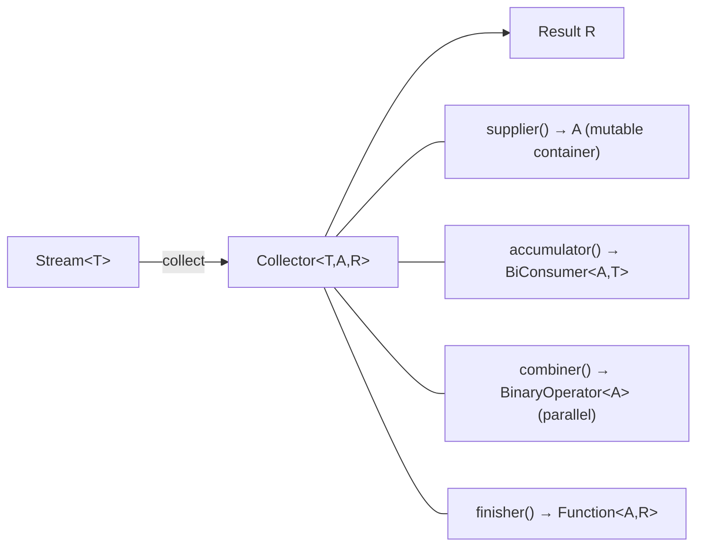

# Advanced Stream Collectors

[← Back to README](../README.md)

---

The `Collectors` utility class provides powerful terminal operations beyond `toList()` and `toMap()`. Mastering `groupingBy`, `partitioningBy`, `teeing`, and custom `Collector` implementations unlocks concise, expressive data transformations without imperative loops.



---

## groupingBy — Partitioning into Maps

```java
record Order(UUID id, String customerId, String status, BigDecimal total) {}

List<Order> orders = orderRepo.findAll();

// Group by status → Map<String, List<Order>>
Map<String, List<Order>> byStatus = orders.stream()
    .collect(Collectors.groupingBy(Order::status));

// Count per status → Map<String, Long>
Map<String, Long> countByStatus = orders.stream()
    .collect(Collectors.groupingBy(Order::status, Collectors.counting()));

// Sum total per customer → Map<String, BigDecimal>
Map<String, BigDecimal> revenueByCustomer = orders.stream()
    .collect(Collectors.groupingBy(
        Order::customerId,
        Collectors.reducing(BigDecimal.ZERO, Order::total, BigDecimal::add)));

// Average total per status
Map<String, OptionalDouble> avgByStatus = orders.stream()
    .collect(Collectors.groupingBy(
        Order::status,
        Collectors.averagingDouble(o -> o.total().doubleValue())));

// Nested grouping → Map<String, Map<String, List<Order>>>
Map<String, Map<String, List<Order>>> byCustomerThenStatus = orders.stream()
    .collect(Collectors.groupingBy(
        Order::customerId,
        Collectors.groupingBy(Order::status)));
```

---

## groupingBy with Custom Downstream Collectors

```java
// Get the most expensive order per customer
Map<String, Optional<Order>> maxByCustomer = orders.stream()
    .collect(Collectors.groupingBy(
        Order::customerId,
        Collectors.maxBy(Comparator.comparing(Order::total))));

// Collect to TreeMap (sorted keys)
TreeMap<String, List<Order>> sortedByStatus = orders.stream()
    .collect(Collectors.groupingBy(
        Order::status,
        TreeMap::new,           // map factory
        Collectors.toList()));

// Summarise statistics per customer
Map<String, DoubleSummaryStatistics> statsByCustomer = orders.stream()
    .collect(Collectors.groupingBy(
        Order::customerId,
        Collectors.summarizingDouble(o -> o.total().doubleValue())));

statsByCustomer.forEach((cust, stats) ->
    System.out.printf("%s: count=%d, sum=%.2f, avg=%.2f%n",
        cust, stats.getCount(), stats.getSum(), stats.getAverage()));
```

---

## partitioningBy — Boolean Grouping

```java
// Split into two groups: true / false
Map<Boolean, List<Order>> partition = orders.stream()
    .collect(Collectors.partitioningBy(
        o -> o.total().compareTo(new BigDecimal("100")) > 0));

List<Order> highValue  = partition.get(true);
List<Order> lowValue   = partition.get(false);

// Count in each partition
Map<Boolean, Long> partitionCounts = orders.stream()
    .collect(Collectors.partitioningBy(
        o -> o.status().equals("CONFIRMED"),
        Collectors.counting()));
```

---

## teeing — Combine Two Collectors in One Pass

`Collectors.teeing` (Java 12+) feeds each element into two collectors simultaneously and merges the results. This avoids two separate stream passes.

```java
// Compute both min and max in a single pass
record MinMax(Optional<Order> min, Optional<Order> max) {}

MinMax minMax = orders.stream()
    .collect(Collectors.teeing(
        Collectors.minBy(Comparator.comparing(Order::total)),
        Collectors.maxBy(Comparator.comparing(Order::total)),
        MinMax::new));

// Count and sum in one pass
record CountAndSum(long count, BigDecimal sum) {}

CountAndSum result = orders.stream()
    .collect(Collectors.teeing(
        Collectors.counting(),
        Collectors.reducing(BigDecimal.ZERO, Order::total, BigDecimal::add),
        CountAndSum::new));

// Partition and count at the same time
record PartitionResult(List<Order> confirmed, long total) {}

PartitionResult pr = orders.stream()
    .collect(Collectors.teeing(
        Collectors.filtering(o -> o.status().equals("CONFIRMED"), Collectors.toList()),
        Collectors.counting(),
        PartitionResult::new));
```

---

## filtering and flatMapping Downstream Collectors

```java
// Filter within a groupingBy (Java 9+)
Map<String, List<Order>> confirmedByCustomer = orders.stream()
    .collect(Collectors.groupingBy(
        Order::customerId,
        Collectors.filtering(
            o -> o.status().equals("CONFIRMED"),
            Collectors.toList())));

// flatMapping — flatten nested collections within a group
record Customer(String id, List<String> tags) {}

Map<String, List<String>> tagsByCustomer = customers.stream()
    .collect(Collectors.groupingBy(
        Customer::id,
        Collectors.flatMapping(
            c -> c.tags().stream(),
            Collectors.toList())));
```

---

## joining — String Concatenation

```java
// Simple join
String ids = orders.stream()
    .map(o -> o.id().toString())
    .collect(Collectors.joining(", "));

// With prefix and suffix
String csv = orders.stream()
    .map(o -> o.id().toString())
    .collect(Collectors.joining(",", "[", "]"));
// → [id1,id2,id3]
```

---

## toUnmodifiableList / toUnmodifiableMap / toUnmodifiableSet

```java
// Immutable results
List<Order> immutable = orders.stream()
    .filter(o -> o.status().equals("CONFIRMED"))
    .collect(Collectors.toUnmodifiableList());

Map<UUID, Order> orderMap = orders.stream()
    .collect(Collectors.toUnmodifiableMap(Order::id, o -> o));
```

---

## Custom Collector

Implement `Collector<T, A, R>` when built-in collectors don't cover your use case.

```java
// Custom collector: running total with item count
public class RunningTotalCollector
        implements Collector<Order, RunningTotalCollector.Accumulator, List<BigDecimal>> {

    record Accumulator(List<BigDecimal> totals, BigDecimal running) {
        static Accumulator empty() { return new Accumulator(new ArrayList<>(), BigDecimal.ZERO); }

        Accumulator add(Order order) {
            BigDecimal next = running.add(order.total());
            totals.add(next);
            return new Accumulator(totals, next);
        }
    }

    @Override
    public Supplier<Accumulator> supplier() {
        return Accumulator::empty;
    }

    @Override
    public BiConsumer<Accumulator, Order> accumulator() {
        return (acc, order) -> acc.add(order);
    }

    @Override
    public BinaryOperator<Accumulator> combiner() {
        // Combining accumulators from parallel streams
        return (a, b) -> {
            a.totals().addAll(b.totals());
            return new Accumulator(a.totals(), a.running().add(b.running()));
        };
    }

    @Override
    public Function<Accumulator, List<BigDecimal>> finisher() {
        return Accumulator::totals;
    }

    @Override
    public Set<Characteristics> characteristics() {
        return Set.of();   // not CONCURRENT, not UNORDERED, not IDENTITY_FINISH
    }
}

// Usage
List<BigDecimal> runningTotals = orders.stream()
    .sorted(Comparator.comparing(Order::createdAt))
    .collect(new RunningTotalCollector());
```

### Characteristics

| Characteristic | Meaning |
|---------------|---------|
| `IDENTITY_FINISH` | Finisher is identity (`a -> a`) — skipped for performance |
| `UNORDERED` | Result doesn't depend on encounter order |
| `CONCURRENT` | Accumulator can be called concurrently from multiple threads |

---

## Parallel Streams

```java
// Parallel processing — uses ForkJoinPool.commonPool()
long count = orders.parallelStream()
    .filter(o -> o.total().compareTo(new BigDecimal("100")) > 0)
    .count();

// Custom thread pool for parallel streams
ForkJoinPool pool = new ForkJoinPool(4);
List<Order> result = pool.submit(() ->
    orders.parallelStream()
        .filter(o -> o.status().equals("CONFIRMED"))
        .toList()
).get();
pool.shutdown();
```

**When parallel streams help:**
- Large collections (10 000+ elements)
- CPU-bound operations per element
- Stateless, non-blocking operations

**Avoid parallel when:**
- Small collections — thread overhead exceeds gain
- Ordered output required (use `forEachOrdered`)
- Shared mutable state (race conditions)
- I/O-bound (use virtual threads instead)

---

## Collectors Summary

| Collector | Returns | Use |
|-----------|---------|-----|
| `groupingBy(classifier)` | `Map<K, List<T>>` | Group elements by key |
| `groupingBy(classifier, downstream)` | `Map<K, R>` | Group + aggregate downstream |
| `partitioningBy(predicate)` | `Map<Boolean, List<T>>` | Split into two groups |
| `counting()` | `Long` | Count elements |
| `summingInt/Long/Double` | numeric | Sum a field |
| `averagingDouble` | `Double` | Average a field |
| `summarizingDouble` | `DoubleSummaryStatistics` | Count + sum + min + max + avg |
| `minBy / maxBy` | `Optional<T>` | Min or max by comparator |
| `joining(sep, prefix, suffix)` | `String` | Concatenate strings |
| `toList / toSet / toMap` | `List / Set / Map` | Collect to standard collections |
| `toUnmodifiableList/Map/Set` | Immutable | Same but immutable result |
| `teeing(c1, c2, merger)` | `R` | Two collectors in a single pass |
| `filtering(pred, downstream)` | `R` | Filter within a downstream collector |
| `flatMapping(mapper, downstream)` | `R` | FlatMap within a downstream collector |
| `reducing(identity, mapper, op)` | `R` | General reduction |

---

[← Back to README](../README.md)
