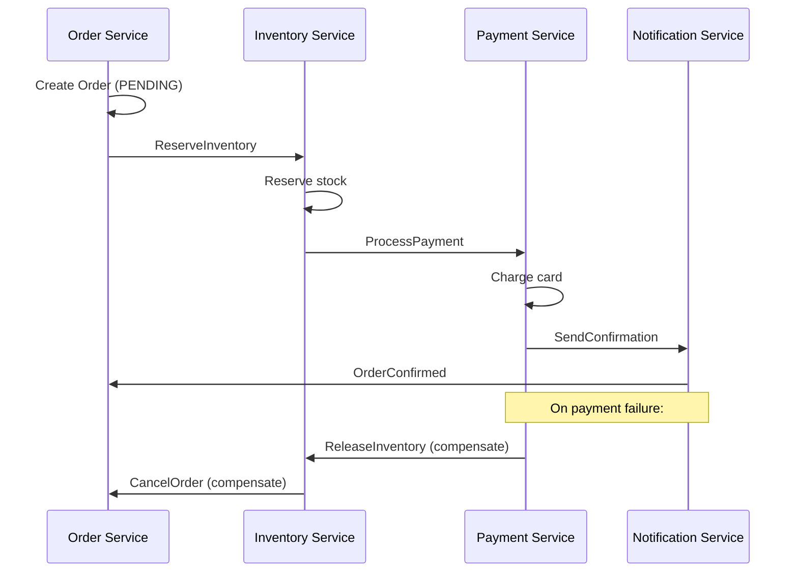
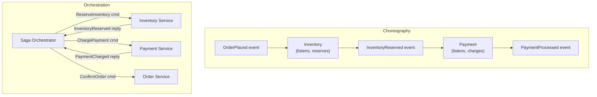

# Saga Pattern Deep Dive

[← Back to README](../README.md)

---

A **Saga** is a sequence of local transactions, each publishing an event or sending a command to trigger the next step. If any step fails, compensating transactions undo completed steps. Sagas replace distributed ACID transactions (2PC) which are impractical across microservices.



---

## Choreography vs Orchestration



| | Choreography | Orchestration |
|---|---|---|
| Coordination | Each service reacts to events | Central orchestrator sends commands |
| Coupling | Services only know events | Services know the orchestrator's API |
| Visibility | Hard to see the full flow | Orchestrator owns the state machine |
| Complexity | Simple sagas; hard to debug complex ones | Explicit flow; easier to add steps |
| Best for | Few steps, loosely coupled services | Multi-step workflows with complex error handling |

---

## Choreography — Event-Driven Saga

```java
// Order Service — starts the saga
@Service
@RequiredArgsConstructor
public class OrderService {

    private final OrderRepository orderRepo;
    private final KafkaTemplate<String, Object> kafka;

    @Transactional
    public Order placeOrder(PlaceOrderCommand cmd) {
        Order order = orderRepo.save(Order.create(cmd));
        kafka.send("order-events", new OrderPlacedEvent(
            order.getId(), order.getCustomerId(), order.getLines()));
        return order;
    }

    @KafkaListener(topics = "payment-events")
    @Transactional
    public void onPaymentEvent(PaymentEvent event) {
        if (event instanceof PaymentProcessedEvent e) {
            orderRepo.findById(e.orderId())
                .ifPresent(o -> orderRepo.save(o.withStatus("CONFIRMED")));
        } else if (event instanceof PaymentFailedEvent e) {
            // Compensate — release inventory (via event)
            kafka.send("inventory-events",
                new ReleaseInventoryCommand(e.orderId()));
            orderRepo.findById(e.orderId())
                .ifPresent(o -> orderRepo.save(o.withStatus("CANCELLED")));
        }
    }
}

// Inventory Service — listens and compensates
@KafkaListener(topics = "order-events")
@Transactional
public void onOrderPlaced(OrderPlacedEvent event) {
    boolean reserved = inventoryService.reserve(event.lines());
    if (reserved) {
        kafka.send("inventory-events", new InventoryReservedEvent(event.orderId()));
    } else {
        kafka.send("inventory-events", new InventoryFailedEvent(event.orderId()));
    }
}
```

---

## Orchestration — Saga Orchestrator

The orchestrator is a state machine that sends commands and reacts to replies.

```java
public enum OrderSagaState {
    STARTED,
    INVENTORY_RESERVED,
    PAYMENT_PROCESSED,
    COMPLETED,
    COMPENSATION_STARTED,
    INVENTORY_RELEASED,
    FAILED
}

@Entity
@Table(name = "order_sagas")
public class OrderSaga {
    @Id UUID sagaId;
    UUID orderId;
    @Enumerated(EnumType.STRING)
    OrderSagaState state;
    Instant createdAt;
    Instant updatedAt;
}
```

```java
@Service
@RequiredArgsConstructor
public class OrderSagaOrchestrator {

    private final OrderSagaRepository sagaRepo;
    private final KafkaTemplate<String, Object> kafka;

    // Step 1 — triggered when a new order is placed
    @TransactionalEventListener(phase = TransactionPhase.AFTER_COMMIT)
    public void onOrderPlaced(OrderPlacedEvent event) {
        OrderSaga saga = sagaRepo.save(new OrderSaga(
            UUID.randomUUID(), event.orderId(), OrderSagaState.STARTED));

        kafka.send("inventory-commands",
            new ReserveInventoryCommand(saga.getSagaId(), event.orderId(), event.lines()));
    }

    // Step 2 — Inventory replied
    @KafkaListener(topics = "saga-replies")
    @Transactional
    public void onSagaReply(SagaReply reply) {
        OrderSaga saga = sagaRepo.findById(reply.sagaId()).orElseThrow();

        switch (reply) {
            case InventoryReservedReply r -> {
                saga.setState(OrderSagaState.INVENTORY_RESERVED);
                sagaRepo.save(saga);
                kafka.send("payment-commands",
                    new ChargePaymentCommand(saga.getSagaId(), saga.getOrderId(), r.amount()));
            }
            case InventoryFailedReply r -> {
                saga.setState(OrderSagaState.FAILED);
                sagaRepo.save(saga);
                kafka.send("order-commands",
                    new CancelOrderCommand(saga.getOrderId(), "Inventory unavailable"));
            }
            case PaymentChargedReply r -> {
                saga.setState(OrderSagaState.PAYMENT_PROCESSED);
                sagaRepo.save(saga);
                kafka.send("order-commands",
                    new ConfirmOrderCommand(saga.getOrderId()));
                saga.setState(OrderSagaState.COMPLETED);
                sagaRepo.save(saga);
            }
            case PaymentFailedReply r -> {
                saga.setState(OrderSagaState.COMPENSATION_STARTED);
                sagaRepo.save(saga);
                // Compensate — release the reserved inventory
                kafka.send("inventory-commands",
                    new ReleaseInventoryCommand(saga.getSagaId(), saga.getOrderId()));
            }
            case InventoryReleasedReply r -> {
                saga.setState(OrderSagaState.INVENTORY_RELEASED);
                sagaRepo.save(saga);
                kafka.send("order-commands",
                    new CancelOrderCommand(saga.getOrderId(), "Payment failed"));
                saga.setState(OrderSagaState.FAILED);
                sagaRepo.save(saga);
            }
        }
    }
}
```

---

## Idempotency — Handling Duplicate Messages

Each participant must handle duplicate commands safely:

```java
@KafkaListener(topics = "inventory-commands")
@Transactional
public void onReserveInventory(ReserveInventoryCommand cmd) {
    // Check if already processed (idempotency key = sagaId)
    if (processedCommandRepo.existsBySagaId(cmd.sagaId())) {
        log.info("Duplicate command {}, skipping", cmd.sagaId());
        return;
    }

    boolean reserved = inventoryService.tryReserve(cmd.orderId(), cmd.lines());

    processedCommandRepo.save(new ProcessedCommand(cmd.sagaId(), Instant.now()));

    if (reserved) {
        kafka.send("saga-replies", new InventoryReservedReply(cmd.sagaId()));
    } else {
        kafka.send("saga-replies", new InventoryFailedReply(cmd.sagaId()));
    }
}
```

---

## Compensating Transactions

Each forward step must have a corresponding compensating transaction:

| Step | Compensation |
|------|-------------|
| Create order | Cancel order |
| Reserve inventory | Release inventory |
| Process payment | Refund payment |
| Send notification | Send cancellation notice |

```java
// Payment Service — refund as compensation
@KafkaListener(topics = "payment-commands")
@Transactional
public void onPaymentCommand(PaymentCommand cmd) {
    if (cmd instanceof ChargePaymentCommand c) {
        PaymentResult result = paymentGateway.charge(c.orderId(), c.amount());
        String replyTopic = "saga-replies";
        kafka.send(replyTopic, result.success()
            ? new PaymentChargedReply(c.sagaId(), result.transactionId())
            : new PaymentFailedReply(c.sagaId(), result.reason()));
    }

    if (cmd instanceof RefundPaymentCommand c) {
        paymentGateway.refund(c.transactionId());
        kafka.send("saga-replies", new PaymentRefundedReply(c.sagaId()));
    }
}
```

---

## Saga Failure Recovery

Sagas must be recoverable after a crash mid-execution:

```java
@Scheduled(fixedDelay = 30_000)   // every 30 seconds
@Transactional
public void recoverStuckSagas() {
    Instant threshold = Instant.now().minus(Duration.ofMinutes(5));

    sagaRepo.findByStateInAndUpdatedAtBefore(
            List.of(OrderSagaState.STARTED, OrderSagaState.INVENTORY_RESERVED),
            threshold)
        .forEach(saga -> {
            log.warn("Recovering stuck saga {} in state {}", saga.getSagaId(), saga.getState());
            replayFromState(saga);
        });
}
```

---

## Testing Sagas

```java
@SpringBootTest
@EmbeddedKafka(partitions = 1,
    topics = {"order-events", "inventory-commands", "saga-replies"})
class OrderSagaIntegrationTest {

    @Autowired OrderSagaOrchestrator orchestrator;
    @Autowired OrderSagaRepository sagaRepo;
    @Autowired EmbeddedKafkaBroker broker;

    @Test
    void happyPathCompletesSuccessfully() throws Exception {
        UUID orderId = UUID.randomUUID();

        // Trigger the saga
        orchestrator.onOrderPlaced(new OrderPlacedEvent(orderId, "cust-1", List.of()));

        // Simulate inventory reply
        orchestrator.onSagaReply(new InventoryReservedReply(findSagaId(orderId)));

        // Simulate payment reply
        orchestrator.onSagaReply(new PaymentChargedReply(findSagaId(orderId), "txn-1"));

        // Verify final state
        await().atMost(Duration.ofSeconds(5))
            .untilAsserted(() -> {
                OrderSaga saga = sagaRepo.findByOrderId(orderId).orElseThrow();
                assertThat(saga.getState()).isEqualTo(OrderSagaState.COMPLETED);
            });
    }
}
```

---

## Saga Pattern Summary

| Concept | Detail |
|---------|--------|
| Saga | Sequence of local transactions with compensating transactions for rollback |
| Choreography | Services react to events from each other — no central coordinator |
| Orchestration | Central saga orchestrator sends commands and tracks state |
| Compensating transaction | Undoes a completed step — must be idempotent |
| Saga state | Persisted in DB so recovery is possible after crash |
| Idempotency | Each participant checks for duplicate commands by saga/correlation ID |
| Recovery | Scheduled job re-triggers stuck sagas |
| vs 2PC | Saga is eventually consistent but doesn't hold DB locks across services |
| Command channel | Kafka/RabbitMQ topic per service for incoming commands |
| Reply channel | Single `saga-replies` topic the orchestrator listens to |

---

[← Back to README](../README.md)
