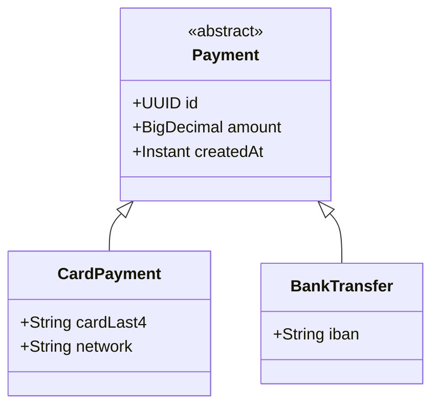

# JPA Advanced — Inheritance, Embeddables & Auditing

[← Back to README](../README.md)

---

Beyond basic `@Entity` mapping, JPA provides three inheritance strategies, `@Embedded` value objects, second-level caching, and auditing via Spring Data's `@CreatedDate` / `@LastModifiedBy`. These features let you model complex domains accurately without sacrificing query performance.



---

## Inheritance Strategies

### SINGLE_TABLE (default — one table, discriminator column)

```java
@Entity
@Table(name = "payments")
@Inheritance(strategy = InheritanceType.SINGLE_TABLE)
@DiscriminatorColumn(name = "payment_type", discriminatorType = DiscriminatorType.STRING)
public abstract class Payment {
    @Id @GeneratedValue UUID id;
    BigDecimal amount;
    Instant createdAt;
}

@Entity
@DiscriminatorValue("CARD")
public class CardPayment extends Payment {
    String cardLast4;
    String network;     // nullable for other types
}

@Entity
@DiscriminatorValue("TRANSFER")
public class BankTransfer extends Payment {
    String iban;        // nullable for card payments
}
```

**Pros:** Single JOIN — fast queries. **Cons:** Nullable columns for each subtype; not null-safe without DB constraints.

---

### JOINED (separate table per class)

```java
@Entity
@Table(name = "payments")
@Inheritance(strategy = InheritanceType.JOINED)
public abstract class Payment {
    @Id @GeneratedValue UUID id;
    BigDecimal amount;
    Instant createdAt;
}

@Entity
@Table(name = "card_payments")
@PrimaryKeyJoinColumn(name = "payment_id")
public class CardPayment extends Payment {
    String cardLast4;
    String network;
}

@Entity
@Table(name = "bank_transfers")
@PrimaryKeyJoinColumn(name = "payment_id")
public class BankTransfer extends Payment {
    String iban;
}
```

**Pros:** Normalised schema; NOT NULL constraints per subtype. **Cons:** JOIN on every query.

---

### TABLE_PER_CLASS (one complete table per concrete class)

```java
@Entity
@Inheritance(strategy = InheritanceType.TABLE_PER_CLASS)
public abstract class Payment { ... }

@Entity
@Table(name = "card_payments")
public class CardPayment extends Payment {
    // id, amount, createdAt duplicated here
    String cardLast4;
}
```

**Pros:** No JOINs for single-type queries. **Cons:** UNION ALL for polymorphic queries; ID uniqueness across tables is complex.

---

### Choosing a Strategy

| Strategy | Query pattern | Schema |
|----------|-------------|--------|
| `SINGLE_TABLE` | Polymorphic queries; few subtypes | One table, many nullable columns |
| `JOINED` | Normalised; subtype-specific queries | Multiple tables, JOIN required |
| `TABLE_PER_CLASS` | Subtype-specific queries only | Multiple complete tables |

---

## @MappedSuperclass — Shared Fields, No Inheritance

`@MappedSuperclass` maps fields to each child table but is not an entity itself — no polymorphic queries.

```java
@MappedSuperclass
public abstract class BaseEntity {
    @Id
    @GeneratedValue(strategy = GenerationType.UUID)
    private UUID id;

    @Version
    private Long version;          // optimistic locking

    @CreatedDate
    @Column(updatable = false)
    private Instant createdAt;

    @LastModifiedDate
    private Instant updatedAt;
}

@Entity
@Table(name = "orders")
public class Order extends BaseEntity {
    private String status;
    private BigDecimal total;
}
```

---

## @Embedded — Value Objects

`@Embeddable` marks a class whose fields are mapped to the owner's table. No separate table, no separate ID.

```java
@Embeddable
public class Address {
    @Column(name = "street", nullable = false)
    private String street;

    @Column(name = "city", nullable = false)
    private String city;

    @Column(name = "postal_code", length = 10)
    private String postalCode;

    @Column(name = "country", length = 2)
    private String country;
}

@Embeddable
public class Money {
    @Column(name = "amount", precision = 19, scale = 4)
    private BigDecimal amount;

    @Column(name = "currency", length = 3)
    private String currency;
}

@Entity
@Table(name = "orders")
public class Order extends BaseEntity {
    @Embedded
    private Address shippingAddress;

    @Embedded
    @AttributeOverrides({
        @AttributeOverride(name = "amount",   column = @Column(name = "total_amount")),
        @AttributeOverride(name = "currency", column = @Column(name = "total_currency"))
    })
    private Money total;
}
```

---

## @ElementCollection — Collection of Embeddables

```java
@Entity
public class Order extends BaseEntity {

    // Collection of simple values → separate table
    @ElementCollection
    @CollectionTable(name = "order_tags",
                     joinColumns = @JoinColumn(name = "order_id"))
    @Column(name = "tag")
    private Set<String> tags = new HashSet<>();

    // Collection of embeddables → separate table
    @ElementCollection
    @CollectionTable(name = "order_items",
                     joinColumns = @JoinColumn(name = "order_id"))
    private List<OrderItem> items = new ArrayList<>();
}

@Embeddable
public class OrderItem {
    @Column(name = "product_id") UUID productId;
    @Column(name = "quantity")   int quantity;
    @Column(name = "unit_price") BigDecimal unitPrice;
}
```

---

## Auditing with Spring Data

```java
// 1. Enable auditing
@SpringBootApplication
@EnableJpaAuditing(auditorAwareRef = "auditorProvider")
public class Application {}

// 2. Provide the current user
@Bean
public AuditorAware<String> auditorProvider() {
    return () -> Optional.ofNullable(SecurityContextHolder.getContext().getAuthentication())
        .map(Authentication::getName);
}

// 3. Use auditing annotations in entities
@MappedSuperclass
@EntityListeners(AuditingEntityListener.class)
public abstract class AuditableEntity {

    @CreatedBy
    @Column(updatable = false)
    private String createdBy;

    @CreatedDate
    @Column(updatable = false)
    private Instant createdAt;

    @LastModifiedBy
    private String updatedBy;

    @LastModifiedDate
    private Instant updatedAt;
}
```

---

## Optimistic Locking

`@Version` adds a version column that JPA increments on every update. If two transactions modify the same row simultaneously, the second throws `OptimisticLockException`.

```java
@Entity
public class Order extends BaseEntity {
    @Version
    private Long version;   // included in UPDATE WHERE clause

    private String status;
}

// If two threads update concurrently:
// Thread A: UPDATE orders SET status='CONFIRMED', version=2 WHERE id=? AND version=1  ✓
// Thread B: UPDATE orders SET status='CANCELLED', version=2 WHERE id=? AND version=1  ✗ → exception
```

```java
// Handle optimistic lock failure
@ExceptionHandler(ObjectOptimisticLockingFailureException.class)
public ResponseEntity<Error> handleConflict(ObjectOptimisticLockingFailureException ex) {
    return ResponseEntity.status(HttpStatus.CONFLICT)
        .body(new Error("Resource modified by another request, retry"));
}
```

---

## Second-Level Cache (Hibernate)

The second-level cache (2LC) sits across sessions — shared by all requests.

```xml
<dependency>
    <groupId>org.hibernate.orm</groupId>
    <artifactId>hibernate-jcache</artifactId>
</dependency>
<dependency>
    <groupId>org.ehcache</groupId>
    <artifactId>ehcache</artifactId>
</dependency>
```

```yaml
spring:
  jpa:
    properties:
      hibernate:
        cache:
          use_second_level_cache: true
          region:
            factory_class: org.hibernate.cache.jcache.JCacheRegionFactory
          use_query_cache: true
```

```java
@Entity
@Cache(usage = CacheConcurrencyStrategy.READ_WRITE)   // cache this entity
public class Category {
    @Id Long id;
    String name;
}

@Repository
public interface CategoryRepository extends JpaRepository<Category, Long> {

    @QueryHints(@QueryHint(name = "org.hibernate.cacheable", value = "true"))
    List<Category> findByActiveTrue();
}
```

---

## Converter — Custom Type Mapping

```java
// Store a List<String> as a comma-separated VARCHAR
@Converter
public class StringListConverter implements AttributeConverter<List<String>, String> {

    @Override
    public String convertToDatabaseColumn(List<String> list) {
        return list == null ? null : String.join(",", list);
    }

    @Override
    public List<String> convertToEntityAttribute(String value) {
        return value == null ? new ArrayList<>()
                             : Arrays.asList(value.split(","));
    }
}

@Entity
public class Product {
    @Convert(converter = StringListConverter.class)
    @Column(name = "tags")
    private List<String> tags;
}
```

---

## JPA Advanced Summary

| Feature | Key Annotation | Detail |
|---------|---------------|--------|
| Single table inheritance | `@Inheritance(SINGLE_TABLE)` + `@DiscriminatorColumn` | One table; discriminator column per subtype |
| Joined inheritance | `@Inheritance(JOINED)` + `@PrimaryKeyJoinColumn` | Normalised; JOIN on query |
| Mapped superclass | `@MappedSuperclass` | Shared fields, no entity table, no polymorphic queries |
| Embeddable | `@Embeddable` + `@Embedded` | Value object columns in owner's table |
| Attribute override | `@AttributeOverrides` | Rename embedded columns when embedding twice |
| Element collection | `@ElementCollection` | Primitives / embeddables in a separate collection table |
| Auditing | `@CreatedDate`, `@LastModifiedBy`, `AuditorAware` | Automatic timestamps and actor tracking |
| Optimistic locking | `@Version` | Prevents lost-update without DB locks |
| Second-level cache | `@Cache(READ_WRITE)` | Entity + query cache across sessions |
| Attribute converter | `AttributeConverter<X,Y>` | Custom Java ↔ DB column type mapping |

---

[← Back to README](../README.md)
