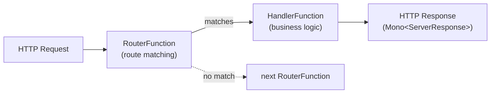

# Functional Web (WebFlux.fn)

[← Back to README](../README.md)

---

Spring WebFlux offers two programming models: **annotation-based** (`@RestController`) and **functional** (`RouterFunction` + `HandlerFunction`). The functional style defines routes explicitly as data rather than method annotations, making routing logic composable, testable without a running server, and easier to reason about in large codebases.



---

## Core Concepts

```java
// HandlerFunction — takes a ServerRequest, returns Mono<ServerResponse>
@FunctionalInterface
public interface HandlerFunction<T extends ServerResponse> {
    Mono<T> handle(ServerRequest request);
}

// RouterFunction — takes a ServerRequest, returns Mono<HandlerFunction> if matched
@FunctionalInterface
public interface RouterFunction<T extends ServerResponse> {
    Mono<HandlerFunction<T>> route(ServerRequest request);
}
```

---

## Handler Class

Extract handler logic into a plain component — no annotations needed:

```java
@Component
@RequiredArgsConstructor
public class OrderHandler {

    private final OrderService orderService;

    public Mono<ServerResponse> getOrder(ServerRequest request) {
        UUID id = UUID.fromString(request.pathVariable("id"));
        return orderService.findById(id)
            .flatMap(order -> ServerResponse.ok()
                .contentType(MediaType.APPLICATION_JSON)
                .bodyValue(order))
            .switchIfEmpty(ServerResponse.notFound().build());
    }

    public Mono<ServerResponse> listOrders(ServerRequest request) {
        UUID customerId = UUID.fromString(
            request.queryParam("customerId").orElseThrow());
        Flux<Order> orders = orderService.findByCustomer(customerId);
        return ServerResponse.ok()
            .contentType(MediaType.APPLICATION_JSON)
            .body(orders, Order.class);
    }

    public Mono<ServerResponse> placeOrder(ServerRequest request) {
        return request.bodyToMono(PlaceOrderRequest.class)
            .flatMap(orderService::placeOrder)
            .flatMap(order -> ServerResponse.created(
                    URI.create("/api/orders/" + order.getId()))
                .bodyValue(order));
    }

    public Mono<ServerResponse> cancelOrder(ServerRequest request) {
        UUID id = UUID.fromString(request.pathVariable("id"));
        return orderService.cancel(id)
            .then(ServerResponse.noContent().build());
    }
}
```

---

## Router Configuration

```java
@Configuration
public class OrderRouter {

    @Bean
    public RouterFunction<ServerResponse> orderRoutes(OrderHandler handler) {
        return RouterFunctions.route()
            .GET("/api/orders/{id}",           handler::getOrder)
            .GET("/api/orders",                handler::listOrders)
            .POST("/api/orders",               handler::placeOrder)
            .DELETE("/api/orders/{id}",        handler::cancelOrder)
            .build();
    }
}
```

---

## Request Predicates

```java
@Bean
public RouterFunction<ServerResponse> routes(OrderHandler handler,
                                              AdminHandler adminHandler) {
    return RouterFunctions.route()

        // Path + method predicates
        .GET("/api/orders/{id}", handler::getOrder)
        .POST("/api/orders",     handler::placeOrder)

        // Path + content type predicate
        .route(RequestPredicates.POST("/api/orders")
                .and(RequestPredicates.contentType(MediaType.APPLICATION_JSON)),
            handler::placeOrder)

        // Accept header predicate
        .route(RequestPredicates.GET("/api/orders")
                .and(RequestPredicates.accept(MediaType.APPLICATION_JSON)),
            handler::listOrders)

        // Nesting — group routes under a common path
        .nest(RequestPredicates.path("/api/admin"), () ->
            RouterFunctions.route()
                .GET("/orders",   adminHandler::listAll)
                .DELETE("/orders/{id}", adminHandler::forceCancel)
                .build())

        .build();
}
```

---

## Request Parsing

```java
public Mono<ServerResponse> placeOrder(ServerRequest request) {
    // Path variable
    String version = request.pathVariable("version");

    // Query param
    Optional<String> status = request.queryParam("status");

    // Header
    Optional<String> correlationId = request.headers()
        .firstHeader("X-Correlation-Id");

    // Body (deserialized)
    return request.bodyToMono(PlaceOrderRequest.class)
        .flatMap(req -> /* ... */);
}

public Mono<ServerResponse> upload(ServerRequest request) {
    // Multipart
    return request.multipartData()
        .flatMap(parts -> {
            Part file = parts.getFirst("file");
            return /* process file */;
        });
}
```

---

## Validation

```java
@Component
@RequiredArgsConstructor
public class OrderHandler {

    private final Validator validator;   // javax.validation.Validator

    public Mono<ServerResponse> placeOrder(ServerRequest request) {
        return request.bodyToMono(PlaceOrderRequest.class)
            .doOnNext(this::validate)
            .flatMap(orderService::placeOrder)
            .flatMap(order -> ServerResponse.created(
                URI.create("/api/orders/" + order.getId())).bodyValue(order));
    }

    private void validate(Object body) {
        Set<ConstraintViolation<Object>> violations = validator.validate(body);
        if (!violations.isEmpty()) {
            throw new ServerWebInputException(
                violations.stream()
                    .map(v -> v.getPropertyPath() + ": " + v.getMessage())
                    .collect(Collectors.joining(", ")));
        }
    }
}
```

---

## HandlerFilterFunction — Cross-Cutting Concerns

```java
// Authentication filter
HandlerFilterFunction<ServerResponse, ServerResponse> authFilter =
    (request, next) -> {
        Optional<String> auth = request.headers().firstHeader("Authorization");
        if (auth.isEmpty() || !auth.get().startsWith("Bearer ")) {
            return ServerResponse.status(HttpStatus.UNAUTHORIZED).build();
        }
        return next.handle(request);
    };

// Logging filter
HandlerFilterFunction<ServerResponse, ServerResponse> loggingFilter =
    (request, next) -> {
        log.info("→ {} {}", request.method(), request.uri());
        return next.handle(request)
            .doOnSuccess(resp -> log.info("← {}", resp.statusCode()));
    };

// Apply filters to a router
@Bean
public RouterFunction<ServerResponse> orderRoutes(OrderHandler handler) {
    return RouterFunctions.route()
        .GET("/api/orders/{id}", handler::getOrder)
        .POST("/api/orders",     handler::placeOrder)
        .filter(authFilter)
        .filter(loggingFilter)
        .build();
}
```

---

## Error Handling

```java
@Bean
public RouterFunction<ServerResponse> orderRoutes(OrderHandler handler) {
    return RouterFunctions.route()
        .GET("/api/orders/{id}", handler::getOrder)
        .onError(OrderNotFoundException.class,
            (ex, req) -> ServerResponse.notFound().build())
        .onError(IllegalStateException.class,
            (ex, req) -> ServerResponse.badRequest()
                .bodyValue(Map.of("error", ex.getMessage())))
        .build();
}
```

Or use a global `@ControllerAdvice` — it works for functional endpoints too:

```java
@RestControllerAdvice
public class GlobalErrorHandler {

    @ExceptionHandler(OrderNotFoundException.class)
    public Mono<ResponseEntity<Error>> handleNotFound(OrderNotFoundException ex) {
        return Mono.just(ResponseEntity.notFound().build());
    }
}
```

---

## Testing Without a Server

Functional routes can be tested without starting a server using `WebTestClient.bindToRouterFunction`:

```java
class OrderRouterTest {

    OrderHandler handler = mock(OrderHandler.class);
    OrderService orderService = mock(OrderService.class);
    WebTestClient client;

    @BeforeEach
    void setUp() {
        OrderHandler handler = new OrderHandler(orderService);
        RouterFunction<ServerResponse> router =
            new OrderRouter().orderRoutes(handler);

        client = WebTestClient.bindToRouterFunction(router).build();
    }

    @Test
    void getOrderReturns200() {
        UUID id = UUID.randomUUID();
        when(orderService.findById(id))
            .thenReturn(Mono.just(new Order(id, "CONFIRMED", BigDecimal.TEN)));

        client.get().uri("/api/orders/{id}", id)
            .exchange()
            .expectStatus().isOk()
            .expectBody()
            .jsonPath("$.status").isEqualTo("CONFIRMED");
    }

    @Test
    void getMissingOrderReturns404() {
        UUID id = UUID.randomUUID();
        when(orderService.findById(id)).thenReturn(Mono.empty());

        client.get().uri("/api/orders/{id}", id)
            .exchange()
            .expectStatus().isNotFound();
    }
}
```

---

## Annotation vs Functional — When to Use Each

| | Annotation (`@RestController`) | Functional (`RouterFunction`) |
|---|---|---|
| Boilerplate | Low | Slightly more explicit |
| Route visibility | Scattered across controllers | All routes in one place |
| Composability | Limited | `RouterFunctions.route().and(other)` |
| Testability | Needs MockMvc / `@WebFluxTest` | `WebTestClient.bindToRouterFunction` — no server |
| Filters | `@Around` AOP | `HandlerFilterFunction` per router |
| Best for | CRUD services; teams familiar with MVC | API gateways; complex routing; highly testable layers |

---

## WebFlux.fn Summary

| Concept | Detail |
|---------|--------|
| `HandlerFunction<T>` | `ServerRequest → Mono<T>` — the actual request logic |
| `RouterFunction<T>` | `ServerRequest → Mono<HandlerFunction<T>>` — matching |
| `RouterFunctions.route()` | Fluent builder for `GET`, `POST`, `PUT`, `DELETE`, `nest` |
| `RequestPredicates` | Composable predicates: `path()`, `method()`, `contentType()`, `accept()` |
| `HandlerFilterFunction` | Pre/post processing applied to a `RouterFunction` |
| `.nest(predicate, routes)` | Group routes under a common path prefix |
| `.onError(type, handler)` | Catch exceptions within a router scope |
| `ServerRequest` | Immutable request wrapper — path vars, query params, body, headers |
| `ServerResponse` | Builder for status, headers, body |
| `WebTestClient.bindToRouterFunction` | Test routes in-process without a server |

---

[← Back to README](../README.md)
