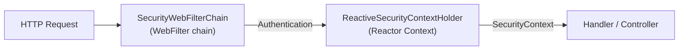

# Reactive Security

[← Back to README](../README.md)

---

Spring Security's reactive stack integrates with Spring WebFlux. Instead of `SecurityFilterChain` and servlet filters, it uses `SecurityWebFilterChain` and `WebFilter`. Authentication is non-blocking throughout, and the security context is propagated via Reactor's `Context` rather than `ThreadLocal`.



---

## Dependency

```xml
<dependency>
    <groupId>org.springframework.boot</groupId>
    <artifactId>spring-boot-starter-security</artifactId>
</dependency>
<dependency>
    <groupId>org.springframework.boot</groupId>
    <artifactId>spring-boot-starter-webflux</artifactId>
</dependency>
```

Spring Boot auto-detects WebFlux and configures the reactive security stack automatically.

---

## SecurityWebFilterChain

```java
@Configuration
@EnableWebFluxSecurity
public class SecurityConfig {

    @Bean
    public SecurityWebFilterChain securityWebFilterChain(ServerHttpSecurity http) {
        return http
            .csrf(ServerHttpSecurity.CsrfSpec::disable)   // stateless API — disable CSRF
            .authorizeExchange(auth -> auth
                .pathMatchers("/api/auth/**").permitAll()
                .pathMatchers(HttpMethod.GET, "/api/products/**").permitAll()
                .pathMatchers("/api/admin/**").hasRole("ADMIN")
                .anyExchange().authenticated())
            .oauth2ResourceServer(oauth2 -> oauth2
                .jwt(jwt -> jwt.jwtAuthenticationConverter(jwtConverter())))
            .build();
    }

    @Bean
    public ReactiveJwtAuthenticationConverter jwtConverter() {
        ReactiveJwtGrantedAuthoritiesConverter authoritiesConverter =
            new ReactiveJwtGrantedAuthoritiesConverter();
        authoritiesConverter.setAuthoritiesClaimName("roles");
        authoritiesConverter.setAuthorityPrefix("ROLE_");

        ReactiveJwtAuthenticationConverter converter = new ReactiveJwtAuthenticationConverter();
        converter.setJwtGrantedAuthoritiesConverter(authoritiesConverter);
        return converter;
    }
}
```

---

## ReactiveUserDetailsService — Custom Authentication

```java
@Component
@RequiredArgsConstructor
public class UserDetailsServiceImpl implements ReactiveUserDetailsService {

    private final UserRepository userRepo;

    @Override
    public Mono<UserDetails> findByUsername(String username) {
        return userRepo.findByUsername(username)   // returns Mono<User>
            .map(user -> org.springframework.security.core.userdetails.User
                .withUsername(user.getUsername())
                .password(user.getPasswordHash())
                .roles(user.getRoles().toArray(String[]::new))
                .build())
            .switchIfEmpty(Mono.error(
                new UsernameNotFoundException("User not found: " + username)));
    }
}
```

---

## JWT Authentication (Stateless)

```java
@Configuration
@EnableWebFluxSecurity
public class JwtSecurityConfig {

    @Bean
    public SecurityWebFilterChain chain(ServerHttpSecurity http,
                                        ReactiveJwtDecoder jwtDecoder) {
        return http
            .csrf(ServerHttpSecurity.CsrfSpec::disable)
            .httpBasic(ServerHttpSecurity.HttpBasicSpec::disable)
            .formLogin(ServerHttpSecurity.FormLoginSpec::disable)
            .authorizeExchange(auth -> auth
                .pathMatchers("/api/public/**").permitAll()
                .anyExchange().authenticated())
            .oauth2ResourceServer(oauth2 -> oauth2
                .jwt(jwt -> jwt.jwtDecoder(jwtDecoder)))
            .build();
    }

    @Bean
    public ReactiveJwtDecoder jwtDecoder() {
        // Validates JWT signature against the issuer's JWKS endpoint
        return ReactiveJwtDecoders.fromIssuerLocation("http://auth-server:9000");
    }
}
```

---

## Custom JWT Authentication Filter

For cases where you manage JWT validation yourself (without an external auth server):

```java
@Component
@RequiredArgsConstructor
public class JwtAuthenticationWebFilter implements WebFilter {

    private final JwtTokenService jwtService;

    @Override
    public Mono<Void> filter(ServerWebExchange exchange, WebFilterChain chain) {
        String token = extractToken(exchange.getRequest());
        if (token == null) return chain.filter(exchange);

        return jwtService.validateAndDecode(token)
            .flatMap(claims -> {
                UsernamePasswordAuthenticationToken auth =
                    new UsernamePasswordAuthenticationToken(
                        claims.getSubject(),
                        null,
                        claims.getRoles().stream()
                            .map(SimpleGrantedAuthority::new)
                            .toList());

                return chain.filter(exchange)
                    .contextWrite(ReactiveSecurityContextHolder.withAuthentication(auth));
            })
            .onErrorResume(e -> {
                exchange.getResponse().setStatusCode(HttpStatus.UNAUTHORIZED);
                return exchange.getResponse().setComplete();
            });
    }

    private String extractToken(ServerHttpRequest request) {
        String auth = request.getHeaders().getFirst(HttpHeaders.AUTHORIZATION);
        return (auth != null && auth.startsWith("Bearer ")) ? auth.substring(7) : null;
    }
}
```

---

## Accessing the Security Context

In reactive code, the security context is in Reactor's `Context`, not `ThreadLocal`:

```java
@RestController
public class OrderController {

    @GetMapping("/api/orders")
    public Flux<Order> myOrders() {
        return ReactiveSecurityContextHolder.getContext()
            .map(SecurityContext::getAuthentication)
            .map(Authentication::getName)
            .flatMapMany(orderService::findByCustomer);
    }

    // Or via @AuthenticationPrincipal in annotated controllers
    @GetMapping("/api/profile")
    public Mono<UserProfile> profile(
            @AuthenticationPrincipal Mono<Jwt> jwt) {
        return jwt.map(token -> new UserProfile(
            token.getSubject(),
            token.getClaimAsString("email")));
    }
}
```

---

## Method Security

```java
@Configuration
@EnableReactiveMethodSecurity
public class MethodSecurityConfig {}

@Service
public class OrderService {

    @PreAuthorize("hasRole('ADMIN')")
    public Flux<Order> findAll() { ... }

    @PreAuthorize("hasRole('ADMIN') or #customerId == authentication.name")
    public Flux<Order> findByCustomer(String customerId) { ... }

    @PostAuthorize("returnObject.map(o -> o.customerId == authentication.name)")
    public Mono<Order> findById(UUID id) { ... }
}
```

---

## CORS in Reactive Security

```java
@Bean
public SecurityWebFilterChain chain(ServerHttpSecurity http) {
    return http
        .cors(cors -> cors.configurationSource(corsConfigurationSource()))
        // ...
        .build();
}

@Bean
public CorsConfigurationSource corsConfigurationSource() {
    CorsConfiguration config = new CorsConfiguration();
    config.setAllowedOrigins(List.of("https://app.example.com"));
    config.setAllowedMethods(List.of("GET", "POST", "PUT", "DELETE"));
    config.setAllowedHeaders(List.of("*"));
    config.setAllowCredentials(true);

    UrlBasedCorsConfigurationSource source = new UrlBasedCorsConfigurationSource();
    source.registerCorsConfiguration("/**", config);
    return source;
}
```

---

## Testing Reactive Security

```java
@WebFluxTest(OrderController.class)
@Import(JwtSecurityConfig.class)
class OrderControllerSecurityTest {

    @Autowired WebTestClient client;
    @MockBean  OrderService orderService;

    @Test
    void unauthenticatedRequestReturns401() {
        client.get().uri("/api/orders")
            .exchange()
            .expectStatus().isUnauthorized();
    }

    @Test
    @WithMockUser(username = "alice", roles = "USER")
    void authenticatedUserCanListOrders() {
        when(orderService.findByCustomer("alice"))
            .thenReturn(Flux.empty());

        client.get().uri("/api/orders")
            .exchange()
            .expectStatus().isOk();
    }

    @Test
    void jwtWithUserRoleCannotAccessAdmin() {
        client.get().uri("/api/admin/orders")
            .headers(h -> h.setBearerAuth(jwtForUser("alice", "ROLE_USER")))
            .exchange()
            .expectStatus().isForbidden();
    }

    @Test
    void jwtWithAdminRoleCanAccessAdmin() {
        when(orderService.findAll()).thenReturn(Flux.empty());

        client.get().uri("/api/admin/orders")
            .headers(h -> h.setBearerAuth(jwtForUser("admin", "ROLE_ADMIN")))
            .exchange()
            .expectStatus().isOk();
    }

    private String jwtForUser(String username, String... roles) {
        // Use Nimbus JOSE to build a test JWT signed with the test key
        return Jwts.builder()
            .subject(username)
            .claim("roles", List.of(roles))
            .signWith(testKey)
            .compact();
    }
}
```

---

## Reactive vs Servlet Security

| | Servlet (`SecurityFilterChain`) | Reactive (`SecurityWebFilterChain`) |
|---|---|---|
| Infrastructure | Servlet filters | `WebFilter` chain |
| Security context | `ThreadLocal` | Reactor `Context` |
| User details | `UserDetailsService` | `ReactiveUserDetailsService` |
| JWT | `JwtDecoder` | `ReactiveJwtDecoder` |
| Method security | `@EnableMethodSecurity` | `@EnableReactiveMethodSecurity` |
| Annotation | `@EnableWebSecurity` | `@EnableWebFluxSecurity` |
| Accessing auth | `SecurityContextHolder.getContext()` | `ReactiveSecurityContextHolder.getContext()` |

---

## Reactive Security Summary

| Concept | Detail |
|---------|--------|
| `SecurityWebFilterChain` | Reactive equivalent of `SecurityFilterChain` |
| `@EnableWebFluxSecurity` | Enables reactive security auto-configuration |
| `ReactiveUserDetailsService` | Returns `Mono<UserDetails>` — non-blocking user lookup |
| `ReactiveJwtDecoder` | Validates JWT signatures non-blocking; auto-fetches JWKS |
| `ReactiveSecurityContextHolder` | Reads/writes `SecurityContext` from Reactor `Context` |
| `ReactiveJwtAuthenticationConverter` | Maps JWT claims to `GrantedAuthority` list |
| `@EnableReactiveMethodSecurity` | Enables `@PreAuthorize` on reactive methods |
| `@AuthenticationPrincipal Mono<Jwt>` | Inject current JWT into a handler parameter |
| `contextWrite(withAuthentication(...))` | Propagate authentication through a reactive pipeline |

---

[← Back to README](../README.md)
