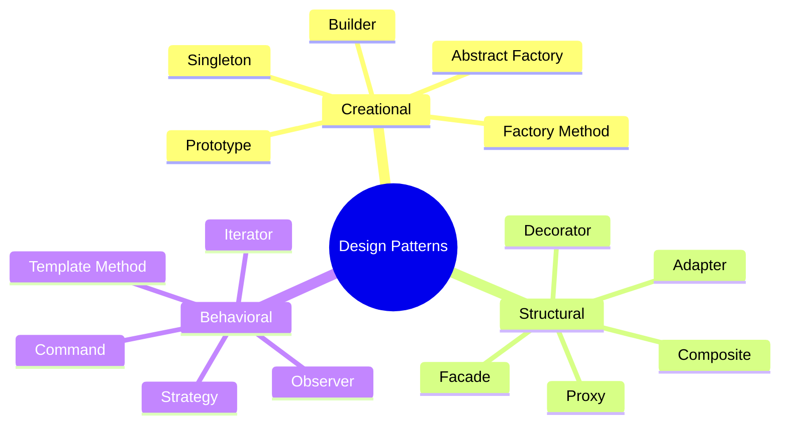

# Design Patterns

[← Back to README](../README.md)

---

Design patterns are reusable solutions to recurring problems in software design. They are not code you copy — they are blueprints you adapt. The 23 classical patterns from the "Gang of Four" book are grouped into three categories.



---

## Creational Patterns

Deal with object creation — controlling how and when objects are instantiated.

---

### Singleton

Ensures a class has **only one instance** and provides a global access point to it.

```java
public class DatabaseConnection {
    private static DatabaseConnection instance;
    private String url;

    private DatabaseConnection(String url) {  // private constructor
        this.url = url;
        System.out.println("Connecting to " + url);
    }

    public static DatabaseConnection getInstance() {
        if (instance == null) {
            instance = new DatabaseConnection("jdbc:postgresql://localhost/mydb");
        }
        return instance;
    }

    public void query(String sql) {
        System.out.println("Executing: " + sql);
    }
}

DatabaseConnection db1 = DatabaseConnection.getInstance();
DatabaseConnection db2 = DatabaseConnection.getInstance();
System.out.println(db1 == db2);  // true — same instance
```

**Thread-safe Singleton** using initialization-on-demand:

```java
public class Singleton {
    private Singleton() {}

    private static class Holder {
        private static final Singleton INSTANCE = new Singleton();
    }

    public static Singleton getInstance() {
        return Holder.INSTANCE;
    }
}
```

> Use Singleton for shared resources like config, logging, or connection pools. Avoid overusing it — it introduces global state and makes testing harder.

---

### Factory Method

Defines an interface for creating an object but lets **subclasses decide which class to instantiate**.

```java
public interface Notification {
    void send(String message);
}

public class EmailNotification implements Notification {
    @Override
    public void send(String message) {
        System.out.println("Email: " + message);
    }
}

public class SMSNotification implements Notification {
    @Override
    public void send(String message) {
        System.out.println("SMS: " + message);
    }
}

public class PushNotification implements Notification {
    @Override
    public void send(String message) {
        System.out.println("Push: " + message);
    }
}

// factory method
public class NotificationFactory {
    public static Notification create(String type) {
        return switch (type.toLowerCase()) {
            case "email" -> new EmailNotification();
            case "sms"   -> new SMSNotification();
            case "push"  -> new PushNotification();
            default      -> throw new IllegalArgumentException("Unknown type: " + type);
        };
    }
}

Notification n = NotificationFactory.create("email");
n.send("Your order has shipped.");  // Email: Your order has shipped.
```

---

### Builder

Constructs a **complex object step by step**, separating construction from representation. Ideal when a constructor would need many parameters.

```java
public class HttpRequest {
    private final String method;
    private final String url;
    private final java.util.Map<String, String> headers;
    private final String body;
    private final int timeoutMs;

    private HttpRequest(Builder builder) {
        this.method    = builder.method;
        this.url       = builder.url;
        this.headers   = builder.headers;
        this.body      = builder.body;
        this.timeoutMs = builder.timeoutMs;
    }

    @Override
    public String toString() {
        return method + " " + url + " (timeout=" + timeoutMs + "ms)";
    }

    public static class Builder {
        private final String method;
        private final String url;
        private java.util.Map<String, String> headers = new java.util.HashMap<>();
        private String body      = "";
        private int    timeoutMs = 3000;

        public Builder(String method, String url) {
            this.method = method;
            this.url    = url;
        }

        public Builder header(String key, String value) {
            this.headers.put(key, value);
            return this;
        }

        public Builder body(String body) {
            this.body = body;
            return this;
        }

        public Builder timeout(int ms) {
            this.timeoutMs = ms;
            return this;
        }

        public HttpRequest build() {
            return new HttpRequest(this);
        }
    }
}

HttpRequest request = new HttpRequest.Builder("POST", "https://api.example.com/users")
    .header("Content-Type", "application/json")
    .header("Authorization", "Bearer token123")
    .body("{\"name\": \"Alice\"}")
    .timeout(5000)
    .build();

System.out.println(request);  // POST https://api.example.com/users (timeout=5000ms)
```

---

### Prototype

Creates new objects by **cloning an existing object** rather than constructing from scratch — useful when creation is expensive.

```java
public class UserProfile implements Cloneable {
    private String username;
    private String theme;
    private java.util.List<String> permissions;

    public UserProfile(String username, String theme, java.util.List<String> permissions) {
        this.username    = username;
        this.theme       = theme;
        this.permissions = new java.util.ArrayList<>(permissions);
    }

    @Override
    public UserProfile clone() {
        try {
            UserProfile copy = (UserProfile) super.clone();
            copy.permissions = new java.util.ArrayList<>(this.permissions);  // deep copy
            return copy;
        } catch (CloneNotSupportedException e) {
            throw new RuntimeException(e);
        }
    }

    public void setUsername(String username) { this.username = username; }

    @Override
    public String toString() {
        return username + " | " + theme + " | " + permissions;
    }
}

UserProfile template = new UserProfile("template", "dark", java.util.List.of("read", "write"));
UserProfile alice    = template.clone();
alice.setUsername("alice");

System.out.println(template);  // template | dark | [read, write]
System.out.println(alice);     // alice    | dark | [read, write]
```

---

## Structural Patterns

Deal with how classes and objects are composed to form larger structures.

---

### Adapter

Converts the **interface of a class into another interface** that clients expect — makes incompatible interfaces work together.

```java
// existing interface our code expects
public interface JsonParser {
    String parse(String json);
}

// third-party library with a different interface
public class XmlLibrary {
    public String parseXml(String xml) {
        return "Parsed XML: " + xml;
    }
}

// adapter — wraps XmlLibrary to look like JsonParser
public class XmlToJsonAdapter implements JsonParser {
    private final XmlLibrary xmlLibrary;

    public XmlToJsonAdapter(XmlLibrary xmlLibrary) {
        this.xmlLibrary = xmlLibrary;
    }

    @Override
    public String parse(String json) {
        String xml = convertJsonToXml(json);
        return xmlLibrary.parseXml(xml);
    }

    private String convertJsonToXml(String json) {
        return "<data>" + json + "</data>";
    }
}

JsonParser parser = new XmlToJsonAdapter(new XmlLibrary());
System.out.println(parser.parse("{\"name\": \"Alice\"}"));
```

---

### Decorator

Attaches **additional responsibilities to an object dynamically** without modifying its class — a flexible alternative to subclassing.

```java
public interface TextProcessor {
    String process(String text);
}

public class PlainText implements TextProcessor {
    @Override
    public String process(String text) {
        return text;
    }
}

// base decorator
public abstract class TextDecorator implements TextProcessor {
    protected final TextProcessor wrapped;

    public TextDecorator(TextProcessor wrapped) {
        this.wrapped = wrapped;
    }
}

public class UpperCaseDecorator extends TextDecorator {
    public UpperCaseDecorator(TextProcessor wrapped) { super(wrapped); }

    @Override
    public String process(String text) {
        return wrapped.process(text).toUpperCase();
    }
}

public class TrimDecorator extends TextDecorator {
    public TrimDecorator(TextProcessor wrapped) { super(wrapped); }

    @Override
    public String process(String text) {
        return wrapped.process(text).trim();
    }
}

public class ExclamationDecorator extends TextDecorator {
    public ExclamationDecorator(TextProcessor wrapped) { super(wrapped); }

    @Override
    public String process(String text) {
        return wrapped.process(text) + "!!!";
    }
}

// stack decorators at runtime
TextProcessor processor = new ExclamationDecorator(
                            new UpperCaseDecorator(
                              new TrimDecorator(
                                new PlainText())));

System.out.println(processor.process("  hello world  "));  // HELLO WORLD!!!
```

---

### Facade

Provides a **simplified interface** to a complex subsystem — hides complexity behind a single entry point.

```java
// complex subsystems
class VideoDecoder   { String decode(String file) { return "decoded:" + file; } }
class AudioDecoder   { String decode(String file) { return "audio:"   + file; } }
class SubtitleLoader { String load(String file)   { return "subs:"    + file; } }
class VideoRenderer  { void render(String video, String audio, String subs) {
    System.out.println("Playing: " + video + " | " + audio + " | " + subs);
}}

// facade — single simple interface
public class MediaPlayer {
    private final VideoDecoder   videoDecoder   = new VideoDecoder();
    private final AudioDecoder   audioDecoder   = new AudioDecoder();
    private final SubtitleLoader subtitleLoader = new SubtitleLoader();
    private final VideoRenderer  videoRenderer  = new VideoRenderer();

    public void play(String file) {
        String video = videoDecoder.decode(file);
        String audio = audioDecoder.decode(file);
        String subs  = subtitleLoader.load(file);
        videoRenderer.render(video, audio, subs);
    }
}

// client only needs to know about MediaPlayer
new MediaPlayer().play("movie.mp4");
// Playing: decoded:movie.mp4 | audio:movie.mp4 | subs:movie.mp4
```

---

### Proxy

Provides a **surrogate or placeholder** for another object to control access — used for lazy loading, access control, logging, or caching.

```java
public interface DataService {
    String fetchData(String id);
}

public class RealDataService implements DataService {
    @Override
    public String fetchData(String id) {
        System.out.println("Fetching from database: " + id);
        return "data:" + id;
    }
}

// caching proxy
public class CachingProxy implements DataService {
    private final DataService real = new RealDataService();
    private final java.util.Map<String, String> cache = new java.util.HashMap<>();

    @Override
    public String fetchData(String id) {
        if (cache.containsKey(id)) {
            System.out.println("Cache hit: " + id);
            return cache.get(id);
        }
        String result = real.fetchData(id);
        cache.put(id, result);
        return result;
    }
}

DataService service = new CachingProxy();
service.fetchData("user-1");  // Fetching from database: user-1
service.fetchData("user-1");  // Cache hit: user-1
service.fetchData("user-2");  // Fetching from database: user-2
```

---

## Behavioral Patterns

Deal with communication and responsibilities between objects.

---

### Strategy

Defines a family of algorithms, encapsulates each one, and makes them **interchangeable at runtime**.

```java
public interface SortStrategy {
    void sort(int[] data);
}

public class BubbleSort implements SortStrategy {
    @Override
    public void sort(int[] data) {
        System.out.println("Bubble sorting " + data.length + " elements");
        // bubble sort implementation
    }
}

public class QuickSort implements SortStrategy {
    @Override
    public void sort(int[] data) {
        System.out.println("Quick sorting " + data.length + " elements");
        // quicksort implementation
    }
}

public class Sorter {
    private SortStrategy strategy;

    public Sorter(SortStrategy strategy) {
        this.strategy = strategy;
    }

    public void setStrategy(SortStrategy strategy) {
        this.strategy = strategy;
    }

    public void sort(int[] data) {
        strategy.sort(data);
    }
}

int[] data = {5, 2, 8, 1, 9};

Sorter sorter = new Sorter(new BubbleSort());
sorter.sort(data);  // Bubble sorting 5 elements

sorter.setStrategy(new QuickSort());
sorter.sort(data);  // Quick sorting 5 elements

// with lambdas — no need for separate classes for simple strategies
sorter.setStrategy(arr -> System.out.println("Lambda sort: " + arr.length + " elements"));
sorter.sort(data);
```

---

### Observer

Defines a **one-to-many dependency** so that when one object changes state, all dependents are notified automatically.

```java
import java.util.ArrayList;
import java.util.List;

public interface Observer {
    void update(String event, Object data);
}

public class EventBus {
    private final java.util.Map<String, List<Observer>> listeners = new java.util.HashMap<>();

    public void subscribe(String event, Observer observer) {
        listeners.computeIfAbsent(event, k -> new ArrayList<>()).add(observer);
    }

    public void unsubscribe(String event, Observer observer) {
        listeners.getOrDefault(event, List.of()).remove(observer);
    }

    public void publish(String event, Object data) {
        listeners.getOrDefault(event, List.of())
                 .forEach(o -> o.update(event, data));
    }
}

EventBus bus = new EventBus();

// subscribe with lambdas
bus.subscribe("user.login",  (event, data) -> System.out.println("Logger: " + data + " logged in"));
bus.subscribe("user.login",  (event, data) -> System.out.println("Audit:  login event for " + data));
bus.subscribe("user.logout", (event, data) -> System.out.println("Logger: " + data + " logged out"));

bus.publish("user.login",  "Alice");
// Logger: Alice logged in
// Audit:  login event for Alice

bus.publish("user.logout", "Alice");
// Logger: Alice logged out
```

---

### Command

Encapsulates a **request as an object**, allowing you to queue, log, or undo operations.

```java
public interface Command {
    void execute();
    void undo();
}

public class TextEditor {
    private StringBuilder text = new StringBuilder();

    public void insert(String s) { text.append(s); }
    public void delete(int n)    { text.delete(text.length() - n, text.length()); }
    public String getText()      { return text.toString(); }
}

public class InsertCommand implements Command {
    private final TextEditor editor;
    private final String     text;

    public InsertCommand(TextEditor editor, String text) {
        this.editor = editor;
        this.text   = text;
    }

    @Override public void execute() { editor.insert(text); }
    @Override public void undo()    { editor.delete(text.length()); }
}

// command history for undo
public class CommandHistory {
    private final java.util.Deque<Command> history = new java.util.ArrayDeque<>();

    public void execute(Command cmd) {
        cmd.execute();
        history.push(cmd);
    }

    public void undo() {
        if (!history.isEmpty()) history.pop().undo();
    }
}

TextEditor    editor  = new TextEditor();
CommandHistory history = new CommandHistory();

history.execute(new InsertCommand(editor, "Hello"));
history.execute(new InsertCommand(editor, ", World"));
System.out.println(editor.getText());  // Hello, World

history.undo();
System.out.println(editor.getText());  // Hello

history.undo();
System.out.println(editor.getText());  // (empty)
```

---

### Template Method

Defines the **skeleton of an algorithm** in a base class, letting subclasses fill in specific steps without changing the overall structure.

```java
public abstract class DataMigration {

    // template method — defines the algorithm
    public final void migrate() {
        connect();
        extractData();
        transformData();
        loadData();
        disconnect();
    }

    private void connect()    { System.out.println("Connecting to source..."); }
    private void disconnect() { System.out.println("Disconnecting."); }

    protected abstract void extractData();    // subclasses implement these
    protected abstract void transformData();
    protected abstract void loadData();
}

public class CsvMigration extends DataMigration {
    @Override protected void extractData()   { System.out.println("Reading CSV rows"); }
    @Override protected void transformData() { System.out.println("Mapping CSV columns"); }
    @Override protected void loadData()      { System.out.println("Inserting into database"); }
}

public class ApiMigration extends DataMigration {
    @Override protected void extractData()   { System.out.println("Calling REST API"); }
    @Override protected void transformData() { System.out.println("Parsing JSON response"); }
    @Override protected void loadData()      { System.out.println("Writing to data warehouse"); }
}

new CsvMigration().migrate();
// Connecting to source...
// Reading CSV rows
// Mapping CSV columns
// Inserting into database
// Disconnecting.
```

---

## Pattern Quick Reference

| Pattern | Category | Problem it solves |
|---------|----------|-------------------|
| Singleton | Creational | Ensure only one instance exists |
| Factory Method | Creational | Decouple object creation from usage |
| Builder | Creational | Construct complex objects step by step |
| Prototype | Creational | Clone objects instead of constructing from scratch |
| Adapter | Structural | Make incompatible interfaces work together |
| Decorator | Structural | Add behaviour to objects without modifying their class |
| Facade | Structural | Simplify a complex subsystem behind a single interface |
| Proxy | Structural | Control access to an object (cache, log, lazy load) |
| Strategy | Behavioral | Swap algorithms at runtime |
| Observer | Behavioral | Notify many objects when one changes state |
| Command | Behavioral | Encapsulate requests as objects (undo, queue, log) |
| Template Method | Behavioral | Define an algorithm skeleton, let subclasses fill steps |

---

[← Back to README](../README.md)
