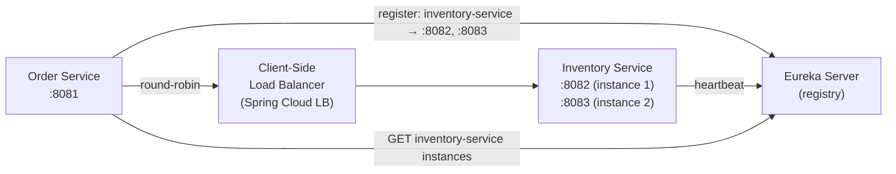

# Spring Cloud Service Discovery

[← Back to README](../README.md)

---

**Service discovery** lets microservices find each other by logical name instead of hardcoded host/port. A registry (Eureka, Consul) holds each service's current address. Clients query the registry and get a list of healthy instances to load-balance across.



---

## Option 1 — Eureka (Netflix)

### Eureka Server

```xml
<dependency>
    <groupId>org.springframework.cloud</groupId>
    <artifactId>spring-cloud-starter-netflix-eureka-server</artifactId>
</dependency>
```

```java
@SpringBootApplication
@EnableEurekaServer
public class EurekaServerApplication {
    public static void main(String[] args) {
        SpringApplication.run(EurekaServerApplication.class, args);
    }
}
```

```yaml
# application.yml — Eureka Server
server:
  port: 8761

eureka:
  instance:
    hostname: localhost
  client:
    register-with-eureka: false    # server doesn't register itself
    fetch-registry: false
  server:
    enable-self-preservation: false   # disable in dev
```

Dashboard available at `http://localhost:8761`.

### Eureka Client

```xml
<dependency>
    <groupId>org.springframework.cloud</groupId>
    <artifactId>spring-cloud-starter-netflix-eureka-client</artifactId>
</dependency>
```

```yaml
spring:
  application:
    name: inventory-service     # service name in registry

eureka:
  client:
    service-url:
      defaultZone: http://localhost:8761/eureka/
  instance:
    prefer-ip-address: true
    health-check-url-path: /actuator/health
    lease-renewal-interval-in-seconds: 10
    lease-expiration-duration-in-seconds: 30
```

```java
@SpringBootApplication
@EnableDiscoveryClient      // or omit — auto-detected from classpath
public class InventoryServiceApplication { ... }
```

---

## Option 2 — Consul

```xml
<dependency>
    <groupId>org.springframework.cloud</groupId>
    <artifactId>spring-cloud-starter-consul-discovery</artifactId>
</dependency>
```

```yaml
spring:
  application:
    name: inventory-service
  cloud:
    consul:
      host: localhost
      port: 8500
      discovery:
        health-check-path: /actuator/health
        health-check-interval: 10s
        register: true
```

```bash
# Start Consul in dev mode
docker run -d -p 8500:8500 consul:latest agent -dev -client=0.0.0.0
```

---

## Client-Side Load Balancing

`@LoadBalanced` makes `RestClient` / `WebClient` resolve `http://service-name` via the registry:

```xml
<dependency>
    <groupId>org.springframework.cloud</groupId>
    <artifactId>spring-cloud-starter-loadbalancer</artifactId>
</dependency>
```

```java
@Configuration
public class WebClientConfig {

    @Bean
    @LoadBalanced    // resolves service names via DiscoveryClient
    public WebClient.Builder webClientBuilder() {
        return WebClient.builder();
    }

    @Bean
    @LoadBalanced
    public RestClient.Builder restClientBuilder() {
        return RestClient.builder();
    }
}

@Service
@RequiredArgsConstructor
public class InventoryClient {

    private final WebClient.Builder webClientBuilder;

    public Mono<InventoryResponse> checkStock(UUID productId) {
        return webClientBuilder.build()
            .get()
            .uri("http://inventory-service/api/inventory/{id}", productId)
            //       ↑ logical name resolved by Spring Cloud LB
            .retrieve()
            .bodyToMono(InventoryResponse.class);
    }
}
```

---

## DiscoveryClient — Manual Instance Lookup

```java
@Service
@RequiredArgsConstructor
public class ServiceInfoService {

    private final DiscoveryClient discoveryClient;

    public List<String> getInventoryInstances() {
        return discoveryClient.getInstances("inventory-service")
            .stream()
            .map(instance -> instance.getUri().toString())
            .toList();
    }

    public List<String> getAllServices() {
        return discoveryClient.getServices();
    }
}
```

---

## Load Balancer Configuration

```java
// Custom load balancing algorithm
@Configuration
@LoadBalancerClient(name = "inventory-service",
                    configuration = InventoryLoadBalancerConfig.class)
public class LoadBalancerConfig {}

public class InventoryLoadBalancerConfig {

    @Bean
    public ReactorLoadBalancer<ServiceInstance> loadBalancer(
            Environment env,
            LoadBalancerClientFactory factory) {
        String name = env.getProperty(LoadBalancerClientFactory.PROPERTY_NAME);

        // Round-robin (default)
        return new RoundRobinLoadBalancer(
            factory.getLazyProvider(name, ServiceInstanceListSupplier.class), name);

        // Or: random
        // return new RandomLoadBalancer(
        //     factory.getLazyProvider(name, ServiceInstanceListSupplier.class), name);
    }
}
```

### Retry with Load Balancer

```yaml
spring:
  cloud:
    loadbalancer:
      retry:
        enabled: true
        max-retries-on-same-service-instance: 1
        max-retries-on-next-service-instance: 2
        retryable-status-codes: 500, 503
```

---

## Health Checks and Instance Metadata

```yaml
eureka:
  instance:
    metadata-map:
      version: "2.1.0"
      region: "us-east-1"
      zone: "us-east-1a"
    status-page-url-path: /actuator/info
    health-check-url-path: /actuator/health
```

```java
// Read instance metadata in a client
@Service
public class RegionAwareClient {

    @Autowired DiscoveryClient discoveryClient;

    public List<ServiceInstance> getInstancesInSameRegion(String service, String region) {
        return discoveryClient.getInstances(service).stream()
            .filter(i -> region.equals(i.getMetadata().get("region")))
            .toList();
    }
}
```

---

## Kubernetes — Built-in Service Discovery

In Kubernetes, service discovery works via DNS — no Eureka/Consul needed:

```yaml
# service.yaml
apiVersion: v1
kind: Service
metadata:
  name: inventory-service
spec:
  selector:
    app: inventory
  ports:
    - port: 8080
```

```java
// Call by DNS name — no @LoadBalanced needed in K8s
WebClient.create("http://inventory-service:8080")
    .get()
    .uri("/api/inventory/{id}", productId)
    .retrieve()
    .bodyToMono(InventoryResponse.class);
```

```xml
<!-- Spring Cloud Kubernetes — integrates DiscoveryClient with K8s -->
<dependency>
    <groupId>org.springframework.cloud</groupId>
    <artifactId>spring-cloud-starter-kubernetes-client-all</artifactId>
</dependency>
```

---

## Testing with Discovery

```java
@SpringBootTest
@ActiveProfiles("test")
class InventoryClientTest {

    // Disable Eureka in tests — use a fixed URL instead
    @DynamicPropertySource
    static void props(DynamicPropertyRegistry r) {
        r.add("eureka.client.enabled", () -> "false");
        r.add("spring.cloud.discovery.enabled", () -> "false");
    }

    // Use WireMock for the downstream service
    @RegisterExtension
    static WireMockExtension wireMock = WireMockExtension.newInstance()
        .options(WireMockConfiguration.wireMockConfig().dynamicPort())
        .build();

    @DynamicPropertySource
    static void wireMockProps(DynamicPropertyRegistry r) {
        r.add("inventory.service.url", wireMock::baseUrl);
    }
}
```

---

## Service Discovery Summary

| Concept | Detail |
|---------|--------|
| Eureka Server | `@EnableEurekaServer` — registry with built-in dashboard |
| Eureka Client | `@EnableDiscoveryClient` — registers on startup, sends heartbeats |
| Consul | Alternative registry — also handles config, health, and KV store |
| `@LoadBalanced` | Decorates `WebClient.Builder` / `RestClient.Builder` to resolve names |
| `DiscoveryClient` | Programmatic registry lookup — `getInstances("service-name")` |
| `spring.application.name` | The logical name services register under |
| Client-side LB | Spring Cloud LoadBalancer (replaces deprecated Ribbon) |
| K8s DNS | Kubernetes services are reachable by `<service-name>.<namespace>.svc.cluster.local` |
| Health check | Eureka deregisters instances that stop sending heartbeats |
| Metadata | Key-value pairs on instances for region/zone-aware routing |

---

[← Back to README](../README.md)
