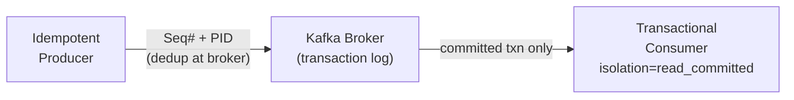

# Kafka Advanced

[← Back to README](../README.md)

---

Beyond basic producer/consumer patterns, Kafka provides **exactly-once semantics** via idempotent producers and transactional APIs, fine-grained **partition strategies** for throughput and ordering, and **consumer lag monitoring** for operational visibility. These features are essential for financial, inventory, and audit workloads where message loss or duplication is unacceptable.



---

## Delivery Guarantees

| Guarantee | Config | Risk |
|-----------|--------|------|
| At-most-once | `acks=0`, no retry | Message loss |
| At-least-once | `acks=all`, retries > 0 | Duplicate messages |
| Exactly-once | Idempotent + transactions | No loss, no duplicates |

---

## Idempotent Producer

Deduplicates retried messages at the broker using a Producer ID + sequence number per partition:

```yaml
spring:
  kafka:
    producer:
      acks: all                    # wait for all ISR replicas
      retries: 2147483647          # retry forever (bounded by delivery.timeout.ms)
      properties:
        "[enable.idempotence]": true          # auto-sets acks=all, retries=MAX
        "[max.in.flight.requests.per.connection]": 5   # max 5 with idempotence
        "[delivery.timeout.ms]": 120000       # 2 minutes total
```

---

## Kafka Transactions — Exactly-Once

Transactions span multiple produce operations (and read-process-write loops) atomically:

```java
@Configuration
public class KafkaConfig {

    @Bean
    public ProducerFactory<String, Object> producerFactory() {
        Map<String, Object> props = new HashMap<>();
        props.put(ProducerConfig.BOOTSTRAP_SERVERS_CONFIG, "localhost:9092");
        props.put(ProducerConfig.KEY_SERIALIZER_CLASS_CONFIG, StringSerializer.class);
        props.put(ProducerConfig.VALUE_SERIALIZER_CLASS_CONFIG, JsonSerializer.class);
        props.put(ProducerConfig.ENABLE_IDEMPOTENCE_CONFIG, true);
        props.put(ProducerConfig.TRANSACTIONAL_ID_CONFIG, "order-producer-1");  // unique per instance

        DefaultKafkaProducerFactory<String, Object> factory =
            new DefaultKafkaProducerFactory<>(props);
        factory.setTransactionIdPrefix("order-tx-");
        return factory;
    }

    @Bean
    public KafkaTransactionManager<String, Object> kafkaTransactionManager(
            ProducerFactory<String, Object> pf) {
        return new KafkaTransactionManager<>(pf);
    }
}
```

```java
@Service
@RequiredArgsConstructor
public class OrderEventService {

    private final KafkaTemplate<String, Object> kafka;

    // Exactly-once: all sends in this method are atomic
    @Transactional("kafkaTransactionManager")
    public void publishOrderEvents(Order order) {
        kafka.send("orders", order.getId().toString(),
            new OrderPlacedEvent(order));
        kafka.send("audit-log", order.getId().toString(),
            new AuditEvent("ORDER_PLACED", order.getId()));
        // If any send fails, both are rolled back at the broker
    }
}
```

---

## Read-Process-Write (Consume-Transform-Produce)

Exactly-once across consume + produce in a single atomic batch:

```java
@KafkaListener(topics = "raw-orders", containerFactory = "exactlyOnceFactory")
@Transactional("kafkaTransactionManager")
public void processOrder(ConsumerRecord<String, RawOrder> record) {
    Order order = transformAndValidate(record.value());
    orderRepo.save(order);   // DB write
    kafka.send("validated-orders", order.getId().toString(), order);
    // DB + Kafka send committed atomically via ChainedKafkaTransactionManager
}
```

```java
@Bean
public ChainedKafkaTransactionManager<String, Object> chainedTxManager(
        KafkaTransactionManager<String, Object> ktm,
        JpaTransactionManager jpaManager) {
    return new ChainedKafkaTransactionManager<>(ktm, jpaManager);
}
```

---

## Consumer Isolation Level

Consumers must use `read_committed` to see only committed transactional messages:

```yaml
spring:
  kafka:
    consumer:
      properties:
        "[isolation.level]": read_committed   # skip uncommitted/aborted messages
      auto-offset-reset: earliest
```

---

## Partition Strategies

### Default (Hash Partitioner)

Messages with the same key always go to the same partition — guarantees ordering per key:

```java
// Same customerId → same partition → ordered delivery
kafka.send("orders", customerId.toString(), event);
```

### Custom Partitioner

```java
public class PriorityPartitioner implements Partitioner {

    @Override
    public int partition(String topic, Object key, byte[] keyBytes,
                         Object value, byte[] valueBytes, Cluster cluster) {
        int numPartitions = cluster.partitionCountForTopic(topic);

        if (value instanceof OrderEvent e && e.isPriority()) {
            // Priority orders → partition 0
            return 0;
        }
        // Others → round-robin across remaining partitions
        return 1 + (Math.abs(key.hashCode()) % (numPartitions - 1));
    }

    @Override
    public void close() {}

    @Override
    public void configure(Map<String, ?> configs) {}
}
```

```yaml
spring:
  kafka:
    producer:
      properties:
        "[partitioner.class]": com.example.PriorityPartitioner
```

### Sticky Partitioner (reduce small batches)

```yaml
spring:
  kafka:
    producer:
      properties:
        "[partitioner.class]": org.apache.kafka.clients.producer.internals.DefaultPartitioner
        "[batch.size]": 65536          # 64KB batches
        "[linger.ms]": 5              # wait 5ms to fill batches
```

---

## Consumer Group Rebalancing

```java
@Component
@RequiredArgsConstructor
public class RebalanceListener implements ConsumerRebalanceListener {

    private final OffsetTracker offsetTracker;

    @Override
    public void onPartitionsRevoked(Collection<TopicPartition> partitions) {
        // Flush in-flight work before handing off partitions
        log.info("Partitions revoked: {}", partitions);
        offsetTracker.commitSync(partitions);
    }

    @Override
    public void onPartitionsAssigned(Collection<TopicPartition> partitions) {
        log.info("Partitions assigned: {}", partitions);
    }
}
```

### Cooperative Rebalancing (Incremental — fewer stops)

```yaml
spring:
  kafka:
    consumer:
      properties:
        "[partition.assignment.strategy]": >
          org.apache.kafka.clients.consumer.CooperativeStickyAssignor
```

---

## Consumer Lag Monitoring

Consumer lag = number of messages produced but not yet consumed. High lag = consumers falling behind.

```java
// Expose lag via Micrometer (auto with spring-kafka + micrometer)
// Metrics: kafka.consumer.fetch-latency-avg, kafka.consumer.records-lag-max
```

```promql
# Alert if any consumer group lags by more than 10 000 messages
kafka_consumer_group_lag{group="order-processor"} > 10000
```

```bash
# CLI tools
kafka-consumer-groups.sh --bootstrap-server localhost:9092 \
  --group order-processor --describe

# Output:
# GROUP          TOPIC   PARTITION  CURRENT-OFFSET  LOG-END-OFFSET  LAG
# order-processor orders  0          1234            1240            6
# order-processor orders  1          890             895             5
```

---

## Compacted Topics — Log Compaction

Kafka retains only the latest value per key — ideal for lookup tables / state snapshots:

```java
// Create a compacted topic
@Bean
public NewTopic customerSnapshotTopic() {
    return TopicBuilder.name("customer-snapshots")
        .partitions(6)
        .replicas(3)
        .config(TopicConfig.CLEANUP_POLICY_CONFIG,
                TopicConfig.CLEANUP_POLICY_COMPACT)
        .config(TopicConfig.MIN_CLEANABLE_DIRTY_RATIO_CONFIG, "0.01")
        .config(TopicConfig.SEGMENT_BYTES_CONFIG, String.valueOf(100 * 1024 * 1024))
        .build();
}

// Tombstone — null value deletes the key during compaction
kafka.send("customer-snapshots", customerId, null);
```

---

## Producer Tuning

```yaml
spring:
  kafka:
    producer:
      batch-size: 65536            # 64KB — larger batches = higher throughput
      buffer-memory: 33554432      # 32MB producer buffer
      compression-type: snappy     # lz4 / snappy / zstd
      properties:
        "[linger.ms]": 5           # wait to fill batches
        "[request.timeout.ms]": 30000
        "[max.block.ms]": 60000    # time to wait when buffer is full
```

---

## Consumer Tuning

```yaml
spring:
  kafka:
    consumer:
      max-poll-records: 500          # records per poll
      fetch-min-size: 1              # bytes (increase for throughput)
      fetch-max-wait: 500ms          # wait if fewer than fetch-min-size bytes available
      properties:
        "[max.poll.interval.ms]": 300000   # max processing time before rebalance
        "[session.timeout.ms]": 45000      # heartbeat timeout
        "[heartbeat.interval.ms]": 3000    # heartbeat frequency
```

---

## Kafka Advanced Summary

| Feature | Key Config | Detail |
|---------|-----------|--------|
| Idempotent producer | `enable.idempotence=true` | Deduplicates retried messages using PID + seq# |
| Transactional producer | `transactional.id` + `@Transactional` | Atomic multi-topic / multi-message sends |
| Read-committed consumer | `isolation.level=read_committed` | Skips aborted/uncommitted messages |
| Key-based partitioning | Same key → same partition | Guarantees per-key ordering |
| Cooperative rebalancing | `CooperativeStickyAssignor` | Incremental rebalance — avoids full stop-the-world |
| Consumer lag | `kafka.consumer.records-lag-max` | Key operational metric — alert on sustained lag |
| Log compaction | `cleanup.policy=compact` | Retains latest value per key — lookup table pattern |
| Batch tuning | `batch-size`, `linger.ms`, `compression-type` | Higher throughput at cost of latency |
| `ChainedKafkaTransactionManager` | DB + Kafka in one transaction | Coordinates JPA and Kafka transaction managers |

---

[← Back to README](../README.md)
