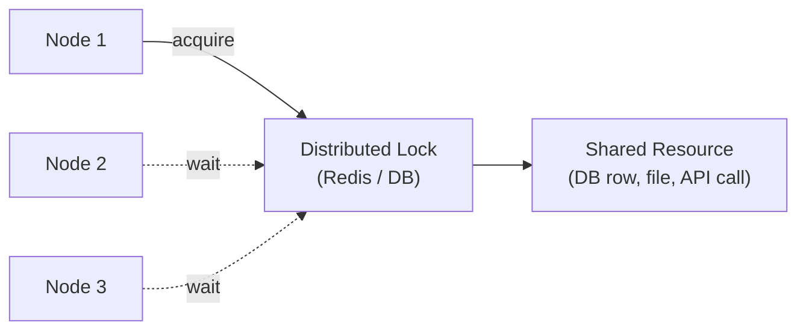

# Distributed Locking

[← Back to README](../README.md)

---

A **distributed lock** ensures that only one node in a cluster executes a critical section at a time — essential for scheduled jobs, inventory reservations, leader election, and any operation that must not run concurrently across multiple JVM instances.



---

## Redis — Redisson `RLock`

Redisson implements the Redlock algorithm and provides a `java.util.concurrent.locks.Lock`-compatible API.

```xml
<dependency>
    <groupId>org.redisson</groupId>
    <artifactId>redisson-spring-boot-starter</artifactId>
    <version>3.29.0</version>
</dependency>
```

```yaml
spring:
  data:
    redis:
      host: localhost
      port: 6379
```

```java
@Service
@RequiredArgsConstructor
public class InventoryService {

    private final RedissonClient redisson;
    private final InventoryRepository repo;

    public boolean reserve(UUID productId, int quantity) {
        RLock lock = redisson.getLock("inventory:" + productId);

        try {
            // Wait up to 3s to acquire, hold for up to 10s
            boolean acquired = lock.tryLock(3, 10, TimeUnit.SECONDS);
            if (!acquired) {
                throw new LockAcquisitionException("Could not lock inventory for " + productId);
            }

            return repo.findById(productId)
                .map(item -> {
                    if (item.getStock() < quantity) return false;
                    item.setStock(item.getStock() - quantity);
                    repo.save(item);
                    return true;
                })
                .orElse(false);

        } catch (InterruptedException e) {
            Thread.currentThread().interrupt();
            throw new LockAcquisitionException("Interrupted while acquiring lock", e);
        } finally {
            if (lock.isHeldByCurrentThread()) {
                lock.unlock();
            }
        }
    }
}
```

---

## Redis — SETNX (Manual Implementation)

For environments without Redisson — using Spring Data Redis directly:

```java
@Service
@RequiredArgsConstructor
public class RedisLockService {

    private final StringRedisTemplate redis;

    public <T> T withLock(String lockKey, Duration ttl, Supplier<T> action) {
        String lockValue = UUID.randomUUID().toString();   // unique per lock holder

        Boolean acquired = redis.opsForValue()
            .setIfAbsent(lockKey, lockValue, ttl);        // SET NX EX

        if (!Boolean.TRUE.equals(acquired)) {
            throw new LockAcquisitionException("Lock already held: " + lockKey);
        }

        try {
            return action.get();
        } finally {
            releaseLock(lockKey, lockValue);
        }
    }

    private void releaseLock(String key, String expectedValue) {
        // Lua script — atomic check-and-delete prevents releasing another holder's lock
        String script = """
            if redis.call('get', KEYS[1]) == ARGV[1] then
                return redis.call('del', KEYS[1])
            else
                return 0
            end
            """;
        redis.execute(new DefaultRedisScript<>(script, Long.class),
            List.of(key), expectedValue);
    }
}
```

---

## Redisson — Fair Lock and MultiLock

```java
// Fair lock — FIFO ordering for waiting threads
RLock fairLock = redisson.getFairLock("resource:fair");

// MultiLock — acquire multiple locks atomically (prevents deadlock)
RLock lock1 = redisson.getLock("resource:A");
RLock lock2 = redisson.getLock("resource:B");
RLock multiLock = redisson.getMultiLock(lock1, lock2);

multiLock.lock();
try {
    // both A and B are locked
} finally {
    multiLock.unlock();
}

// Read-write lock — multiple readers, exclusive writer
RReadWriteLock rwLock = redisson.getReadWriteLock("product:catalog");
rwLock.readLock().lock();    // multiple concurrent readers
rwLock.writeLock().lock();   // exclusive writer
```

---

## Database Advisory Locks (PostgreSQL)

PostgreSQL provides session-level and transaction-level advisory locks — no extra infrastructure needed.

```java
@Repository
@RequiredArgsConstructor
public class AdvisoryLockRepository {

    private final JdbcTemplate jdbc;

    // Session lock — held until explicitly released or connection closed
    public boolean tryAcquire(long lockId) {
        return Boolean.TRUE.equals(
            jdbc.queryForObject(
                "SELECT pg_try_advisory_lock(?)", Boolean.class, lockId));
    }

    public void release(long lockId) {
        jdbc.execute("SELECT pg_advisory_unlock(" + lockId + ")");
    }

    // Transaction lock — auto-released on commit/rollback
    @Transactional
    public boolean tryAcquireTransactional(long lockId) {
        return Boolean.TRUE.equals(
            jdbc.queryForObject(
                "SELECT pg_try_advisory_xact_lock(?)", Boolean.class, lockId));
    }
}
```

```java
@Service
@RequiredArgsConstructor
public class JobLockService {

    private final AdvisoryLockRepository lockRepo;

    private static final long NIGHTLY_IMPORT_LOCK = 12345L;

    @Scheduled(cron = "0 0 2 * * *")
    public void runNightlyImport() {
        if (!lockRepo.tryAcquire(NIGHTLY_IMPORT_LOCK)) {
            log.info("Nightly import already running on another node — skipping");
            return;
        }
        try {
            doImport();
        } finally {
            lockRepo.release(NIGHTLY_IMPORT_LOCK);
        }
    }
}
```

---

## Database Row-Level Locking

```java
// Pessimistic lock on a row for the duration of a transaction
@Transactional
public void deductBalance(UUID accountId, BigDecimal amount) {
    Account account = accountRepo.findById(accountId)
        .map(a -> accountRepo.findByIdWithLock(accountId))   // SELECT FOR UPDATE
        .orElseThrow();

    if (account.getBalance().compareTo(amount) < 0)
        throw new InsufficientFundsException();

    account.setBalance(account.getBalance().subtract(amount));
    accountRepo.save(account);
}
```

```java
public interface AccountRepository extends JpaRepository<Account, UUID> {

    @Lock(LockModeType.PESSIMISTIC_WRITE)
    @Query("SELECT a FROM Account a WHERE a.id = :id")
    Optional<Account> findByIdWithLock(@Param("id") UUID id);
}
```

---

## Fencing Tokens

A fencing token prevents a lock holder that resumes after a pause from overwriting work done by a newer lock holder:

```java
public record LockToken(String lockId, long fencingToken) {}

@Service
public class FencedLockService {

    private final RedissonClient redisson;

    public LockToken acquire(String resource) {
        RLock lock = redisson.getLock(resource);
        long token = System.currentTimeMillis();   // monotonically increasing
        lock.lock(30, TimeUnit.SECONDS);
        return new LockToken(resource, token);
    }

    // Storage layer rejects writes with outdated tokens
    public void writeWithFencing(LockToken token, Data data) {
        jdbc.update("""
            UPDATE resources
            SET    data = ?, last_token = ?
            WHERE  id = ? AND last_token < ?
            """, data.serialize(), token.fencingToken(),
                 token.lockId(), token.fencingToken());
        // 0 rows updated → token is stale → reject
    }
}
```

---

## Spring Integration — `LockRegistry`

Spring Integration provides a `LockRegistry` abstraction with Redis and JDBC implementations:

```xml
<dependency>
    <groupId>org.springframework.integration</groupId>
    <artifactId>spring-integration-redis</artifactId>
</dependency>
```

```java
@Bean
public RedisLockRegistry redisLockRegistry(RedisConnectionFactory factory) {
    return new RedisLockRegistry(factory, "app-locks", 30_000);  // TTL 30s
}

@Service
@RequiredArgsConstructor
public class ScheduledJobService {

    private final LockRegistry lockRegistry;

    @Scheduled(fixedDelay = 60_000)
    public void runOnlyOnce() throws InterruptedException {
        Lock lock = lockRegistry.obtain("job:nightly-report");
        if (lock.tryLock(1, TimeUnit.SECONDS)) {
            try {
                generateReport();
            } finally {
                lock.unlock();
            }
        }
    }
}
```

---

## ShedLock — Distributed Scheduled Jobs

ShedLock ensures a Spring `@Scheduled` method runs on only one node at a time:

```xml
<dependency>
    <groupId>net.javacrumbs.shedlock</groupId>
    <artifactId>shedlock-spring</artifactId>
    <version>5.13.0</version>
</dependency>
<dependency>
    <groupId>net.javacrumbs.shedlock</groupId>
    <artifactId>shedlock-provider-redis-spring</artifactId>
    <version>5.13.0</version>
</dependency>
```

```java
@SpringBootApplication
@EnableScheduling
@EnableSchedulerLock(defaultLockAtMostFor = "PT10M")
public class Application {}

@Bean
public LockProvider lockProvider(RedisConnectionFactory factory) {
    return new RedisLockProvider(factory);
}
```

```java
@Component
public class ReportJob {

    @Scheduled(cron = "0 0 3 * * *")
    @SchedulerLock(name = "nightly-report",
                   lockAtLeastFor = "PT5M",    // hold lock for 5 min minimum
                   lockAtMostFor = "PT30M")    // release after 30 min max (failsafe)
    public void generateReport() {
        // Runs on exactly one node per cron tick
    }
}
```

---

## Distributed Locking Summary

| Approach | Best For | Pros | Cons |
|----------|---------|------|------|
| Redisson `RLock` | Redis-based; Redlock algorithm | Fencing, multilock, fair queue | Requires Redis |
| Redis `SETNX` + Lua | Lightweight custom lock | No extra library | Manual release; limited features |
| PostgreSQL advisory lock | No extra infra; same DB as app | ACID guarantees | DB-specific; session-scoped |
| JPA `PESSIMISTIC_WRITE` | Single-row critical sections | Simple; transactional | Holds DB connection; doesn't scale to cross-service |
| `LockRegistry` (Spring Integration) | Pluggable; Redis or JDBC | Abstracts provider | Spring Integration dependency |
| ShedLock | Distributed `@Scheduled` jobs | Simple annotation; Redis/JDBC/Mongo | Scheduled tasks only |
| Fencing token | Protect against split-brain pauses | Storage-layer enforcement | Requires storage cooperation |

---

[← Back to README](../README.md)
