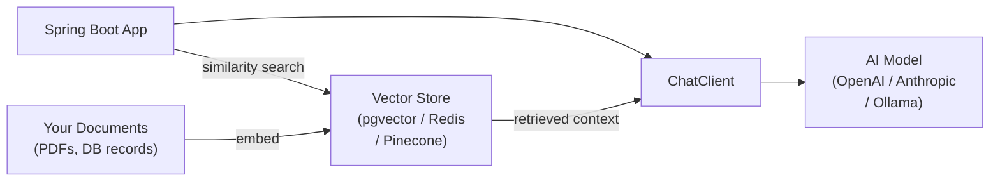

# Spring AI

[← Back to README](../README.md)

---

**Spring AI** brings generative AI integration to Spring Boot applications. It provides a portable `ChatClient` abstraction over OpenAI, Anthropic, Google Gemini, Ollama, and others, along with tools for prompt templates, structured output, function calling, vector stores, and Retrieval-Augmented Generation (RAG).



---

## Dependencies

```xml
<dependencyManagement>
    <dependencies>
        <dependency>
            <groupId>org.springframework.ai</groupId>
            <artifactId>spring-ai-bom</artifactId>
            <version>1.0.0</version>
            <type>pom</type>
            <scope>import</scope>
        </dependency>
    </dependencies>
</dependencyManagement>

<!-- OpenAI -->
<dependency>
    <groupId>org.springframework.ai</groupId>
    <artifactId>spring-ai-starter-model-openai</artifactId>
</dependency>

<!-- Anthropic (Claude) -->
<dependency>
    <groupId>org.springframework.ai</groupId>
    <artifactId>spring-ai-starter-model-anthropic</artifactId>
</dependency>

<!-- Ollama (local models) -->
<dependency>
    <groupId>org.springframework.ai</groupId>
    <artifactId>spring-ai-starter-model-ollama</artifactId>
</dependency>
```

```yaml
spring:
  ai:
    openai:
      api-key: ${OPENAI_API_KEY}
      chat:
        options:
          model: gpt-4o
          temperature: 0.7
          max-tokens: 2048
```

---

## ChatClient — Basic Usage

```java
@RestController
@RequiredArgsConstructor
public class ChatController {

    private final ChatClient chatClient;

    // Simple string response
    @PostMapping("/api/chat")
    public String chat(@RequestBody String userMessage) {
        return chatClient.prompt()
            .user(userMessage)
            .call()
            .content();
    }

    // With system prompt
    @PostMapping("/api/support")
    public String support(@RequestBody String question) {
        return chatClient.prompt()
            .system("You are a helpful customer support agent for an e-commerce platform. " +
                    "Be concise, friendly, and focus on resolving issues.")
            .user(question)
            .call()
            .content();
    }
}
```

```java
// Configure ChatClient as a bean
@Configuration
public class AiConfig {

    @Bean
    public ChatClient chatClient(ChatClient.Builder builder) {
        return builder
            .defaultSystem("You are a helpful assistant for our Java course platform.")
            .defaultOptions(OpenAiChatOptions.builder()
                .model("gpt-4o-mini")
                .temperature(0.3f)
                .build())
            .build();
    }
}
```

---

## Prompt Templates

```java
@Service
@RequiredArgsConstructor
public class EmailDraftService {

    private final ChatClient chatClient;

    public String draftReply(String customerEmail, String context) {
        return chatClient.prompt()
            .system("""
                You are a customer service agent. Draft professional, empathetic email replies.
                Always sign off as "The Support Team".
                """)
            .user(u -> u.text("""
                Customer email:
                {email}
                
                Context about their order:
                {context}
                
                Draft a helpful reply.
                """)
                .param("email", customerEmail)
                .param("context", context))
            .call()
            .content();
    }
}
```

---

## Structured Output

Map AI responses directly to Java records/classes:

```java
public record ProductRecommendation(
    String productName,
    String reason,
    double confidenceScore,
    List<String> tags
) {}

public record RecommendationList(List<ProductRecommendation> recommendations) {}

@Service
@RequiredArgsConstructor
public class RecommendationService {

    private final ChatClient chatClient;

    public RecommendationList recommend(String customerProfile) {
        return chatClient.prompt()
            .user("""
                Based on this customer profile, recommend 3 products:
                {profile}
                """)
            .user(u -> u.param("profile", customerProfile))
            .call()
            .entity(RecommendationList.class);   // auto-parsed from JSON
    }
}
```

---

## Streaming Responses

```java
@GetMapping(value = "/api/chat/stream", produces = MediaType.TEXT_EVENT_STREAM_VALUE)
public Flux<String> streamChat(@RequestParam String message) {
    return chatClient.prompt()
        .user(message)
        .stream()
        .content();   // Flux<String> — each chunk as it arrives
}
```

---

## Function Calling (Tool Use)

Allow the model to call application functions:

```java
@Component
public class OrderTools {

    @Tool(description = "Get the current status and details of an order by order ID")
    public OrderDetails getOrderStatus(
            @ToolParam(description = "The order UUID") String orderId) {
        return orderService.findById(UUID.fromString(orderId))
            .map(o -> new OrderDetails(o.getId(), o.getStatus(), o.getTotal()))
            .orElseThrow();
    }

    @Tool(description = "Cancel an order. Returns true if successfully cancelled.")
    public boolean cancelOrder(
            @ToolParam(description = "The order UUID to cancel") String orderId) {
        return orderService.cancel(UUID.fromString(orderId));
    }
}

// Wire tools into the chat client
@PostMapping("/api/agent")
public String agentChat(@RequestBody String message) {
    return chatClient.prompt()
        .user(message)
        .tools(orderTools)      // model can call getOrderStatus, cancelOrder
        .call()
        .content();
}
```

---

## Embeddings — Turning Text into Vectors

```java
@Service
@RequiredArgsConstructor
public class EmbeddingService {

    private final EmbeddingModel embeddingModel;

    public float[] embed(String text) {
        EmbeddingResponse response = embeddingModel.embedForResponse(List.of(text));
        return response.getResults().get(0).getOutput();
    }

    public double cosineSimilarity(float[] a, float[] b) {
        // Compute dot product / (|a| * |b|)
        double dot = 0, normA = 0, normB = 0;
        for (int i = 0; i < a.length; i++) {
            dot   += a[i] * b[i];
            normA += a[i] * a[i];
            normB += b[i] * b[i];
        }
        return dot / (Math.sqrt(normA) * Math.sqrt(normB));
    }
}
```

---

## RAG — Retrieval-Augmented Generation

RAG grounds AI responses in your own data by retrieving relevant documents and injecting them into the prompt.

```xml
<!-- pgvector vector store -->
<dependency>
    <groupId>org.springframework.ai</groupId>
    <artifactId>spring-ai-pgvector-store-spring-boot-starter</artifactId>
</dependency>
```

```yaml
spring:
  ai:
    vectorstore:
      pgvector:
        index-type: HNSW
        distance-type: COSINE_DISTANCE
        dimensions: 1536    # OpenAI text-embedding-3-small
```

### Ingesting Documents

```java
@Service
@RequiredArgsConstructor
public class DocumentIngestionService {

    private final VectorStore vectorStore;
    private final DocumentReader pdfReader;

    public void ingestPdf(Resource pdf) {
        List<Document> docs = new PagePdfDocumentReader(pdf)
            .get();

        // Chunk large documents
        List<Document> chunks = new TokenTextSplitter()
            .apply(docs);

        // Embed and store
        vectorStore.add(chunks);
    }

    public void ingestFaqEntry(String question, String answer) {
        Document doc = new Document(
            "Q: " + question + "\nA: " + answer,
            Map.of("source", "faq", "question", question));
        vectorStore.add(List.of(doc));
    }
}
```

### Querying with RAG

```java
@Service
@RequiredArgsConstructor
public class RagService {

    private final ChatClient chatClient;
    private final VectorStore vectorStore;

    public String answerWithContext(String question) {
        // 1. Retrieve relevant documents
        List<Document> context = vectorStore.similaritySearch(
            SearchRequest.query(question).withTopK(5));

        // 2. Build context string
        String contextText = context.stream()
            .map(Document::getContent)
            .collect(Collectors.joining("\n---\n"));

        // 3. Inject into prompt
        return chatClient.prompt()
            .system("""
                Answer questions using only the provided context.
                If the answer is not in the context, say so.
                """)
            .user(u -> u.text("""
                Context:
                {context}
                
                Question: {question}
                """)
                .param("context", contextText)
                .param("question", question))
            .call()
            .content();
    }
}
```

---

## Advisors — Cross-Cutting AI Concerns

```java
@Configuration
public class AiConfig {

    @Bean
    public ChatClient chatClient(ChatClient.Builder builder,
                                  VectorStore vectorStore,
                                  ChatMemory chatMemory) {
        return builder
            // RAG — automatically retrieves and injects context
            .defaultAdvisors(new QuestionAnswerAdvisor(vectorStore,
                SearchRequest.defaults().withTopK(4)))

            // Chat memory — maintains conversation history
            .defaultAdvisors(new MessageChatMemoryAdvisor(chatMemory))

            // Logging — logs prompts and responses
            .defaultAdvisors(new SimpleLoggerAdvisor())

            .build();
    }

    @Bean
    public ChatMemory chatMemory() {
        return new InMemoryChatMemory();   // or Redis, DB-backed
    }
}
```

---

## Testing

```java
@SpringBootTest
class ChatServiceTest {

    @MockBean ChatModel chatModel;
    @Autowired ChatClient chatClient;

    @Test
    void returnsExpectedContent() {
        when(chatModel.call(any(Prompt.class)))
            .thenReturn(new ChatResponse(List.of(
                new Generation(new AssistantMessage("Order confirmed")))));

        String result = chatClient.prompt()
            .user("What is the status of order 123?")
            .call()
            .content();

        assertThat(result).isEqualTo("Order confirmed");
    }
}
```

---

## Spring AI Summary

| Concept | Detail |
|---------|--------|
| `ChatClient` | Portable abstraction over OpenAI, Anthropic, Gemini, Ollama |
| `.call().content()` | Blocking call — returns response as `String` |
| `.stream().content()` | Streaming — returns `Flux<String>` |
| `.call().entity(Class<T>)` | Structured output — parses response into Java object |
| Prompt templates | `.user(u -> u.text("...").param("key", value))` |
| `@Tool` | Expose application methods as callable tools to the model |
| `EmbeddingModel` | Convert text to vector representation |
| `VectorStore` | Store and similarity-search embeddings (pgvector, Redis, Pinecone) |
| RAG | `QuestionAnswerAdvisor` — auto-retrieves context from vector store |
| `MessageChatMemoryAdvisor` | Maintains multi-turn conversation history |
| `SimpleLoggerAdvisor` | Logs prompts and responses for debugging |

---

[← Back to README](../README.md)
