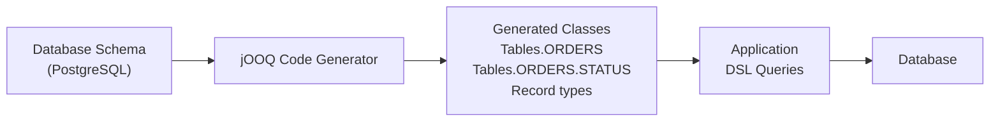

# jOOQ — Type-Safe SQL

[← Back to README](../README.md)

---

**jOOQ** (Java Object Oriented Querying) generates Java classes from your database schema and lets you write SQL as a type-safe DSL. Unlike JPQL or Criteria API, jOOQ is SQL-first: the generated code matches your actual schema, column renames break at compile time, and you get full access to database-specific SQL features.



---

## Dependencies

```xml
<dependency>
    <groupId>org.springframework.boot</groupId>
    <artifactId>spring-boot-starter-jooq</artifactId>
</dependency>
<dependency>
    <groupId>org.postgresql</groupId>
    <artifactId>postgresql</artifactId>
    <scope>runtime</scope>
</dependency>

<!-- Code generator plugin -->
<plugin>
    <groupId>org.jooq</groupId>
    <artifactId>jooq-codegen-maven</artifactId>
    <version>3.19.9</version>
    <configuration>
        <jdbc>
            <driver>org.postgresql.Driver</driver>
            <url>jdbc:postgresql://localhost:5432/orders</url>
            <user>app</user>
            <password>secret</password>
        </jdbc>
        <generator>
            <database>
                <name>org.jooq.meta.postgres.PostgresDatabase</name>
                <includes>.*</includes>
                <inputSchema>public</inputSchema>
            </database>
            <target>
                <packageName>com.example.jooq</packageName>
                <directory>target/generated-sources/jooq</directory>
            </target>
        </generator>
    </configuration>
</plugin>
```

---

## Configuration

```yaml
spring:
  datasource:
    url: jdbc:postgresql://localhost:5432/orders
    username: app
    password: ${DB_PASSWORD}
  jooq:
    sql-dialect: postgres
```

Spring Boot auto-creates a `DSLContext` bean wired to the configured `DataSource`.

---

## Basic CRUD

```java
@Repository
@RequiredArgsConstructor
public class OrderRepository {

    private final DSLContext dsl;

    // SELECT
    public List<OrderRecord> findAll() {
        return dsl.selectFrom(ORDERS).fetchInto(OrderRecord.class);
    }

    public Optional<OrderRecord> findById(UUID id) {
        return dsl.selectFrom(ORDERS)
            .where(ORDERS.ID.eq(id))
            .fetchOptionalInto(OrderRecord.class);
    }

    // INSERT
    public OrderRecord create(UUID customerId, BigDecimal total) {
        return dsl.insertInto(ORDERS)
            .set(ORDERS.ID, UUID.randomUUID())
            .set(ORDERS.CUSTOMER_ID, customerId)
            .set(ORDERS.STATUS, "PENDING")
            .set(ORDERS.TOTAL, total)
            .set(ORDERS.CREATED_AT, OffsetDateTime.now())
            .returning()
            .fetchOne();
    }

    // UPDATE
    public int updateStatus(UUID id, String newStatus) {
        return dsl.update(ORDERS)
            .set(ORDERS.STATUS, newStatus)
            .where(ORDERS.ID.eq(id))
            .execute();
    }

    // DELETE
    public int delete(UUID id) {
        return dsl.deleteFrom(ORDERS)
            .where(ORDERS.ID.eq(id))
            .execute();
    }
}
```

---

## Joins and Projections

```java
// JOIN — compile-time safe column references
public List<OrderWithCustomer> findConfirmedWithCustomer() {
    return dsl.select(
                ORDERS.ID,
                ORDERS.TOTAL,
                ORDERS.STATUS,
                CUSTOMERS.NAME.as("customerName"),
                CUSTOMERS.EMAIL)
            .from(ORDERS)
            .join(CUSTOMERS).on(ORDERS.CUSTOMER_ID.eq(CUSTOMERS.ID))
            .where(ORDERS.STATUS.eq("CONFIRMED"))
            .orderBy(ORDERS.CREATED_AT.desc())
            .fetchInto(OrderWithCustomer.class);  // maps by name matching
}

record OrderWithCustomer(UUID id, BigDecimal total, String status,
                          String customerName, String email) {}
```

---

## Dynamic Queries

```java
public List<OrderRecord> search(OrderFilter filter) {
    List<Condition> conditions = new ArrayList<>();

    if (filter.status() != null)
        conditions.add(ORDERS.STATUS.eq(filter.status()));

    if (filter.customerId() != null)
        conditions.add(ORDERS.CUSTOMER_ID.eq(filter.customerId()));

    if (filter.minTotal() != null)
        conditions.add(ORDERS.TOTAL.ge(filter.minTotal()));

    if (filter.createdAfter() != null)
        conditions.add(ORDERS.CREATED_AT.ge(filter.createdAfter().atOffset(ZoneOffset.UTC)));

    return dsl.selectFrom(ORDERS)
        .where(DSL.and(conditions))         // empty list = no WHERE clause
        .orderBy(ORDERS.CREATED_AT.desc())
        .fetchInto(OrderRecord.class);
}
```

---

## Aggregations

```java
public List<StatusSummary> summaryByStatus() {
    return dsl.select(
                ORDERS.STATUS,
                DSL.count().as("orderCount"),
                DSL.sum(ORDERS.TOTAL).as("revenue"),
                DSL.avg(ORDERS.TOTAL).as("avgTotal"))
            .from(ORDERS)
            .groupBy(ORDERS.STATUS)
            .having(DSL.count().gt(0))
            .orderBy(DSL.sum(ORDERS.TOTAL).desc())
            .fetchInto(StatusSummary.class);
}

record StatusSummary(String status, int orderCount,
                      BigDecimal revenue, BigDecimal avgTotal) {}
```

---

## Window Functions

```java
public List<OrderRanked> rankOrdersByCustomer() {
    var rank = DSL.rank()
        .over(DSL.partitionBy(ORDERS.CUSTOMER_ID)
                 .orderBy(ORDERS.TOTAL.desc()));

    return dsl.select(
                ORDERS.ID,
                ORDERS.CUSTOMER_ID,
                ORDERS.TOTAL,
                rank.as("rank"))
            .from(ORDERS)
            .fetchInto(OrderRanked.class);
}

// Top-N per group using window function
public List<OrderRecord> topOrdersPerCustomer(int n) {
    var ranked = dsl.select(
                    ORDERS.asterisk(),
                    DSL.rowNumber()
                       .over(DSL.partitionBy(ORDERS.CUSTOMER_ID)
                                .orderBy(ORDERS.TOTAL.desc()))
                       .as("rn"))
                .from(ORDERS)
                .asTable("ranked");

    return dsl.selectFrom(ranked)
        .where(ranked.field("rn", Integer.class).le(n))
        .fetchInto(OrderRecord.class);
}
```

---

## CTEs (Common Table Expressions)

```java
public List<TopCustomer> topCustomersByRevenue(int limit) {
    var customerRevenue = DSL.name("customer_revenue").as(
        dsl.select(
                ORDERS.CUSTOMER_ID,
                DSL.sum(ORDERS.TOTAL).as("total_revenue"),
                DSL.count().as("order_count"))
            .from(ORDERS)
            .where(ORDERS.STATUS.eq("CONFIRMED"))
            .groupBy(ORDERS.CUSTOMER_ID));

    return dsl.with(customerRevenue)
        .select(
            CUSTOMERS.NAME,
            CUSTOMERS.EMAIL,
            customerRevenue.field("total_revenue", BigDecimal.class),
            customerRevenue.field("order_count", Integer.class))
        .from(customerRevenue)
        .join(CUSTOMERS)
            .on(CUSTOMERS.ID.eq(customerRevenue.field(ORDERS.CUSTOMER_ID)))
        .orderBy(customerRevenue.field("total_revenue", BigDecimal.class).desc())
        .limit(limit)
        .fetchInto(TopCustomer.class);
}
```

---

## Transactions

```java
@Service
@RequiredArgsConstructor
public class OrderService {

    private final DSLContext dsl;

    // Spring @Transactional works with jOOQ
    @Transactional
    public Order placeOrder(PlaceOrderCommand cmd) {
        OrderRecord order = dsl.insertInto(ORDERS)
            .set(ORDERS.ID, UUID.randomUUID())
            .set(ORDERS.CUSTOMER_ID, cmd.customerId())
            .set(ORDERS.STATUS, "PENDING")
            .set(ORDERS.TOTAL, cmd.total())
            .returning()
            .fetchOne();

        for (var line : cmd.lines()) {
            dsl.insertInto(ORDER_LINES)
                .set(ORDER_LINES.ORDER_ID, order.getId())
                .set(ORDER_LINES.PRODUCT_ID, line.productId())
                .set(ORDER_LINES.QUANTITY, line.quantity())
                .set(ORDER_LINES.UNIT_PRICE, line.unitPrice())
                .execute();
        }

        return mapToOrder(order);
    }

    // Programmatic transaction
    public void transferStock(UUID from, UUID to, int qty) {
        dsl.transaction(config -> {
            DSLContext tx = DSL.using(config);
            tx.update(PRODUCTS).set(PRODUCTS.STOCK, PRODUCTS.STOCK.minus(qty))
                .where(PRODUCTS.ID.eq(from)).execute();
            tx.update(PRODUCTS).set(PRODUCTS.STOCK, PRODUCTS.STOCK.plus(qty))
                .where(PRODUCTS.ID.eq(to)).execute();
        });
    }
}
```

---

## Batch Operations

```java
// Batch insert
dsl.batch(
    cmd.lines().stream()
        .map(line -> dsl.insertInto(ORDER_LINES)
            .set(ORDER_LINES.ORDER_ID, orderId)
            .set(ORDER_LINES.PRODUCT_ID, line.productId())
            .set(ORDER_LINES.QUANTITY, line.quantity())
            .set(ORDER_LINES.UNIT_PRICE, line.unitPrice()))
        .toArray(Query[]::new)
).execute();

// Bulk update
dsl.batch(
    orderIds.stream()
        .map(id -> dsl.update(ORDERS)
            .set(ORDERS.STATUS, "SHIPPED")
            .where(ORDERS.ID.eq(id)))
        .toArray(Query[]::new)
).execute();
```

---

## Testing with jOOQ

```java
@SpringBootTest
@Testcontainers
class OrderRepositoryTest {

    @Container
    static PostgreSQLContainer<?> pg = new PostgreSQLContainer<>("postgres:16");

    @DynamicPropertySource
    static void props(DynamicPropertyRegistry r) {
        r.add("spring.datasource.url", pg::getJdbcUrl);
        r.add("spring.datasource.username", pg::getUsername);
        r.add("spring.datasource.password", pg::getPassword);
    }

    @Autowired OrderRepository repo;
    @Autowired DSLContext dsl;

    @Test
    @Transactional
    void createAndFindOrder() {
        OrderRecord order = repo.create(UUID.randomUUID(), new BigDecimal("49.99"));
        assertThat(order.getStatus()).isEqualTo("PENDING");

        Optional<OrderRecord> found = repo.findById(order.getId());
        assertThat(found).isPresent();
        assertThat(found.get().getTotal()).isEqualByComparingTo("49.99");
    }
}
```

---

## jOOQ Summary

| Concept | Detail |
|---------|--------|
| Code generation | Schema → Java classes at build time; column renames break compilation |
| `DSLContext` | Central entry point — `dsl.selectFrom(TABLE).where(...)` |
| `ORDERS.STATUS.eq("CONFIRMED")` | Type-safe condition — column type enforced at compile time |
| `DSL.and(conditions)` | Compose conditions dynamically — empty list = always true |
| `.fetchInto(Class<T>)` | Map result to a POJO or record by column name |
| `.returning()` | Return inserted/updated row — avoids a second SELECT |
| `DSL.name("alias").as(query)` | Named CTE (`WITH` clause) |
| `DSL.rowNumber().over(...)` | Window functions with partition/order |
| `dsl.transaction(config -> ...)` | Programmatic transaction with nested `DSLContext` |
| `dsl.batch(queries).execute()` | Batched inserts/updates in one round-trip |

---

[← Back to README](../README.md)
