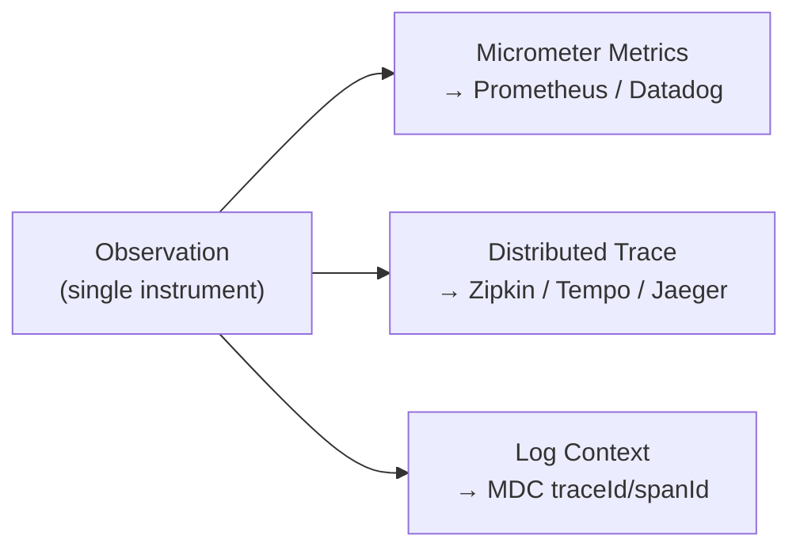
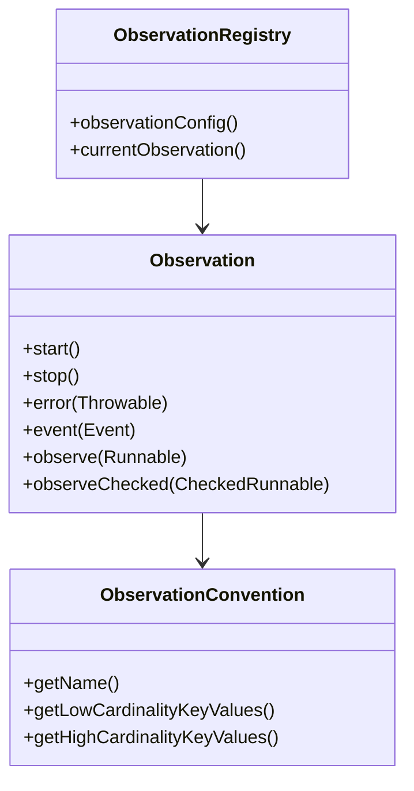

# Micrometer Observation API

[← Back to README](../README.md)

---

The **Micrometer Observation API** (introduced in Micrometer 1.10 / Spring Boot 3.0) unifies metrics, tracing, and logging under a single `Observation`. Instead of separately instrumenting for Prometheus metrics and OpenTelemetry spans, one `Observation` produces all three signals automatically.



---

## Core Concepts



---

## Basic Usage

```java
@Service
@RequiredArgsConstructor
public class OrderService {

    private final ObservationRegistry registry;
    private final OrderRepository orderRepo;

    public Order placeOrder(PlaceOrderCommand cmd) {
        return Observation.createNotStarted("order.place", registry)
            .lowCardinalityKeyValue("payment.method", cmd.paymentMethod())
            .highCardinalityKeyValue("customer.id", cmd.customerId().toString())
            .observe(() -> {
                Order order = orderRepo.save(Order.create(cmd));
                return order;
            });
    }

    // With manual start/stop for finer control
    public Order confirmOrder(UUID orderId) {
        Observation obs = Observation.createNotStarted("order.confirm", registry)
            .lowCardinalityKeyValue("order.status", "CONFIRMED")
            .start();
        try {
            Order order = orderRepo.findById(orderId).orElseThrow();
            order.confirm();
            Order saved = orderRepo.save(order);
            obs.event(Observation.Event.of("order.confirmed"));
            return saved;
        } catch (Exception e) {
            obs.error(e);
            throw e;
        } finally {
            obs.stop();
        }
    }
}
```

---

## Key Values — Low vs High Cardinality

| | Low Cardinality | High Cardinality |
|---|---|---|
| Examples | `status=CONFIRMED`, `region=us-east` | `order.id=uuid`, `customer.id=uuid` |
| Used for | Metric labels (low number of distinct values) | Trace span attributes only |
| Risk | None | Metric cardinality explosion if used as labels |

```java
Observation.createNotStarted("payment.charge", registry)
    .lowCardinalityKeyValue("payment.gateway", "stripe")   // metric tag
    .lowCardinalityKeyValue("payment.method", "card")      // metric tag
    .highCardinalityKeyValue("order.id", orderId.toString()) // span attribute only
    .observe(() -> gateway.charge(orderId, amount));
```

---

## ObservationConvention — Reusable Naming

Define the observation's name and key values once, reuse across the codebase:

```java
public class OrderPlacementObservationContext extends Observation.Context {
    private final PlaceOrderCommand command;

    public OrderPlacementObservationContext(PlaceOrderCommand command) {
        this.command = command;
    }

    public PlaceOrderCommand getCommand() { return command; }
}

public class OrderPlacementConvention
        implements ObservationConvention<OrderPlacementObservationContext> {

    @Override
    public String getName() { return "order.placement"; }

    @Override
    public String getContextualName(OrderPlacementObservationContext ctx) {
        return "place order";   // shown in trace UI
    }

    @Override
    public KeyValues getLowCardinalityKeyValues(OrderPlacementObservationContext ctx) {
        return KeyValues.of(
            "payment.method", ctx.getCommand().paymentMethod(),
            "order.source",   ctx.getCommand().source());
    }

    @Override
    public KeyValues getHighCardinalityKeyValues(OrderPlacementObservationContext ctx) {
        return KeyValues.of(
            "customer.id", ctx.getCommand().customerId().toString());
    }

    @Override
    public boolean supportsContext(Observation.Context ctx) {
        return ctx instanceof OrderPlacementObservationContext;
    }
}
```

```java
// Usage
OrderPlacementObservationContext ctx = new OrderPlacementObservationContext(cmd);
return Observation.createNotStarted(new OrderPlacementConvention(),
                                     () -> ctx, registry)
    .observe(() -> orderRepo.save(Order.create(cmd)));
```

---

## @Observed — Declarative Observation

Spring Boot 3.2+ supports `@Observed` as an aspect that wraps a method with an observation:

```xml
<dependency>
    <groupId>org.springframework.boot</groupId>
    <artifactId>spring-boot-starter-aop</artifactId>
</dependency>
```

```java
@Configuration
public class ObservationConfig {

    @Bean
    ObservedAspect observedAspect(ObservationRegistry registry) {
        return new ObservedAspect(registry);
    }
}

@Service
public class OrderService {

    @Observed(name = "order.placement",
              contextualName = "place order",
              lowCardinalityKeyValues = {"layer", "service"})
    public Order placeOrder(PlaceOrderCommand cmd) {
        return orderRepo.save(Order.create(cmd));
    }
}
```

---

## ObservationHandler — Custom Behaviour per Signal

`ObservationHandler` lets you hook into the observation lifecycle — log at start/stop, record metrics, etc.:

```java
@Component
public class OrderObservationHandler
        implements ObservationHandler<Observation.Context> {

    @Override
    public void onStart(Observation.Context ctx) {
        log.debug("Observation started: {}", ctx.getName());
    }

    @Override
    public void onStop(Observation.Context ctx) {
        log.debug("Observation stopped: {} in {}ms",
            ctx.getName(),
            ctx.get(ObservationKeyValues.LATENCY_MS_KEY));
    }

    @Override
    public void onError(Observation.Context ctx) {
        log.error("Observation error: {} — {}",
            ctx.getName(), ctx.getError().getMessage());
    }

    @Override
    public boolean supportsContext(Observation.Context ctx) {
        return true;   // handle all observations
    }
}
```

---

## Auto-Configuration — What Spring Boot Wires

Spring Boot 3 auto-registers:

- `DefaultMeterObservationHandler` — converts observations to Micrometer `Timer` metrics
- `DefaultTracingObservationHandler` — converts observations to OpenTelemetry / Brave spans
- MDC propagation — sets `traceId` and `spanId` in MDC for log correlation

```yaml
management:
  observations:
    key-values:
      application: order-service   # global low-cardinality key added to all observations
  tracing:
    enabled: true
    sampling:
      probability: 1.0
```

---

## Spring MVC / WebFlux Auto-Instrumentation

Spring Boot auto-observes incoming HTTP requests:

```
# Metric automatically created:
http.server.requests{method="POST", uri="/api/orders", status="201", exception="none"}

# Span automatically created:
POST /api/orders
  ├─ order.placement (your custom observation)
  └─ db.query (JPA auto-instrumented)
```

---

## Observing Async and Reactive Code

```java
// CompletableFuture — scope propagation
public CompletableFuture<Order> placeOrderAsync(PlaceOrderCommand cmd) {
    Observation obs = Observation.createNotStarted("order.placement.async", registry).start();

    return CompletableFuture
        .supplyAsync(() -> orderRepo.save(Order.create(cmd)),
            obs.openScope()::close)   // propagate observation context
        .whenComplete((result, ex) -> {
            if (ex != null) obs.error(ex);
            obs.stop();
        });
}

// Reactive — Micrometer reactor integration
// Add spring-boot-starter-reactor-netty-micrometer for auto-propagation
Mono<Order> result = Mono.fromCallable(() -> orderRepo.save(order))
    .tap(Micrometer.observation(registry));
```

---

## Metrics Produced by Observations

Every observation automatically produces a `Timer` metric (via `DefaultMeterObservationHandler`):

```promql
# Request rate
rate(order_placement_seconds_count[1m])

# p95 latency
histogram_quantile(0.95, rate(order_placement_seconds_bucket[5m]))

# Error rate
rate(order_placement_seconds_count{error="true"}[1m])
  /
rate(order_placement_seconds_count[1m])
```

---

## Micrometer Observation Summary

| Concept | Detail |
|---------|--------|
| `Observation` | Single instrument producing metrics + trace span + MDC |
| `ObservationRegistry` | Central registry; auto-configured by Spring Boot |
| `lowCardinalityKeyValue` | Becomes a metric label + span attribute |
| `highCardinalityKeyValue` | Span attribute only — never a metric label |
| `Observation.Event` | Named point-in-time events within a span |
| `ObservationConvention` | Centralises naming and key-value extraction |
| `@Observed` | AOP annotation — wraps a method with an observation |
| `ObservationHandler` | Custom lifecycle hooks (start, stop, error) |
| `DefaultMeterObservationHandler` | Auto-converts observations to `Timer` metrics |
| `DefaultTracingObservationHandler` | Auto-converts observations to OTel/Brave spans |
| MDC propagation | `traceId` and `spanId` set in MDC — appear in log lines automatically |

---

[← Back to README](../README.md)
