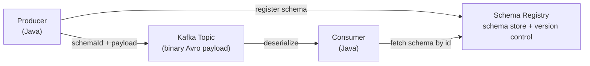

# Apache Avro & Schema Registry

[← Back to README](../README.md)

---

**Apache Avro** is a compact, schema-based binary serialization format widely used with Kafka. A **Schema Registry** (Confluent or Apicurio) stores schemas centrally so producers and consumers can evolve independently without breaking each other — the cornerstone of safe schema evolution in event-driven systems.



---

## Dependencies

```xml
<!-- Confluent Avro serializer/deserializer -->
<dependency>
    <groupId>io.confluent</groupId>
    <artifactId>kafka-avro-serializer</artifactId>
    <version>7.7.0</version>
</dependency>
<dependency>
    <groupId>org.apache.avro</groupId>
    <artifactId>avro</artifactId>
    <version>1.11.3</version>
</dependency>

<!-- Avro Maven plugin — generates Java classes from .avsc schemas -->
<plugin>
    <groupId>org.apache.avro</groupId>
    <artifactId>avro-maven-plugin</artifactId>
    <version>1.11.3</version>
    <executions>
        <execution>
            <phase>generate-sources</phase>
            <goals><goal>schema</goal></goals>
            <configuration>
                <sourceDirectory>src/main/avro</sourceDirectory>
                <outputDirectory>target/generated-sources/avro</outputDirectory>
            </configuration>
        </execution>
    </executions>
</plugin>
```

---

## Avro Schema (`.avsc`)

```json
// src/main/avro/OrderPlacedEvent.avsc
{
  "namespace": "com.example.events",
  "type": "record",
  "name": "OrderPlacedEvent",
  "doc": "Fired when a new order is placed",
  "fields": [
    { "name": "orderId",    "type": "string",  "doc": "UUID of the order" },
    { "name": "customerId", "type": "string" },
    { "name": "total",      "type": { "type": "bytes", "logicalType": "decimal",
                                       "precision": 19, "scale": 4 } },
    { "name": "status",     "type": { "type": "enum", "name": "OrderStatus",
                                       "symbols": ["PENDING", "CONFIRMED"] } },
    { "name": "placedAt",   "type": { "type": "long", "logicalType": "timestamp-millis" } },
    { "name": "metadata",   "type": { "type": "map", "values": "string" }, "default": {} }
  ]
}
```

```bash
# Maven generates com.example.events.OrderPlacedEvent class
mvn generate-sources
```

---

## Configuration

```yaml
spring:
  kafka:
    bootstrap-servers: localhost:9092
    properties:
      "[schema.registry.url]": http://localhost:8081
    producer:
      key-serializer: org.apache.kafka.common.serialization.StringSerializer
      value-serializer: io.confluent.kafka.serializers.KafkaAvroSerializer
      properties:
        "[auto.register.schemas]": true           # register new schemas automatically
        "[use.latest.version]": false
    consumer:
      key-deserializer: org.apache.kafka.common.serialization.StringDeserializer
      value-deserializer: io.confluent.kafka.serializers.KafkaAvroDeserializer
      properties:
        "[specific.avro.reader]": true            # deserialize to generated class, not GenericRecord
```

---

## Producer

```java
@Service
@RequiredArgsConstructor
public class OrderEventProducer {

    private final KafkaTemplate<String, OrderPlacedEvent> kafka;

    public void publish(Order order) {
        OrderPlacedEvent event = OrderPlacedEvent.newBuilder()
            .setOrderId(order.getId().toString())
            .setCustomerId(order.getCustomerId().toString())
            .setTotal(order.getTotal().unscaledValue().toByteBuffer())
            .setStatus(OrderStatus.PENDING)
            .setPlacedAt(Instant.now().toEpochMilli())
            .build();

        kafka.send("order-events", order.getId().toString(), event)
            .whenComplete((result, ex) -> {
                if (ex != null) log.error("Failed to publish event", ex);
                else log.info("Published to partition {} offset {}",
                    result.getRecordMetadata().partition(),
                    result.getRecordMetadata().offset());
            });
    }
}
```

---

## Consumer

```java
@Component
public class OrderEventConsumer {

    @KafkaListener(topics = "order-events", groupId = "inventory-service")
    public void onOrderPlaced(OrderPlacedEvent event) {
        log.info("Received order {} status {}", event.getOrderId(), event.getStatus());
        // event is a fully deserialized, type-safe generated class
    }
}
```

---

## Schema Evolution Rules

Avro supports safe schema evolution with compatibility checks enforced by the Schema Registry.

### Compatibility Modes

| Mode | Allowed Changes | Direction |
|------|----------------|-----------|
| `BACKWARD` (default) | Add optional fields with defaults; remove fields | New consumers read old data |
| `FORWARD` | Remove optional fields; add fields (old readers ignore them) | Old consumers read new data |
| `FULL` | Both BACKWARD and FORWARD | Bidirectional safe |
| `NONE` | No checks | Anything goes |

```bash
# Set compatibility per subject
curl -X PUT http://localhost:8081/config/order-events-value \
  -H "Content-Type: application/json" \
  -d '{"compatibility": "FULL"}'
```

### Safe Changes

```json
// V1
{ "fields": [
    { "name": "orderId", "type": "string" },
    { "name": "total",   "type": "double" }
]}

// V2 — BACKWARD compatible: added optional field with default
{ "fields": [
    { "name": "orderId",    "type": "string" },
    { "name": "total",      "type": "double" },
    { "name": "currency",   "type": "string", "default": "USD" },  // ← safe: has default
    { "name": "customerId", "type": ["null", "string"], "default": null }  // ← safe: nullable
]}
```

### Unsafe Changes

```json
// BREAKING — changing a field type without union
// V1: "total": "double"
// V2: "total": "string"   ← breaks existing consumers
```

---

## Working with GenericRecord (Schema-less)

When you don't have a generated class:

```java
@KafkaListener(topics = "order-events")
public void consume(ConsumerRecord<String, GenericRecord> record) {
    GenericRecord event = record.value();
    String orderId = event.get("orderId").toString();
    Object total   = event.get("total");

    // Access schema metadata
    Schema schema = event.getSchema();
    log.info("Schema name: {} version fields: {}", schema.getName(), schema.getFields());
}
```

---

## Schema Registry REST API

```bash
# List all subjects
GET http://localhost:8081/subjects

# Get schema versions for a subject
GET http://localhost:8081/subjects/order-events-value/versions

# Get specific version
GET http://localhost:8081/subjects/order-events-value/versions/1

# Check compatibility before registering
POST http://localhost:8081/compatibility/subjects/order-events-value/versions/latest
{
  "schema": "{\"type\":\"record\",\"name\":\"OrderPlacedEvent\",...}"
}
# → {"is_compatible": true}

# Register schema manually
POST http://localhost:8081/subjects/order-events-value/versions
{
  "schema": "{\"type\":\"record\",...}"
}
# → {"id": 42}
```

---

## Docker Compose Setup

```yaml
services:
  zookeeper:
    image: confluentinc/cp-zookeeper:7.7.0
    environment:
      ZOOKEEPER_CLIENT_PORT: 2181

  kafka:
    image: confluentinc/cp-kafka:7.7.0
    depends_on: [zookeeper]
    ports:
      - "9092:9092"
    environment:
      KAFKA_ZOOKEEPER_CONNECT: zookeeper:2181
      KAFKA_ADVERTISED_LISTENERS: PLAINTEXT://localhost:9092
      KAFKA_OFFSETS_TOPIC_REPLICATION_FACTOR: 1

  schema-registry:
    image: confluentinc/cp-schema-registry:7.7.0
    depends_on: [kafka]
    ports:
      - "8081:8081"
    environment:
      SCHEMA_REGISTRY_HOST_NAME: schema-registry
      SCHEMA_REGISTRY_KAFKASTORE_BOOTSTRAP_SERVERS: kafka:9092
```

---

## Testing

```java
@SpringBootTest
@EmbeddedKafka(partitions = 1, topics = "order-events")
class OrderEventProducerTest {

    // Use mock schema registry for tests
    @TestConfiguration
    static class TestConfig {
        @Bean
        public SchemaRegistryClient schemaRegistryClient() {
            return new MockSchemaRegistryClient();
        }
    }

    @Autowired OrderEventProducer producer;

    @Test
    void publishesEventWithCorrectFields() throws Exception {
        Order order = new Order(UUID.randomUUID(), UUID.randomUUID(),
            new BigDecimal("49.99"), "PENDING");

        producer.publish(order);

        // Verify via consumer...
    }
}
```

---

## Avro & Schema Registry Summary

| Concept | Detail |
|---------|--------|
| `.avsc` file | JSON schema definition — `record`, `enum`, `array`, `map`, `union` |
| Avro Maven plugin | Generates type-safe Java classes from `.avsc` at build time |
| `KafkaAvroSerializer` | Registers schema, writes `[magic byte][schema id][payload]` |
| `KafkaAvroDeserializer` | Reads schema ID, fetches schema, deserializes payload |
| `specific.avro.reader=true` | Deserialize to generated class, not `GenericRecord` |
| Schema Registry | Central store — validates compatibility before accepting new schema versions |
| `BACKWARD` compatibility | New schema reads old data — add fields with defaults, don't remove fields |
| `FULL` compatibility | Both backward and forward — safest for long-lived topics |
| `GenericRecord` | Schema-agnostic record — useful when schema is unknown at compile time |
| Subject naming | Default: `<topic>-value`, `<topic>-key` |

---

[← Back to README](../README.md)
