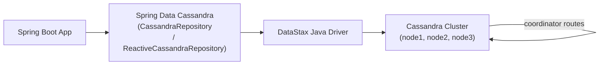

# Spring Data Cassandra

[← Back to README](../README.md)

---

**Apache Cassandra** is a wide-column NoSQL database designed for massive write throughput and linear horizontal scaling. Unlike relational databases, Cassandra is query-driven: you model tables around the access patterns your application needs, not around normalisation. Spring Data Cassandra provides repository abstractions and reactive support via the DataStax driver.



---

## Dependencies

```xml
<dependency>
    <groupId>org.springframework.boot</groupId>
    <artifactId>spring-boot-starter-data-cassandra</artifactId>
</dependency>
<!-- Reactive support -->
<dependency>
    <groupId>org.springframework.boot</groupId>
    <artifactId>spring-boot-starter-data-cassandra-reactive</artifactId>
</dependency>
```

---

## Configuration

```yaml
spring:
  cassandra:
    contact-points: localhost:9042
    local-datacenter: datacenter1
    keyspace-name: orders
    username: cassandra
    password: ${CASSANDRA_PASSWORD}
    schema-action: CREATE_IF_NOT_EXISTS   # dev only; use migrations in prod
    request:
      timeout: 10s
      consistency: LOCAL_QUORUM           # read/write consistency level
    connection:
      connect-timeout: 10s
      init-query-timeout: 10s
    pool:
      local:
        max-requests-per-connection: 32768
```

---

## Data Modelling — Query-First Design

In Cassandra, each table is designed around a single query pattern. The primary key has two parts:
- **Partition key** — determines which node stores the data
- **Clustering columns** — sort data within a partition

```java
// Table: orders_by_customer
// Access pattern: "find all orders for a customer, sorted by date desc"
@Table("orders_by_customer")
public class OrderByCustomer {

    @PrimaryKeyColumn(name = "customer_id", ordinal = 0,
                      type = PrimaryKeyType.PARTITIONED)
    private UUID customerId;    // partition key — all orders for a customer on same node

    @PrimaryKeyColumn(name = "placed_at", ordinal = 1,
                      type = PrimaryKeyType.CLUSTERED,
                      ordering = Ordering.DESCENDING)
    private Instant placedAt;   // clustering column — sorted desc within partition

    @PrimaryKeyColumn(name = "order_id", ordinal = 2,
                      type = PrimaryKeyType.CLUSTERED)
    private UUID orderId;       // clustering column — unique within timestamp

    @Column("status")
    private String status;

    @Column("total")
    private BigDecimal total;
}

// Table: orders_by_status (separate table for a different query)
@Table("orders_by_status")
public class OrderByStatus {

    @PrimaryKeyColumn(name = "status", ordinal = 0, type = PrimaryKeyType.PARTITIONED)
    private String status;

    @PrimaryKeyColumn(name = "placed_at", ordinal = 1,
                      type = PrimaryKeyType.CLUSTERED,
                      ordering = Ordering.DESCENDING)
    private Instant placedAt;

    @PrimaryKeyColumn(name = "order_id", ordinal = 2, type = PrimaryKeyType.CLUSTERED)
    private UUID orderId;

    @Column("customer_id")
    private UUID customerId;

    @Column("total")
    private BigDecimal total;
}
```

---

## Composite Primary Key Class

```java
@PrimaryKeyClass
public class OrderByCustomerKey implements Serializable {

    @PrimaryKeyColumn(ordinal = 0, type = PrimaryKeyType.PARTITIONED)
    private UUID customerId;

    @PrimaryKeyColumn(ordinal = 1, type = PrimaryKeyType.CLUSTERED,
                      ordering = Ordering.DESCENDING)
    private Instant placedAt;

    @PrimaryKeyColumn(ordinal = 2, type = PrimaryKeyType.CLUSTERED)
    private UUID orderId;

    // constructors, equals, hashCode
}

@Table("orders_by_customer")
public class OrderByCustomer {
    @PrimaryKey
    private OrderByCustomerKey key;

    private String status;
    private BigDecimal total;
}
```

---

## Repository

```java
public interface OrderByCustomerRepository
        extends CassandraRepository<OrderByCustomer, OrderByCustomerKey> {

    // Find all orders for a customer (partition scan — efficient)
    List<OrderByCustomer> findByKeyCustomerId(UUID customerId);

    // Find recent orders (partition + clustering key range)
    @Query("SELECT * FROM orders_by_customer WHERE customer_id = ?0 AND placed_at > ?1")
    List<OrderByCustomer> findRecentOrders(UUID customerId, Instant since);

    // Count orders for a customer
    @Query("SELECT COUNT(*) FROM orders_by_customer WHERE customer_id = ?0")
    long countByCustomerId(UUID customerId);

    // Delete by partition key
    void deleteByKeyCustomerId(UUID customerId);
}
```

---

## Reactive Repository

```java
public interface ReactiveOrderRepository
        extends ReactiveCassandraRepository<OrderByCustomer, OrderByCustomerKey> {

    Flux<OrderByCustomer> findByKeyCustomerId(UUID customerId);

    @Query("SELECT * FROM orders_by_customer WHERE customer_id = ?0 LIMIT ?1")
    Flux<OrderByCustomer> findTopNByCustomer(UUID customerId, int limit);
}

@Service
@RequiredArgsConstructor
public class OrderQueryService {

    private final ReactiveOrderRepository repo;

    public Flux<OrderByCustomer> getCustomerOrders(UUID customerId) {
        return repo.findByKeyCustomerId(customerId);
    }
}
```

---

## CassandraTemplate — Low-Level Access

```java
@Service
@RequiredArgsConstructor
public class OrderWriteService {

    private final CassandraTemplate template;

    public void insertOrder(OrderByCustomer order) {
        // Simple insert
        template.insert(order);

        // Insert with TTL (auto-delete after 90 days)
        InsertOptions options = InsertOptions.builder()
            .ttl(Duration.ofDays(90))
            .build();
        template.insert(order, options);
    }

    public void deleteOldOrders(UUID customerId, Instant before) {
        template.delete(Query.query(
            Criteria.where("customer_id").is(customerId)
                    .and("placed_at").lt(before)),
            OrderByCustomer.class);
    }

    // Lightweight transaction (LWT) — check-then-act
    public boolean insertIfNotExists(OrderByCustomer order) {
        WriteResult result = template.insert(order,
            InsertOptions.builder().withIfNotExists().build());
        return result.wasApplied();
    }
}
```

---

## Batch Statements

```java
@Service
@RequiredArgsConstructor
public class OrderDenormalizationService {

    private final CassandraTemplate template;

    // Write to multiple tables atomically (LOGGED batch — same partition for performance)
    @Transactional
    public void writeOrderToAllTables(OrderEvent event) {
        OrderByCustomer byCustomer = mapToByCustomer(event);
        OrderByStatus   byStatus   = mapToByStatus(event);

        // Cassandra batch — all or nothing within a single partition
        template.batchOps()
            .insert(byCustomer)
            .insert(byStatus)
            .execute();
    }
}
```

---

## TTL — Time-To-Live

```java
// Column-level TTL
@Table("sessions")
public class UserSession {

    @PrimaryKeyColumn(type = PrimaryKeyType.PARTITIONED)
    private String sessionId;

    private String userId;
    private String data;
}

// Insert with TTL
template.insert(session, InsertOptions.builder().ttl(Duration.ofHours(24)).build());

// CQL equivalent
// INSERT INTO sessions (session_id, user_id, data) VALUES (?, ?, ?) USING TTL 86400;
```

---

## Consistency Levels

```java
// Per-statement consistency level
@Query(value = "SELECT * FROM orders_by_customer WHERE customer_id = ?0",
       consistencyLevel = "LOCAL_ONE")   // fast read from local replica
List<OrderByCustomer> findLocallyConsistent(UUID customerId);

// Programmatic
QueryOptions options = QueryOptions.builder()
    .consistencyLevel(ConsistencyLevel.QUORUM)
    .build();
template.select(query, OrderByCustomer.class, options);
```

| Level | Reads/Writes from | Use When |
|-------|------------------|----------|
| `LOCAL_ONE` | 1 local replica | Fastest; may read stale data |
| `LOCAL_QUORUM` | Majority of local DC | Balanced; recommended default |
| `QUORUM` | Majority of all DCs | Strong consistency across DCs |
| `ALL` | All replicas | Strongest; lowest availability |

---

## Testing with Testcontainers

```java
@SpringBootTest
@Testcontainers
class OrderRepositoryTest {

    @Container
    static CassandraContainer<?> cassandra =
        new CassandraContainer<>("cassandra:4.1")
            .withInitScript("cassandra-schema.cql");

    @DynamicPropertySource
    static void props(DynamicPropertyRegistry r) {
        r.add("spring.cassandra.contact-points",
            () -> cassandra.getHost() + ":" + cassandra.getMappedPort(9042));
        r.add("spring.cassandra.local-datacenter", cassandra::getLocalDatacenter);
        r.add("spring.cassandra.keyspace-name", () -> "orders");
    }

    @Autowired OrderByCustomerRepository repo;

    @Test
    void insertAndFindOrder() {
        UUID customerId = UUID.randomUUID();
        OrderByCustomer order = new OrderByCustomer(
            new OrderByCustomerKey(customerId, Instant.now(), UUID.randomUUID()),
            "PENDING", new BigDecimal("49.99"));

        repo.insert(order);

        List<OrderByCustomer> found = repo.findByKeyCustomerId(customerId);
        assertThat(found).hasSize(1)
            .first().satisfies(o -> assertThat(o.getStatus()).isEqualTo("PENDING"));
    }
}
```

---

## Cassandra Data Modelling Rules

1. **Design tables for queries, not normalisation** — duplicate data across tables
2. **Partition key = equality filter** — only `=` is efficient on partition key
3. **Clustering columns = range/sort** — `>`, `<`, `ORDER BY` on clustering columns
4. **Avoid unbounded partitions** — partition growing without limit causes hotspots
5. **Keep partitions under ~100MB** — larger partitions cause GC pressure
6. **No JOINs** — denormalise; write to multiple tables in application code or batch
7. **TTL for time-series data** — auto-expire old records without explicit deletes

---

## Spring Data Cassandra Summary

| Concept | Detail |
|---------|--------|
| `@Table` | Maps class to a Cassandra table |
| `@PrimaryKeyColumn(PARTITIONED)` | Partition key — determines data placement |
| `@PrimaryKeyColumn(CLUSTERED)` | Clustering column — sorts within partition |
| `@PrimaryKeyClass` | Composite primary key as a separate class |
| `CassandraRepository` | Blocking repository |
| `ReactiveCassandraRepository` | Returns `Mono`/`Flux` |
| `CassandraTemplate` | Low-level API for TTL, LWT, batch, custom queries |
| `InsertOptions.ttl()` | Set time-to-live for automatic expiry |
| `withIfNotExists()` | Lightweight transaction — conditional insert |
| `LOCAL_QUORUM` | Recommended consistency level for balanced apps |
| Denormalisation | Write same data to multiple tables to serve different query patterns |

---

[← Back to README](../README.md)
