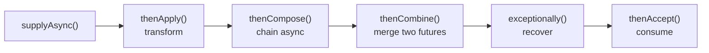

# CompletableFuture Deep Dive

[← Back to README](../README.md)

---

`CompletableFuture<T>` is Java's primary tool for asynchronous, non-blocking computation. It lets you chain transformations, combine multiple async operations, handle errors at any stage, and set timeouts — all without blocking a thread. With Java 21 virtual threads, `CompletableFuture` gains even more relevance as the composition API for concurrent tasks.



---

## Creating CompletableFutures

```java
// Already completed
CompletableFuture<String> done = CompletableFuture.completedFuture("hello");
CompletableFuture<String> failed = CompletableFuture.failedFuture(new RuntimeException("oops"));

// Async supplier — runs on ForkJoinPool.commonPool()
CompletableFuture<Order> cf = CompletableFuture.supplyAsync(() -> orderRepo.findById(id));

// With custom executor (preferred in production)
ExecutorService executor = Executors.newVirtualThreadPerTaskExecutor();
CompletableFuture<Order> cf = CompletableFuture.supplyAsync(
    () -> orderRepo.findById(id), executor);

// Fire-and-forget
CompletableFuture.runAsync(() -> auditLog.record(event), executor);
```

---

## Transformation — thenApply / thenApplyAsync

```java
CompletableFuture<OrderDto> dto = CompletableFuture
    .supplyAsync(() -> orderRepo.findById(id))   // → Order
    .thenApply(OrderMapper::toDto);              // → OrderDto (same thread)

// Async variant — next stage runs on executor thread
CompletableFuture<OrderDto> dtoAsync = CompletableFuture
    .supplyAsync(() -> orderRepo.findById(id))
    .thenApplyAsync(OrderMapper::toDto, executor);
```

---

## Chaining Async Calls — thenCompose

`thenCompose` (flatMap) avoids `CompletableFuture<CompletableFuture<T>>`:

```java
// WITHOUT thenCompose — nested futures
CompletableFuture<CompletableFuture<Customer>> nested =
    orderRepo.findByIdAsync(orderId)
        .thenApply(order -> customerRepo.findByIdAsync(order.getCustomerId()));

// WITH thenCompose — flat chain
CompletableFuture<Customer> customer =
    orderRepo.findByIdAsync(orderId)
        .thenCompose(order -> customerRepo.findByIdAsync(order.getCustomerId()));

// Real-world chain
CompletableFuture<Receipt> receiptFuture =
    orderRepo.findByIdAsync(orderId)
        .thenCompose(order -> paymentService.chargeAsync(order))
        .thenCompose(payment -> invoiceService.generateAsync(payment))
        .thenCompose(invoice -> emailService.sendAsync(invoice));
```

---

## Combining Futures — thenCombine / allOf / anyOf

```java
// thenCombine — zip two independent futures
CompletableFuture<Order>    orderFuture    = orderRepo.findByIdAsync(orderId);
CompletableFuture<Customer> customerFuture = customerRepo.findByIdAsync(customerId);

CompletableFuture<OrderDetails> details =
    orderFuture.thenCombine(customerFuture,
        (order, customer) -> new OrderDetails(order, customer));

// allOf — wait for all, no result
CompletableFuture<Void> allDone = CompletableFuture.allOf(
    emailService.sendAsync(email),
    auditLog.recordAsync(event),
    metricService.incrementAsync("orders.placed"));

// Collect results from allOf
List<CompletableFuture<String>> futures = List.of(
    fetchAsync("url1"), fetchAsync("url2"), fetchAsync("url3"));

CompletableFuture<List<String>> all = CompletableFuture
    .allOf(futures.toArray(CompletableFuture[]::new))
    .thenApply(v -> futures.stream()
        .map(CompletableFuture::join)   // safe — all completed at this point
        .toList());

// anyOf — first to complete wins
CompletableFuture<Object> fastest = CompletableFuture.anyOf(
    fetchFromReplica1Async(query),
    fetchFromReplica2Async(query),
    fetchFromReplica3Async(query));
```

---

## Parallel Execution Pattern

```java
@Service
@RequiredArgsConstructor
public class OrderDetailsService {

    private final OrderRepository orderRepo;
    private final CustomerClient customerClient;
    private final InventoryClient inventoryClient;

    private final ExecutorService executor =
        Executors.newVirtualThreadPerTaskExecutor();

    public OrderDetails fetchAll(UUID orderId) {
        // All three calls run in parallel
        CompletableFuture<Order>        orderFuture    =
            CompletableFuture.supplyAsync(() -> orderRepo.findById(orderId), executor);
        CompletableFuture<Customer>     customerFuture =
            orderFuture.thenCompose(o ->
                CompletableFuture.supplyAsync(() ->
                    customerClient.fetch(o.getCustomerId()), executor));
        CompletableFuture<List<Item>>   itemsFuture    =
            CompletableFuture.supplyAsync(() ->
                inventoryClient.fetchItems(orderId), executor);

        return orderFuture
            .thenCombine(customerFuture, (o, c) -> new OrderWithCustomer(o, c))
            .thenCombine(itemsFuture, (oc, items) ->
                new OrderDetails(oc.order(), oc.customer(), items))
            .join();
    }
}
```

---

## Error Handling

```java
// exceptionally — recover from any exception
CompletableFuture<Order> safe = orderRepo.findByIdAsync(id)
    .exceptionally(ex -> {
        log.error("Failed to fetch order", ex);
        return Order.empty();   // fallback value
    });

// handle — process both result and exception (always called)
CompletableFuture<OrderDto> result = orderRepo.findByIdAsync(id)
    .handle((order, ex) -> {
        if (ex != null) return OrderDto.error(ex.getMessage());
        return OrderMapper.toDto(order);
    });

// whenComplete — side effects only (doesn't transform)
CompletableFuture<Order> withLogging = orderRepo.findByIdAsync(id)
    .whenComplete((order, ex) -> {
        if (ex != null) metrics.increment("order.fetch.error");
        else metrics.increment("order.fetch.success");
    });

// exceptionallyCompose — recover with another async call
CompletableFuture<Order> withFallback = primaryRepo.findByIdAsync(id)
    .exceptionallyCompose(ex -> fallbackRepo.findByIdAsync(id));
```

---

## Timeouts

```java
// orTimeout — completes exceptionally with TimeoutException after delay
CompletableFuture<Order> withTimeout = orderRepo.findByIdAsync(id)
    .orTimeout(3, TimeUnit.SECONDS);

// completeOnTimeout — completes with a default value after delay
CompletableFuture<Order> withDefault = orderRepo.findByIdAsync(id)
    .completeOnTimeout(Order.empty(), 3, TimeUnit.SECONDS);

// Combined with exceptionally
CompletableFuture<OrderDto> safe = orderRepo.findByIdAsync(id)
    .orTimeout(3, TimeUnit.SECONDS)
    .thenApply(OrderMapper::toDto)
    .exceptionally(ex -> {
        if (ex.getCause() instanceof TimeoutException)
            return OrderDto.timeout();
        return OrderDto.error(ex.getMessage());
    });
```

---

## Cancellation

```java
CompletableFuture<Order> future = orderRepo.findByIdAsync(id);

// Cancel — sets the future to cancelled state (doesn't interrupt the thread)
boolean cancelled = future.cancel(true);

// Check cancellation
if (future.isCancelled()) {
    log.info("Request cancelled");
}

// React to cancellation downstream
future.exceptionally(ex -> {
    if (ex instanceof CancellationException) return Order.empty();
    throw (RuntimeException) ex;
});
```

---

## CompletableFuture vs Virtual Threads

| | `CompletableFuture` | Virtual Threads |
|---|---|---|
| Code style | Callback chains | Imperative blocking |
| Error handling | `.exceptionally()`, `.handle()` | try/catch |
| Timeout | `.orTimeout()` | `Thread.sleep()` / `Future.get(timeout)` |
| Combining | `thenCombine`, `allOf` | `StructuredTaskScope` |
| Thread model | ForkJoinPool / custom executor | One VT per task |
| Best for | Non-blocking I/O; composing async results | Blocking I/O where code clarity matters |

```java
// Virtual thread equivalent of thenCombine with allOf
try (var scope = new StructuredTaskScope.ShutdownOnFailure()) {
    var orderTask    = scope.fork(() -> orderRepo.findById(orderId));
    var customerTask = scope.fork(() -> customerClient.fetch(customerId));
    var itemsTask    = scope.fork(() -> inventoryClient.fetchItems(orderId));

    scope.join().throwIfFailed();
    return new OrderDetails(orderTask.get(), customerTask.get(), itemsTask.get());
}
```

---

## Common Mistakes

```java
// MISTAKE — blocking inside a CompletableFuture on ForkJoinPool
CompletableFuture.supplyAsync(() -> {
    return orderRepo.findById(id);   // blocks a ForkJoinPool thread — starves other tasks!
});

// FIX — use a dedicated executor for blocking work
CompletableFuture.supplyAsync(() -> orderRepo.findById(id), blockingExecutor);

// MISTAKE — chaining join() inside thenApply (deadlock risk)
CompletableFuture.supplyAsync(() ->
    anotherFuture.join()   // blocks the thread — potential deadlock in FJP
);

// FIX — use thenCompose for nested futures
.thenCompose(result -> anotherFuture);

// MISTAKE — swallowing exceptions
future.thenApply(o -> process(o));   // exception in process() propagates but is easy to miss

// FIX — always add a terminal error handler
future.thenApply(o -> process(o))
      .exceptionally(ex -> { log.error("Failed", ex); return fallback; });
```

---

## CompletableFuture Summary

| Method | Returns | Use |
|--------|---------|-----|
| `supplyAsync(supplier, exec)` | `CF<T>` | Start an async computation |
| `runAsync(runnable, exec)` | `CF<Void>` | Fire-and-forget |
| `thenApply(fn)` | `CF<U>` | Transform result (sync) |
| `thenApplyAsync(fn, exec)` | `CF<U>` | Transform result (async) |
| `thenCompose(fn)` | `CF<U>` | Chain another async call (flatMap) |
| `thenCombine(other, fn)` | `CF<V>` | Merge two independent futures |
| `thenAccept(consumer)` | `CF<Void>` | Consume result, no return |
| `allOf(futures...)` | `CF<Void>` | Wait for all to complete |
| `anyOf(futures...)` | `CF<Object>` | First result wins |
| `exceptionally(fn)` | `CF<T>` | Recover from exception |
| `handle(biFunction)` | `CF<U>` | Handle result or exception |
| `whenComplete(biConsumer)` | `CF<T>` | Side effects; passes through result |
| `orTimeout(n, unit)` | `CF<T>` | Fail with `TimeoutException` after delay |
| `completeOnTimeout(val, n, unit)` | `CF<T>` | Complete with default value after delay |
| `join()` | `T` | Block for result (unchecked exception) |
| `get(n, unit)` | `T` | Block with timeout (checked exception) |

---

[← Back to README](../README.md)
