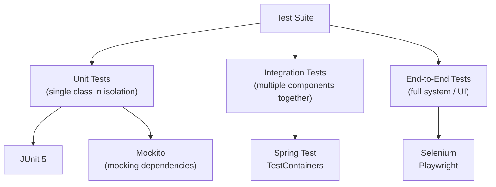

# Testing

[← Back to README](../README.md)

---

Testing verifies that code behaves as expected. Java's primary testing ecosystem is built around **JUnit 5** for unit tests and **Mockito** for mocking dependencies.



---

## JUnit 5

JUnit 5 is the standard Java testing framework. It is composed of three modules:

- **JUnit Platform** — test runner and discovery engine
- **JUnit Jupiter** — the new API for writing tests (`@Test`, `@BeforeEach`, etc.)
- **JUnit Vintage** — backwards compatibility with JUnit 4

### Adding JUnit 5 (Maven)

```xml
<dependency>
    <groupId>org.junit.jupiter</groupId>
    <artifactId>junit-jupiter</artifactId>
    <version>5.10.2</version>
    <scope>test</scope>
</dependency>
```

### Adding JUnit 5 (Gradle)

```groovy
testImplementation 'org.junit.jupiter:junit-jupiter:5.10.2'
```

---

## Writing Tests

### Basic Test Structure

```java
import org.junit.jupiter.api.*;
import static org.junit.jupiter.api.Assertions.*;

class CalculatorTest {

    private Calculator calculator;

    @BeforeAll
    static void initAll() {
        System.out.println("Runs once before all tests in this class");
    }

    @BeforeEach
    void setUp() {
        calculator = new Calculator();  // fresh instance before each test
    }

    @Test
    void add_twoPositiveNumbers_returnsSum() {
        int result = calculator.add(3, 7);
        assertEquals(10, result);
    }

    @Test
    void divide_byZero_throwsException() {
        assertThrows(ArithmeticException.class, () -> calculator.divide(10, 0));
    }

    @AfterEach
    void tearDown() {
        System.out.println("Runs after each test");
    }

    @AfterAll
    static void tearDownAll() {
        System.out.println("Runs once after all tests in this class");
    }
}
```

### Lifecycle Annotations

| Annotation | When it runs |
|------------|--------------|
| `@BeforeAll` | Once before all tests in the class (must be `static`) |
| `@BeforeEach` | Before each test method |
| `@AfterEach` | After each test method |
| `@AfterAll` | Once after all tests in the class (must be `static`) |
| `@Test` | Marks a method as a test |
| `@Disabled` | Skips the test |

---

## Assertions

All assertions are static methods in `org.junit.jupiter.api.Assertions`.

```java
import static org.junit.jupiter.api.Assertions.*;

// equality
assertEquals(10, result);
assertEquals(3.14, result, 0.001);          // delta for floating point
assertEquals("Alice", user.getName());

// not equal
assertNotEquals(0, result);

// null checks
assertNull(value);
assertNotNull(value);

// boolean
assertTrue(list.isEmpty());
assertFalse(list.contains("unknown"));

// same object reference
assertSame(expected, actual);

// arrays
assertArrayEquals(new int[]{1, 2, 3}, result);

// exceptions
assertThrows(IllegalArgumentException.class, () -> service.create(null));

// exception message
var ex = assertThrows(IllegalArgumentException.class, () -> service.create(null));
assertEquals("Name cannot be null", ex.getMessage());

// multiple assertions — all run even if some fail
assertAll(
    () -> assertEquals("Alice", user.getName()),
    () -> assertEquals(30, user.getAge()),
    () -> assertTrue(user.isActive())
);

// custom failure message
assertEquals(10, result, "Expected sum of 3 + 7 to be 10");

// fail explicitly
fail("This test is not yet implemented");
```

---

## Parameterized Tests

Run the same test logic with multiple sets of inputs.

```java
import org.junit.jupiter.params.ParameterizedTest;
import org.junit.jupiter.params.provider.*;

class StringUtilsTest {

    // single argument
    @ParameterizedTest
    @ValueSource(strings = {"", " ", "\t", "\n"})
    void isBlank_blankStrings_returnsTrue(String input) {
        assertTrue(input.isBlank());
    }

    // multiple arguments
    @ParameterizedTest
    @CsvSource({
        "Alice, 3, ALICE",
        "hello, 2, HELLO",
        "java,  1, JAVA"
    })
    void repeat_returnsRepeatedUppercase(String word, int times, String expected) {
        assertEquals(expected, word.toUpperCase());
    }

    // from a method
    @ParameterizedTest
    @MethodSource("provideNumbers")
    void isPositive(int number, boolean expected) {
        assertEquals(expected, number > 0);
    }

    static java.util.stream.Stream<org.junit.jupiter.params.provider.Arguments> provideNumbers() {
        return java.util.stream.Stream.of(
            org.junit.jupiter.params.provider.Arguments.of(1,  true),
            org.junit.jupiter.params.provider.Arguments.of(-1, false),
            org.junit.jupiter.params.provider.Arguments.of(0,  false)
        );
    }

    // enum source
    @ParameterizedTest
    @EnumSource(java.time.DayOfWeek.class)
    void everyDayHasAName(java.time.DayOfWeek day) {
        assertNotNull(day.name());
    }
}
```

---

## Test Organisation

### Naming Convention

Good test names describe the scenario and expected outcome:

```
methodName_stateUnderTest_expectedBehaviour
```

```java
@Test void add_twoPositiveIntegers_returnsCorrectSum() { }
@Test void withdraw_insufficientFunds_throwsException() { }
@Test void findUser_nonExistentId_returnsEmptyOptional() { }
```

### Nested Tests

Group related tests with `@Nested` to reflect the structure of the class under test.

```java
class BankAccountTest {

    BankAccount account;

    @BeforeEach
    void setUp() { account = new BankAccount(100.0); }

    @Nested
    class Deposit {
        @Test void positiveAmount_increasesBalance() {
            account.deposit(50);
            assertEquals(150.0, account.getBalance());
        }

        @Test void negativeAmount_throwsException() {
            assertThrows(IllegalArgumentException.class, () -> account.deposit(-10));
        }
    }

    @Nested
    class Withdraw {
        @Test void sufficientFunds_decreasesBalance() {
            account.withdraw(30);
            assertEquals(70.0, account.getBalance());
        }

        @Test void insufficientFunds_throwsException() {
            assertThrows(IllegalStateException.class, () -> account.withdraw(200));
        }
    }
}
```

### Tagging and Filtering

```java
import org.junit.jupiter.api.Tag;

@Tag("fast")
@Test void quickTest() { }

@Tag("slow")
@Test void slowIntegrationTest() { }
```

Run only tagged tests:

```bash
# Maven
mvn test -Dgroups="fast"

# Gradle
./gradlew test --tests "*" -PincludeTags="fast"
```

---

## Mockito

Mockito creates **mock objects** — fake implementations of dependencies — so you can test a class in isolation without needing real databases, APIs, or other services.

### Adding Mockito (Maven)

```xml
<dependency>
    <groupId>org.mockito</groupId>
    <artifactId>mockito-junit-jupiter</artifactId>
    <version>5.11.0</version>
    <scope>test</scope>
</dependency>
```

### Creating Mocks

```java
import org.junit.jupiter.api.Test;
import org.junit.jupiter.api.extension.ExtendWith;
import org.mockito.*;
import org.mockito.junit.jupiter.MockitoExtension;
import static org.mockito.Mockito.*;
import static org.junit.jupiter.api.Assertions.*;

@ExtendWith(MockitoExtension.class)
class UserServiceTest {

    @Mock
    UserRepository repository;   // Mockito creates a fake implementation

    @InjectMocks
    UserService service;         // Mockito injects the mock into this

    @Test
    void findUser_existingId_returnsUser() {
        User alice = new User(1L, "Alice");

        // stub — define what the mock returns when called
        when(repository.findById(1L)).thenReturn(Optional.of(alice));

        Optional<User> result = service.findUser(1L);

        assertTrue(result.isPresent());
        assertEquals("Alice", result.get().getName());

        // verify the mock was actually called
        verify(repository).findById(1L);
    }

    @Test
    void findUser_nonExistentId_returnsEmpty() {
        when(repository.findById(99L)).thenReturn(Optional.empty());

        Optional<User> result = service.findUser(99L);

        assertFalse(result.isPresent());
        verify(repository, times(1)).findById(99L);
    }
}
```

### Stubbing

```java
// return a value
when(mock.method(arg)).thenReturn(value);

// return different values on successive calls
when(mock.method()).thenReturn("first", "second", "third");

// throw an exception
when(mock.method(arg)).thenThrow(new RuntimeException("error"));

// call real method (partial mock)
when(mock.method()).thenCallRealMethod();

// do nothing on void method
doNothing().when(mock).voidMethod();

// throw on void method
doThrow(new RuntimeException()).when(mock).voidMethod();

// argument matchers
when(repository.findById(anyLong())).thenReturn(Optional.empty());
when(service.process(any(User.class))).thenReturn(true);
when(service.find(eq("exact"))).thenReturn(result);
when(service.find(argThat(s -> s.startsWith("A")))).thenReturn(result);
```

### Verifying Interactions

```java
// called exactly once (default)
verify(mock).method(arg);

// called specific number of times
verify(mock, times(3)).method();
verify(mock, never()).method();
verify(mock, atLeast(1)).method();
verify(mock, atMost(2)).method();

// no other interactions with the mock
verifyNoMoreInteractions(mock);

// never interacted with at all
verifyNoInteractions(mock);

// capture the argument passed to a mock
ArgumentCaptor<User> captor = ArgumentCaptor.forClass(User.class);
verify(repository).save(captor.capture());
assertEquals("Alice", captor.getValue().getName());
```

### Spies

A **spy** wraps a real object — real methods are called unless stubbed.

```java
List<String> realList = new java.util.ArrayList<>();
List<String> spy = Mockito.spy(realList);

spy.add("hello");          // calls real add
System.out.println(spy.size());  // 1

doReturn(100).when(spy).size();  // stub just the size method
System.out.println(spy.size());  // 100
```

---

## Test Doubles — When to Use What

| Double | What it is | Use when |
|--------|------------|----------|
| **Dummy** | Object passed but never used | Filling required parameters |
| **Stub** | Returns pre-set values | You need the dependency to return specific data |
| **Mock** | Verifies interactions | You need to assert the dependency was called correctly |
| **Spy** | Wraps a real object | You want real behaviour but need to stub some methods |
| **Fake** | Working simplified implementation | In-memory database, fake email sender |

---

## Testing Best Practices

- **One assertion per test** — or one logical concept. Tests that verify one thing are easier to diagnose.
- **Arrange, Act, Assert (AAA)** — structure every test in three clear sections.
- **Test behaviour, not implementation** — test what a method does, not how it does it internally.
- **Keep tests independent** — tests should not depend on execution order or shared mutable state.
- **Test edge cases** — null inputs, empty collections, boundary values, maximum values.
- **Name tests descriptively** — the test name should read like a specification.
- **Don't mock what you don't own** — avoid mocking third-party types directly; wrap them instead.
- **Keep tests fast** — slow tests get skipped. Unit tests should run in milliseconds.

### Arrange, Act, Assert

```java
@Test
void deposit_validAmount_increasesBalance() {
    // Arrange
    BankAccount account = new BankAccount(100.0);

    // Act
    account.deposit(50.0);

    // Assert
    assertEquals(150.0, account.getBalance());
}
```

---

## Code Coverage

Code coverage measures which lines/branches are exercised by tests. Use **JaCoCo** to generate reports.

```xml
<!-- Maven plugin -->
<plugin>
    <groupId>org.jacoco</groupId>
    <artifactId>jacoco-maven-plugin</artifactId>
    <version>0.8.11</version>
    <executions>
        <execution>
            <goals><goal>prepare-agent</goal></goals>
        </execution>
        <execution>
            <id>report</id>
            <phase>test</phase>
            <goals><goal>report</goal></goals>
        </execution>
    </executions>
</plugin>
```

```bash
mvn test          # runs tests and generates coverage
# report at: target/site/jacoco/index.html
```

> 100% coverage doesn't mean no bugs — it means every line ran at least once. Aim for high coverage on business logic; don't chase the metric blindly.

---

## Testing Summary

| Tool / Concept | Purpose |
|----------------|---------|
| `@Test` | Mark a method as a test |
| `@BeforeEach` / `@AfterEach` | Setup and teardown per test |
| `@BeforeAll` / `@AfterAll` | Setup and teardown per class |
| `assertEquals`, `assertThrows` | Assert expected outcomes |
| `assertAll` | Run multiple assertions, report all failures |
| `@ParameterizedTest` | Run one test with many input sets |
| `@Nested` | Group related tests hierarchically |
| `@Tag` | Label tests for selective execution |
| `@Mock` / `@InjectMocks` | Create and inject Mockito mocks |
| `when(...).thenReturn(...)` | Stub mock behaviour |
| `verify(...)` | Assert a mock was called correctly |
| `ArgumentCaptor` | Capture and inspect arguments passed to mocks |
| JaCoCo | Measure code coverage |

---

[← Back to README](../README.md)
