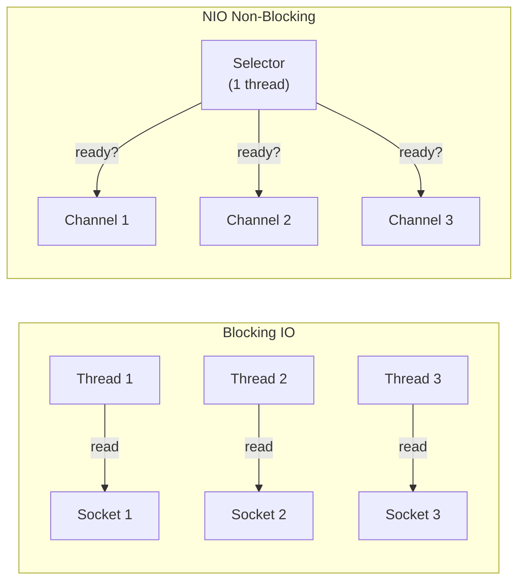

# Java NIO & Asynchronous I/O

[← Back to README](../README.md)

---

**Java NIO** (New I/O, introduced in Java 1.4) replaces the stream-based blocking I/O with buffers, channels, and selectors. **NIO.2** (Java 7) added `java.nio.file` (`Path`, `Files`), `AsynchronousFileChannel`, and `WatchService`. Together they enable high-throughput, non-blocking I/O without a thread per connection.



---

## Buffers

All NIO data flows through `Buffer` objects. Key positions: `capacity` ≥ `limit` ≥ `position` ≥ 0.

```java
// Allocate a buffer
ByteBuffer buf = ByteBuffer.allocate(1024);         // heap buffer
ByteBuffer direct = ByteBuffer.allocateDirect(1024); // off-heap — faster for I/O

// Write mode: position advances on put
buf.put("Hello".getBytes(StandardCharsets.UTF_8));

// Flip to read mode: limit = position, position = 0
buf.flip();

// Read
byte[] bytes = new byte[buf.remaining()];
buf.get(bytes);                                      // reads all remaining bytes

// Rewind — re-read from start
buf.rewind();

// Clear — reset for writing (doesn't erase data)
buf.clear();

// Compact — shift unread bytes to front, ready to write more
buf.compact();

// Typed buffers
IntBuffer    intBuf  = IntBuffer.allocate(10);
DoubleBuffer dblBuf  = DoubleBuffer.wrap(new double[]{1.0, 2.0, 3.0});
CharBuffer   charBuf = CharBuffer.wrap("hello");
```

---

## FileChannel — File I/O

```java
// Read a file with FileChannel
try (FileChannel channel = FileChannel.open(Path.of("data.bin"), StandardOpenOption.READ)) {
    ByteBuffer buf = ByteBuffer.allocate(4096);
    int bytesRead;
    while ((bytesRead = channel.read(buf)) != -1) {
        buf.flip();
        // process buf.remaining() bytes
        buf.clear();
    }
}

// Write
try (FileChannel channel = FileChannel.open(Path.of("output.bin"),
        StandardOpenOption.WRITE, StandardOpenOption.CREATE)) {
    ByteBuffer buf = ByteBuffer.wrap("Hello NIO".getBytes());
    while (buf.hasRemaining()) {
        channel.write(buf);
    }
}

// Memory-mapped file — maps file directly into memory address space
try (FileChannel channel = FileChannel.open(Path.of("large.dat"), StandardOpenOption.READ)) {
    MappedByteBuffer mapped = channel.map(
        FileChannel.MapMode.READ_ONLY, 0, channel.size());
    // Access file bytes as if they were in memory
    byte firstByte = mapped.get(0);
}

// Transfer between channels (zero-copy)
try (FileChannel src  = FileChannel.open(Path.of("source.dat"), StandardOpenOption.READ);
     FileChannel dest = FileChannel.open(Path.of("dest.dat"),
             StandardOpenOption.WRITE, StandardOpenOption.CREATE)) {
    src.transferTo(0, src.size(), dest);   // OS-level zero-copy
}
```

---

## SocketChannel — Non-Blocking TCP

```java
// Non-blocking server
ServerSocketChannel server = ServerSocketChannel.open();
server.bind(new InetSocketAddress(8080));
server.configureBlocking(false);   // non-blocking mode

// Selector — multiplexes multiple channels on one thread
Selector selector = Selector.open();
server.register(selector, SelectionKey.OP_ACCEPT);

while (true) {
    selector.select();   // blocks until at least one channel is ready

    Iterator<SelectionKey> keys = selector.selectedKeys().iterator();
    while (keys.hasNext()) {
        SelectionKey key = keys.next();
        keys.remove();

        if (key.isAcceptable()) {
            // New connection
            SocketChannel client = server.accept();
            client.configureBlocking(false);
            client.register(selector, SelectionKey.OP_READ);

        } else if (key.isReadable()) {
            // Data available
            SocketChannel client = (SocketChannel) key.channel();
            ByteBuffer buf = ByteBuffer.allocate(1024);
            int n = client.read(buf);
            if (n == -1) {
                client.close();
            } else {
                buf.flip();
                client.write(buf);   // echo back
            }
        }
    }
}
```

---

## AsynchronousFileChannel — True Async I/O

```java
// Async read with CompletableFuture
AsynchronousFileChannel channel = AsynchronousFileChannel.open(
    Path.of("data.bin"), StandardOpenOption.READ);

ByteBuffer buf = ByteBuffer.allocate(4096);
CompletableFuture<Integer> future = new CompletableFuture<>();

channel.read(buf, 0, null, new CompletionHandler<Integer, Void>() {
    @Override
    public void completed(Integer bytesRead, Void attachment) {
        buf.flip();
        future.complete(bytesRead);
    }

    @Override
    public void failed(Throwable exc, Void attachment) {
        future.completeExceptionally(exc);
    }
});

future.thenAccept(n -> {
    byte[] data = new byte[n];
    buf.get(data);
    System.out.println("Read: " + new String(data));
});
```

---

## AsynchronousSocketChannel

```java
// Async TCP client
AsynchronousSocketChannel client = AsynchronousSocketChannel.open();

client.connect(new InetSocketAddress("api.example.com", 443), null,
    new CompletionHandler<Void, Void>() {

        @Override
        public void completed(Void result, Void attachment) {
            ByteBuffer request = ByteBuffer.wrap("GET / HTTP/1.0\r\n\r\n".getBytes());
            client.write(request, request, new CompletionHandler<Integer, ByteBuffer>() {
                @Override
                public void completed(Integer written, ByteBuffer buf) {
                    if (buf.hasRemaining()) {
                        client.write(buf, buf, this);   // write remaining
                    } else {
                        // Start reading response
                        ByteBuffer response = ByteBuffer.allocate(8192);
                        client.read(response, response, readHandler);
                    }
                }
                @Override
                public void failed(Throwable exc, ByteBuffer buf) { /* handle */ }
            });
        }

        @Override
        public void failed(Throwable exc, Void attachment) {
            log.error("Connection failed", exc);
        }
    });
```

---

## NIO.2 — Path and Files

```java
// Path operations
Path path = Path.of("/home/user/data", "orders.csv");
Path absolute  = path.toAbsolutePath();
Path parent    = path.getParent();
Path fileName  = path.getFileName();
Path relative  = Path.of("/home").relativize(path);   // user/data/orders.csv

// Files utility
Files.createDirectories(Path.of("output/reports"));
Files.copy(src, dest, StandardCopyOption.REPLACE_EXISTING);
Files.move(src, dest, StandardCopyOption.ATOMIC_MOVE);
Files.delete(path);
Files.deleteIfExists(path);

// Read all / write all
byte[]       bytes   = Files.readAllBytes(path);
List<String> lines   = Files.readAllLines(path, StandardCharsets.UTF_8);
String       content = Files.readString(path);

Files.write(path, "content".getBytes());
Files.writeString(path, "content", StandardOpenOption.APPEND);

// Buffered streams
try (BufferedReader reader = Files.newBufferedReader(path)) {
    reader.lines().forEach(System.out::println);
}

// Walk directory tree
try (Stream<Path> walk = Files.walk(Path.of("src"))) {
    List<Path> javaFiles = walk
        .filter(p -> p.toString().endsWith(".java"))
        .toList();
}

// File attributes
BasicFileAttributes attrs = Files.readAttributes(path, BasicFileAttributes.class);
System.out.println(attrs.size() + " bytes, modified: " + attrs.lastModifiedTime());
```

---

## WatchService — File System Events

```java
WatchService watcher = FileSystems.getDefault().newWatchService();

Path dir = Path.of("/var/app/config");
dir.register(watcher,
    StandardWatchEventKinds.ENTRY_CREATE,
    StandardWatchEventKinds.ENTRY_MODIFY,
    StandardWatchEventKinds.ENTRY_DELETE);

// Poll for events (run in background thread)
Thread.ofVirtual().start(() -> {
    while (true) {
        WatchKey key;
        try {
            key = watcher.take();   // blocks until event
        } catch (InterruptedException e) {
            return;
        }

        for (WatchEvent<?> event : key.pollEvents()) {
            WatchEvent.Kind<?> kind = event.kind();
            Path changed = dir.resolve((Path) event.context());

            if (kind == StandardWatchEventKinds.ENTRY_MODIFY) {
                log.info("Config changed: {}", changed);
                configLoader.reload(changed);
            }
        }

        if (!key.reset()) break;   // directory no longer accessible
    }
});
```

---

## Charset and CharBuffer

```java
// Encode String → ByteBuffer
Charset utf8 = StandardCharsets.UTF_8;
ByteBuffer encoded = utf8.encode("Hello, 世界");

// Decode ByteBuffer → CharBuffer
CharBuffer decoded = utf8.decode(encoded);
System.out.println(decoded.toString());

// Streaming charset encoder (chunked processing)
CharsetEncoder encoder = utf8.newEncoder()
    .onMalformedInput(CodingErrorAction.REPLACE)
    .onUnmappableCharacter(CodingErrorAction.REPLACE);
```

---

## Java NIO Summary

| Concept | Class | Detail |
|---------|-------|--------|
| Buffer | `ByteBuffer`, `IntBuffer`... | Data container with position/limit/capacity |
| `flip()` | `Buffer` | Switch write→read mode |
| `compact()` | `ByteBuffer` | Shift unread data to front; switch to write mode |
| Channel | `FileChannel`, `SocketChannel`, `ServerSocketChannel` | Non-blocking I/O conduit |
| `Selector` | `Selector` | Single thread monitors multiple non-blocking channels |
| `SelectionKey` | `SelectionKey` | OP_ACCEPT, OP_READ, OP_WRITE, OP_CONNECT |
| Memory-mapped | `MappedByteBuffer` | File appears as memory — OS manages paging |
| `transferTo` | `FileChannel` | Zero-copy file transfer |
| `AsynchronousFileChannel` | `AsynchronousFileChannel` | True async file I/O via `CompletionHandler` |
| `WatchService` | `WatchService` | File-system event notifications |
| `Files.walk` | `Files` | Lazy directory tree traversal as `Stream<Path>` |
| `Files.readString` | `Files` | Read entire file as String (Java 11+) |

---

[← Back to README](../README.md)
