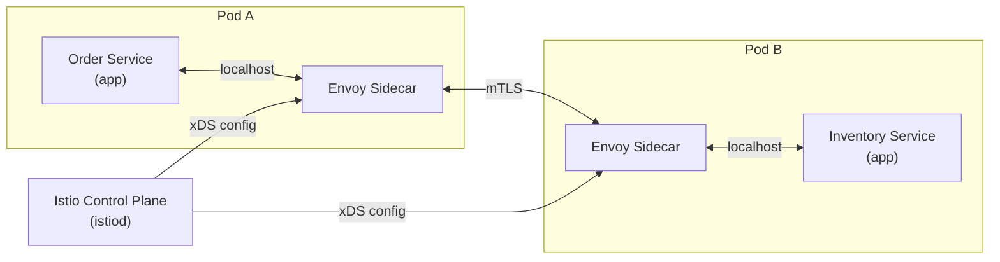

# Service Mesh & Istio

[← Back to README](../README.md)

---

A **service mesh** moves cross-cutting concerns — mTLS, retries, circuit breaking, traffic shifting, and observability — out of application code and into a transparent infrastructure layer. **Istio** is the most widely adopted service mesh: it injects a sidecar proxy (Envoy) into every pod and controls all service-to-service traffic.



---

## Installing Istio

```bash
# Download and install Istio CLI
curl -L https://istio.io/downloadIstio | sh -
export PATH="$PWD/istio-1.22.0/bin:$PATH"

# Install Istio on Kubernetes (demo profile)
istioctl install --set profile=demo -y

# Label namespace for sidecar injection
kubectl label namespace default istio-injection=enabled

# Verify
istioctl verify-install
kubectl get pods -n istio-system
```

---

## Sidecar Injection

Once the namespace is labelled, every new pod gets an Envoy sidecar automatically:

```yaml
# deployment.yaml — no Istio-specific changes needed in your app
apiVersion: apps/v1
kind: Deployment
metadata:
  name: order-service
spec:
  template:
    spec:
      containers:
        - name: order-service
          image: order-service:1.0.0
          ports:
            - containerPort: 8080
      # Istio injects: initContainer (iptables rules) + envoy sidecar
```

```bash
kubectl describe pod order-service-xxx
# Containers: order-service, istio-proxy (envoy)
```

---

## mTLS — Mutual TLS

Istio issues short-lived X.509 certificates to every service and enforces mTLS transparently. Applications use plain HTTP internally; Envoy handles TLS.

```yaml
# PeerAuthentication — enforce STRICT mTLS in a namespace
apiVersion: security.istio.io/v1beta1
kind: PeerAuthentication
metadata:
  name: default
  namespace: production
spec:
  mtls:
    mode: STRICT    # reject non-mTLS connections
```

```yaml
# DestinationRule — configure TLS for a specific service
apiVersion: networking.istio.io/v1beta1
kind: DestinationRule
metadata:
  name: inventory-service
spec:
  host: inventory-service
  trafficPolicy:
    tls:
      mode: ISTIO_MUTUAL   # use Istio-managed certs
```

---

## Traffic Management — VirtualService

```yaml
# VirtualService — route traffic based on headers, weight, or URL
apiVersion: networking.istio.io/v1beta1
kind: VirtualService
metadata:
  name: order-service
spec:
  hosts:
    - order-service
  http:
    # Header-based routing (beta testers)
    - match:
        - headers:
            x-beta-user:
              exact: "true"
      route:
        - destination:
            host: order-service
            subset: v2

    # Canary — 10% to v2
    - route:
        - destination:
            host: order-service
            subset: v1
          weight: 90
        - destination:
            host: order-service
            subset: v2
          weight: 10
```

```yaml
# DestinationRule — define subsets (v1, v2)
apiVersion: networking.istio.io/v1beta1
kind: DestinationRule
metadata:
  name: order-service
spec:
  host: order-service
  subsets:
    - name: v1
      labels:
        version: v1
    - name: v2
      labels:
        version: v2
```

---

## Retries and Timeouts

```yaml
apiVersion: networking.istio.io/v1beta1
kind: VirtualService
metadata:
  name: payment-service
spec:
  hosts:
    - payment-service
  http:
    - timeout: 5s         # request timeout
      retries:
        attempts: 3
        perTryTimeout: 2s
        retryOn: "5xx,reset,connect-failure,retriable-4xx"
      route:
        - destination:
            host: payment-service
```

---

## Circuit Breaking

```yaml
apiVersion: networking.istio.io/v1beta1
kind: DestinationRule
metadata:
  name: inventory-service
spec:
  host: inventory-service
  trafficPolicy:
    connectionPool:
      tcp:
        maxConnections: 100
      http:
        http1MaxPendingRequests: 100
        http2MaxRequests: 1000
    outlierDetection:
      consecutiveGatewayErrors: 5      # trip after 5 consecutive 5xx
      interval: 30s                    # evaluation window
      baseEjectionTime: 30s            # eject host for 30s
      maxEjectionPercent: 50           # eject at most 50% of hosts
```

---

## Fault Injection (Chaos Testing)

```yaml
# Inject a 3s delay for 50% of requests to payment-service
apiVersion: networking.istio.io/v1beta1
kind: VirtualService
metadata:
  name: payment-service
spec:
  hosts:
    - payment-service
  http:
    - fault:
        delay:
          percentage:
            value: 50.0
          fixedDelay: 3s
        abort:
          percentage:
            value: 10.0
          httpStatus: 503    # simulate 10% failures
      route:
        - destination:
            host: payment-service
```

---

## Ingress Gateway

```yaml
# Expose a service to the internet via Istio Gateway
apiVersion: networking.istio.io/v1beta1
kind: Gateway
metadata:
  name: api-gateway
spec:
  selector:
    istio: ingressgateway
  servers:
    - port:
        number: 443
        name: https
        protocol: HTTPS
      tls:
        mode: SIMPLE
        credentialName: api-tls-cert   # K8s Secret with TLS cert
      hosts:
        - api.example.com

---
apiVersion: networking.istio.io/v1beta1
kind: VirtualService
metadata:
  name: api-routes
spec:
  hosts:
    - api.example.com
  gateways:
    - api-gateway
  http:
    - match:
        - uri:
            prefix: /api/orders
      route:
        - destination:
            host: order-service
            port:
              number: 8080
    - match:
        - uri:
            prefix: /api/inventory
      route:
        - destination:
            host: inventory-service
            port:
              number: 8080
```

---

## Authorization Policy

```yaml
# Allow only inventory-service to call order-service
apiVersion: security.istio.io/v1beta1
kind: AuthorizationPolicy
metadata:
  name: order-service-policy
  namespace: production
spec:
  selector:
    matchLabels:
      app: order-service
  rules:
    - from:
        - source:
            principals:
              - "cluster.local/ns/production/sa/inventory-service"
      to:
        - operation:
            methods: ["GET"]
            paths: ["/api/orders/*"]
    - from:
        - source:
            principals:
              - "cluster.local/ns/production/sa/payment-service"
      to:
        - operation:
            methods: ["POST"]
            paths: ["/api/orders/*/confirm"]
```

---

## Observability

Istio automatically generates:
- **Metrics** → Prometheus (`istio_requests_total`, `istio_request_duration_milliseconds`)
- **Traces** → Zipkin / Jaeger (propagate `b3` headers through your app)
- **Logs** → Envoy access logs per request

```bash
# Install observability add-ons
kubectl apply -f samples/addons/prometheus.yaml
kubectl apply -f samples/addons/grafana.yaml
kubectl apply -f samples/addons/kiali.yaml   # service topology UI
kubectl apply -f samples/addons/jaeger.yaml

# Open Kiali dashboard
istioctl dashboard kiali
```

### Trace Propagation in Java

Istio traces require your app to forward these headers:

```java
@Component
public class TraceHeaderForwardingInterceptor implements ClientHttpRequestInterceptor {

    private static final List<String> TRACE_HEADERS = List.of(
        "x-request-id", "x-b3-traceid", "x-b3-spanid",
        "x-b3-parentspanid", "x-b3-sampled", "x-b3-flags", "b3");

    @Override
    public ClientHttpResponse intercept(HttpRequest request, byte[] body,
                                        ClientHttpRequestExecution execution)
            throws IOException {
        HttpServletRequest incoming = getCurrentRequest();
        TRACE_HEADERS.forEach(header -> {
            String value = incoming.getHeader(header);
            if (value != null) request.getHeaders().set(header, value);
        });
        return execution.execute(request, body);
    }
}
```

---

## Istio vs Application-Level Resilience

| Concern | Istio (mesh level) | Application (Resilience4j) |
|---------|-------------------|--------------------------|
| Retries | VirtualService `retries` | `@Retry` |
| Timeout | VirtualService `timeout` | `@TimeLimiter` |
| Circuit breaker | `outlierDetection` | `@CircuitBreaker` |
| mTLS | `PeerAuthentication` | Not applicable |
| Traffic shifting | VirtualService `weight` | Not applicable |
| Fault injection | VirtualService `fault` | Not applicable |

Use both: Istio for infrastructure-level defaults; Resilience4j for fine-grained business logic.

---

## Service Mesh Summary

| Concept | Detail |
|---------|--------|
| Sidecar (Envoy) | Transparent proxy injected into every pod — intercepts all traffic |
| `PeerAuthentication` | Enforce mTLS between services — STRICT or PERMISSIVE mode |
| `VirtualService` | Define traffic routing rules — canary, header routing, fault injection |
| `DestinationRule` | Configure load balancing, connection pool, circuit breaking per host |
| `Gateway` | Expose services externally via the Istio ingress gateway |
| `AuthorizationPolicy` | Fine-grained service-to-service access control using SPIFFE identities |
| `outlierDetection` | Istio circuit breaker — ejects unhealthy endpoints from load balancer |
| Trace header propagation | Forward `x-b3-*` or `b3` headers for distributed trace correlation |
| Kiali | Service topology dashboard showing traffic flow, health, and configuration |

---

[← Back to README](../README.md)
