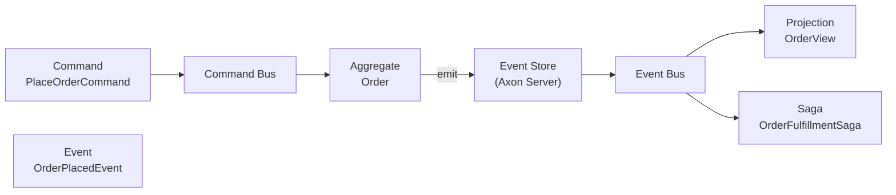

# Axon Framework

[← Back to README](../README.md)

---

**Axon Framework** is a Java framework for building applications using CQRS (Command Query Responsibility Segregation) and Event Sourcing. It provides a command bus, event bus, query bus, event store, and saga infrastructure — letting you focus on domain logic while Axon handles the message routing plumbing.



---

## Dependencies

```xml
<dependencyManagement>
    <dependencies>
        <dependency>
            <groupId>org.axonframework</groupId>
            <artifactId>axon-bom</artifactId>
            <version>4.10.0</version>
            <type>pom</type>
            <scope>import</scope>
        </dependency>
    </dependencies>
</dependencyManagement>

<dependencies>
    <dependency>
        <groupId>org.axonframework</groupId>
        <artifactId>axon-spring-boot-starter</artifactId>
    </dependency>
</dependencies>
```

```yaml
axon:
  axonserver:
    servers: localhost:8124   # Axon Server (event store + message routing)
  serializer:
    events: jackson
    messages: jackson
    general: xstream
```

---

## Commands

Commands are plain POJOs that express intent. They target a specific aggregate via `@TargetAggregateIdentifier`.

```java
public record PlaceOrderCommand(
    @TargetAggregateIdentifier UUID orderId,
    UUID customerId,
    List<OrderLine> lines
) {}

public record ConfirmOrderCommand(
    @TargetAggregateIdentifier UUID orderId
) {}

public record CancelOrderCommand(
    @TargetAggregateIdentifier UUID orderId,
    String reason
) {}
```

---

## Aggregate — Event-Sourced

The aggregate handles commands and emits events. Its state is rebuilt by replaying events.

```java
@Aggregate
public class Order {

    @AggregateIdentifier
    private UUID orderId;
    private OrderStatus status;
    private UUID customerId;

    // Required by Axon for reconstruction
    protected Order() {}

    // Creation command handler
    @CommandHandler
    public Order(PlaceOrderCommand cmd) {
        // Validate
        if (cmd.lines().isEmpty())
            throw new IllegalArgumentException("Order must have at least one line");

        // Emit event — don't change state directly
        AggregateLifecycle.apply(new OrderPlacedEvent(
            cmd.orderId(), cmd.customerId(), cmd.lines()));
    }

    @CommandHandler
    public void handle(ConfirmOrderCommand cmd) {
        if (status != OrderStatus.PENDING)
            throw new IllegalStateException("Can only confirm a PENDING order");
        AggregateLifecycle.apply(new OrderConfirmedEvent(orderId));
    }

    @CommandHandler
    public void handle(CancelOrderCommand cmd) {
        if (status == OrderStatus.SHIPPED)
            throw new IllegalStateException("Cannot cancel a shipped order");
        AggregateLifecycle.apply(new OrderCancelledEvent(orderId, cmd.reason()));
    }

    // Event sourcing handlers — rebuild state from events
    @EventSourcingHandler
    public void on(OrderPlacedEvent event) {
        this.orderId    = event.orderId();
        this.customerId = event.customerId();
        this.status     = OrderStatus.PENDING;
    }

    @EventSourcingHandler
    public void on(OrderConfirmedEvent event) {
        this.status = OrderStatus.CONFIRMED;
    }

    @EventSourcingHandler
    public void on(OrderCancelledEvent event) {
        this.status = OrderStatus.CANCELLED;
    }
}
```

---

## Events

```java
public record OrderPlacedEvent(UUID orderId, UUID customerId, List<OrderLine> lines) {}
public record OrderConfirmedEvent(UUID orderId) {}
public record OrderCancelledEvent(UUID orderId, String reason) {}
public record InventoryReservedEvent(UUID orderId) {}
public record PaymentProcessedEvent(UUID orderId, String transactionId) {}
```

---

## Command Gateway — Sending Commands

```java
@RestController
@RequiredArgsConstructor
@RequestMapping("/api/orders")
public class OrderController {

    private final CommandGateway commandGateway;

    @PostMapping
    @ResponseStatus(HttpStatus.CREATED)
    public CompletableFuture<UUID> placeOrder(@RequestBody PlaceOrderRequest req) {
        UUID orderId = UUID.randomUUID();
        return commandGateway.send(new PlaceOrderCommand(
            orderId, req.customerId(), req.lines()));
    }

    @PostMapping("/{id}/confirm")
    public CompletableFuture<Void> confirm(@PathVariable UUID id) {
        return commandGateway.send(new ConfirmOrderCommand(id));
    }
}
```

---

## Projections — Read Models

Projections listen to events and build query-optimised read models.

```java
@Component
@ProcessingGroup("order-projections")
public class OrderProjection {

    private final OrderViewRepository viewRepo;

    @EventHandler
    public void on(OrderPlacedEvent event) {
        viewRepo.save(new OrderView(
            event.orderId(), event.customerId(), "PENDING",
            Instant.now()));
    }

    @EventHandler
    public void on(OrderConfirmedEvent event) {
        viewRepo.findById(event.orderId())
            .ifPresent(view -> {
                view.setStatus("CONFIRMED");
                viewRepo.save(view);
            });
    }

    @EventHandler
    public void on(OrderCancelledEvent event) {
        viewRepo.findById(event.orderId())
            .ifPresent(view -> {
                view.setStatus("CANCELLED");
                viewRepo.save(view);
            });
    }
}
```

---

## Query Bus

```java
// Query
public record FindOrderByIdQuery(UUID orderId) {}
public record FindOrdersByCustomerQuery(UUID customerId) {}

// Query handler (lives in the projection)
@QueryHandler
public OrderView handle(FindOrderByIdQuery query) {
    return viewRepo.findById(query.orderId())
        .orElseThrow(() -> new OrderNotFoundException(query.orderId()));
}

@QueryHandler
public List<OrderView> handle(FindOrdersByCustomerQuery query) {
    return viewRepo.findByCustomerId(query.customerId());
}
```

```java
// Controller sends queries
@RestController
@RequiredArgsConstructor
public class OrderQueryController {

    private final QueryGateway queryGateway;

    @GetMapping("/api/orders/{id}")
    public CompletableFuture<OrderView> getOrder(@PathVariable UUID id) {
        return queryGateway.query(new FindOrderByIdQuery(id), OrderView.class);
    }

    @GetMapping("/api/orders")
    public CompletableFuture<List<OrderView>> listByCustomer(@RequestParam UUID customerId) {
        return queryGateway.query(
            new FindOrdersByCustomerQuery(customerId),
            ResponseTypes.multipleInstancesOf(OrderView.class));
    }
}
```

---

## Saga — Distributed Transactions

```java
@Saga
public class OrderFulfillmentSaga {

    @Autowired
    private transient CommandGateway commandGateway;

    private UUID orderId;

    @StartSaga
    @SagaEventHandler(associationProperty = "orderId")
    public void on(OrderPlacedEvent event) {
        this.orderId = event.orderId();
        commandGateway.send(new ReserveInventoryCommand(event.orderId(), event.lines()));
    }

    @SagaEventHandler(associationProperty = "orderId")
    public void on(InventoryReservedEvent event) {
        commandGateway.send(new ProcessPaymentCommand(event.orderId()));
    }

    @SagaEventHandler(associationProperty = "orderId")
    public void on(InventoryReservationFailedEvent event) {
        commandGateway.send(new CancelOrderCommand(event.orderId(), "Inventory unavailable"));
        SagaLifecycle.end();
    }

    @SagaEventHandler(associationProperty = "orderId")
    public void on(PaymentProcessedEvent event) {
        commandGateway.send(new ConfirmOrderCommand(event.orderId()));
        SagaLifecycle.end();
    }

    @EndSaga
    @SagaEventHandler(associationProperty = "orderId")
    public void on(OrderConfirmedEvent event) {
        // Saga complete
    }

    @SagaEventHandler(associationProperty = "orderId")
    public void on(PaymentFailedEvent event) {
        commandGateway.send(new ReleaseInventoryCommand(event.orderId()));
        commandGateway.send(new CancelOrderCommand(event.orderId(), "Payment failed"));
        SagaLifecycle.end();
    }
}
```

---

## Event Replay and Tracking Processors

```java
// Reset a projection to rebuild from scratch
@Autowired EventProcessingConfiguration processingConfig;

public void replayProjection() {
    processingConfig.eventProcessorByProcessingGroup("order-projections",
        TrackingEventProcessor.class)
        .ifPresent(processor -> {
            processor.shutDown();
            processor.resetTokens();
            processor.start();
        });
}
```

```yaml
# Configure processors
axon:
  eventhandling:
    processors:
      order-projections:
        mode: tracking          # pull events from event store (vs subscribing)
        thread-count: 2
        batch-size: 100
```

---

## Axon Framework Summary

| Concept | Annotation / Class | Detail |
|---------|-------------------|--------|
| Aggregate | `@Aggregate` | Handles commands, applies events, state from event replay |
| Command handler | `@CommandHandler` | Method that handles a specific command type |
| Event sourcing handler | `@EventSourcingHandler` | Rebuilds aggregate state from events |
| `AggregateLifecycle.apply()` | | Emit an event from within an aggregate |
| Event handler | `@EventHandler` | Projection method that updates read model |
| Query handler | `@QueryHandler` | Returns read model for a query type |
| Saga | `@Saga` + `@SagaEventHandler` | Stateful process manager for distributed transactions |
| `CommandGateway` | | Send commands; returns `CompletableFuture` |
| `QueryGateway` | | Send queries; returns `CompletableFuture` |
| `EventGateway` | | Publish events directly (outside aggregates) |
| Tracking processor | `TrackingEventProcessor` | Pulls events from store; supports replay |
| Subscribing processor | `SubscribingEventProcessor` | Push-based; no replay support |
| Axon Server | | Event store + message routing server |

---

[← Back to README](../README.md)
