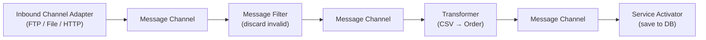

# Spring Integration

[← Back to README](../README.md)

---

**Spring Integration** implements the **Enterprise Integration Patterns** (EIP) from Hohpe & Woolf. It connects systems — files, databases, HTTP endpoints, messaging brokers — using a uniform `Message` model and a pipeline of channels, filters, transformers, and routers. Think of it as a lightweight Apache Camel built into the Spring ecosystem.



---

## Dependency

```xml
<dependency>
    <groupId>org.springframework.boot</groupId>
    <artifactId>spring-boot-starter-integration</artifactId>
</dependency>
<!-- Additional adapters as needed -->
<dependency>
    <groupId>org.springframework.integration</groupId>
    <artifactId>spring-integration-file</artifactId>
</dependency>
<dependency>
    <groupId>org.springframework.integration</groupId>
    <artifactId>spring-integration-kafka</artifactId>
</dependency>
<dependency>
    <groupId>org.springframework.integration</groupId>
    <artifactId>spring-integration-http</artifactId>
</dependency>
```

---

## Core Concepts

| Concept | Description |
|---------|-------------|
| `Message<T>` | Payload + headers — the unit of data flowing through the pipeline |
| `MessageChannel` | Conduit between components — `DirectChannel` (sync) or `QueueChannel` (async) |
| Channel Adapter | Bridge between the integration flow and the outside world (file, HTTP, Kafka) |
| Transformer | Converts one message type to another |
| Filter | Passes or discards messages based on a predicate |
| Router | Sends a message to one or more channels based on content |
| Splitter | Splits one message into many |
| Aggregator | Collects related messages and emits a single combined message |
| Service Activator | Invokes a Spring bean method with the message |
| Gateway | Clean Java interface hiding the messaging infrastructure |

---

## DSL Flow Definition

```java
@Configuration
@EnableIntegration
public class OrderImportFlow {

    @Bean
    public IntegrationFlow csvOrderImportFlow() {
        return IntegrationFlow
            // Inbound — poll a directory for CSV files every 5s
            .from(Files.inboundAdapter(new File("/var/orders/incoming"))
                    .patternFilter("*.csv"),
                e -> e.poller(Pollers.fixedDelay(Duration.ofSeconds(5))))

            // Transform — parse CSV into a list of Order objects
            .transform(CsvOrderParser::parse)

            // Split — one message per order
            .split()

            // Filter — skip orders below minimum value
            .filter(Order.class, order -> order.getTotal().compareTo(new BigDecimal("1")) > 0)

            // Route — send VIP orders to priority channel
            .route(Order.class,
                order -> order.isVip() ? "priority" : "standard",
                routerSpec -> routerSpec
                    .channelMapping("priority", "priorityOrderChannel")
                    .channelMapping("standard", "standardOrderChannel"))
            .get();
    }

    @Bean
    public IntegrationFlow standardOrderFlow() {
        return IntegrationFlow.from("standardOrderChannel")
            .handle(orderService(), "save")
            .handle(kafkaProducer(), "send")
            .get();
    }

    @Bean
    public IntegrationFlow priorityOrderFlow() {
        return IntegrationFlow.from("priorityOrderChannel")
            .handle((order, headers) -> {
                orderService().saveWithPriority((Order) order);
                return null;   // null = message consumed, no output
            })
            .get();
    }
}
```

---

## Channels

```java
// Direct channel (synchronous, one subscriber)
@Bean
public MessageChannel standardOrderChannel() {
    return new DirectChannel();
}

// Queue channel (asynchronous, buffered)
@Bean
public MessageChannel asyncOrderChannel() {
    return new QueueChannel(100);   // capacity 100
}

// Publish-subscribe channel (fan-out to all subscribers)
@Bean
public MessageChannel broadcastChannel() {
    return new PublishSubscribeChannel(taskExecutor());
}

// Priority queue channel (processes high-priority first)
@Bean
public MessageChannel priorityChannel() {
    return new PriorityChannel(100,
        Comparator.comparing(m -> (Integer) m.getHeaders()
            .getOrDefault("priority", 0)));
}
```

---

## Messaging Gateway — Clean API

Hide the integration infrastructure behind a plain Java interface:

```java
@MessagingGateway(defaultRequestChannel = "orderImportChannel")
public interface OrderImportGateway {

    // Send and forget
    void importOrder(@Payload Order order);

    // Request-reply
    @Gateway(requestChannel = "orderValidationChannel",
             replyChannel = "validationResultChannel")
    ValidationResult validate(@Payload Order order, @Header("correlationId") String correlationId);
}

// Usage — caller knows nothing about messaging
@Service
@RequiredArgsConstructor
public class OrderService {
    private final OrderImportGateway gateway;

    public void importFromCsv(Order order) {
        gateway.importOrder(order);
    }
}
```

---

## Transformers

```java
@Configuration
public class OrderTransformers {

    @Bean
    public IntegrationFlow transformFlow() {
        return IntegrationFlow.from("rawOrderChannel")
            // Lambda transformer
            .transform(String.class, csv -> Order.parse(csv))

            // Method reference
            .transform(orderMapper()::toDto)

            // Add/modify headers
            .enrichHeaders(h -> h
                .header("source", "csv-import")
                .headerExpression("priority",
                    "payload.total > 1000 ? 'HIGH' : 'NORMAL'"))

            // Log (for debugging)
            .log(LoggingHandler.Level.DEBUG, "order-pipeline",
                m -> "Processing order: " + m.getPayload())

            .channel("processedOrderChannel")
            .get();
    }
}
```

---

## Aggregator — Collect and Combine

```java
@Bean
public IntegrationFlow orderLineAggregationFlow() {
    return IntegrationFlow.from("orderLineChannel")
        .aggregate(aggregatorSpec -> aggregatorSpec
            .correlationStrategy(
                m -> m.getHeaders().get("orderId"))   // group by orderId
            .releaseStrategy(
                group -> group.size() >= group.getMessages().stream()
                    .mapToInt(m -> (Integer) m.getHeaders().get("totalLines"))
                    .max().orElse(0))                 // release when all lines received
            .outputProcessor(group -> {
                List<OrderLine> lines = group.getMessages().stream()
                    .map(m -> (OrderLine) m.getPayload())
                    .toList();
                UUID orderId = (UUID) group.getOne().getHeaders().get("orderId");
                return new Order(orderId, lines);
            })
            .expireGroupsUponCompletion(true))
        .channel("completeOrderChannel")
        .get();
}
```

---

## Error Handling

```java
@Bean
public IntegrationFlow orderFlowWithErrors() {
    return IntegrationFlow.from("orderChannel")
        .handle(orderService(), "process",
            e -> e.advice(retryAdvice(), circuitBreakerAdvice()))
        .get();
}

@Bean
public RequestHandlerRetryAdvice retryAdvice() {
    RequestHandlerRetryAdvice advice = new RequestHandlerRetryAdvice();
    RetryTemplate template = RetryTemplate.builder()
        .maxAttempts(3)
        .exponentialBackoff(1000, 2, 10000)
        .retryOn(IOException.class)
        .build();
    advice.setRetryTemplate(template);
    return advice;
}

// Global error channel
@ServiceActivator(inputChannel = "errorChannel")
public void handleError(ErrorMessage error) {
    Throwable cause = error.getPayload().getCause();
    Message<?> failedMessage = error.getPayload().getFailedMessage();
    log.error("Integration error processing {}: {}", failedMessage, cause.getMessage());
    deadLetterRepo.save(failedMessage.getPayload(), cause.getMessage());
}
```

---

## Kafka Integration

```java
@Configuration
public class KafkaIntegrationFlow {

    @Bean
    public IntegrationFlow kafkaInboundFlow(ConsumerFactory<String, Order> cf) {
        return IntegrationFlow
            .from(Kafka.messageDrivenChannelAdapter(cf,
                KafkaMessageDrivenChannelAdapter.ListenerMode.record,
                "orders"))
            .transform(Order.class, order -> enrichOrder(order))
            .handle(orderService(), "process")
            .get();
    }

    @Bean
    public IntegrationFlow kafkaOutboundFlow(KafkaTemplate<String, Object> template) {
        return IntegrationFlow.from("processedOrderChannel")
            .handle(Kafka.outboundChannelAdapter(template)
                .topic("processed-orders")
                .messageKey(m -> ((Order) m.getPayload()).getId().toString()))
            .get();
    }
}
```

---

## HTTP Inbound / Outbound

```java
@Bean
public IntegrationFlow httpInboundFlow() {
    return IntegrationFlow
        .from(Http.inboundGateway("/api/integration/orders")
            .requestMapping(m -> m.methods(HttpMethod.POST))
            .requestPayloadType(Order.class))
        .handle(orderService(), "processIntegrationOrder")
        .get();
}

@Bean
public IntegrationFlow httpOutboundFlow() {
    return IntegrationFlow.from("notificationChannel")
        .handle(Http.outboundGateway("http://notification-service/api/notify")
            .httpMethod(HttpMethod.POST)
            .expectedResponseType(Void.class))
        .get();
}
```

---

## Spring Integration Summary

| Concept | Detail |
|---------|--------|
| `IntegrationFlow` | DSL for defining a pipeline of components |
| `DirectChannel` | Synchronous point-to-point; sender blocks until handler returns |
| `QueueChannel` | Async buffered channel; requires a poller |
| `PublishSubscribeChannel` | Fan-out to all subscribers simultaneously |
| `@MessagingGateway` | Interface-based entry point hiding the channel infrastructure |
| `.transform(fn)` | Convert payload type |
| `.filter(predicate)` | Drop messages that don't match |
| `.route(fn)` | Send to one of several output channels based on message content |
| `.split()` | One message → many messages (e.g., collection items) |
| `.aggregate()` | Many messages → one message (by correlation key + release strategy) |
| `.handle(bean, method)` | Invoke a Spring bean method with the message |
| `errorChannel` | Default destination for unhandled exceptions |
| `.log(level, category)` | Debug-log message at a pipeline step |
| `Kafka.messageDrivenChannelAdapter` | Consume Kafka records as integration messages |

---

[← Back to README](../README.md)
