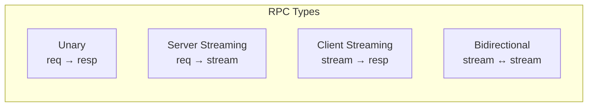

# gRPC Advanced

[← Back to README](../README.md)

---

Beyond basic unary RPC, gRPC supports **server streaming**, **client streaming**, and **bidirectional streaming**. **Interceptors** add cross-cutting concerns (auth, logging, tracing). **Deadlines** propagate timeout budgets across service chains. This doc builds on the basics from doc 57 (gRPC).



---

## Proto — All Four RPC Types

```protobuf
syntax = "proto3";
package com.example.orders;
option java_package = "com.example.grpc";
option java_multiple_files = true;

service OrderService {
    // Unary
    rpc PlaceOrder (PlaceOrderRequest) returns (OrderResponse);

    // Server streaming — stream order updates to client
    rpc WatchOrder (WatchOrderRequest) returns (stream OrderStatusUpdate);

    // Client streaming — upload many order lines
    rpc UploadOrderLines (stream OrderLine) returns (UploadSummary);

    // Bidirectional — interactive order negotiation
    rpc NegotiateOrder (stream NegotiationMessage) returns (stream NegotiationMessage);
}

message PlaceOrderRequest  { string customer_id = 1; repeated OrderLine lines = 2; }
message OrderResponse      { string order_id = 1; string status = 2; }
message WatchOrderRequest  { string order_id = 1; }
message OrderStatusUpdate  { string order_id = 1; string status = 2; int64 timestamp = 3; }
message OrderLine          { string product_id = 1; int32 quantity = 2; double unit_price = 3; }
message UploadSummary      { int32 lines_accepted = 1; int32 lines_rejected = 2; double total = 3; }
message NegotiationMessage { string type = 1; string payload = 2; }
```

---

## Server Implementation

### Unary

```java
@GrpcService
public class OrderGrpcService extends OrderServiceGrpc.OrderServiceImplBase {

    @Override
    public void placeOrder(PlaceOrderRequest request,
                            StreamObserver<OrderResponse> responseObserver) {
        try {
            Order order = orderService.place(request.getCustomerId(),
                request.getLinesList());
            responseObserver.onNext(OrderResponse.newBuilder()
                .setOrderId(order.getId().toString())
                .setStatus(order.getStatus())
                .build());
            responseObserver.onCompleted();
        } catch (Exception e) {
            responseObserver.onError(Status.INTERNAL
                .withDescription(e.getMessage())
                .asRuntimeException());
        }
    }
```

### Server Streaming

```java
    @Override
    public void watchOrder(WatchOrderRequest request,
                            StreamObserver<OrderStatusUpdate> responseObserver) {
        UUID orderId = UUID.fromString(request.getOrderId());

        // Subscribe to status changes (e.g., from Kafka)
        Disposable subscription = orderEventBus
            .subscribe(orderId, statusUpdate -> {
                if (!responseObserver.isReady()) return;

                responseObserver.onNext(OrderStatusUpdate.newBuilder()
                    .setOrderId(orderId.toString())
                    .setStatus(statusUpdate.getStatus())
                    .setTimestamp(statusUpdate.getTimestamp().toEpochMilli())
                    .build());

                if (statusUpdate.getStatus().equals("DELIVERED")) {
                    responseObserver.onCompleted();
                }
            });

        // Clean up when client disconnects
        ((ServerCallStreamObserver<OrderStatusUpdate>) responseObserver)
            .setOnCancelHandler(subscription::dispose);
    }
```

### Client Streaming

```java
    @Override
    public StreamObserver<OrderLine> uploadOrderLines(
            StreamObserver<UploadSummary> responseObserver) {

        return new StreamObserver<>() {
            private int accepted = 0;
            private int rejected = 0;
            private double total = 0;

            @Override
            public void onNext(OrderLine line) {
                if (line.getQuantity() <= 0 || line.getUnitPrice() <= 0) {
                    rejected++;
                } else {
                    total += line.getQuantity() * line.getUnitPrice();
                    lineRepo.save(line);
                    accepted++;
                }
            }

            @Override
            public void onError(Throwable t) {
                log.error("Client streaming error", t);
            }

            @Override
            public void onCompleted() {
                responseObserver.onNext(UploadSummary.newBuilder()
                    .setLinesAccepted(accepted)
                    .setLinesRejected(rejected)
                    .setTotal(total)
                    .build());
                responseObserver.onCompleted();
            }
        };
    }
```

### Bidirectional Streaming

```java
    @Override
    public StreamObserver<NegotiationMessage> negotiateOrder(
            StreamObserver<NegotiationMessage> responseObserver) {

        return new StreamObserver<>() {
            @Override
            public void onNext(NegotiationMessage message) {
                NegotiationMessage reply = switch (message.getType()) {
                    case "OFFER"     -> handleOffer(message.getPayload());
                    case "COUNTER"   -> handleCounter(message.getPayload());
                    case "ACCEPT"    -> handleAccept(message.getPayload());
                    default          -> NegotiationMessage.newBuilder()
                                        .setType("ERROR").setPayload("Unknown type").build();
                };
                responseObserver.onNext(reply);
            }

            @Override
            public void onError(Throwable t)  { log.error("Negotiation error", t); }

            @Override
            public void onCompleted()          { responseObserver.onCompleted(); }
        };
    }
}
```

---

## Client

### Blocking Stub (Unary)

```java
@Component
@RequiredArgsConstructor
public class OrderGrpcClient {

    private final OrderServiceGrpc.OrderServiceBlockingStub blockingStub;

    public OrderResponse placeOrder(String customerId, List<OrderLine> lines) {
        PlaceOrderRequest request = PlaceOrderRequest.newBuilder()
            .setCustomerId(customerId)
            .addAllLines(lines)
            .build();
        return blockingStub
            .withDeadline(Deadline.after(5, TimeUnit.SECONDS))
            .placeOrder(request);
    }
```

### Async Stub (Server Streaming)

```java
    private final OrderServiceGrpc.OrderServiceStub asyncStub;

    public void watchOrder(String orderId, Consumer<OrderStatusUpdate> onUpdate,
                            Runnable onDone) {
        asyncStub.watchOrder(
            WatchOrderRequest.newBuilder().setOrderId(orderId).build(),
            new StreamObserver<>() {
                @Override public void onNext(OrderStatusUpdate u)  { onUpdate.accept(u); }
                @Override public void onError(Throwable t)          { log.error("Watch error", t); }
                @Override public void onCompleted()                  { onDone.run(); }
            });
    }
```

### Client Streaming

```java
    public UploadSummary uploadLines(List<OrderLine> lines) throws InterruptedException {
        CountDownLatch latch = new CountDownLatch(1);
        AtomicReference<UploadSummary> result = new AtomicReference<>();

        StreamObserver<OrderLine> requestObserver = asyncStub.uploadOrderLines(
            new StreamObserver<>() {
                @Override public void onNext(UploadSummary s)  { result.set(s); }
                @Override public void onError(Throwable t)      { latch.countDown(); }
                @Override public void onCompleted()              { latch.countDown(); }
            });

        lines.forEach(requestObserver::onNext);
        requestObserver.onCompleted();

        latch.await(10, TimeUnit.SECONDS);
        return result.get();
    }
}
```

---

## Server Interceptors

```java
@Component
@GrpcGlobalServerInterceptor
public class AuthServerInterceptor implements ServerInterceptor {

    @Override
    public <Q, R> ServerCall.Listener<Q> interceptCall(
            ServerCall<Q, R> call,
            Metadata headers,
            ServerCallHandler<Q, R> next) {

        String token = headers.get(
            Metadata.Key.of("authorization", Metadata.ASCII_STRING_MARSHALLER));

        if (token == null || !token.startsWith("Bearer ")) {
            call.close(Status.UNAUTHENTICATED
                .withDescription("Missing or invalid token"), new Metadata());
            return new ServerCall.Listener<>() {};
        }

        try {
            Claims claims = jwtService.validate(token.substring(7));
            Context ctx = Context.current()
                .withValue(USER_CONTEXT_KEY, claims);
            return Contexts.interceptCall(ctx, call, headers, next);
        } catch (Exception e) {
            call.close(Status.UNAUTHENTICATED.withDescription(e.getMessage()),
                new Metadata());
            return new ServerCall.Listener<>() {};
        }
    }
}
```

### Logging Interceptor

```java
@Component
@GrpcGlobalServerInterceptor
@Order(Ordered.HIGHEST_PRECEDENCE)
public class LoggingServerInterceptor implements ServerInterceptor {

    @Override
    public <Q, R> ServerCall.Listener<Q> interceptCall(
            ServerCall<Q, R> call, Metadata headers, ServerCallHandler<Q, R> next) {

        long start = System.currentTimeMillis();
        String method = call.getMethodDescriptor().getFullMethodName();

        ServerCall<Q, R> wrappedCall = new ForwardingServerCall.SimpleForwardingServerCall<>(call) {
            @Override
            public void close(Status status, Metadata trailers) {
                log.info("gRPC {} {} {}ms",
                    method, status.getCode(), System.currentTimeMillis() - start);
                super.close(status, trailers);
            }
        };

        return next.startCall(wrappedCall, headers);
    }
}
```

---

## Client Interceptors

```java
@Configuration
public class GrpcClientConfig {

    @Bean
    public ClientInterceptor deadlineInterceptor() {
        return new ClientInterceptor() {
            @Override
            public <Q, R> ClientCall<Q, R> interceptCall(
                    MethodDescriptor<Q, R> method, CallOptions options, Channel next) {

                // Enforce 5s deadline if none set
                if (options.getDeadline() == null) {
                    options = options.withDeadline(Deadline.after(5, TimeUnit.SECONDS));
                }
                return next.newCall(method, options);
            }
        };
    }
}
```

---

## Deadlines and Cancellation

```java
// Set deadline on a call
OrderResponse response = stub
    .withDeadline(Deadline.after(3, TimeUnit.SECONDS))
    .placeOrder(request);

// Propagate deadline from parent call (deadline budget)
@Override
public void placeOrder(PlaceOrderRequest req,
                        StreamObserver<OrderResponse> responseObserver) {
    // The gRPC framework propagates the deadline automatically when using
    // stub.withDeadlineAfter() — downstream calls inherit the remaining budget
    InventoryResponse inv = inventoryStub
        .withDeadline(Context.current().getDeadline())  // inherit remaining budget
        .checkStock(StockRequest.newBuilder()
            .setProductId(req.getLines(0).getProductId()).build());
}
```

---

## Error Status Codes

```java
// Return appropriate gRPC status codes
responseObserver.onError(Status.NOT_FOUND
    .withDescription("Order " + orderId + " not found")
    .asRuntimeException());

responseObserver.onError(Status.INVALID_ARGUMENT
    .withDescription("Quantity must be positive")
    .asRuntimeException());

responseObserver.onError(Status.RESOURCE_EXHAUSTED
    .withDescription("Too many requests")
    .asRuntimeException());

responseObserver.onError(Status.UNAVAILABLE
    .withDescription("Payment service unavailable")
    .asRuntimeException());
```

| Status | HTTP Equivalent | Use |
|--------|----------------|-----|
| `OK` | 200 | Success |
| `NOT_FOUND` | 404 | Resource not found |
| `INVALID_ARGUMENT` | 400 | Bad request |
| `PERMISSION_DENIED` | 403 | Authorisation failure |
| `UNAUTHENTICATED` | 401 | Missing/invalid credentials |
| `RESOURCE_EXHAUSTED` | 429 | Rate limit or quota exceeded |
| `UNAVAILABLE` | 503 | Service temporarily down |
| `DEADLINE_EXCEEDED` | 504 | Timeout |
| `INTERNAL` | 500 | Unexpected server error |
| `ALREADY_EXISTS` | 409 | Duplicate resource |

---

## gRPC Advanced Summary

| Concept | Detail |
|---------|--------|
| Unary RPC | Single request, single response — simplest pattern |
| Server streaming | One request, stream of responses — live updates, feeds |
| Client streaming | Stream of requests, single response — file upload, batch |
| Bidirectional streaming | Dual streams — chat, negotiation, real-time collaboration |
| `@GrpcGlobalServerInterceptor` | Applied to all services on the server |
| `@GrpcGlobalClientInterceptor` | Applied to all stubs on the client |
| `Deadline.after(n, unit)` | Set timeout on a stub call |
| `Context.current().getDeadline()` | Propagate parent deadline to downstream calls |
| Status codes | Rich error model beyond HTTP status codes |
| `ServerCallStreamObserver.setOnCancelHandler` | Clean up server resources when client disconnects |
| `ForwardingServerCall` | Wrap a server call in an interceptor to observe close/send |
| gRPC-Web | Browser-compatible gRPC via HTTP/1.1 — needs an Envoy proxy |

---

[← Back to README](../README.md)
