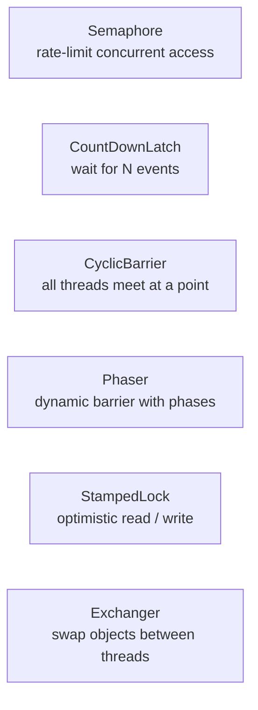

# Java Concurrency Utilities Deep Dive

[← Back to README](../README.md)

---

`java.util.concurrent` provides high-level synchronisation primitives that go beyond `synchronized` and `wait/notify`. Each class solves a specific coordination problem — knowing which tool to reach for prevents reinventing broken wheels with raw monitors.



---

## Semaphore — Limit Concurrent Access

A `Semaphore` controls how many threads can access a resource simultaneously. Useful for connection pools, rate limiting, and bounded resource access.

```java
// Allow at most 3 concurrent DB connections
Semaphore semaphore = new Semaphore(3);

public Result queryDatabase(String sql) throws InterruptedException {
    semaphore.acquire();   // blocks if 3 threads already holding permits
    try {
        return db.execute(sql);
    } finally {
        semaphore.release();
    }
}

// Non-blocking attempt
if (semaphore.tryAcquire(200, TimeUnit.MILLISECONDS)) {
    try {
        return db.execute(sql);
    } finally {
        semaphore.release();
    }
} else {
    throw new ResourceBusyException("All connections in use");
}

// Fair semaphore — FIFO ordering
Semaphore fairSemaphore = new Semaphore(3, true);

// Query current state
log.info("Available permits: {}", semaphore.availablePermits());
log.info("Queue length: {}", semaphore.getQueueLength());
```

---

## CountDownLatch — Wait for N Events

A one-shot gate: threads wait until a counter reaches zero. The counter cannot be reset.

```java
// Use case: wait for all services to start before accepting traffic
CountDownLatch startLatch = new CountDownLatch(3);   // wait for 3 services

// Services signal readiness
new Thread(() -> {
    inventoryService.start();
    startLatch.countDown();   // decrement counter
}).start();

new Thread(() -> {
    paymentService.start();
    startLatch.countDown();
}).start();

new Thread(() -> {
    notificationService.start();
    startLatch.countDown();
}).start();

// Main thread waits for all three
boolean allStarted = startLatch.await(30, TimeUnit.SECONDS);
if (!allStarted) throw new TimeoutException("Services did not start in time");
log.info("All services ready — accepting traffic");

// Use case: start-gun for concurrent tests
CountDownLatch startGun = new CountDownLatch(1);
CountDownLatch doneLatch = new CountDownLatch(10);

for (int i = 0; i < 10; i++) {
    new Thread(() -> {
        try {
            startGun.await();       // all threads wait here
            doWork();
        } finally {
            doneLatch.countDown();  // signal completion
        }
    }).start();
}

startGun.countDown();               // release all threads simultaneously
doneLatch.await();                  // wait for all to finish
```

---

## CyclicBarrier — Rendezvous Point

All threads must arrive before any can proceed. Unlike `CountDownLatch`, it can be **reset** and reused across phases.

```java
// Use case: parallel map-reduce phases
int threadCount = 4;
CyclicBarrier barrier = new CyclicBarrier(threadCount, () ->
    log.info("Phase complete — all threads at barrier"));

for (int i = 0; i < threadCount; i++) {
    final int id = i;
    Thread.ofVirtual().start(() -> {
        try {
            // Phase 1 — all threads compute their partition
            List<Result> partial = computePartition(id, threadCount);

            barrier.await();   // wait for ALL threads to finish phase 1

            // Phase 2 — all threads now merge results safely
            mergeResults(partial);

            barrier.await();   // wait for ALL threads to finish phase 2

            log.info("Thread {} done", id);
        } catch (InterruptedException | BrokenBarrierException e) {
            Thread.currentThread().interrupt();
        }
    });
}

// Reset for reuse (only when no threads are waiting)
barrier.reset();
```

---

## Phaser — Dynamic Barrier with Phases

`Phaser` is a flexible `CyclicBarrier` where parties can register and deregister dynamically. Useful for tree-structured parallel tasks.

```java
// Use case: multi-phase document processing pipeline
Phaser phaser = new Phaser(1);   // register the main thread (1 party)

List<Document> documents = loadDocuments();

// Register one party per document
documents.forEach(doc -> phaser.register());

for (Document doc : documents) {
    Thread.ofVirtual().start(() -> {
        // Phase 0: parse
        doc.setParsed(parse(doc));
        phaser.arriveAndAwaitAdvance();   // wait for all to finish parsing

        // Phase 1: validate
        doc.setValid(validate(doc.getParsed()));
        phaser.arriveAndAwaitAdvance();   // wait for all to finish validation

        // Phase 2: index
        index(doc);
        phaser.arriveAndDeregister();     // done — remove from party count
    });
}

// Main thread participates in phases
phaser.arriveAndAwaitAdvance();   // wait for phase 0
phaser.arriveAndAwaitAdvance();   // wait for phase 1
phaser.arriveAndDeregister();     // deregister main thread

// Tiered phaser (tree structure for large task counts)
Phaser root   = new Phaser();
Phaser child1 = new Phaser(root);  // child reports to root
Phaser child2 = new Phaser(root);
```

---

## StampedLock — Optimistic Reads

`StampedLock` (Java 8+) is a high-performance read/write lock that adds an **optimistic read** mode: read without locking, then validate. Falls back to read lock only on contention.

```java
public class OrderCache {

    private final StampedLock lock = new StampedLock();
    private volatile Map<UUID, Order> cache = new HashMap<>();

    // Optimistic read — no lock acquired
    public Order get(UUID id) {
        long stamp = lock.tryOptimisticRead();
        Order order = cache.get(id);

        if (!lock.validate(stamp)) {
            // A write occurred — fall back to a real read lock
            stamp = lock.readLock();
            try {
                order = cache.get(id);
            } finally {
                lock.unlockRead(stamp);
            }
        }
        return order;
    }

    // Write lock — exclusive
    public void put(UUID id, Order order) {
        long stamp = lock.writeLock();
        try {
            cache.put(id, order);
        } finally {
            lock.unlockWrite(stamp);
        }
    }

    // Convert read lock to write lock (upgrade)
    public void refreshIfStale(UUID id) {
        long stamp = lock.readLock();
        try {
            Order order = cache.get(id);
            if (order != null && !order.isStale()) return;

            // Try to upgrade to write lock
            long writeStamp = lock.tryConvertToWriteLock(stamp);
            if (writeStamp != 0) {
                stamp = writeStamp;
                cache.put(id, fetchFresh(id));
            } else {
                // Upgrade failed — release read, acquire write
                lock.unlockRead(stamp);
                stamp = lock.writeLock();
                cache.put(id, fetchFresh(id));
            }
        } finally {
            lock.unlock(stamp);
        }
    }
}
```

---

## Exchanger — Swap Between Two Threads

`Exchanger` is a synchronisation point where exactly two threads swap objects. Classic use: double-buffered I/O (one thread fills a buffer while the other drains it).

```java
Exchanger<List<Order>> exchanger = new Exchanger<>();

// Producer thread — fills a buffer and exchanges when full
Thread producer = Thread.ofVirtual().start(() -> {
    List<Order> buffer = new ArrayList<>();
    while (!Thread.currentThread().isInterrupted()) {
        buffer.add(fetchNextOrder());
        if (buffer.size() >= 100) {
            try {
                // Exchange full buffer for the empty one returned by consumer
                buffer = exchanger.exchange(buffer);
            } catch (InterruptedException e) {
                Thread.currentThread().interrupt();
                return;
            }
        }
    }
});

// Consumer thread — drains the buffer, returns the empty one
Thread consumer = Thread.ofVirtual().start(() -> {
    List<Order> empty = new ArrayList<>();
    while (!Thread.currentThread().isInterrupted()) {
        try {
            List<Order> full = exchanger.exchange(empty);
            full.forEach(orderService::process);
            empty = full;
            empty.clear();
        } catch (InterruptedException e) {
            Thread.currentThread().interrupt();
            return;
        }
    }
});
```

---

## Choosing the Right Primitive

| Problem | Tool |
|---------|------|
| Limit concurrent access to N | `Semaphore` |
| Wait for N events, then proceed once | `CountDownLatch` |
| All N threads meet, then all proceed | `CyclicBarrier` |
| Multi-phase coordination, dynamic membership | `Phaser` |
| High-throughput read-heavy cache / state | `StampedLock` |
| Two threads swap data | `Exchanger` |
| Simple exclusive locking with conditions | `ReentrantLock` + `Condition` |
| Read-heavy, infrequent writes | `ReadWriteLock` |
| Single flag / counter | `AtomicBoolean` / `AtomicInteger` |
| Accumulated counter (high contention) | `LongAdder` |

---

## Concurrency Utilities Summary

| Class | Key Methods | Notes |
|-------|------------|-------|
| `Semaphore(n)` | `acquire()`, `release()`, `tryAcquire(t, unit)` | `true` for fair (FIFO) |
| `CountDownLatch(n)` | `countDown()`, `await()`, `await(t, unit)` | One-shot; no reset |
| `CyclicBarrier(n, action)` | `await()`, `reset()`, `getNumberWaiting()` | Reusable; optional barrier action |
| `Phaser` | `register()`, `arriveAndAwaitAdvance()`, `arriveAndDeregister()` | Dynamic parties; tiered |
| `StampedLock` | `writeLock()`, `readLock()`, `tryOptimisticRead()`, `validate(stamp)` | Not reentrant |
| `Exchanger<V>` | `exchange(v)`, `exchange(v, t, unit)` | Exactly two threads |

---

[← Back to README](../README.md)
