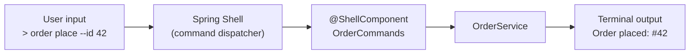

# Spring Shell & CLI Tools

[← Back to README](../README.md)

---

**Spring Shell** turns a Spring Boot application into an interactive command-line shell. Commands are plain Spring beans annotated with `@ShellComponent` and `@ShellMethod`. Built-in features include tab completion, history, help generation, and ANSI colouring.



---

## Dependency

```xml
<dependency>
    <groupId>org.springframework.shell</groupId>
    <artifactId>spring-shell-starter</artifactId>
    <version>3.2.0</version>
</dependency>
```

---

## Basic Commands

```java
@ShellComponent
@RequiredArgsConstructor
public class OrderCommands {

    private final OrderService orderService;

    @ShellMethod(key = "order-list", value = "List all orders")
    public String listOrders() {
        List<Order> orders = orderService.findAll();
        if (orders.isEmpty()) return "No orders found.";

        return orders.stream()
            .map(o -> "%s  %-10s  %s".formatted(o.getId(), o.getStatus(), o.getTotal()))
            .collect(Collectors.joining("\n"));
    }

    @ShellMethod(key = "order-place", value = "Place a new order")
    public String placeOrder(
            @ShellOption(help = "Customer ID") String customerId,
            @ShellOption(help = "Product ID")  String productId,
            @ShellOption(defaultValue = "1")   int quantity) {

        Order order = orderService.place(customerId, productId, quantity);
        return "Order placed: #" + order.getId();
    }

    @ShellMethod(key = "order-cancel", value = "Cancel an order")
    public String cancelOrder(@ShellOption String orderId) {
        orderService.cancel(UUID.fromString(orderId));
        return "Order " + orderId + " cancelled.";
    }
}
```

---

## Command Groups and Aliases

```java
@ShellComponent
@ShellCommandGroup("Inventory")   // groups commands in the help output
public class InventoryCommands {

    @ShellMethod(key = {"inv-check", "stock"}, value = "Check stock level")
    public String checkStock(@ShellOption String productId) {
        int level = inventoryService.getStock(productId);
        return "Stock for " + productId + ": " + level;
    }

    @ShellMethod(key = "inv-restock", value = "Restock a product")
    public String restock(
            @ShellOption String productId,
            @ShellOption int quantity) {
        inventoryService.restock(productId, quantity);
        return "Restocked " + productId + " by " + quantity + " units.";
    }
}
```

---

## Input Validation

```java
@ShellComponent
@RequiredArgsConstructor
public class ValidatedCommands {

    @ShellMethod(key = "user-create", value = "Create a user")
    public String createUser(
            @ShellOption @NotBlank String username,
            @ShellOption @Email    String email,
            @ShellOption @Min(18)  int age) {
        userService.create(username, email, age);
        return "User created: " + username;
    }
}
```

Add `spring-boot-starter-validation` for `@NotBlank`, `@Email`, `@Min` to work.

---

## Availability Conditions

```java
@ShellComponent
public class AdminCommands {

    private boolean adminMode = false;

    @ShellMethod(key = "admin-enable", value = "Enable admin mode")
    public String enableAdmin(@ShellOption String password) {
        if ("secret".equals(password)) {
            adminMode = true;
            return "Admin mode ON";
        }
        return "Wrong password";
    }

    // Only show this command when adminMode is true
    @ShellMethod(key = "purge-orders", value = "Purge all orders (admin only)")
    public String purgeOrders() {
        orderService.purgeAll();
        return "All orders purged.";
    }

    @ShellMethodAvailability("purge-orders")
    public Availability purgeAvailability() {
        return adminMode
            ? Availability.available()
            : Availability.unavailable("admin mode is not enabled");
    }
}
```

---

## ANSI Colours and Formatted Output

```java
@ShellComponent
public class StyledCommands {

    private final ShellHelper shellHelper;   // custom helper wrapping AttributedString

    @ShellMethod(key = "status", value = "Show system status")
    public AttributedString systemStatus() {
        AttributedStringBuilder sb = new AttributedStringBuilder();

        sb.append("Services:\n", AttributedStyle.BOLD);
        sb.append("  ✓ Database ", AttributedStyle.DEFAULT.foreground(AttributedStyle.GREEN));
        sb.append("online\n");
        sb.append("  ✗ Cache    ", AttributedStyle.DEFAULT.foreground(AttributedStyle.RED));
        sb.append("offline\n");

        return sb.toAttributedString();
    }
}
```

---

## Custom Tab Completion

```java
@ShellComponent
public class CompletionCommands {

    @ShellMethod(key = "report", value = "Generate a report")
    public String generateReport(@ShellOption String type) {
        return reportService.generate(type);
    }

    // Provide tab-completion candidates for 'type'
    @ShellMethodAvailability
    public CompletionContext reportTypeCompletion(CompletionContext context) {
        return context;
    }
}

@Component
public class ReportTypeValueProvider implements ValueProvider {

    @Override
    public List<CompletionProposal> complete(CompletionContext context) {
        return List.of("daily", "weekly", "monthly", "annual").stream()
            .filter(s -> s.startsWith(context.currentWordUpToCursor()))
            .map(CompletionProposal::new)
            .toList();
    }
}
```

---

## Non-Interactive (Batch) Mode

Run commands non-interactively for scripting or CI:

```bash
# Execute a single command and exit
java -jar myapp.jar order-list

# Pipe multiple commands
echo -e "order-list\norder-place --customer-id abc --product-id xyz" | java -jar myapp.jar
```

```yaml
# application.yml — disable interactive mode in production
spring:
  shell:
    interactive:
      enabled: false
```

---

## Progress and Long-Running Commands

```java
@ShellComponent
@RequiredArgsConstructor
public class BatchCommands {

    private final ProgressBar progressBar;   // spring-shell built-in

    @ShellMethod(key = "import-csv", value = "Import orders from CSV")
    public void importCsv(@ShellOption String filePath) throws IOException {
        List<String> lines = Files.readAllLines(Path.of(filePath));
        int total = lines.size();

        try (ProgressBar pb = new ProgressBar("Importing", total)) {
            for (String line : lines) {
                orderService.importLine(line);
                pb.step();
            }
        }

        System.out.println("Imported " + total + " orders.");
    }
}
```

---

## Spring Shell Summary

| Concept | Detail |
|---------|--------|
| `@ShellComponent` | Marks a bean as containing shell commands |
| `@ShellMethod` | Declares a shell command; `key` sets the command name |
| `@ShellOption` | Binds a method parameter to a named option; supports `defaultValue` |
| `@ShellCommandGroup` | Groups related commands in `help` output |
| `@ShellMethodAvailability` | Conditionally enable/disable a command at runtime |
| `Availability.unavailable(reason)` | Returned when a command is not yet available |
| `AttributedStringBuilder` | Builds ANSI-coloured terminal output |
| `ValueProvider` | Supplies tab-completion candidates for an option |
| Non-interactive mode | Pass command as arg or pipe; `spring.shell.interactive.enabled=false` |
| `ProgressBar` | Built-in progress indicator for long-running commands |

---

[← Back to README](../README.md)
