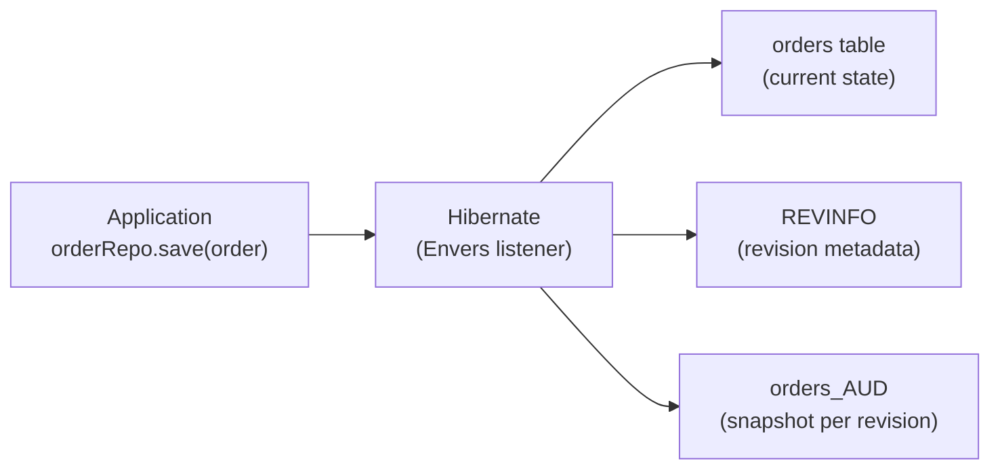

# Hibernate Envers — Audit History

[← Back to README](../README.md)

---

**Hibernate Envers** adds automatic audit logging to JPA entities. Every insert, update, and delete creates a revision record. You can query the full history of any entity, compare versions, and restore past states — without writing a single audit trigger.



---

## Dependency

```xml
<dependency>
    <groupId>org.springframework.data</groupId>
    <artifactId>spring-data-envers</artifactId>
</dependency>
<!-- Included transitively via spring-boot-starter-data-jpa + envers -->
<dependency>
    <groupId>org.hibernate.orm</groupId>
    <artifactId>hibernate-envers</artifactId>
</dependency>
```

---

## Annotate Entities

```java
@Entity
@Table(name = "orders")
@Audited                          // track all fields
public class Order {

    @Id @GeneratedValue(strategy = GenerationType.UUID)
    private UUID id;

    private String status;
    private BigDecimal total;

    @ManyToOne
    @Audited(targetAuditMode = RelationTargetAuditMode.NOT_AUDITED)
    private Customer customer;    // audit the FK, not the full Customer history

    @NotAudited                   // exclude noisy fields
    private Instant lastPingAt;
}

@Entity
@Audited
public class OrderLine {
    @Id @GeneratedValue(strategy = GenerationType.UUID)
    private UUID id;

    private String productId;
    private int quantity;
    private BigDecimal unitPrice;
}
```

---

## Custom Revision Entity

Track who made each change:

```java
@Entity
@RevisionEntity(UserRevisionListener.class)
@Table(name = "REVINFO")
public class UserRevisionEntity extends DefaultRevisionEntity {

    private String username;
    private String ipAddress;

    // getters/setters
}

@Component
public class UserRevisionListener implements RevisionListener {

    @Override
    public void newRevision(Object revisionEntity) {
        UserRevisionEntity rev = (UserRevisionEntity) revisionEntity;

        // Pull current user from Spring Security context
        Authentication auth = SecurityContextHolder.getContext().getAuthentication();
        rev.setUsername(auth != null ? auth.getName() : "system");
        rev.setIpAddress(RequestContextHolder.currentRequestAttributes()
            .getAttribute("REMOTE_ADDR", 0).toString());
    }
}
```

---

## Querying Audit History with AuditReader

```java
@Service
@RequiredArgsConstructor
public class OrderAuditService {

    @PersistenceContext
    private EntityManager em;

    // Get all revisions for an order
    public List<Order> getOrderHistory(UUID orderId) {
        AuditReader reader = AuditReaderFactory.get(em);

        List<Number> revisions = reader.getRevisions(Order.class, orderId);

        return revisions.stream()
            .map(rev -> reader.find(Order.class, orderId, rev))
            .toList();
    }

    // Get the state of an order at a specific revision
    public Order getOrderAtRevision(UUID orderId, int revision) {
        AuditReader reader = AuditReaderFactory.get(em);
        return reader.find(Order.class, orderId, revision);
    }

    // Get the state of an order at a point in time
    public Order getOrderAtTime(UUID orderId, Date at) {
        AuditReader reader = AuditReaderFactory.get(em);
        Number revision = reader.getRevisionNumberForDate(at);
        return reader.find(Order.class, orderId, revision);
    }

    // List revision metadata (who, when)
    public List<AuditSnapshot> getRevisionMetadata(UUID orderId) {
        AuditReader reader = AuditReaderFactory.get(em);
        List<Number> revisions = reader.getRevisions(Order.class, orderId);

        return revisions.stream().map(rev -> {
            UserRevisionEntity revEntity = reader.findRevision(UserRevisionEntity.class, rev);
            Order snapshot = reader.find(Order.class, orderId, rev);
            return new AuditSnapshot(rev, revEntity.getUsername(),
                revEntity.getRevisionDate(), snapshot);
        }).toList();
    }
}
```

---

## Audit Queries — AuditQueryCreator

```java
@Service
@RequiredArgsConstructor
public class AuditQueryService {

    @PersistenceContext
    private EntityManager em;

    // Find all orders that were PENDING at any point
    public List<Order> findOrdersEverPending() {
        AuditReader reader = AuditReaderFactory.get(em);

        return reader.createQuery()
            .forRevisionsOfEntity(Order.class, true, true)
            .add(AuditEntity.property("status").eq("PENDING"))
            .getResultList();
    }

    // Find orders modified after a date
    public List<Order> findOrdersModifiedAfter(Date since) {
        AuditReader reader = AuditReaderFactory.get(em);

        return reader.createQuery()
            .forRevisionsOfEntity(Order.class, true, false)
            .add(AuditEntity.revisionProperty("timestamp").gt(since.getTime()))
            .addOrder(AuditEntity.revisionNumber().asc())
            .getResultList();
    }

    // Find deleted orders (revision type = DEL)
    public List<Order> findDeletedOrders() {
        AuditReader reader = AuditReaderFactory.get(em);

        return reader.createQuery()
            .forRevisionsOfEntity(Order.class, true, true)
            .add(AuditEntity.revisionType().eq(RevisionType.DEL))
            .getResultList();
    }
}
```

---

## Spring Data Envers — Repository Support

```java
// Extend RevisionRepository to get audit methods for free
public interface OrderRepository
        extends JpaRepository<Order, UUID>,
                RevisionRepository<Order, UUID, Integer> {
}

// Usage
@Service
@RequiredArgsConstructor
public class OrderRevisionService {

    private final OrderRepository orderRepo;

    public Page<Revision<Integer, Order>> getRevisions(UUID orderId, Pageable pageable) {
        return orderRepo.findRevisions(orderId, pageable);
    }

    public Optional<Revision<Integer, Order>> getLatestRevision(UUID orderId) {
        return orderRepo.findLastChangeRevision(orderId);
    }
}
```

Enable with:

```java
@EnableJpaRepositories(repositoryFactoryBeanClass = EnversRevisionRepositoryFactoryBean.class)
```

---

## Schema

Envers creates audit tables automatically:

```sql
-- Revision metadata (one row per transaction)
CREATE TABLE REVINFO (
    REV      INT PRIMARY KEY,
    REVTSTMP BIGINT,
    username VARCHAR(255),
    ip_address VARCHAR(255)
);

-- Audit table mirrors the entity table plus revision columns
CREATE TABLE orders_AUD (
    id         UUID,
    REV        INT REFERENCES REVINFO(REV),
    REVTYPE    SMALLINT,   -- 0=ADD, 1=MOD, 2=DEL
    status     VARCHAR(50),
    total      NUMERIC,
    customer_id UUID,
    PRIMARY KEY (id, REV)
);
```

---

## Configuration

```yaml
spring:
  jpa:
    properties:
      org.hibernate.envers:
        audit_table_suffix: _AUD          # default
        revision_field_name: REV
        revision_type_field_name: REVTYPE
        store_data_at_delete: true        # save final state on DELETE
        global_with_modified_flag: true   # add _MOD columns per field
```

---

## Hibernate Envers Summary

| Concept | Detail |
|---------|--------|
| `@Audited` | Enable audit tracking on an entity or field |
| `@NotAudited` | Exclude a field from audit |
| `@RevisionEntity` | Custom revision table entity (extends `DefaultRevisionEntity`) |
| `RevisionListener` | Populates revision metadata (user, IP) on each change |
| `AuditReaderFactory.get(em)` | Entry point for querying audit data |
| `reader.find(Class, id, rev)` | Retrieve entity snapshot at a specific revision |
| `reader.getRevisions(Class, id)` | List all revision numbers for an entity |
| `reader.createQuery()` | Fluent API for cross-revision queries |
| `RevisionType` | `ADD` (0), `MOD` (1), `DEL` (2) |
| `RevisionRepository<T, ID, N>` | Spring Data interface with `findRevisions`, `findLastChangeRevision` |
| `store_data_at_delete` | Preserve field values in the DEL revision row |
| `global_with_modified_flag` | Add `field_MOD` boolean columns to track which fields changed |

---

[← Back to README](../README.md)
