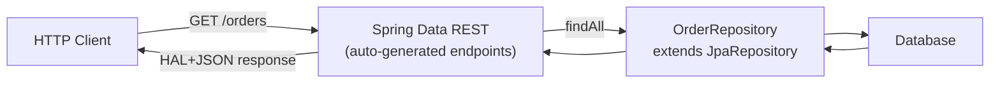

# Spring Data REST

[← Back to README](../README.md)

---

**Spring Data REST** automatically exposes Spring Data repositories as hypermedia-driven REST endpoints using the HAL format. A `JpaRepository` becomes a full CRUD API with pagination, sorting, and links — with zero controller boilerplate.



---

## Dependency

```xml
<dependency>
    <groupId>org.springframework.boot</groupId>
    <artifactId>spring-boot-starter-data-rest</artifactId>
</dependency>
```

---

## Expose a Repository

```java
@Entity
public class Order {
    @Id @GeneratedValue(strategy = GenerationType.UUID)
    private UUID id;
    private String status;
    private BigDecimal total;
    @ManyToOne private Customer customer;
    // getters/setters
}

// That's all — Spring Data REST exposes CRUD at /orders
@RepositoryRestResource(path = "orders", collectionResourceRel = "orders")
public interface OrderRepository extends JpaRepository<Order, UUID> {

    // Custom finder exposed at /orders/search/by-status?status=PENDING
    List<Order> findByStatus(@Param("status") String status);

    // Exposed at /orders/search/by-customer?customerId=...
    Page<Order> findByCustomerId(@Param("customerId") UUID customerId, Pageable pageable);
}
```

HAL response for `GET /orders`:

```json
{
  "_embedded": {
    "orders": [
      { "status": "PENDING", "total": 99.99,
        "_links": { "self": { "href": "/orders/abc-123" } } }
    ]
  },
  "_links": {
    "self":    { "href": "/orders{?page,size,sort}", "templated": true },
    "search":  { "href": "/orders/search" }
  },
  "page": { "size": 20, "totalElements": 1, "totalPages": 1, "number": 0 }
}
```

---

## Configuration

```yaml
spring:
  data:
    rest:
      base-path: /api           # all endpoints under /api
      default-page-size: 20
      max-page-size: 100
      return-body-on-create: true
      return-body-on-update: true
```

---

## Projections — Shape the Response

```java
// Inline projection — show only selected fields
@Projection(name = "summary", types = { Order.class })
public interface OrderSummary {
    UUID getId();
    String getStatus();
    BigDecimal getTotal();

    // Computed field
    @Value("#{target.customer.name}")
    String getCustomerName();
}
```

Usage: `GET /orders?projection=summary`

```java
// Excerpt projection — default representation in collections
@RepositoryRestResource(excerptProjection = OrderSummary.class)
public interface OrderRepository extends JpaRepository<Order, UUID> { }
```

---

## Event Handlers

Spring Data REST fires lifecycle events before and after each operation:

```java
@Component
@RepositoryEventHandler(Order.class)
public class OrderEventHandler {

    @HandleBeforeCreate
    public void onBeforeCreate(Order order) {
        order.setStatus("PENDING");
        order.setCreatedAt(Instant.now());
    }

    @HandleAfterCreate
    public void onAfterCreate(Order order) {
        eventBus.publish(new OrderCreatedEvent(order.getId()));
    }

    @HandleBeforeSave
    public void onBeforeSave(Order order) {
        order.setUpdatedAt(Instant.now());
    }

    @HandleBeforeDelete
    public void onBeforeDelete(Order order) {
        if ("SHIPPED".equals(order.getStatus())) {
            throw new IllegalStateException("Cannot delete a shipped order");
        }
    }
}
```

---

## Validators

```java
@Component("beforeCreateOrderValidator")   // naming convention: before{Operation}{ResourceName}Validator
public class OrderValidator implements Validator {

    @Override
    public boolean supports(Class<?> clazz) { return Order.class.equals(clazz); }

    @Override
    public void validate(Object target, Errors errors) {
        Order order = (Order) target;
        if (order.getTotal() == null || order.getTotal().signum() <= 0) {
            errors.rejectValue("total", "total.invalid", "Total must be positive");
        }
    }
}
```

Validator naming convention: `before{Create|Save|Delete}{EntityName}Validator`.

---

## Hiding Repositories and Methods

```java
// Hide entire repository
@RepositoryRestResource(exported = false)
public interface InternalAuditRepository extends JpaRepository<AuditLog, UUID> { }

// Hide specific methods
public interface OrderRepository extends JpaRepository<Order, UUID> {

    @Override
    @RestResource(exported = false)
    void deleteById(UUID id);   // DELETE /orders/{id} returns 405 Method Not Allowed

    @RestResource(path = "pending", rel = "pending")
    List<Order> findByStatus(@Param("status") String status);
}
```

---

## Linking Resources — HAL and ALPS

```java
// Custom link added to the order resource
@Component
public class OrderResourceProcessor implements ResourceProcessor<EntityModel<Order>> {

    @Override
    public EntityModel<Order> process(EntityModel<Order> model) {
        Order order = model.getContent();
        if ("PENDING".equals(order.getStatus())) {
            model.add(Link.of("/orders/" + order.getId() + "/confirm").withRel("confirm"));
        }
        return model;
    }
}
```

---

## Security Integration

```java
@Configuration
@EnableMethodSecurity
public class RestSecurityConfig {

    @Bean
    public SecurityFilterChain filterChain(HttpSecurity http) throws Exception {
        return http
            .authorizeHttpRequests(auth -> auth
                .requestMatchers(HttpMethod.GET, "/api/orders/**").hasRole("USER")
                .requestMatchers(HttpMethod.POST, "/api/orders").hasRole("ADMIN")
                .requestMatchers(HttpMethod.DELETE, "/api/orders/**").hasRole("ADMIN"))
            .build();
    }
}
```

---

## Spring Data REST Summary

| Concept | Detail |
|---------|--------|
| `@RepositoryRestResource` | Expose and configure a repository as REST; set `path`, `rel` |
| `@Param` | Bind query method parameter to HTTP query param |
| `/orders/search` | Auto-generated endpoint listing all exported finder methods |
| `@Projection` | Shape the response — select fields, add computed values |
| `excerptProjection` | Applied by default in collection (`_embedded`) responses |
| `@RepositoryEventHandler` | Lifecycle callbacks: `@HandleBeforeCreate`, `@HandleAfterSave`, etc. |
| Validator naming | `beforeCreate{Entity}Validator` picked up automatically |
| `exported = false` | Hide a repository or method from the HTTP API |
| `ResourceProcessor<EntityModel<T>>` | Add custom HAL links to a resource representation |
| `spring.data.rest.base-path` | Mount all SDR endpoints under a prefix |
| HAL format | `_embedded`, `_links`, `page` envelope in every collection response |

---

[← Back to README](../README.md)
