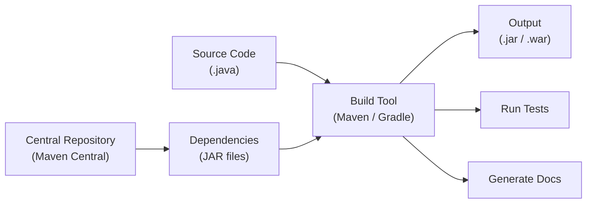
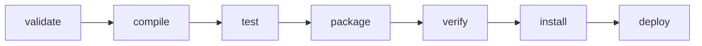

# Build Tools and Dependency Management

[← Back to README](../README.md)

---

Build tools automate compiling source code, resolving dependencies, running tests, and packaging applications. The two dominant Java build tools are **Maven** and **Gradle**.



---

## Maven

Maven is a convention-over-configuration build tool. Projects follow a standard directory layout and are described by a `pom.xml` file.

### Standard Directory Layout

```
project/
├── pom.xml
└── src/
    ├── main/
    │   ├── java/          ← production source code
    │   └── resources/     ← config files, templates
    └── test/
        ├── java/          ← test source code
        └── resources/     ← test config files
```

### pom.xml

The **Project Object Model** — every Maven project has one.

```xml
<?xml version="1.0" encoding="UTF-8"?>
<project xmlns="http://maven.apache.org/POM/4.0.0"
         xmlns:xsi="http://www.w3.org/2001/XMLSchema-instance"
         xsi:schemaLocation="http://maven.apache.org/POM/4.0.0
                             http://maven.apache.org/xsd/maven-4.0.0.xsd">

    <modelVersion>4.0.0</modelVersion>

    <!-- project coordinates — uniquely identify this artifact -->
    <groupId>com.example</groupId>
    <artifactId>my-app</artifactId>
    <version>1.0.0</version>
    <packaging>jar</packaging>

    <properties>
        <java.version>21</java.version>
        <maven.compiler.source>${java.version}</maven.compiler.source>
        <maven.compiler.target>${java.version}</maven.compiler.target>
        <project.build.sourceEncoding>UTF-8</project.build.sourceEncoding>
    </properties>

    <dependencies>

        <!-- production dependency -->
        <dependency>
            <groupId>com.google.guava</groupId>
            <artifactId>guava</artifactId>
            <version>33.1.0-jre</version>
        </dependency>

        <!-- test-only dependency -->
        <dependency>
            <groupId>org.junit.jupiter</groupId>
            <artifactId>junit-jupiter</artifactId>
            <version>5.10.2</version>
            <scope>test</scope>
        </dependency>

        <!-- available at compile time but not packaged (provided by runtime env) -->
        <dependency>
            <groupId>jakarta.servlet</groupId>
            <artifactId>jakarta.servlet-api</artifactId>
            <version>6.0.0</version>
            <scope>provided</scope>
        </dependency>

    </dependencies>

    <build>
        <plugins>
            <plugin>
                <groupId>org.apache.maven.plugins</groupId>
                <artifactId>maven-surefire-plugin</artifactId>
                <version>3.2.5</version>
            </plugin>
        </plugins>
    </build>

</project>
```

### Dependency Scopes

| Scope | Compile | Test | Packaged | Use case |
|-------|:-------:|:----:|:--------:|----------|
| `compile` (default) | ✓ | ✓ | ✓ | Regular dependencies |
| `test` | | ✓ | | JUnit, Mockito |
| `provided` | ✓ | ✓ | | Servlet API (provided by server) |
| `runtime` | | ✓ | ✓ | JDBC drivers |
| `optional` | ✓ | ✓ | | Not inherited by dependents |

### Maven Lifecycle

Maven defines three built-in lifecycles. Running a phase also runs all phases before it.



| Phase | What it does |
|-------|-------------|
| `validate` | Checks the project is correct |
| `compile` | Compiles source code |
| `test` | Runs unit tests |
| `package` | Packages compiled code into JAR/WAR |
| `verify` | Runs integration tests |
| `install` | Installs the artifact into the local repository (`~/.m2`) |
| `deploy` | Uploads the artifact to a remote repository |

### Common Maven Commands

```bash
mvn validate              # validate project structure
mvn compile               # compile source code
mvn test                  # run tests
mvn package               # build the JAR
mvn install               # install to local ~/.m2 repo
mvn clean                 # delete the target/ directory
mvn clean package         # clean then build
mvn clean test            # clean then test
mvn dependency:tree       # show full dependency tree
mvn dependency:list       # list all resolved dependencies
mvn versions:display-dependency-updates   # check for newer versions
```

### Multi-Module Projects

Large projects split code across modules with a parent `pom.xml`.

```
parent/
├── pom.xml               ← parent POM (packaging: pom)
├── core/
│   └── pom.xml
├── api/
│   └── pom.xml
└── web/
    └── pom.xml
```

```xml
<!-- parent pom.xml -->
<packaging>pom</packaging>

<modules>
    <module>core</module>
    <module>api</module>
    <module>web</module>
</modules>

<!-- child module refers back to parent -->
<parent>
    <groupId>com.example</groupId>
    <artifactId>parent</artifactId>
    <version>1.0.0</version>
</parent>
```

---

## Gradle

Gradle uses a **programmatic DSL** (Groovy or Kotlin) instead of XML, making builds more concise and flexible. It is the default build tool for Android and increasingly popular for Java backends.

### Standard Directory Layout

Same as Maven — Gradle follows the same convention by default.

### build.gradle (Groovy DSL)

```groovy
plugins {
    id 'java'
    id 'application'
}

group   = 'com.example'
version = '1.0.0'

java {
    sourceCompatibility = JavaVersion.VERSION_21
    targetCompatibility = JavaVersion.VERSION_21
}

repositories {
    mavenCentral()   // where to download dependencies from
}

dependencies {
    // production
    implementation 'com.google.guava:guava:33.1.0-jre'

    // test only
    testImplementation 'org.junit.jupiter:junit-jupiter:5.10.2'
    testRuntimeOnly    'org.junit.platform:junit-platform-launcher'
}

application {
    mainClass = 'com.example.Main'
}

test {
    useJUnitPlatform()  // required to run JUnit 5
}
```

### build.gradle.kts (Kotlin DSL) — recommended for new projects

```kotlin
plugins {
    java
    application
}

group   = "com.example"
version = "1.0.0"

java {
    sourceCompatibility = JavaVersion.VERSION_21
    targetCompatibility = JavaVersion.VERSION_21
}

repositories {
    mavenCentral()
}

dependencies {
    implementation("com.google.guava:guava:33.1.0-jre")

    testImplementation("org.junit.jupiter:junit-jupiter:5.10.2")
    testRuntimeOnly("org.junit.platform:junit-platform-launcher")
}

application {
    mainClass = "com.example.Main"
}

tasks.test {
    useJUnitPlatform()
}
```

### Gradle Dependency Configurations

| Configuration | Scope | Use case |
|---------------|-------|----------|
| `implementation` | Compile + runtime | Regular dependencies (not exposed to consumers) |
| `api` | Compile + runtime | Dependencies exposed as part of your public API |
| `testImplementation` | Test compile + runtime | JUnit, Mockito |
| `testRuntimeOnly` | Test runtime only | Test runner launcher |
| `compileOnly` | Compile only | Annotation processors, provided deps |
| `runtimeOnly` | Runtime only | JDBC drivers |

### Common Gradle Commands

```bash
./gradlew tasks               # list all available tasks
./gradlew build               # compile, test, and package
./gradlew test                # run tests
./gradlew clean               # delete the build/ directory
./gradlew clean build         # clean then build
./gradlew run                 # run the application (needs 'application' plugin)
./gradlew jar                 # build the JAR only
./gradlew dependencies        # show full dependency tree
./gradlew dependencyUpdates   # check for newer versions (needs plugin)
```

### Gradle Wrapper

The wrapper (`gradlew`) pins the Gradle version for the project — always use it instead of a system-installed Gradle.

```bash
./gradlew build   # uses the version in gradle/wrapper/gradle-wrapper.properties
```

---

## Dependency Management

### How Coordinates Work

Every artifact is identified by three coordinates:

```
groupId : artifactId : version
com.google.guava : guava : 33.1.0-jre
```

- **groupId** — organisation or domain (`com.google.guava`)
- **artifactId** — the library name (`guava`)
- **version** — the release version (`33.1.0-jre`)

### Repositories

Dependencies are downloaded from **repositories** — remote servers hosting JAR files.

| Repository | URL | Contents |
|------------|-----|----------|
| Maven Central | `repo.maven.apache.org` | The main public repository |
| Google Maven | `maven.google.com` | Android and Google libraries |
| JitPack | `jitpack.io` | GitHub projects as dependencies |
| Private Nexus / Artifactory | Self-hosted | Internal company artifacts |

### Version Strategies

```xml
<!-- Maven -->
<version>1.2.3</version>          <!-- exact version -->
<version>[1.2,2.0)</version>      <!-- range: 1.2 ≤ x < 2.0 -->
<version>LATEST</version>         <!-- avoid — non-deterministic -->

<!-- Gradle -->
implementation 'lib:name:1.2.3'   // exact
implementation 'lib:name:1.2.+'   // 1.2.x — patch updates only
implementation 'lib:name:+'       // avoid — any version
```

> Prefer exact versions in production. Use a tool like Dependabot or Renovate to automate version updates.

### Transitive Dependencies

When you depend on library A, and A depends on B, you get B automatically — this is a **transitive dependency**.

```bash
mvn dependency:tree
./gradlew dependencies
```

```
com.example:my-app
└── com.google.guava:guava:33.1.0-jre
    └── com.google.guava:failureaccess:1.0.2  ← transitive
```

**Excluding a transitive dependency:**

```xml
<!-- Maven -->
<dependency>
    <groupId>org.springframework</groupId>
    <artifactId>spring-core</artifactId>
    <version>6.1.5</version>
    <exclusions>
        <exclusion>
            <groupId>commons-logging</groupId>
            <artifactId>commons-logging</artifactId>
        </exclusion>
    </exclusions>
</dependency>
```

```groovy
// Gradle
implementation('org.springframework:spring-core:6.1.5') {
    exclude group: 'commons-logging', module: 'commons-logging'
}
```

### Dependency Conflicts

When two dependencies require different versions of the same library, the build tool must pick one.

- **Maven** — nearest-wins: the version closest to your project in the dependency tree wins.
- **Gradle** — highest-wins: the highest requested version wins by default.

Force a specific version:

```xml
<!-- Maven — use dependencyManagement -->
<dependencyManagement>
    <dependencies>
        <dependency>
            <groupId>com.fasterxml.jackson.core</groupId>
            <artifactId>jackson-databind</artifactId>
            <version>2.17.0</version>
        </dependency>
    </dependencies>
</dependencyManagement>
```

```groovy
// Gradle
configurations.all {
    resolutionStrategy {
        force 'com.fasterxml.jackson.core:jackson-databind:2.17.0'
    }
}
```

---

## Maven vs Gradle

| | Maven | Gradle |
|---|---|---|
| Config format | XML (`pom.xml`) | Groovy or Kotlin DSL (`build.gradle`) |
| Convention | Strict, opinionated | Flexible, programmable |
| Performance | Slower (no incremental by default) | Faster (incremental builds, build cache) |
| Android support | No | Yes (default) |
| Learning curve | Lower | Higher |
| IDE support | Excellent | Excellent |
| Multi-project builds | Supported | Better support, more flexible |
| Ecosystem | Huge, mature | Growing, modern |
| Use when | Standard Java / Jakarta EE projects | Android, large multi-module, performance-sensitive |

---

## Useful Plugins

### Maven

| Plugin | Purpose |
|--------|---------|
| `maven-surefire-plugin` | Run unit tests |
| `maven-failsafe-plugin` | Run integration tests |
| `maven-shade-plugin` | Build a fat JAR (all deps bundled) |
| `maven-assembly-plugin` | Create custom distribution packages |
| `jacoco-maven-plugin` | Code coverage reports |
| `spotbugs-maven-plugin` | Static analysis |
| `versions-maven-plugin` | Check for dependency updates |

### Gradle

| Plugin | Purpose |
|--------|---------|
| `java` | Compile, test, package Java |
| `application` | Run and distribute Java apps |
| `jacoco` | Code coverage |
| `checkstyle` | Code style enforcement |
| `spotbugs` | Static analysis |
| `com.github.ben-manes.versions` | Check for dependency updates |
| `com.github.johnrengelman.shadow` | Build fat JARs |

---

## Build Tools Summary

| Concept | Maven | Gradle |
|---------|-------|--------|
| Project file | `pom.xml` | `build.gradle` / `build.gradle.kts` |
| Build command | `mvn package` | `./gradlew build` |
| Run tests | `mvn test` | `./gradlew test` |
| Clean build | `mvn clean package` | `./gradlew clean build` |
| Dependency tree | `mvn dependency:tree` | `./gradlew dependencies` |
| Local repo cache | `~/.m2/repository` | `~/.gradle/caches` |
| Wrapper | `mvnw` | `gradlew` |

---

[← Back to README](../README.md)
