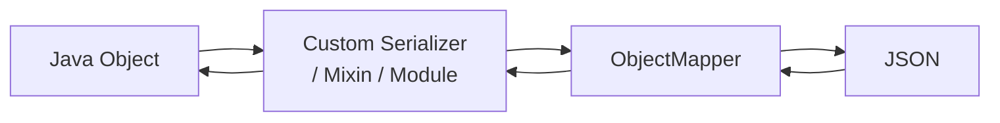

# Jackson Advanced

[← Back to README](../README.md)

---

Beyond basic `@JsonProperty` and `ObjectMapper`, Jackson provides custom serializers/deserializers, mixins for third-party classes, polymorphic type handling, `@JsonView` for response shaping, and a module system for registering extensions. These tools handle real-world serialisation complexity without polluting domain models.



---

## Custom Serializer

```java
// Serialize Money as { "amount": 99.99, "currency": "USD" }
public class MoneySerializer extends JsonSerializer<Money> {

    @Override
    public void serialize(Money value, JsonGenerator gen, SerializerProvider provider)
            throws IOException {
        gen.writeStartObject();
        gen.writeNumberField("amount",   value.getAmount().doubleValue());
        gen.writeStringField("currency", value.getCurrency().getCurrencyCode());
        gen.writeEndObject();
    }
}

// Register on the field
public class Order {
    @JsonSerialize(using = MoneySerializer.class)
    private Money total;
}

// Or register globally on ObjectMapper
ObjectMapper mapper = new ObjectMapper();
SimpleModule module = new SimpleModule();
module.addSerializer(Money.class, new MoneySerializer());
mapper.registerModule(module);
```

---

## Custom Deserializer

```java
public class MoneyDeserializer extends JsonDeserializer<Money> {

    @Override
    public Money deserialize(JsonParser p, DeserializationContext ctx) throws IOException {
        JsonNode node   = p.getCodec().readTree(p);
        BigDecimal amt  = node.get("amount").decimalValue();
        Currency curr   = Currency.getInstance(node.get("currency").asText());
        return new Money(amt, curr);
    }
}

public class Order {
    @JsonDeserialize(using = MoneyDeserializer.class)
    private Money total;
}
```

---

## Mixins — Annotate Without Touching the Class

Use when you cannot modify the target class (e.g., third-party library):

```java
// Mixin for a third-party Address class
@JsonIgnoreProperties({"internalCode", "rawData"})
public abstract class AddressMixin {

    @JsonProperty("street_line")
    abstract String getStreetLine();

    @JsonProperty("postal_code")
    abstract String getPostalCode();

    @JsonCreator
    public AddressMixin(
        @JsonProperty("street_line") String streetLine,
        @JsonProperty("postal_code") String postalCode) { }
}

// Register
ObjectMapper mapper = new ObjectMapper();
mapper.addMixIn(Address.class, AddressMixin.class);
```

---

## Polymorphic Types

```java
@JsonTypeInfo(
    use = JsonTypeInfo.Id.NAME,
    include = JsonTypeInfo.As.PROPERTY,
    property = "type")
@JsonSubTypes({
    @JsonSubTypes.Type(value = CreditCardPayment.class, name = "credit_card"),
    @JsonSubTypes.Type(value = BankTransferPayment.class, name = "bank_transfer"),
    @JsonSubTypes.Type(value = CryptoPayment.class,      name = "crypto")
})
public abstract class Payment {
    private BigDecimal amount;
    private Instant processedAt;
}

public class CreditCardPayment extends Payment {
    private String maskedNumber;
    private String network;
}

public class BankTransferPayment extends Payment {
    private String iban;
    private String bic;
}
```

Serialised output:

```json
{ "type": "credit_card", "amount": 99.99, "maskedNumber": "****1234", "network": "VISA" }
```

---

## @JsonView — Shape the Response per Caller

```java
public class Views {
    public interface Public {}
    public interface Internal extends Public {}
    public interface Admin extends Internal {}
}

public class Order {
    @JsonView(Views.Public.class)
    private UUID id;

    @JsonView(Views.Public.class)
    private String status;

    @JsonView(Views.Internal.class)   // not in Public
    private BigDecimal total;

    @JsonView(Views.Admin.class)      // only in Admin
    private String internalNotes;
}
```

```java
// In a Spring MVC controller
@GetMapping("/orders/{id}")
@JsonView(Views.Public.class)
public Order getOrder(@PathVariable UUID id) {
    return orderService.findById(id);
}

@GetMapping("/admin/orders/{id}")
@JsonView(Views.Admin.class)
public Order getOrderAdmin(@PathVariable UUID id) {
    return orderService.findById(id);
}
```

---

## @JsonCreator and Immutable Objects

```java
public class OrderId {

    private final UUID value;

    @JsonCreator
    public OrderId(@JsonProperty("value") String value) {
        this.value = UUID.fromString(value);
    }

    @JsonProperty("value")
    public String getValue() { return value.toString(); }
}
```

For records (Java 16+):

```java
public record Money(
    @JsonProperty("amount")   BigDecimal amount,
    @JsonProperty("currency") String currency) {
}
```

---

## Custom Jackson Module

Package related serializers, deserializers, and mixins together:

```java
public class DomainModule extends SimpleModule {

    public DomainModule() {
        super("DomainModule", new Version(1, 0, 0, null, null, null));

        addSerializer(Money.class,   new MoneySerializer());
        addDeserializer(Money.class, new MoneyDeserializer());
        addSerializer(OrderId.class, new OrderIdSerializer());
        addDeserializer(OrderId.class, new OrderIdDeserializer());
    }
}

// Spring Boot auto-registers any Module @Bean
@Bean
public DomainModule domainModule() {
    return new DomainModule();
}
```

---

## ObjectMapper Configuration

```java
@Bean
public ObjectMapper objectMapper() {
    return JsonMapper.builder()
        // Serialisation
        .disable(SerializationFeature.WRITE_DATES_AS_TIMESTAMPS)
        .enable(SerializationFeature.INDENT_OUTPUT)
        .serializationInclusion(JsonInclude.Include.NON_NULL)

        // Deserialisation
        .disable(DeserializationFeature.FAIL_ON_UNKNOWN_PROPERTIES)
        .enable(DeserializationFeature.USE_BIG_DECIMAL_FOR_FLOATS)

        // Java time support
        .addModule(new JavaTimeModule())

        // Custom module
        .addModule(new DomainModule())

        .build();
}
```

---

## @JsonFilter — Runtime Field Filtering

```java
@JsonFilter("orderFilter")
public class Order { ... }

// In a controller
@GetMapping("/orders/{id}")
public MappingJacksonValue getOrder(@PathVariable UUID id,
                                     @RequestParam Set<String> fields) {
    Order order = orderService.findById(id);

    SimpleFilterProvider filters = new SimpleFilterProvider()
        .addFilter("orderFilter",
            fields.isEmpty()
                ? SimpleBeanPropertyFilter.serializeAll()
                : SimpleBeanPropertyFilter.filterOutAllExcept(fields));

    MappingJacksonValue value = new MappingJacksonValue(order);
    value.setFilters(filters);
    return value;
}
```

---

## Jackson Advanced Summary

| Concept | Detail |
|---------|--------|
| `JsonSerializer<T>` | Control how T is written to JSON |
| `JsonDeserializer<T>` | Control how JSON is parsed back to T |
| `@JsonSerialize` / `@JsonDeserialize` | Apply a custom (de)serializer on a field or class |
| Mixin | Add Jackson annotations to a class you cannot modify |
| `@JsonTypeInfo` + `@JsonSubTypes` | Polymorphic type serialisation with a discriminator property |
| `@JsonView` | Include/exclude fields per named view; used with `@JsonView` on controller methods |
| `@JsonCreator` | Designate a constructor or factory method for deserialisation |
| `SimpleModule` | Bundle serializers, deserializers, and mixins; auto-registered if declared as a `@Bean` |
| `JsonMapper.builder()` | Immutable builder for `ObjectMapper` configuration |
| `@JsonFilter` + `MappingJacksonValue` | Runtime field filtering without changing the model |
| `JavaTimeModule` | Add support for `java.time` types (Instant, LocalDate, etc.) |
| `NON_NULL` inclusion | Omit null fields from serialised output |

---

[← Back to README](../README.md)
