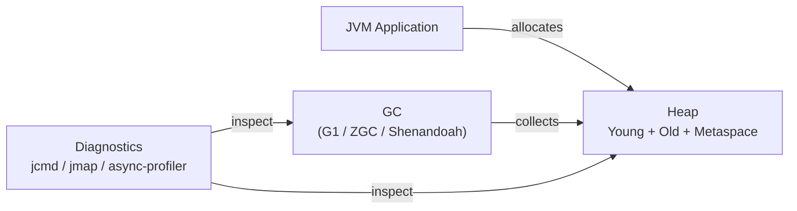

# GC Tuning & JVM Diagnostics

[← Back to README](../README.md)

---

Choosing and tuning a garbage collector is the first lever for reducing latency and eliminating stop-the-world pauses. Modern GCs (G1, ZGC, Shenandoah) do most of their work concurrently, but they still need correct sizing and configuration to shine. JVM diagnostic tooling pinpoints heap leaks, CPU hot spots, and lock contention before they become production incidents.



---

## Choosing a GC

| GC | JDK | Best for | Pause target |
|----|-----|----------|-------------|
| **G1** | 9+ (default) | General purpose, balanced throughput/latency | < 200 ms |
| **ZGC** | 15+ (production) | Low-latency services, large heaps (TB-scale) | < 1 ms |
| **Shenandoah** | 17+ (OpenJDK) | Ultra-low latency, predictable pauses | < 10 ms |
| **Parallel GC** | All | Batch jobs — maximise throughput, pauses OK | N/A |
| **Serial GC** | All | Tiny heaps, IoT, single-core | N/A |

---

## G1 GC — Flags

```bash
# Enable G1 (default since JDK 9)
-XX:+UseG1GC

# Heap sizing
-Xms4g -Xmx4g           # fix heap to avoid resize pauses
-XX:MetaspaceSize=256m   # initial metaspace
-XX:MaxMetaspaceSize=512m

# Pause target — G1 tries to stay under 200 ms
-XX:MaxGCPauseMillis=200

# Tuning
-XX:G1HeapRegionSize=16m        # region size (1–32 MB, power of 2)
-XX:G1NewSizePercent=20         # min young gen percentage
-XX:G1MaxNewSizePercent=40      # max young gen percentage
-XX:InitiatingHeapOccupancyPercent=45  # start concurrent marking at 45% full

# GC logging
-Xlog:gc*:file=/var/log/app/gc.log:time,uptime,level,tags:filecount=5,filesize=20m
```

---

## ZGC — Flags

```bash
# Enable ZGC
-XX:+UseZGC

# Heap
-Xms8g -Xmx8g
-XX:SoftMaxHeapSize=6g   # ZGC tries to stay under this; frees to Xmx under pressure

# ZGC-specific
-XX:ZCollectionInterval=5        # force GC every 5 seconds if idle
-XX:ZUncommitDelay=300           # return memory to OS after 5 min idle
-XX:+ZGenerational               # enable generational ZGC (JDK 21+, default in JDK 23+)

# Logging
-Xlog:gc*:file=/var/log/app/gc-zgc.log:time,uptime:filecount=5,filesize=20m
```

---

## GC Log Analysis

```bash
# View GC pauses in real time
tail -f /var/log/app/gc.log | grep "GC("

# Key log lines to watch:
# [info][gc] GC(42) Pause Young (Normal) (G1 Evacuation Pause) 512M->128M(4096M) 45.123ms
# [info][gc] GC(43) Pause Full (Ergonomics) 3800M->1200M(4096M) 8543.456ms  ← problem!

# GCEasy — paste log for visual analysis
# https://gceasy.io  (external tool)
```

Patterns to watch for:

| Pattern | Root cause |
|---------|------------|
| Frequent Full GC | Old gen too small or memory leak |
| Pause > target | Heap too small, region size wrong |
| Rising `Metaspace` | Class leak (dynamic proxies, reflection) |
| `To-space exhausted` | Promotion failure — young gen objects can't fit old gen |

---

## Heap Dumps

```bash
# Trigger heap dump from CLI
jcmd <pid> GC.heap_dump /tmp/heapdump.hprof

# On OutOfMemoryError
-XX:+HeapDumpOnOutOfMemoryError
-XX:HeapDumpPath=/var/log/app/

# Programmatically
MBeanServer server = ManagementFactory.getPlatformMBeanServer();
HotSpotDiagnosticMXBean mxBean = ManagementFactory.newPlatformMXBeanProxy(
    server, "com.sun.management:type=HotSpotDiagnostic", HotSpotDiagnosticMXBean.class);
mxBean.dumpHeap("/tmp/heapdump.hprof", true);  // true = live objects only
```

Analyse with **Eclipse MAT** or **VisualVM**:
- Dominator tree → what's holding the most memory
- Leak suspects report → objects growing unboundedly
- OQL query: `SELECT * FROM java.util.HashMap WHERE size > 10000`

---

## jcmd — Swiss Army Knife

```bash
# List all JVM processes
jcmd

# List all available commands for a PID
jcmd <pid> help

# Print VM flags (effective values)
jcmd <pid> VM.flags

# Print system properties
jcmd <pid> VM.system_properties

# Thread dump
jcmd <pid> Thread.print

# GC statistics
jcmd <pid> GC.run_finalization
jcmd <pid> GC.run

# Native memory tracking
jcmd <pid> VM.native_memory summary
jcmd <pid> VM.native_memory detail

# Class histogram (top memory consumers by class)
jcmd <pid> GC.class_histogram | head -30
```

---

## async-profiler — CPU and Allocation Profiling

```bash
# Download: https://github.com/async-profiler/async-profiler

# CPU profile — 30 seconds, generate flamegraph
./asprof -d 30 -f /tmp/cpu.html <pid>

# Allocation profile — find hot allocation sites
./asprof -e alloc -d 30 -f /tmp/alloc.html <pid>

# Lock contention profile
./asprof -e lock -d 30 -f /tmp/lock.html <pid>

# Wall-clock profile (virtual threads, blocking I/O)
./asprof -e wall -d 30 -f /tmp/wall.html <pid>
```

---

## JVM Memory Areas

```
┌──────────────────────────────────────────────┐
│  Heap                                        │
│  ┌─────────────────┐  ┌───────────────────┐  │
│  │  Young Gen      │  │  Old Gen          │  │
│  │  Eden │ S0 │ S1 │  │  (long-lived obj) │  │
│  └─────────────────┘  └───────────────────┘  │
├──────────────────────────────────────────────┤
│  Metaspace (class metadata, method bytecode) │
├──────────────────────────────────────────────┤
│  Code Cache (JIT-compiled native code)       │
├──────────────────────────────────────────────┤
│  Thread Stacks (one per thread)              │
├──────────────────────────────────────────────┤
│  Direct / Off-heap (NIO, ByteBuffer.direct)  │
└──────────────────────────────────────────────┘
```

---

## Sizing Rules of Thumb

```bash
# Fix Xms == Xmx to avoid heap resize pauses
-Xms4g -Xmx4g

# Metaspace: start with 256m, raise if you see MetaspaceOOM
-XX:MaxMetaspaceSize=512m

# Thread stack: reduce for services with thousands of threads
-Xss256k   # default 512k–1m; safe to drop for simple threads

# Direct memory: needed for NIO / Netty
-XX:MaxDirectMemorySize=1g

# Container awareness (JDK 10+ respects cgroup limits by default)
-XX:+UseContainerSupport
-XX:MaxRAMPercentage=75.0   # use 75% of container RAM for heap
```

---

## GC Tuning Summary

| Topic | Detail |
|-------|--------|
| G1 GC | Default since JDK 9; tune with `-XX:MaxGCPauseMillis` and region size |
| ZGC | Sub-millisecond pauses; use `-XX:+ZGenerational` on JDK 21+ |
| Shenandoah | Alternative ultra-low-latency GC (OpenJDK / Red Hat builds) |
| `Xms == Xmx` | Fix heap size to eliminate resize pauses |
| `-Xlog:gc*` | Structured GC log; pipe through `gceasy.io` for visual analysis |
| `jcmd` | Thread dumps, heap histograms, VM flags — no external agent needed |
| Heap dump | `jcmd <pid> GC.heap_dump` or `-XX:+HeapDumpOnOutOfMemoryError` |
| async-profiler | Flamegraph CPU / allocation / lock / wall profiles; low overhead |
| Dominator tree | MAT feature to find what is retaining the most heap |
| `MaxRAMPercentage` | Container-aware heap sizing; replaces hardcoded `-Xmx` in Docker |

---

[← Back to README](../README.md)
