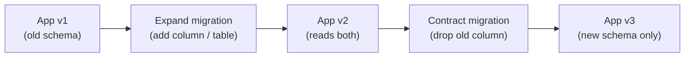

# Zero-Downtime Database Migrations

[← Back to README](../README.md)

---

Zero-downtime migrations require that the database schema is backward-compatible with **both** the old and new application version during a rolling deploy. The **expand/contract** pattern achieves this in three phases: add the new structure, migrate data, then remove the old structure — each deployed independently.



---

## Expand / Contract in Three Deployments

### Phase 1 — Expand (additive migration, no data loss)

```sql
-- Migration V2__add_email_verified.sql
-- Safe: adding a nullable column never breaks existing code

ALTER TABLE users ADD COLUMN email_verified BOOLEAN;
ALTER TABLE users ADD COLUMN email_verified_at TIMESTAMPTZ;

-- Backfill: set default for existing rows
UPDATE users SET email_verified = false WHERE email_verified IS NULL;

-- Make NOT NULL only after backfill
ALTER TABLE users ALTER COLUMN email_verified SET NOT NULL;
ALTER TABLE users ALTER COLUMN email_verified SET DEFAULT false;
```

App v1 ignores the new columns. App v2 starts writing them.

### Phase 2 — Transition (app reads from both old and new)

```java
// App v2 — writes new column, reads with fallback
public boolean isEmailVerified(User user) {
    // New column may be null for rows written before the migration
    return Boolean.TRUE.equals(user.getEmailVerified());
}
```

### Phase 3 — Contract (remove old structure)

```sql
-- Migration V3__drop_legacy_verified_flag.sql
-- Safe only after ALL instances run v2

ALTER TABLE users DROP COLUMN legacy_verified_flag;
```

---

## Column Rename — Expand / Contract

Direct rename breaks running instances that still reference the old name:

```sql
-- Step 1: Expand — add new column, keep old
ALTER TABLE orders ADD COLUMN customer_reference VARCHAR(100);

-- Step 2: Backfill
UPDATE orders SET customer_reference = order_ref WHERE customer_reference IS NULL;

-- Add trigger to keep both in sync during transition
CREATE OR REPLACE FUNCTION sync_order_ref() RETURNS TRIGGER AS $$
BEGIN
    NEW.customer_reference := NEW.order_ref;
    RETURN NEW;
END;
$$ LANGUAGE plpgsql;

CREATE TRIGGER sync_order_ref_trigger
BEFORE INSERT OR UPDATE ON orders
FOR EACH ROW EXECUTE FUNCTION sync_order_ref();
```

```sql
-- Step 3: Contract (after new app fully deployed, trigger dropped)
DROP TRIGGER sync_order_ref_trigger ON orders;
DROP FUNCTION sync_order_ref();
ALTER TABLE orders DROP COLUMN order_ref;
```

---

## Adding a NOT NULL Column Safely

Never add a `NOT NULL` column without a default in one step on a large table — it requires a full table rewrite.

```sql
-- WRONG on large tables (takes lock, rewrites table):
ALTER TABLE orders ADD COLUMN priority INT NOT NULL DEFAULT 0;

-- RIGHT: multi-step, low-lock approach
-- Step 1: add nullable (fast, no rewrite)
ALTER TABLE orders ADD COLUMN priority INT;

-- Step 2: backfill in batches to avoid long transactions
DO $$
DECLARE batch_size INT := 10000;
BEGIN
    LOOP
        UPDATE orders SET priority = 0
        WHERE id IN (
            SELECT id FROM orders WHERE priority IS NULL LIMIT batch_size
        );
        EXIT WHEN NOT FOUND;
        PERFORM pg_sleep(0.1);   -- yield CPU between batches
    END LOOP;
END $$;

-- Step 3: add NOT NULL constraint using a NOT VALID check (no full scan)
ALTER TABLE orders ADD CONSTRAINT orders_priority_not_null
    CHECK (priority IS NOT NULL) NOT VALID;

-- Step 4: validate in background (ShareUpdateExclusiveLock, not full lock)
ALTER TABLE orders VALIDATE CONSTRAINT orders_priority_not_null;

-- Step 5 (optional): convert to a true NOT NULL (requires brief AccessExclusiveLock on modern PG)
ALTER TABLE orders ALTER COLUMN priority SET NOT NULL;
ALTER TABLE orders DROP CONSTRAINT orders_priority_not_null;
```

---

## Index Creation Without Downtime

```sql
-- WRONG: blocks writes for the duration of the index build
CREATE INDEX ON orders (customer_id);

-- RIGHT: CONCURRENTLY — reads and writes continue during build
CREATE INDEX CONCURRENTLY idx_orders_customer_id ON orders (customer_id);

-- Drop index concurrently too
DROP INDEX CONCURRENTLY idx_orders_customer_id;
```

`CONCURRENTLY` takes longer and uses more I/O, but never blocks.

---

## Flyway / Liquibase Best Practices

```java
// application.yml — never auto-run in production
spring:
  flyway:
    enabled: true
    out-of-order: false          # strict ordering
    validate-on-migrate: true    # fail fast on checksum mismatch
    baseline-on-migrate: false   # only true on first-time adopt
    locations: classpath:db/migration
    table: flyway_schema_history
```

```java
// Never edit an applied migration — create a new one
// V3__fix_index.sql — safe fix
DROP INDEX CONCURRENTLY idx_orders_status;
CREATE INDEX CONCURRENTLY idx_orders_status_created ON orders (status, created_at);
```

---

## Locking Cheat Sheet

| Operation | Lock type | Blocks |
|-----------|-----------|--------|
| `ALTER TABLE ADD COLUMN` (nullable) | AccessExclusiveLock | Reads + writes briefly |
| `ALTER TABLE ADD COLUMN NOT NULL DEFAULT` | AccessExclusiveLock + rewrite | Long block on large table |
| `CREATE INDEX` | ShareLock | Writes only |
| `CREATE INDEX CONCURRENTLY` | ShareUpdateExclusiveLock | Almost nothing |
| `UPDATE` (batched) | RowExclusiveLock | Nothing else |
| `ALTER TABLE DROP COLUMN` | AccessExclusiveLock | Reads + writes briefly |

---

## Batched Data Migration in Java

```java
@Component
@RequiredArgsConstructor
public class BackfillService {

    private final JdbcTemplate jdbc;

    @Scheduled(fixedDelay = 1000)
    @Transactional
    public void backfillPriority() {
        int updated = jdbc.update("""
            UPDATE orders SET priority = 0
            WHERE priority IS NULL
            LIMIT 5000
            """);

        log.info("Backfilled {} rows", updated);
        if (updated == 0) {
            log.info("Backfill complete — disabling task");
            // self-disable or flip a feature flag
        }
    }
}
```

---

## Zero-Downtime Migration Summary

| Pattern | Detail |
|---------|--------|
| Expand / Contract | Three-phase: add → migrate data → remove old; each a separate deploy |
| Nullable column first | Add `NULL` column, backfill, then enforce `NOT NULL` |
| `NOT VALID` constraint | Adds check without scanning existing rows; validate later |
| `CREATE INDEX CONCURRENTLY` | Builds index without blocking writes; takes longer |
| Rename via synonym | Add new column + sync trigger, drop old after deploy |
| Batched backfill | Update rows in small batches with `LIMIT` + sleep to avoid locking |
| Never edit applied migrations | Create a new migration to fix or revert; checksums protect integrity |
| `validate-on-migrate: true` | Flyway fails fast if a migration file was edited after applying |
| Feature flags | Gate new code path behind a flag; roll out independently of schema |
| Two-phase NOT NULL | `ADD COLUMN` nullable → batch fill → `ALTER COLUMN SET NOT NULL` (brief lock on PG 12+) |

---

[← Back to README](../README.md)
