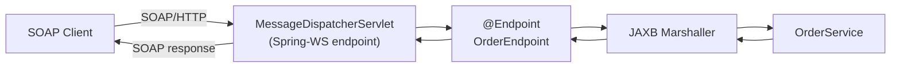

# Spring Web Services (SOAP)

[← Back to README](../README.md)

---

**Spring-WS** implements contract-first SOAP web services: you write the XSD schema and WSDL first, generate Java classes from them, and Spring-WS handles the marshalling, routing, and transport. It also acts as a SOAP client via `WebServiceTemplate`.



---

## Dependencies

```xml
<dependency>
    <groupId>org.springframework.boot</groupId>
    <artifactId>spring-boot-starter-web-services</artifactId>
</dependency>
<dependency>
    <groupId>wsdl4j</groupId>
    <artifactId>wsdl4j</artifactId>
</dependency>
<!-- JAXB for Java 11+ -->
<dependency>
    <groupId>org.glassfish.jaxb</groupId>
    <artifactId>jaxb-runtime</artifactId>
</dependency>
```

---

## XSD Contract

```xml
<!-- src/main/resources/orders.xsd -->
<xs:schema xmlns:xs="http://www.w3.org/2001/XMLSchema"
           xmlns:tns="http://example.com/orders"
           targetNamespace="http://example.com/orders"
           elementFormDefault="qualified">

    <xs:element name="PlaceOrderRequest">
        <xs:complexType>
            <xs:sequence>
                <xs:element name="customerId" type="xs:string"/>
                <xs:element name="productId"  type="xs:string"/>
                <xs:element name="quantity"   type="xs:int"/>
            </xs:sequence>
        </xs:complexType>
    </xs:element>

    <xs:element name="PlaceOrderResponse">
        <xs:complexType>
            <xs:sequence>
                <xs:element name="orderId" type="xs:string"/>
                <xs:element name="status"  type="xs:string"/>
            </xs:sequence>
        </xs:complexType>
    </xs:element>

    <xs:element name="GetOrderRequest">
        <xs:complexType>
            <xs:sequence>
                <xs:element name="orderId" type="xs:string"/>
            </xs:sequence>
        </xs:complexType>
    </xs:element>

    <xs:element name="GetOrderResponse">
        <xs:complexType>
            <xs:sequence>
                <xs:element name="orderId"    type="xs:string"/>
                <xs:element name="customerId" type="xs:string"/>
                <xs:element name="status"     type="xs:string"/>
                <xs:element name="total"      type="xs:decimal"/>
            </xs:sequence>
        </xs:complexType>
    </xs:element>
</xs:schema>
```

---

## Generate Java Classes from XSD

```xml
<!-- pom.xml -->
<plugin>
    <groupId>org.codehaus.mojo</groupId>
    <artifactId>jaxb2-maven-plugin</artifactId>
    <version>3.1.0</version>
    <executions>
        <execution>
            <goals><goal>xjc</goal></goals>
        </execution>
    </executions>
    <configuration>
        <sources>
            <source>src/main/resources/orders.xsd</source>
        </sources>
        <packageName>com.example.orders.generated</packageName>
    </configuration>
</plugin>
```

---

## Server Configuration

```java
@EnableWs
@Configuration
public class WebServiceConfig extends WsConfigurerAdapter {

    // Register MessageDispatcherServlet
    @Bean
    public ServletRegistrationBean<MessageDispatcherServlet> messageDispatcherServlet(
            ApplicationContext ctx) {
        MessageDispatcherServlet servlet = new MessageDispatcherServlet();
        servlet.setApplicationContext(ctx);
        servlet.setTransformWsdlLocations(true);
        return new ServletRegistrationBean<>(servlet, "/ws/*");
    }

    // Auto-generate WSDL at /ws/orders.wsdl
    @Bean(name = "orders")
    public DefaultWsdl11Definition defaultWsdl11Definition(XsdSchema ordersSchema) {
        DefaultWsdl11Definition wsdl = new DefaultWsdl11Definition();
        wsdl.setPortTypeName("OrdersPort");
        wsdl.setLocationUri("/ws");
        wsdl.setTargetNamespace("http://example.com/orders");
        wsdl.setSchema(ordersSchema);
        return wsdl;
    }

    @Bean
    public XsdSchema ordersSchema() {
        return new SimpleXsdSchema(new ClassPathResource("orders.xsd"));
    }
}
```

---

## Endpoint

```java
@Endpoint
@RequiredArgsConstructor
public class OrderEndpoint {

    private static final String NAMESPACE = "http://example.com/orders";

    private final OrderService orderService;

    @PayloadRoot(namespace = NAMESPACE, localPart = "PlaceOrderRequest")
    @ResponsePayload
    public PlaceOrderResponse placeOrder(@RequestPayload PlaceOrderRequest request) {
        Order order = orderService.place(
            request.getCustomerId(),
            request.getProductId(),
            request.getQuantity());

        PlaceOrderResponse response = new PlaceOrderResponse();
        response.setOrderId(order.getId().toString());
        response.setStatus(order.getStatus());
        return response;
    }

    @PayloadRoot(namespace = NAMESPACE, localPart = "GetOrderRequest")
    @ResponsePayload
    public GetOrderResponse getOrder(@RequestPayload GetOrderRequest request) {
        Order order = orderService.findById(UUID.fromString(request.getOrderId()));

        GetOrderResponse response = new GetOrderResponse();
        response.setOrderId(order.getId().toString());
        response.setCustomerId(order.getCustomerId().toString());
        response.setStatus(order.getStatus());
        response.setTotal(order.getTotal());
        return response;
    }
}
```

---

## SOAP Client with WebServiceTemplate

```java
@Component
@RequiredArgsConstructor
public class OrderSoapClient extends WebServiceGatewaySupport {

    public PlaceOrderResponse placeOrder(String customerId, String productId, int quantity) {
        PlaceOrderRequest request = new PlaceOrderRequest();
        request.setCustomerId(customerId);
        request.setProductId(productId);
        request.setQuantity(quantity);

        return (PlaceOrderResponse) getWebServiceTemplate()
            .marshalSendAndReceive(
                "http://external-system/ws",
                request,
                new SoapActionCallback("http://example.com/orders/PlaceOrder"));
    }
}

@Configuration
public class SoapClientConfig {

    @Bean
    public OrderSoapClient orderSoapClient(Jaxb2Marshaller marshaller) {
        OrderSoapClient client = new OrderSoapClient();
        client.setDefaultUri("http://external-system/ws");
        client.setMarshaller(marshaller);
        client.setUnmarshaller(marshaller);
        return client;
    }

    @Bean
    public Jaxb2Marshaller marshaller() {
        Jaxb2Marshaller marshaller = new Jaxb2Marshaller();
        marshaller.setContextPath("com.example.orders.generated");
        return marshaller;
    }
}
```

---

## Interceptors (Logging, WS-Security)

```java
@Configuration
public class WebServiceConfig extends WsConfigurerAdapter {

    @Override
    public void addInterceptors(List<EndpointInterceptor> interceptors) {
        // Payload logging
        PayloadLoggingInterceptor loggingInterceptor = new PayloadLoggingInterceptor();
        interceptors.add(loggingInterceptor);

        // WS-Security (username token)
        Wss4jSecurityInterceptor securityInterceptor = new Wss4jSecurityInterceptor();
        securityInterceptor.setValidationActions("UsernameToken");
        securityInterceptor.setValidationCallbackHandler(
            new SimplePasswordValidationCallbackHandler() {{
                setUsersMap(Map.of("serviceUser", "secret"));
            }});
        interceptors.add(securityInterceptor);
    }
}
```

---

## Fault Handling

```java
@Endpoint
public class OrderEndpoint {

    @PayloadRoot(namespace = NAMESPACE, localPart = "GetOrderRequest")
    @ResponsePayload
    public GetOrderResponse getOrder(@RequestPayload GetOrderRequest request)
            throws SoapFaultClientException {
        try {
            Order order = orderService.findById(UUID.fromString(request.getOrderId()));
            // ... build response
        } catch (OrderNotFoundException e) {
            throw new SoapFaultDefinitionException(
                SoapFaultDefinition.SERVER,
                "Order " + request.getOrderId() + " not found");
        }
    }
}

// Custom SOAP fault mapping
@Bean
public SoapFaultMappingExceptionResolver exceptionResolver() {
    SoapFaultMappingExceptionResolver resolver = new SoapFaultMappingExceptionResolver();
    resolver.setDefaultFault(SoapFaultDefinition.SERVER);
    Properties mappings = new Properties();
    mappings.setProperty(OrderNotFoundException.class.getName(), "CLIENT");
    resolver.setExceptionMappings(mappings);
    resolver.setOrder(1);
    return resolver;
}
```

---

## Spring Web Services Summary

| Concept | Detail |
|---------|--------|
| Contract-first | Define XSD → generate Java → implement endpoint |
| `@EnableWs` | Enable Spring-WS in a `@Configuration` class |
| `MessageDispatcherServlet` | Handles SOAP messages at a `/ws/*` URL pattern |
| `DefaultWsdl11Definition` | Auto-generates WSDL from an XSD schema at `/ws/{name}.wsdl` |
| `@Endpoint` | Marks a class containing SOAP operation handlers |
| `@PayloadRoot` | Maps a SOAP message by namespace + local element name |
| `@RequestPayload` / `@ResponsePayload` | Bind SOAP body to/from method parameter / return value |
| `Jaxb2Marshaller` | Converts XML ↔ JAXB objects using generated classes |
| `WebServiceGatewaySupport` | Base class for SOAP clients using `WebServiceTemplate` |
| `Wss4jSecurityInterceptor` | WS-Security — username tokens, digital signatures, encryption |
| `SoapFaultMappingExceptionResolver` | Map exceptions to SOAP faults (CLIENT vs SERVER) |

---

[← Back to README](../README.md)
