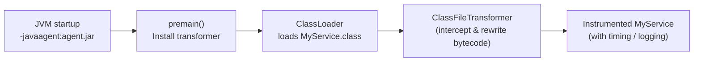

# Java Agents & Bytecode Instrumentation

[← Back to README](../README.md)

---

A **Java agent** is a JAR that attaches to the JVM and can transform class bytecode before or after it loads. APM tools (New Relic, Datadog, OpenTelemetry), profilers, and coverage tools like JaCoCo are all agents. **ByteBuddy** makes bytecode manipulation safe and readable — no raw ASM manipulation needed.



---

## Agent Entry Points

```java
// src/main/java/com/example/agent/TimingAgent.java

public class TimingAgent {

    // Called before main() when loaded via -javaagent
    public static void premain(String agentArgs, Instrumentation inst) {
        System.out.println("Agent starting with args: " + agentArgs);
        inst.addTransformer(new TimingTransformer(), true);
    }

    // Called when attaching to a running JVM (dynamic attach)
    public static void agentmain(String agentArgs, Instrumentation inst) {
        premain(agentArgs, inst);
    }
}
```

```xml
<!-- MANIFEST.MF (via maven-jar-plugin) -->
<manifestEntries>
    <Premain-Class>com.example.agent.TimingAgent</Premain-Class>
    <Agent-Class>com.example.agent.TimingAgent</Agent-Class>
    <Can-Retransform-Classes>true</Can-Retransform-Classes>
    <Can-Redefine-Classes>true</Can-Redefine-Classes>
</manifestEntries>
```

```bash
# Launch with agent
java -javaagent:timing-agent.jar=verbose=true -jar myapp.jar
```

---

## Raw ClassFileTransformer (ASM)

Low-level approach — rarely used directly:

```java
public class TimingTransformer implements ClassFileTransformer {

    @Override
    public byte[] transform(ClassLoader loader, String className,
                            Class<?> classBeingRedefined,
                            ProtectionDomain domain,
                            byte[] classfileBuffer) {
        // className uses slashes: com/example/service/OrderService
        if (!className.startsWith("com/example/service/")) return null;

        ClassReader  reader  = new ClassReader(classfileBuffer);
        ClassWriter  writer  = new ClassWriter(reader, ClassWriter.COMPUTE_FRAMES);
        ClassVisitor visitor = new TimingClassVisitor(writer);
        reader.accept(visitor, 0);
        return writer.toByteArray();
    }
}
```

---

## ByteBuddy — High-Level Instrumentation

ByteBuddy wraps ASM with a fluent API that reads like the Java you intend to produce:

```xml
<dependency>
    <groupId>net.bytebuddy</groupId>
    <artifactId>byte-buddy</artifactId>
    <version>1.14.18</version>
</dependency>
<dependency>
    <groupId>net.bytebuddy</groupId>
    <artifactId>byte-buddy-agent</artifactId>
    <version>1.14.18</version>
</dependency>
```

### Intercept All Methods in a Package

```java
public class TimingAgent {

    public static void premain(String args, Instrumentation inst) {
        new AgentBuilder.Default()
            .type(nameStartsWith("com.example.service."))
            .transform((builder, type, loader, module, domain) ->
                builder.method(isPublic().and(not(isConstructor())))
                       .intercept(MethodDelegation.to(TimingInterceptor.class)))
            .installOn(inst);
    }
}

public class TimingInterceptor {

    @RuntimeType
    public static Object intercept(
            @Origin Method method,
            @SuperCall Callable<?> superCall,
            @AllArguments Object[] args) throws Exception {

        long start = System.nanoTime();
        try {
            return superCall.call();
        } finally {
            long elapsed = System.nanoTime() - start;
            System.out.printf("[AGENT] %s.%s took %.2f ms%n",
                method.getDeclaringClass().getSimpleName(),
                method.getName(),
                elapsed / 1_000_000.0);
        }
    }
}
```

### Add a Field to a Class

```java
new ByteBuddy()
    .redefine(Order.class)
    .defineField("_traceId", String.class, Visibility.PUBLIC)
    .make()
    .load(Order.class.getClassLoader(), ClassReloadingStrategy.fromInstalledAgent());
```

### Subclass and Override

```java
Class<? extends OrderService> proxyClass = new ByteBuddy()
    .subclass(OrderService.class)
    .method(named("placeOrder"))
    .intercept(MethodDelegation.to(AuditInterceptor.class))
    .make()
    .load(OrderService.class.getClassLoader())
    .getLoaded();

OrderService proxy = proxyClass.getDeclaredConstructor().newInstance();
```

---

## Dynamic Attach — Attach to Running JVM

```java
// Attach to a running process without restarting it
import com.sun.tools.attach.VirtualMachine;

public class DynamicAttach {
    public static void attach(String pid, String agentJarPath) throws Exception {
        VirtualMachine vm = VirtualMachine.attach(pid);
        try {
            vm.loadAgent(agentJarPath, "verbose=true");
        } finally {
            vm.detach();
        }
    }
}
```

```bash
# Find PID
jcmd

# Attach programmatically or via jcmd
jcmd <pid> VM.load_agent_path /path/to/agent.jar verbose=true
```

---

## OpenTelemetry Java Agent — Production Example

```bash
# Drop-in zero-code instrumentation
java -javaagent:opentelemetry-javaagent.jar \
     -Dotel.service.name=order-service \
     -Dotel.exporter.otlp.endpoint=http://otel-collector:4317 \
     -Dotel.traces.sampler=parentbased_traceidratio \
     -Dotel.traces.sampler.arg=0.1 \
     -jar order-service.jar
```

The agent intercepts Spring MVC, JDBC, Kafka, gRPC, and dozens of other libraries automatically via ByteBuddy.

---

## Instrumentation API Utilities

```java
public static void premain(String args, Instrumentation inst) {

    // Get all loaded classes
    Class<?>[] loaded = inst.getAllLoadedClasses();

    // Check if class is modifiable
    boolean canModify = inst.isModifiableClass(OrderService.class);

    // Retransform a class already loaded
    inst.retransformClasses(OrderService.class);

    // Get object size (useful for memory analysis)
    long size = inst.getObjectSize(new Order());
    System.out.println("Order object size: " + size + " bytes");

    // Append a JAR to the bootstrap class loader
    inst.appendToBootstrapClassLoaderSearch(new JarFile("/path/to/extra.jar"));
}
```

---

## Java Agents Summary

| Concept | Detail |
|---------|--------|
| `premain(String, Instrumentation)` | Agent entry point; called before `main()` |
| `agentmain(String, Instrumentation)` | Dynamic attach entry point; JVM already running |
| `Premain-Class` manifest | Declares the class with `premain`; required in agent JAR |
| `Can-Retransform-Classes: true` | Required to retransform already-loaded classes |
| `ClassFileTransformer` | Low-level hook; return rewritten bytecode or null to skip |
| ByteBuddy `AgentBuilder` | High-level DSL; specify type matcher + transformation |
| `@Origin Method` | Inject the reflected `Method` into an interceptor |
| `@SuperCall Callable<?>` | Call the original method from an interceptor |
| `@AllArguments Object[]` | Inject all method arguments into an interceptor |
| Dynamic attach | `VirtualMachine.attach(pid)` then `vm.loadAgent(path)` |
| `inst.getObjectSize(obj)` | Measure object shallow size in bytes |
| OpenTelemetry agent | Production-grade drop-in agent; auto-instruments common libraries |

---

[← Back to README](../README.md)
