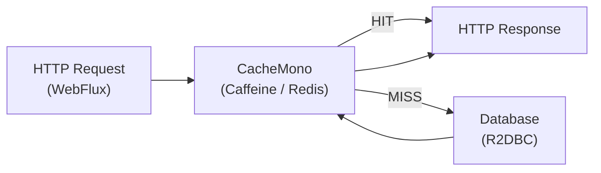

# Reactive Caching

[← Back to README](../README.md)

---

Spring's `@Cacheable` is synchronous and blocks the calling thread — incompatible with reactive pipelines. Reactive caching assembles `Mono`/`Flux` with cache operators, or uses Reactor's built-in `cache()` and `CacheMono`/`CacheFlux` from `reactor-extra`. For distributed caching, Spring Data Redis Reactive provides a non-blocking `ReactiveRedisTemplate`.



---

## Why @Cacheable Doesn't Work in WebFlux

```java
// BROKEN — @Cacheable wraps the Mono in a cache, not the resolved value
@Cacheable("orders")
public Mono<Order> findById(UUID id) {
    return orderRepository.findById(id);  // the Mono itself gets cached, not the Order
}
```

The cache stores a cold `Mono` reference that re-subscribes on every cache hit, bypassing the cache entirely. Use the patterns below instead.

---

## CacheMono / CacheFlux (reactor-extra)

```xml
<dependency>
    <groupId>io.projectreactor.addons</groupId>
    <artifactId>reactor-extra</artifactId>
</dependency>
```

```java
@Service
@RequiredArgsConstructor
public class OrderCacheService {

    private final OrderRepository orderRepository;
    private final Cache<UUID, Order> caffeineCache;

    public Mono<Order> findById(UUID id) {
        return CacheMono.lookup(
                // Lookup: return Mono.empty() on miss
                key -> Mono.justOrEmpty(caffeineCache.getIfPresent(key))
                           .map(Signal::next),
                id)
            // Source: called on cache miss
            .onCacheMissResume(() -> orderRepository.findById(id))
            // Writer: store the resolved value in the cache
            .andWriteWith((key, signal) -> Mono.fromRunnable(() -> {
                if (signal.hasValue()) {
                    caffeineCache.put(key, signal.get());
                }
            }));
    }

    public Flux<Order> findByCustomerId(UUID customerId) {
        return CacheFlux.lookup(
                key -> {
                    List<Order> cached = listCache.getIfPresent(key);
                    return cached != null
                        ? Flux.fromIterable(cached).map(Signal::next).collectList()
                        : Mono.empty();
                },
                customerId)
            .onCacheMissResume(() -> orderRepository.findByCustomerId(customerId))
            .andWriteWith((key, signals) -> Flux.fromIterable(signals)
                .filter(Signal::hasValue)
                .map(Signal::get)
                .collectList()
                .doOnNext(list -> listCache.put(key, list))
                .then());
    }
}
```

---

## Caffeine as the Backing Cache

```java
@Configuration
public class CacheConfig {

    @Bean
    public Cache<UUID, Order> orderCache() {
        return Caffeine.newBuilder()
            .maximumSize(10_000)
            .expireAfterWrite(Duration.ofMinutes(5))
            .recordStats()
            .build();
    }

    @Bean
    public Cache<UUID, List<Order>> orderListCache() {
        return Caffeine.newBuilder()
            .maximumSize(1_000)
            .expireAfterWrite(Duration.ofMinutes(2))
            .build();
    }
}
```

---

## Reactive Redis Cache

```xml
<dependency>
    <groupId>org.springframework.boot</groupId>
    <artifactId>spring-boot-starter-data-redis-reactive</artifactId>
</dependency>
```

```java
@Service
@RequiredArgsConstructor
public class ReactiveRedisCacheService {

    private final ReactiveRedisTemplate<String, Order> redisTemplate;
    private final OrderRepository orderRepository;

    private static final Duration TTL = Duration.ofMinutes(10);

    public Mono<Order> findById(UUID id) {
        String key = "order:" + id;

        return redisTemplate.opsForValue().get(key)
            .switchIfEmpty(
                orderRepository.findById(id)
                    .flatMap(order ->
                        redisTemplate.opsForValue()
                            .set(key, order, TTL)
                            .thenReturn(order)));
    }

    public Mono<Void> evict(UUID id) {
        return redisTemplate.delete("order:" + id).then();
    }

    public Mono<Void> evictAll() {
        return redisTemplate.keys("order:*")
            .flatMap(redisTemplate::delete)
            .then();
    }
}
```

```java
@Configuration
public class ReactiveRedisConfig {

    @Bean
    public ReactiveRedisTemplate<String, Order> reactiveRedisTemplate(
            ReactiveRedisConnectionFactory factory) {

        Jackson2JsonRedisSerializer<Order> serializer =
            new Jackson2JsonRedisSerializer<>(Order.class);

        RedisSerializationContext<String, Order> context =
            RedisSerializationContext.<String, Order>newSerializationContext(
                new StringRedisSerializer())
                .value(serializer)
                .build();

        return new ReactiveRedisTemplate<>(factory, context);
    }
}
```

---

## Cache Invalidation on Write

```java
@Service
@RequiredArgsConstructor
public class OrderService {

    private final OrderRepository orderRepository;
    private final ReactiveRedisCacheService cache;

    public Mono<Order> update(UUID id, UpdateOrderCommand cmd) {
        return orderRepository.findById(id)
            .map(order -> order.apply(cmd))
            .flatMap(orderRepository::save)
            .flatMap(saved ->
                cache.evict(saved.getId())
                     .thenReturn(saved));
    }
}
```

---

## Mono.cache() — In-Memory Memoization

For singleton or application-scoped values loaded once:

```java
@Component
public class ConfigService {

    private final Mono<AppConfig> cachedConfig;

    public ConfigService(ConfigRepository repo) {
        // Load once, replay to all subscribers
        this.cachedConfig = repo.findActive()
            .cache(Duration.ofMinutes(30));
    }

    public Mono<AppConfig> getConfig() {
        return cachedConfig;
    }
}
```

`Mono.cache()` with a duration re-fetches after expiry. Without a duration it caches forever (cold-start singleton).

---

## Metrics and Cache Stats

```java
@Bean
public CacheMetricsRegistrar cacheMetricsRegistrar(MeterRegistry registry,
                                                    Cache<UUID, Order> orderCache) {
    // Caffeine stats exposed to Micrometer
    CaffeineCache spring = new CaffeineCache("orders", orderCache);
    new CaffeineCacheMetrics(spring, "orders", List.of()).bindTo(registry);
    return new CacheMetricsRegistrar(registry, List.of());
}
```

```yaml
# Expose cache stats via Actuator
management:
  endpoints:
    web:
      exposure:
        include: caches, metrics
```

---

## Reactive Caching Summary

| Concept | Detail |
|---------|--------|
| `@Cacheable` in WebFlux | Caches the `Mono` reference, not the value — avoid it |
| `CacheMono.lookup` | Reactive cache-aside: lookup → miss → source → write |
| `CacheFlux.lookup` | Same pattern for `Flux<T>` values |
| `Cache<K,V>` (Caffeine) | In-process cache; `getIfPresent` / `put` in lookup/write lambdas |
| `ReactiveRedisTemplate` | Non-blocking Redis access — `opsForValue().get()` / `set()` |
| `switchIfEmpty` | Fallback to the data source on cache miss |
| Cache invalidation | `redisTemplate.delete(key)` after write, flat-mapped into the save flow |
| `Mono.cache()` | Memoize a singleton `Mono`; optional TTL for auto-refresh |
| `Duration` TTL on Redis | `.set(key, value, ttl)` — Redis expires the key automatically |
| CaffeineCache metrics | Wrap Caffeine cache with `CaffeineCacheMetrics` to expose hit rate to Micrometer |

---

[← Back to README](../README.md)
