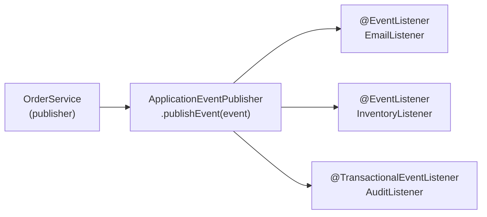

# Spring Events & ApplicationEventPublisher

[← Back to README](../README.md)

---

Spring's event system provides loosely coupled in-process communication between components. A publisher fires an event without knowing who handles it. Listeners react independently — in the same thread, asynchronously, or only after a transaction commits.



---

## Defining Events

```java
// Simple POJO event (Spring 4.2+ — no need to extend ApplicationEvent)
public record OrderPlacedEvent(UUID orderId, UUID customerId, BigDecimal total) {}

public record OrderCancelledEvent(UUID orderId, String reason) {}

// With source (classic style)
public class OrderShippedEvent extends ApplicationEvent {
    private final UUID orderId;

    public OrderShippedEvent(Object source, UUID orderId) {
        super(source);
        this.orderId = orderId;
    }

    public UUID getOrderId() { return orderId; }
}
```

---

## Publishing Events

```java
@Service
@RequiredArgsConstructor
public class OrderService {

    private final OrderRepository orderRepository;
    private final ApplicationEventPublisher publisher;

    @Transactional
    public Order place(PlaceOrderCommand cmd) {
        Order order = Order.create(cmd);
        orderRepository.save(order);

        // Fired immediately — listeners run in the same transaction
        publisher.publishEvent(new OrderPlacedEvent(
            order.getId(), cmd.customerId(), order.getTotal()));

        return order;
    }

    @Transactional
    public void cancel(UUID orderId, String reason) {
        Order order = orderRepository.findById(orderId).orElseThrow();
        order.cancel(reason);
        orderRepository.save(order);
        publisher.publishEvent(new OrderCancelledEvent(orderId, reason));
    }
}
```

---

## Listening to Events

```java
@Component
@RequiredArgsConstructor
public class OrderEmailListener {

    private final EmailService emailService;

    @EventListener
    public void onOrderPlaced(OrderPlacedEvent event) {
        emailService.sendConfirmation(event.customerId(), event.orderId());
    }

    @EventListener
    public void onOrderCancelled(OrderCancelledEvent event) {
        emailService.sendCancellation(event.orderId(), event.reason());
    }
}

@Component
@RequiredArgsConstructor
public class InventoryListener {

    private final InventoryService inventoryService;

    @EventListener
    public void onOrderPlaced(OrderPlacedEvent event) {
        inventoryService.reserve(event.orderId());
    }
}
```

---

## @TransactionalEventListener — Fire After Commit

Run a listener only after the publishing transaction successfully commits:

```java
@Component
@RequiredArgsConstructor
public class OrderAuditListener {

    private final AuditRepository auditRepository;

    // Default phase: AFTER_COMMIT — fires only if the transaction committed
    @TransactionalEventListener
    public void onOrderPlaced(OrderPlacedEvent event) {
        auditRepository.save(new AuditEntry(event.orderId(), "ORDER_PLACED"));
    }

    // Other phases
    @TransactionalEventListener(phase = TransactionPhase.BEFORE_COMMIT)
    public void beforeCommit(OrderPlacedEvent event) { /* ... */ }

    @TransactionalEventListener(phase = TransactionPhase.AFTER_ROLLBACK)
    public void onRollback(OrderPlacedEvent event) {
        log.warn("Order {} placement rolled back", event.orderId());
    }

    @TransactionalEventListener(phase = TransactionPhase.AFTER_COMPLETION)
    public void afterCompletion(OrderPlacedEvent event) { /* commit OR rollback */ }
}
```

`@TransactionalEventListener` requires an active transaction when the event is published. If there is no transaction, the event is dropped by default — use `fallbackExecution = true` to fire regardless.

---

## Async Event Listeners

```java
@Configuration
@EnableAsync
public class AsyncConfig {

    @Bean
    public Executor eventExecutor() {
        ThreadPoolTaskExecutor executor = new ThreadPoolTaskExecutor();
        executor.setCorePoolSize(4);
        executor.setMaxPoolSize(16);
        executor.setQueueCapacity(100);
        executor.setThreadNamePrefix("event-");
        executor.initialize();
        return executor;
    }
}

@Component
public class AsyncOrderListener {

    @Async("eventExecutor")
    @EventListener
    public void onOrderPlaced(OrderPlacedEvent event) {
        // Runs on the event executor thread pool, not the caller's thread
        analyticsService.recordOrder(event.orderId(), event.total());
    }
}
```

---

## Ordering Listeners

```java
@Component
public class PriorityListeners {

    @EventListener
    @Order(1)   // runs first
    public void validateFirst(OrderPlacedEvent event) {
        fraudService.check(event.orderId());
    }

    @EventListener
    @Order(2)   // runs second
    public void reserveStock(OrderPlacedEvent event) {
        inventoryService.reserve(event.orderId());
    }

    @EventListener
    @Order(3)   // runs last
    public void notifyCustomer(OrderPlacedEvent event) {
        emailService.sendConfirmation(event.customerId(), event.orderId());
    }
}
```

---

## Conditional Listeners

```java
@Component
public class ConditionalListener {

    // SpEL condition — only listen for high-value orders
    @EventListener(condition = "#event.total > 1000")
    public void onHighValueOrder(OrderPlacedEvent event) {
        vipService.flag(event.orderId());
    }
}
```

---

## Listener Returns a New Event (Event Chaining)

```java
@Component
public class OrderWorkflow {

    @EventListener
    public OrderShippedEvent onOrderPacked(OrderPackedEvent event) {
        shippingService.dispatch(event.orderId());
        // Returning non-null publishes this as a new event automatically
        return new OrderShippedEvent(this, event.orderId());
    }
}
```

---

## Testing Events

```java
@SpringBootTest
class OrderServiceTest {

    @Autowired private OrderService orderService;
    @MockBean  private ApplicationEventPublisher publisher;

    @Test
    void placeOrder_publishesOrderPlacedEvent() {
        orderService.place(new PlaceOrderCommand("cust-1", "prod-1", 2));

        verify(publisher).publishEvent(argThat(event ->
            event instanceof OrderPlacedEvent e && e.customerId().equals("cust-1")));
    }
}
```

---

## Spring Events Summary

| Concept | Detail |
|---------|--------|
| `ApplicationEventPublisher` | Injected bean for publishing events from any Spring component |
| POJO events | No need to extend `ApplicationEvent` since Spring 4.2 |
| `@EventListener` | Register a method as a synchronous listener — runs in the publisher's thread |
| `@TransactionalEventListener` | Fire after commit (default), before commit, after rollback, or after completion |
| `fallbackExecution = true` | Fire `@TransactionalEventListener` even when no transaction is active |
| `@Async` + `@EventListener` | Run listener on a separate thread pool — caller continues immediately |
| `@Order` | Control the sequence when multiple listeners handle the same event type |
| `condition` SpEL | Filter events before invoking the listener |
| Return value chaining | Returning a non-null value from a listener auto-publishes it as a new event |
| `TransactionPhase` | `BEFORE_COMMIT`, `AFTER_COMMIT`, `AFTER_ROLLBACK`, `AFTER_COMPLETION` |

---

[← Back to README](../README.md)
