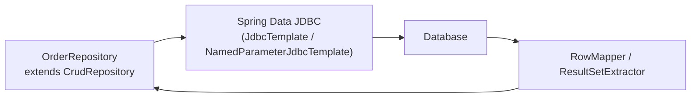

# Spring Data JDBC

[← Back to README](../README.md)

---

**Spring Data JDBC** is a lightweight alternative to JPA/Hibernate. It maps aggregates to tables with simple, explicit rules: no lazy loading, no dirty checking, no proxy objects, no session. Reads are explicit SQL; writes are deterministic. Perfect for teams that want Spring Data's repository abstractions without Hibernate's complexity.



---

## Dependency

```xml
<dependency>
    <groupId>org.springframework.boot</groupId>
    <artifactId>spring-boot-starter-data-jdbc</artifactId>
</dependency>
```

---

## Aggregate Root and Entities

Spring Data JDBC follows DDD aggregate semantics: only aggregate roots have repositories.

```java
// Aggregate root — has its own table and repository
@Table("orders")
public class Order {

    @Id
    private Long id;

    private String customerId;
    private String status;
    private BigDecimal total;

    // Embedded value object — maps to columns in the same table
    @Embedded(onEmpty = Embedded.OnEmpty.USE_NULL)
    private Address shippingAddress;

    // Child entities — owned by this aggregate; Spring JDBC manages inserts/deletes
    @MappedCollection(idColumn = "order_id", keyColumn = "line_number")
    private List<OrderLine> lines = new ArrayList<>();

    private Instant createdAt;
}

// Child entity — no separate repository
@Table("order_lines")
public class OrderLine {
    private String productId;
    private int quantity;
    private BigDecimal unitPrice;
}

// Embedded value object
public class Address {
    private String street;
    private String city;
    private String postalCode;
}
```

---

## Repository

```java
public interface OrderRepository extends CrudRepository<Order, Long> {

    // Derived query
    List<Order> findByCustomerId(String customerId);

    // With pagination
    Page<Order> findByStatus(String status, Pageable pageable);

    // Custom SQL query
    @Query("SELECT * FROM orders WHERE total > :minTotal ORDER BY created_at DESC LIMIT :limit")
    List<Order> findTopByMinTotal(@Param("minTotal") BigDecimal minTotal,
                                   @Param("limit") int limit);

    // Modifying query
    @Modifying
    @Query("UPDATE orders SET status = :status WHERE id = :id")
    int updateStatus(@Param("id") Long id, @Param("status") String status);
}

// Extend ListCrudRepository for List return types (Spring Data 3+)
public interface OrderRepository extends ListCrudRepository<Order, Long>,
                                          ListPagingAndSortingRepository<Order, Long> { }
```

---

## Service Usage

```java
@Service
@RequiredArgsConstructor
public class OrderService {

    private final OrderRepository orderRepository;

    @Transactional
    public Order place(PlaceOrderCommand cmd) {
        Order order = new Order();
        order.setCustomerId(cmd.customerId());
        order.setStatus("PENDING");
        order.setTotal(cmd.total());
        order.setCreatedAt(Instant.now());

        cmd.lines().forEach(line -> {
            OrderLine ol = new OrderLine();
            ol.setProductId(line.productId());
            ol.setQuantity(line.quantity());
            ol.setUnitPrice(line.unitPrice());
            order.getLines().add(ol);
        });

        // Spring Data JDBC inserts order + all lines atomically
        return orderRepository.save(order);
    }

    @Transactional
    public void addLine(Long orderId, OrderLine line) {
        Order order = orderRepository.findById(orderId).orElseThrow();
        order.getLines().add(line);
        // Save re-inserts all lines (delete-then-insert for the collection)
        orderRepository.save(order);
    }
}
```

---

## Custom Queries with JdbcClient (Spring 6.1+)

```java
@Repository
@RequiredArgsConstructor
public class OrderQueryRepository {

    private final JdbcClient jdbcClient;

    public List<OrderSummary> findSummaries(String status, int limit) {
        return jdbcClient.sql("""
                SELECT o.id, o.customer_id, o.total, o.created_at,
                       COUNT(ol.product_id) AS line_count
                FROM orders o
                JOIN order_lines ol ON ol.order_id = o.id
                WHERE o.status = :status
                GROUP BY o.id
                ORDER BY o.created_at DESC
                LIMIT :limit
                """)
            .param("status", status)
            .param("limit", limit)
            .query(OrderSummary.class)   // maps by column name matching record components
            .list();
    }

    public Optional<Order> findByIdWithLines(Long id) {
        return jdbcClient.sql("SELECT * FROM orders WHERE id = :id")
            .param("id", id)
            .query(Order.class)
            .optional();
    }
}
```

---

## Callbacks and Lifecycle Events

```java
@Component
public class OrderCallbacks {

    // Fired before insert
    @BeforeSave
    public void beforeSave(Order order) {
        if (order.getCreatedAt() == null) {
            order.setCreatedAt(Instant.now());
        }
    }

    // Fired after insert (ID is now populated)
    @AfterSave
    public void afterSave(Order order) {
        log.info("Saved order {}", order.getId());
    }

    // Fired before delete
    @BeforeDelete
    public void beforeDelete(Order order) {
        log.info("Deleting order {}", order.getId());
    }
}
```

---

## Custom RowMapper

```java
@Component
@RequiredArgsConstructor
public class OrderRowMapper implements RowMapper<Order> {

    @Override
    public Order mapRow(ResultSet rs, int rowNum) throws SQLException {
        Order order = new Order();
        order.setId(rs.getLong("id"));
        order.setCustomerId(rs.getString("customer_id"));
        order.setStatus(rs.getString("status"));
        order.setTotal(rs.getBigDecimal("total"));
        order.setCreatedAt(rs.getTimestamp("created_at").toInstant());
        return order;
    }
}
```

---

## Schema

```sql
CREATE TABLE orders (
    id           BIGSERIAL PRIMARY KEY,
    customer_id  VARCHAR(36)    NOT NULL,
    status       VARCHAR(20)    NOT NULL DEFAULT 'PENDING',
    total        NUMERIC(12, 2) NOT NULL,
    -- Embedded Address columns (no separate table)
    street       VARCHAR(200),
    city         VARCHAR(100),
    postal_code  VARCHAR(20),
    created_at   TIMESTAMPTZ    NOT NULL DEFAULT NOW()
);

CREATE TABLE order_lines (
    order_id     BIGINT         NOT NULL REFERENCES orders(id) ON DELETE CASCADE,
    line_number  INT            NOT NULL,   -- key column for ordered list
    product_id   VARCHAR(36)    NOT NULL,
    quantity     INT            NOT NULL,
    unit_price   NUMERIC(12, 2) NOT NULL,
    PRIMARY KEY (order_id, line_number)
);
```

---

## JPA vs Spring Data JDBC

| Feature | JPA / Hibernate | Spring Data JDBC |
|---------|-----------------|-----------------|
| Lazy loading | Yes (can cause N+1) | No — always eager |
| Dirty checking | Yes (automatic) | No — explicit save required |
| Session / EntityManager | Yes (complex lifecycle) | No — stateless |
| Proxy objects | Yes | No — plain POJOs |
| Caching (1LC / 2LC) | Yes | No |
| Complex mappings | Yes (many-to-many, etc.) | Aggregate-only |
| Learning curve | High | Low |
| SQL control | Low (generated) | High (explicit `@Query`) |

---

## Spring Data JDBC Summary

| Concept | Detail |
|---------|--------|
| Aggregate root | Only top-level entity with `@Id`; the only class with a repository |
| `@MappedCollection` | Maps a `List<ChildEntity>` to a child table; `idColumn` links to parent |
| `@Embedded` | Maps a value object's fields as columns in the parent table |
| `CrudRepository` | `save`, `findById`, `findAll`, `delete` — same interface as JPA |
| `@Query` | Custom SQL; named params with `@Param`; `@Modifying` for DML |
| `JdbcClient` | Fluent SQL API (Spring 6.1+); replaces verbose `NamedParameterJdbcTemplate` |
| `@BeforeSave` / `@AfterSave` | Lifecycle callbacks on aggregate root — set timestamps, log, etc. |
| Delete-then-insert | Spring JDBC deletes and re-inserts collection children on every save |
| No dirty checking | Must call `save()` explicitly after mutating an aggregate |
| Stateless | No session context; each `save` / `find` is an independent database call |

---

[← Back to README](../README.md)
